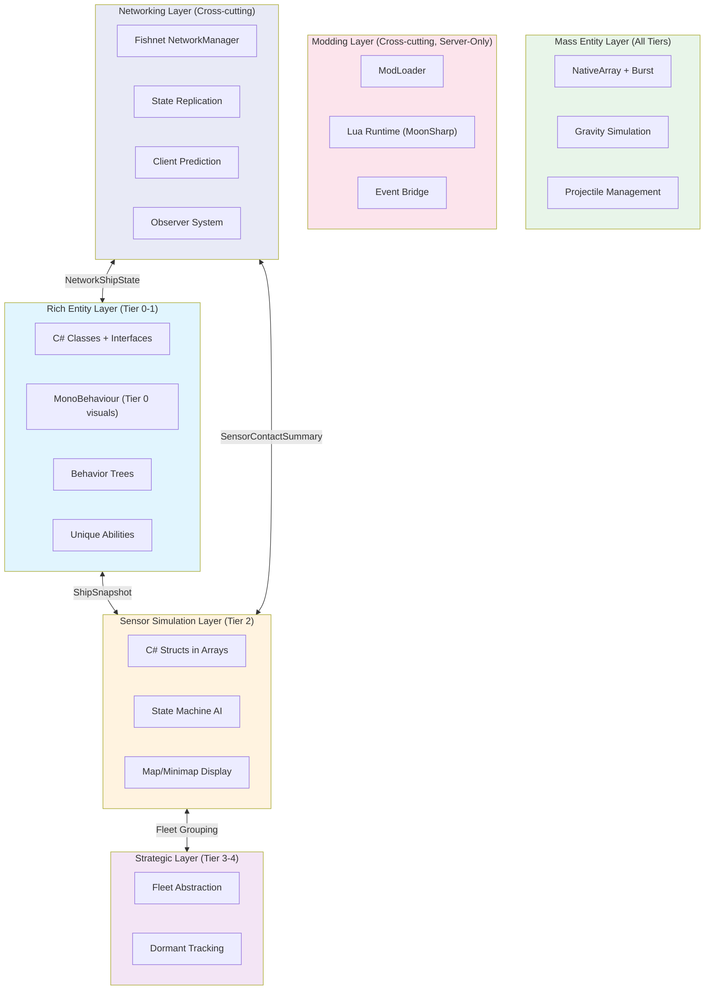
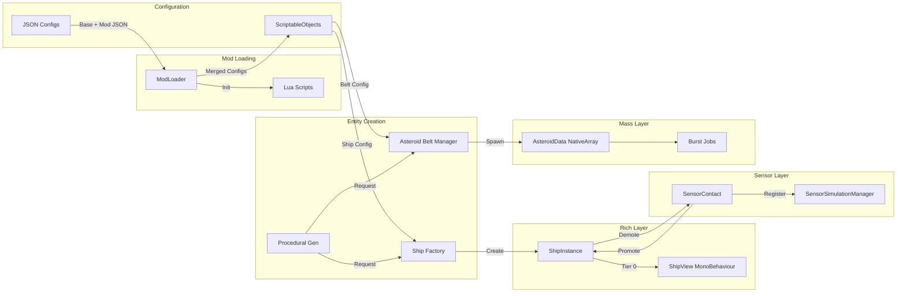
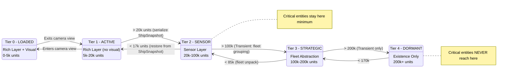
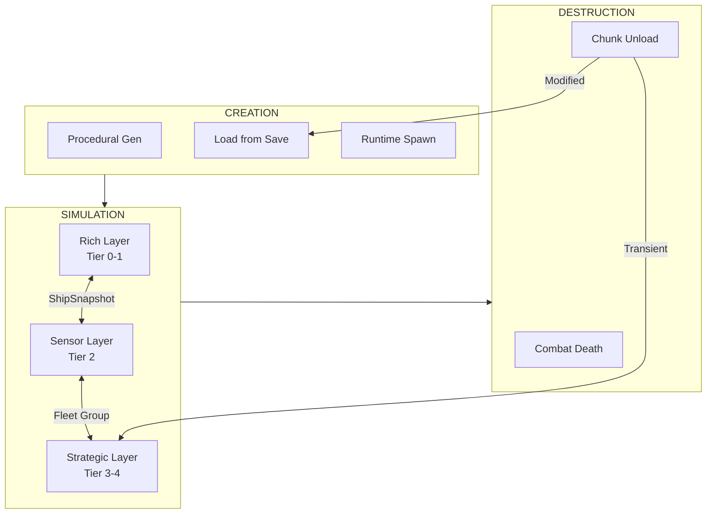

# Starfire Architecture Overview

This document provides a high-level view of the Starfire hybrid architecture, showing how all systems work together across three processing layers.

> **Multiplayer Architecture:** Starfire uses **Fishnet** for server-authoritative multiplayer (8-16 players). The server runs the full simulation; clients predict their own ship and render locally. Single-player is a local listen server — there is no separate offline code path. See [[13-networking-architecture]] for full detail.

---

## Design Philosophy

Starfire uses a **hybrid architecture** that matches the simulation approach to the entity type:

- **Ships, stations, named NPCs** are inherently unique - different classes have fundamentally different abilities (cloaking, tractor beams, mine deployment, hacking). These use traditional **OOP with C# classes and interfaces** for rich polymorphic behavior.
- **Asteroids, debris, projectiles** are uniform - thousands of identical bodies with simple physics. These use **NativeArray + Burst Jobs** for high-performance batch processing.
- **Distant entities** visible on sensors use **lightweight C# structs** with state machine AI for realistic but efficient simulation.

The simulation resolution matches the representation complexity. ECS-style batch processing is reserved for where it genuinely helps: mass uniform entities and simplified distant representations.

The **networking architecture** adds a cross-cutting concern: the server runs authoritative simulation across all layers, while clients handle prediction (own ship only), interpolation (remote entities), and presentation. Fishnet's tick-based system (30 Hz) replaces frame-based `Update()` for all simulation.

---

## Architecture Layers

The Mass Entity Layer runs **in parallel** with the other layers at all distances - it is a separate processing path for uniform entities, not a tier.

| Layer | Technology | Entity Types | Max Count | Update Rate |
|-------|-----------|--------------|-----------|-------------|
| **Rich** | C# classes, interfaces, MonoBehaviour | Ships, stations, named NPCs | ~500 | Every tick (30 Hz) |
| **Sensor** | C# structs in managed arrays | Medium-range contacts | ~200 | Every 5-10 ticks |
| **Strategic** | Fleet structs, dormant records | Far-range groups | ~100 fleets | Every ~1 second |
| **Mass** | NativeArray + Burst Jobs | Asteroids, debris, projectiles | Thousands | Every tick (Burst) |
| **Networking** | Fishnet (NetworkBehaviour, RPCs) | Cross-cutting | Per-player | Tier-dependent |

---

## Document Index

| Document | Layer | Responsibility |
|----------|-------|----------------|
| [[00-overview]] | All | This document - high-level architecture |
| [[01-component-model]] | All | Data models per layer (classes, structs, interfaces) |
| [[02-system-architecture]] | All | Processing pipeline per layer, execution order |
| [[03-tiered-simulation]] | All | Distance-based tier system, layer transitions |
| [[04-archetype-strategy]] | Rich + Mass | Entity composition (C# classes for ships, structs for mass) |
| [[05-configuration-layer]] | Rich + Sensor | JSON config pipeline, ship/module definitions, mod loading |
| [[06-chunk-integration]] | All | World chunk management, floating origin |
| [[07-warp-system]] | Rich + Sensor | High-speed warp travel |
| [[08-control-modes]] | Rich | Player/AI control (Direct, Command, Autonomous) |
| [[09-progressive-destruction]] | Rich | Localized damage, module degradation |
| [[10-gravity-system]] | Mass + Rich | Newtonian gravity, orbital mechanics |
| [[11-heat-system]] | Rich | Thermal radiation, hull temperature |
| [[12-modding-architecture]] | Cross-cutting | Mod loading, Lua scripting, event bridge, mod API |
| [[13-networking-architecture]] | Cross-cutting | Fishnet integration, server/client pipeline, prediction, observer system |

---

## Data Flow Pipeline

---

## Processing Pipeline

The simulation runs on Fishnet's `TimeManager.OnTick` (30 Hz). The pipeline splits into a **server pipeline** (authoritative simulation) and a **client pipeline** (prediction + rendering). See [[02-system-architecture]] for full detail.

```mermaid
flowchart TB
    subgraph SERVER["Server OnTick (30 Hz)"]
        S1["1. NetworkInputCollector"]
        S2["2. RichEntityManager"]
        S3["3. SensorSimulationManager"]
        S4["4. MassEntityManager"]
        S5["5. EnvironmentManager"]
        S6["6. TierManager (Multi-Viewpoint)"]
        S7["7. ScriptExecutionManager"]
        S8["8. NetworkStateReplicator"]
    end

    subgraph CLIENT["Client OnTick + Update"]
        C1["1. LocalInputManager"]
        C2["2. ClientPredictionManager"]
        C3["3. ClientEnvironmentManager"]
        C4["4. NetworkStateReceiver"]
        C5["5. InterpolationManager"]
        C6["6. PresentationManager (Update)"]
    end

    S1 --> S2 --> S3 --> S4 --> S5 --> S6 --> S7 --> S8
    C1 --> C2 --> C3 --> C4 --> C5 -.-> C6
```

**Performance Budgets (Server — 33ms available at 30 Hz):**

| Group | Target | Notes |
|-------|--------|-------|
| Input Collection | 0.3ms | Gather inputs from N clients |
| Rich Layer | 3ms | Ship simulation, abilities, combat |
| Sensor Layer | 0.5ms | Amortized state machine updates |
| Mass Entities | 2ms | Burst-compiled gravity + physics |
| Environment | 1ms | Gravity sources, heat |
| Tier Management | 0.9ms | Multi-viewpoint distance, transitions |
| Script Execution | 0.5ms | Lua event dispatch, timer callbacks, mod API calls |
| State Replication | 0.6ms | Delta compression, observer filtering |
| **Total** | **8.8ms** | 24.2ms headroom at 30 Hz tick |

**Client budget:** ~1.3ms per tick (prediction, interpolation) + ~2ms per render frame (presentation).

---

## Layer Transitions

**Key transition concept:** Each layer transition is a **serialization step**. The `ShipSnapshot` struct is the common currency - it captures enough state to reconstruct a ship at any fidelity level.

**Persistence Behavior:**

| Persistence | Tier 0-1 (Rich) | Tier 2 (Sensor) | Tier 3 (Strategic) | Tier 4 (Dormant) |
|-------------|----------------|-----------------|-------------------|-----------------|
| **Transient** | Full OOP sim | State machine | Fleet grouped | Can despawn |
| **Persistent** | Full OOP sim | State machine | Individual, slow | Tracked, no sim |
| **Critical** | Full OOP sim | Full BT (reduced) | **Never** | **Never** |

---

## Tier Boundaries (Default)

| Tier | Range | Hysteresis | Demote At |
|------|-------|------------|-----------|
| 0 | 0 - 5k | 750 | 4,250 |
| 1 | 5k - 20k | 3k | 17,000 |
| 2 | 20k - 100k | 15k | 85,000 |
| 3 | 100k - 200k | 30k | 170,000 |
| 4 | 200k+ | - | - |

---

## Global Services

| Service | Purpose | Used By |
|---------|---------|---------|
| `WorldOrigin` | Floating origin offset | All layers |
| `PlayerPosition` | Cached player position | Tier management, AI |
| `FactionRelationshipMatrix` | Faction friend/foe lookup | Rich + Sensor layers |
| `ConfigRegistry` | Ship/module configurations | Rich layer, spawning |
| `TierManager` | Distance checks, layer transitions | All layers |
| `ChunkManager` | Spatial world management | All layers |
| `SensorDisplayManager` | Map/minimap data aggregation | UI |
| `ModLoader` | Discovers mods, resolves load order, manages manifests | Initialization |
| `LuaRuntime` | MoonSharp script engine, per-mod sandbox, API registration | Script Execution |
| `GameEventBus` | Typed game events for C# and Lua subscribers | All managers, Lua scripts |
| `NetworkManager` | Fishnet connection management, tick system | All networked managers |
| `NetworkEventBridge` | Forwards server events to clients for VFX/SFX | PresentationManager, UI |

---

## Key Events

| Event | Fired When | Consumed By |
|-------|------------|-------------|
| `OnTierTransition` | Entity crosses tier boundary | Layer managers |
| `OnShipDestroyed` | Ship hull reaches 0 | Quest system, loot, effects |
| `OnWarpEngaged` | Player starts warp | UI, chunk loading |
| `OnWarpDropped` | Player exits warp | UI, tier recalculation |
| `OnModuleDamaged` | Module state changes | AI, visual effects |
| `OnSensorContactChanged` | Sensor contact changes state | Map/minimap UI |
| `OnChunkBoundary` | Entity crosses chunk | Chunk migration |
| `OnEntitySpawned` | Entity created (any type) | Lua scripts, quest system |
| `OnEntityDamaged` | Entity takes damage | Lua scripts |
| `OnProjectileHit` | Projectile hits target | Lua scripts |
| `OnWaveStarted` | Combat wave begins | Lua scripts |
| `OnPlayerDocked` | Player docks at station | Lua scripts |
| `OnModsLoaded` | All mods finished loading | UI, game systems |

---

## Entity Lifecycle

---

## Modding Integration

The game is its own first mod. Base game content loads through the **same pipeline** as mod content - base configs in `StreamingAssets/data/` are simply the first entries in the load order.

**Loading Sequence:**
1. ModLoader scans `StreamingAssets/data/` (base game)
2. ModLoader scans `StreamingAssets/mods/` for mod manifests
3. Resolve load order (dependencies, priority)
4. ConfigRegistry processes merged configs (later overrides earlier)
5. LuaRuntime initializes per-mod Script instances (MoonSharp, sandboxed)
6. Lua scripts register event handlers via `starfire.on(...)`
7. Game loop begins - ScriptExecutionManager dispatches events each frame

**Key constraints:**
- Lua executes on the main thread, after all game simulation completes for the tick
- Lua interacts with Rich layer entities directly via proxy wrappers (no deferred buffer - changes are immediate)
- Burst jobs (Mass layer) cannot call Lua - events from Mass layer are queued and dispatched in the Script Execution step
- Mods cannot define new C# types - custom state uses per-entity `ScriptData` dictionary
- **Multiplayer:** Lua runs server-only. Changes made by Lua are replicated to clients via NetworkStateReplicator

See [[05-configuration-layer]] for the JSON config pipeline and [[12-modding-architecture]] for the full scripting system.

---

## Reading Order

1. [[00-overview]] - This document (start here)
2. [[01-component-model]] - Data models per layer
3. [[04-archetype-strategy]] - Entity composition patterns
4. [[02-system-architecture]] - Processing pipeline (server/client split)
5. [[03-tiered-simulation]] - Tier system and transitions (multi-viewpoint)
6. [[08-control-modes]] - Player/AI control
7. [[10-gravity-system]] - Orbital mechanics
8. [[11-heat-system]] - Thermal radiation
9. [[09-progressive-destruction]] - Localized damage
10. [[05-configuration-layer]] - JSON configuration
11. [[06-chunk-integration]] - World management
12. [[07-warp-system]] - High-speed travel
13. [[12-modding-architecture]] - Modding and Lua scripting
14. [[13-networking-architecture]] - Multiplayer networking (Fishnet)

---

## Related Documents

- [[01-component-model]] - Data models for all layers
- [[02-system-architecture]] - Per-layer processing pipeline
- [[03-tiered-simulation]] - Distance-based simulation tiers
- [[04-archetype-strategy]] - Entity composition patterns
- [[05-configuration-layer]] - JSON configuration pipeline
- [[06-chunk-integration]] - World chunk management
- [[07-warp-system]] - High-speed warp travel
- [[08-control-modes]] - Entity control modes
- [[09-progressive-destruction]] - Localized damage and module degradation
- [[10-gravity-system]] - Newtonian gravity and orbital mechanics
- [[11-heat-system]] - Thermal radiation and hull temperature
- [[12-modding-architecture]] - Mod loading, Lua scripting, event bridge, mod API
- [[13-networking-architecture]] - Fishnet integration, server/client pipeline, prediction, observer system
