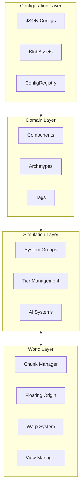
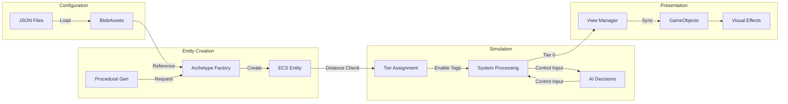
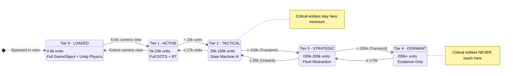
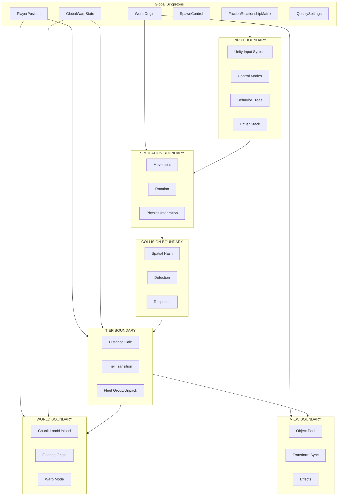
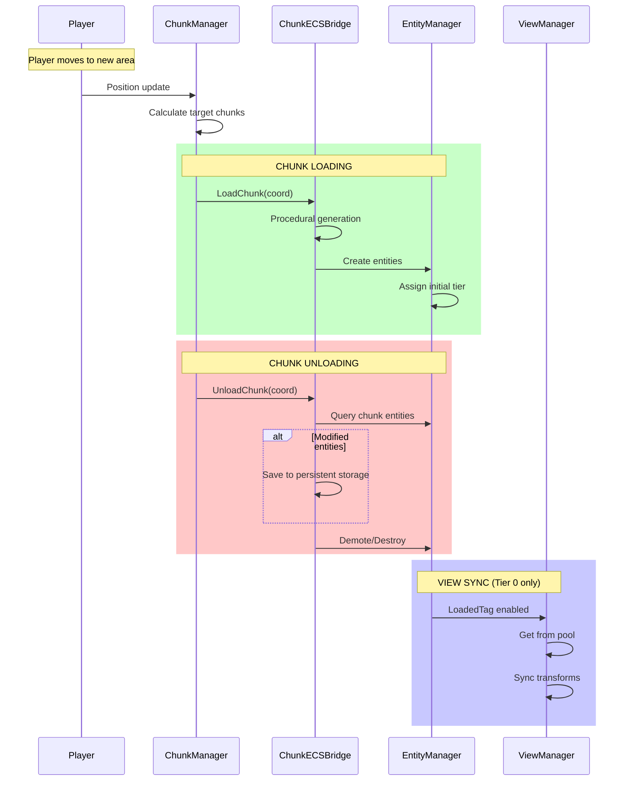
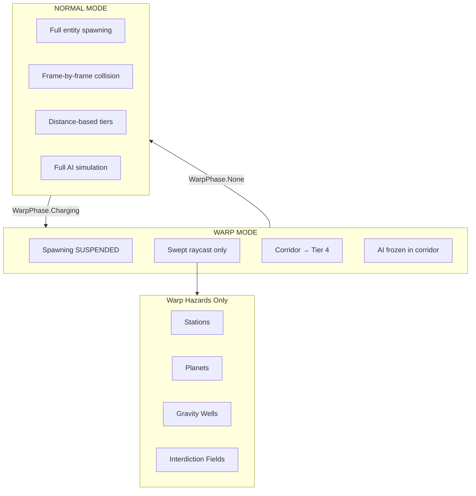
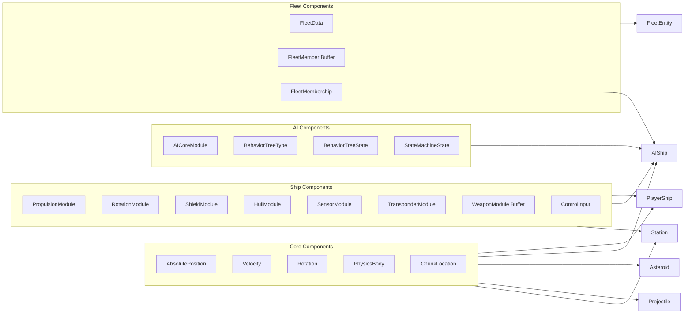
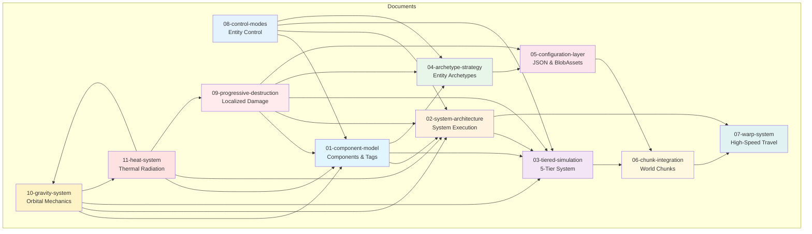
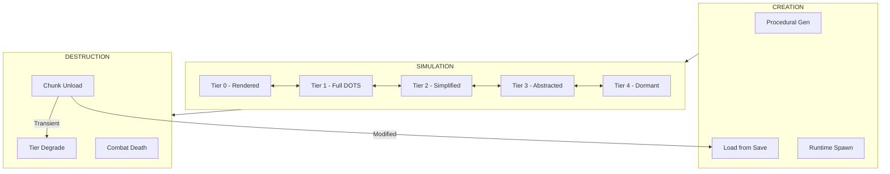

# Starfire ECS Architecture Overview

This document provides a high-level view of the Starfire DOTS architecture, showing how all systems work together.

---

## Architecture Layers

| Layer | Documents | Responsibility |
|-------|-----------|----------------|
| **Configuration** | [[05-configuration-layer]] | JSON → BlobAsset pipeline, mod support |
| **Domain** | [[01-component-model]], [[04-archetype-strategy]] | Data structures, entity definitions |
| **Simulation** | [[02-system-architecture]], [[03-tiered-simulation]] | System execution, tier management |
| **Environment** | [[10-gravity-system]], [[11-heat-system]] | Newtonian gravity, orbital mechanics, thermal radiation |
| **Input/Control** | [[08-control-modes]] | Entity control modes (Direct, Command, Autonomous) |
| **World** | [[06-chunk-integration]], [[07-warp-system]] | Spatial management, high-speed travel |
| **Combat** | [[09-progressive-destruction]] | Localized damage, module degradation |

---

## Data Flow Pipeline

---

## System Execution Order

```mermaid
flowchart TB
    subgraph INIT["Initialization (Startup)"]
        CLS[ConfigLoadSystem]
        ESS[EntitySpawnSystem]
        TAS[TierAssignSystem]
    end

    subgraph INPUT["Input Group"]
        PIS[PlayerInputSystem]
        AIS[AIInputSystem]
        DSS[DriverStackSystem]
    end

    subgraph SIM["Simulation Group"]
        MVS[MovementSystem]
        RTS[RotationSystem]
        PHS[PhysicsIntegration]
    end

    subgraph ENV["Environment Group"]
        SOUS[StarOrbitUpdateSystem]
        BCS[BarycenterCalcSystem]
        GSS[GravitySimulatorSystem]
        HSS[HeatSimulatorSystem]
    end

    subgraph PHYSICS["Physics Group"]
        BPC[BroadPhaseCollision]
        NPC[NarrowPhaseCollision]
        CRS[CollisionResponse]
    end

    subgraph COMBAT["Combat Group"]
        WPS[WeaponSystem]
        PJS[ProjectileSystem]
        DLS[DamageLocalizationSystem]
        MDS[ModuleDamageSystem]
        HDS[HullDamageSystem]
        MRS[ModuleRepairSystem]
        ATPS[AITargetPrioritySystem]
        QTS[QuestTrackingSystem]
        DECS[DamageEventCleanupSystem]
        DTS[DestructionSystem]
    end

    subgraph TIERMGMT["Tier Management"]
        DCS[DistanceCalcSystem]
        TTS[TierTransitionSystem]
        CMS[ChunkMigrationSystem]
    end

    subgraph BG["Background Simulation"]
        T2S[Tier2TacticalSystem]
        T3S[Tier3StrategicSystem]
        FLS[FleetSystem]
    end

    subgraph RENDER["Presentation"]
        VMS[ViewManagerSystem]
        TRS[TransformSyncSystem]
        VES[VisualEffectsSystem]
    end

    INIT --> INPUT
    INPUT --> SIM
    SIM --> ENV
    ENV --> PHYSICS
    PHYSICS --> COMBAT
    COMBAT --> TIERMGMT
    TIERMGMT --> BG
    BG --> RENDER
```

**Performance Budgets:**

| Group | Target | Notes |
|-------|--------|-------|
| Input | 0.5ms | Minimal, reading only |
| Simulation | 2ms | Tier 0-1 entities |
| Environment | 1ms | Gravity + Heat simulation |
| Physics | 3ms | Burst spatial hash |
| Combat | 1ms | Projectile-heavy scenarios |
| Tier Management | 0.5ms | Distance checks |
| Background | 1ms | Amortized |
| Presentation | 2ms | Transform sync |
| **Total** | **11ms** | 5ms headroom for 60 FPS |

---

## 5-Tier Simulation System

**Persistence Behavior:**

| Persistence | Tier 0-1 | Tier 2 | Tier 3 | Tier 4 |
|-------------|----------|--------|--------|--------|
| **Transient** | Full sim | State machine | Fleet grouped | Can despawn |
| **Persistent** | Full sim | State machine | Individual, slow | Tracked, no sim |
| **Critical** | Full sim | Full BT (reduced) | **Never** | **Never** |

---

## System Boundaries

---

## Chunk ↔ ECS Integration

---

## Warp Mode State Changes

---

## Component → Archetype Mapping

---

## Document Cross-Reference Map

**Reading Order for New Developers:**
1. [[01-component-model]] - Understand the data
2. [[04-archetype-strategy]] - How components compose
3. [[02-system-architecture]] - How systems process data
4. [[08-control-modes]] - Entity control (Direct, Command, Autonomous)
5. [[03-tiered-simulation]] - Distance-based simulation
6. [[10-gravity-system]] - Newtonian orbital mechanics
7. [[11-heat-system]] - Thermal radiation and damage
8. [[09-progressive-destruction]] - Localized damage and module degradation
9. [[05-configuration-layer]] - How entities are configured
10. [[06-chunk-integration]] - World management
11. [[07-warp-system]] - Special high-speed mode

---

## Key Singletons

| Singleton | Purpose | Updated By |
|-----------|---------|------------|
| `WorldOrigin` | Floating origin offset | FloatingOriginSystem |
| `PlayerPosition` | Cached player position | PlayerMovementSystem |
| `GlobalWarpState` | Warp mode flags | WarpModeSystem |
| `SpawnControl` | Enable/disable spawning | WarpModeSystem |
| `FactionRelationshipMatrix` | Faction friend/foe | ConfigLoadSystem |
| `SimulationSettings` | Quality settings | QualityManager |
| `ConfigRegistry` | BlobAsset references | ConfigLoadSystem |
| `PrefabEntityRegistry` | Entity prefabs | InitializationSystem |

---

## Key Events

| Event | Fired When | Consumed By |
|-------|------------|-------------|
| `ChunkBoundaryEvent` | Entity crosses chunk | ChunkMigrationSystem |
| `WarpEngagedEvent` | Player starts warp | UI, AudioSystem |
| `WarpDropEvent` | Player exits warp | UI, TierSystem |
| `WarpHazardWarningEvent` | Hazard ahead in warp | UI |
| `PendingDestructionTag` | Entity hull ≤ 0 | DestructionSystem |
| `ModuleDamagedEvent` | Module state changes | DamageEffectsSystem, AI |
| `ModuleDisabledEvent` | Module becomes Disabled | AI, QuestSystem |

---

## Entity Lifecycle Summary

---

## Quick Reference

### Tier Boundaries (Default)

| Tier | Range | Hysteresis | Demote At |
|------|-------|------------|-----------|
| 0 | 0 - 5k | 750 | 4,250 |
| 1 | 5k - 20k | 3k | 17,000 |
| 2 | 20k - 100k | 15k | 85,000 |
| 3 | 100k - 200k | 30k | 170,000 |
| 4 | 200k+ | - | - |

### Entity Counts (Target)

| Tier | Max Entities | Cost/Entity |
|------|--------------|-------------|
| 0 | ~20 | ~0.5ms |
| 1 | ~500 | ~0.01ms |
| 2 | ~2,000 | ~0.002ms |
| 3 | ~100 fleets | ~0.0005ms |
| 4 | Unlimited | ~0 |

### Warp Speeds

| Engine Class | Max Speed | Charge Time |
|--------------|-----------|-------------|
| Basic | 5,000 u/s | 3s |
| Military | 10,000 u/s | 2s |
| Advanced | 20,000 u/s | 1.5s |

---

## Related Documents

- [[01-component-model]] - ECS component definitions
- [[02-system-architecture]] - System execution order
- [[03-tiered-simulation]] - 5-tier progressive simulation
- [[04-archetype-strategy]] - Entity archetype patterns
- [[05-configuration-layer]] - JSON configuration pipeline
- [[06-chunk-integration]] - World chunk management
- [[07-warp-system]] - High-speed warp travel
- [[08-control-modes]] - Entity control modes (Direct, Command, Autonomous)
- [[09-progressive-destruction]] - Localized damage and module degradation
- [[10-gravity-system]] - Newtonian orbital mechanics and N-body approximation
- [[11-heat-system]] - Thermal radiation and hull temperature damage
