# ECS Component Model

## Overview

This document defines all `IComponentData` structs for the Starfire DOTS architecture. Components are organized by domain and represent the **source of truth** for entity state in the ECS world.

---

## Design Decisions Summary

| Decision | Choice | Rationale |
|----------|--------|-----------|
| Position type | `double` | Sub-unit precision at 500k+ units, no jitter |
| Chunk index type | `long` | Future-proofing for massive worlds |
| Module approach | Individual components | Full detail preserved, hot-swap via archetype change |
| Core modules | Always present | Hull, Shield, Transponder, Sensor on all ships |
| Weapons | `IBufferElementData` | Variable count, frequently swapped |
| Sensor detections | Faction-scoped pool | Shared data reduces per-entity overhead |
| Tier tags | `IEnableableComponent` | Avoid structural changes on tier transitions |
| AI/BT batching | `ISharedComponentData` | Group entities by behavior tree type |

---

## Core Transform Components

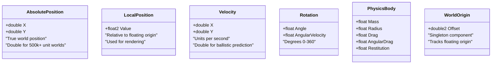

### AbsolutePosition
**Purpose:** True world position using double-precision

```csharp
public struct AbsolutePosition : IComponentData
{
    public double X;
    public double Y;
}
```

**Rationale:** Single-precision floats lose accuracy beyond ~16km. At 500,000 units, `double` still provides ~10 decimal places of precision. Mirrors existing `Vector2D` type.

### LocalPosition
**Purpose:** Float-precision position relative to floating origin (for rendering)

```csharp
public struct LocalPosition : IComponentData
{
    public float2 Value;
}
```

**Rationale:** Unity rendering uses floats. Recalculated on origin shifts to keep values near zero.

### Velocity
**Purpose:** Movement in world units per second

```csharp
public struct Velocity : IComponentData
{
    public double X;
    public double Y;
}
```

**Rationale:** Double precision enables accurate Tier 2 ballistic prediction over long time periods.

### Rotation
**Purpose:** Orientation and angular velocity

```csharp
public struct Rotation : IComponentData
{
    public float Angle;           // Degrees 0-360
    public float AngularVelocity; // Degrees per second
}
```

**Angle Wrapping:** `Rotation.Angle` should be wrapped to 0-360 by `RotationSystem` to prevent accumulation to large values:

```csharp
public static float WrapAngle(float angle)
{
    angle = angle % 360f;
    return angle < 0 ? angle + 360f : angle;
}
```

### PhysicsBody
**Purpose:** Physical properties for simulation

```csharp
public struct PhysicsBody : IComponentData
{
    public float Mass;        // Kilograms
    public float Radius;      // Collision radius
    public float Drag;        // Linear drag coefficient
    public float AngularDrag; // Rotational drag
    public float Restitution; // Bounce factor 0-1
}
```

### WorldOrigin (Singleton)
**Purpose:** Track floating origin offset for coordinate conversion

```csharp
public struct WorldOrigin : IComponentData
{
    public double2 Offset;  // Current origin in absolute space
}
```

---

## Entity Identity Components

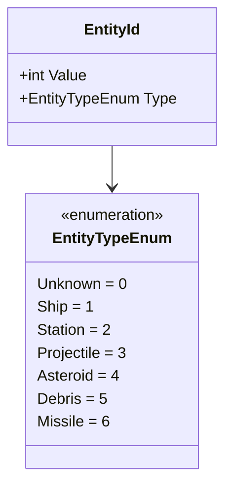

### EntityId
**Purpose:** Unique identifier and type classification

```csharp
public struct EntityId : IComponentData
{
    public int Value;
    public EntityTypeEnum Type;
}

public enum EntityTypeEnum : byte
{
    Unknown = 0,
    Ship = 1,
    Station = 2,
    Projectile = 3,
    Asteroid = 4,
    Debris = 5,
    Missile = 6
}
```

### EntityId Generation

**CRITICAL:** EntityId.Value requires a unique generation mechanism for cross-tier references and persistence.

```csharp
/// <summary>
/// Singleton that generates unique EntityIds.
/// Uses atomic counter for thread-safety in Burst jobs.
/// </summary>
public struct EntityIdGenerator : IComponentData
{
    public int NextId;  // Atomic counter, starts at 1
}

/// <summary>
/// System to initialize and manage entity ID generation.
/// </summary>
[UpdateInGroup(typeof(InitializationSystemGroup))]
public partial struct EntityIdGeneratorSystem : ISystem
{
    public void OnCreate(ref SystemState state)
    {
        state.EntityManager.CreateSingleton(new EntityIdGenerator { NextId = 1 });
    }

    /// <summary>
    /// Get next unique ID. Thread-safe via Interlocked.
    /// Call from main thread or use EntityCommandBuffer for jobs.
    /// </summary>
    public static int GetNextId(ref EntityIdGenerator generator)
    {
        return System.Threading.Interlocked.Increment(ref generator.NextId);
    }
}
```

---

## Tag Components

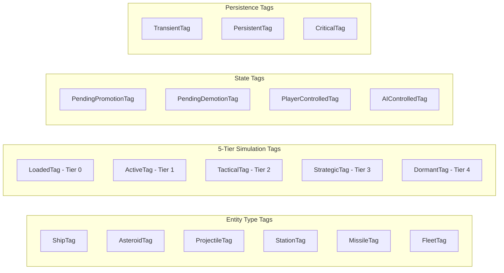

**Purpose:** Zero-size markers for efficient archetype filtering

```csharp
// Entity Type Tags
public struct ShipTag : IComponentData { }
public struct AsteroidTag : IComponentData { }
public struct ProjectileTag : IComponentData { }
public struct StationTag : IComponentData { }
public struct MissileTag : IComponentData { }
public struct FleetTag : IComponentData { }  // Tier 3 fleet entities

// 5-Tier Simulation Tags - Use IEnableableComponent to avoid structural changes
public struct LoadedTag : IComponentData, IEnableableComponent { }     // Tier 0: Full GameObject
public struct ActiveTag : IComponentData, IEnableableComponent { }     // Tier 1: Full DOTS sim
public struct TacticalTag : IComponentData, IEnableableComponent { }   // Tier 2: State machine AI
public struct StrategicTag : IComponentData, IEnableableComponent { }  // Tier 3: Fleet abstraction
public struct DormantTag : IComponentData, IEnableableComponent { }    // Tier 4: Existence only

// State Tags
public struct PendingPromotionTag : IComponentData { }
public struct PendingDemotionTag : IComponentData { }
public struct PlayerControlledTag : IComponentData { }
public struct AIControlledTag : IComponentData { }

// Persistence Tags (determines tier degradation behavior)
public struct TransientTag : IComponentData { }   // Can be grouped into fleets
public struct PersistentTag : IComponentData { }  // Named NPCs, stay individual
public struct CriticalTag : IComponentData { }    // Quest targets, never below Tier 2
```

**Note:** Tier tags use `IEnableableComponent` so tier transitions don't cause archetype migrations (structural changes).

### 5-Tier System Overview

| Tier | Tag | Range | AI | Entity Persistence Behavior |
|------|-----|-------|-----|---------------------------|
| 0 | `LoadedTag` | 0-5k | Full BT | All: Full GameObject |
| 1 | `ActiveTag` | 5k-20k | Full BT | All: Full DOTS sim |
| 2 | `TacticalTag` | 20k-100k | State Machine | Critical: Full BT (reduced rate) |
| 3 | `StrategicTag` | 100k-200k | Fleet-level | Transient: Grouped into fleets |
| 4 | `DormantTag` | 200k+ | None | Critical: **Never reaches here** |

---

## Simulation Tier Components

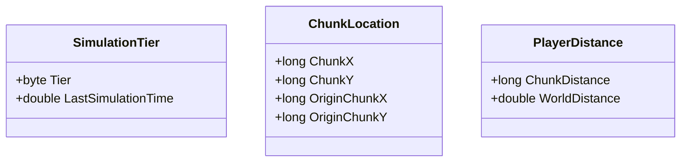

### SimulationTier
**Purpose:** Track which simulation tier an entity is in

```csharp
public struct SimulationTier : IComponentData
{
    public byte Tier;                  // 0=Loaded, 1=Active, 2=Tactical, 3=Strategic, 4=Dormant
    public double LastSimulationTime;  // For Tier 2 prediction calculations
}
```

### ChunkLocation
**Purpose:** Spatial organization for chunk-based world management

```csharp
public struct ChunkLocation : IComponentData
{
    public long ChunkX;       // Current chunk X
    public long ChunkY;       // Current chunk Y
    public long OriginChunkX; // Procedural spawn chunk X (for regeneration)
    public long OriginChunkY; // Procedural spawn chunk Y
}
```

### PlayerDistance
**Purpose:** Distance from player for tier demotion/promotion decisions

```csharp
public struct PlayerDistance : IComponentData
{
    public long ChunkDistance;   // Chebyshev distance in chunks
    public double WorldDistance; // Actual distance (for priority sorting)
}
```

---

## Entity Persistence Components

Controls how entities degrade across simulation tiers.

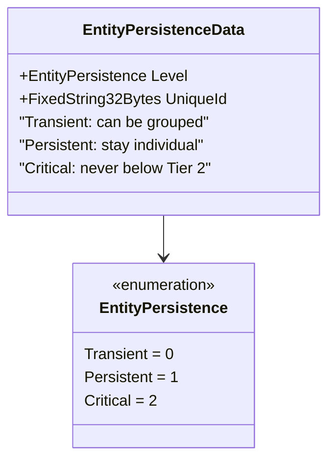

### EntityPersistenceData
**Purpose:** Determines how entity degrades across tiers

```csharp
public struct EntityPersistenceData : IComponentData
{
    public EntityPersistence Level;
    public FixedString32Bytes UniqueId;  // Empty = generic, non-empty = named NPC
}

public enum EntityPersistence : byte
{
    Transient = 0,   // Generic pirates - can be grouped into fleets at Tier 3
    Persistent = 1,  // Named NPCs - stay individual, reduced updates at distance
    Critical = 2     // Quest targets, allies - always Tier 2 minimum
}
```

**Behavior by Level:**
- **Transient:** Generic enemies. At Tier 3, grouped into fleet entities. Can reach Tier 4 (dormant).
- **Persistent:** Named NPCs (Captain Vex, Merchant Joe). Always tracked individually. Slower updates at distance.
- **Critical:** Quest targets, player allies. Never demotes below Tier 2. Always simulated.

---

## Fleet Components (Tier 3 Abstraction)

At Tier 3, transient entities are grouped into fleet entities for efficient simulation.

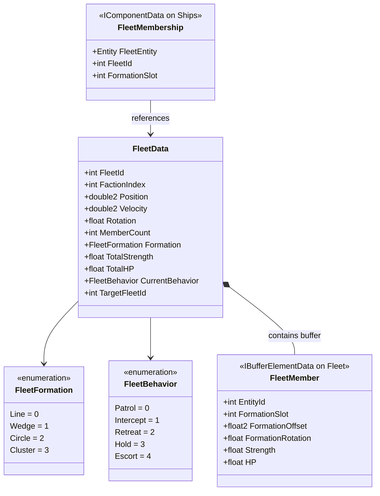

### FleetData
**Purpose:** Tier 3 abstracted fleet entity

```csharp
public struct FleetData : IComponentData
{
    public int FleetId;
    public int FactionIndex;
    public double2 Position;           // Fleet center
    public double2 Velocity;           // Fleet movement
    public float Rotation;             // Fleet facing direction (degrees) - REQUIRED for unpacking
    public int MemberCount;            // How many ships
    public FleetFormation Formation;   // Shape of formation
    public float TotalStrength;        // Aggregated DPS
    public float TotalHP;              // Aggregated health
    public FleetBehavior CurrentBehavior;
    public int TargetFleetId;          // If engaging another fleet
}

public enum FleetFormation : byte
{
    Line = 0,
    Wedge = 1,
    Circle = 2,
    Cluster = 3
}

public enum FleetBehavior : byte
{
    Patrol = 0,
    Intercept = 1,
    Retreat = 2,
    Hold = 3,
    Escort = 4
}
```

### FleetMembership (On Individual Ships)
**Purpose:** Links an individual ship to its fleet

```csharp
public struct FleetMembership : IComponentData
{
    public Entity FleetEntity;       // Reference to fleet entity
    public int FleetId;              // Stable ID (survives entity recreation)
    public int FormationSlot;        // Index into FleetMember buffer
}
```

**Added when:** Ship enters Tier 3 and is grouped into a fleet.
**Removed when:** Fleet unpacks to Tier 2.

### FleetMember (Buffer on Fleet Entity)
**Purpose:** Tracks individual ships that belong to this fleet

```csharp
public struct FleetMember : IBufferElementData
{
    public int EntityId;             // Ship's EntityId (for cross-tier reference)
    public int FormationSlot;        // Position in formation
    public float2 FormationOffset;   // Local offset from fleet center
    public float FormationRotation;  // Local rotation offset
    public float Strength;           // Combat contribution (for abstract combat)
    public float HP;                 // Current HP (for casualty tracking)
    public EntityPersistence Persistence;  // Cached for casualty selection
}
```

**Relationship between FleetMembership and FleetMember:**

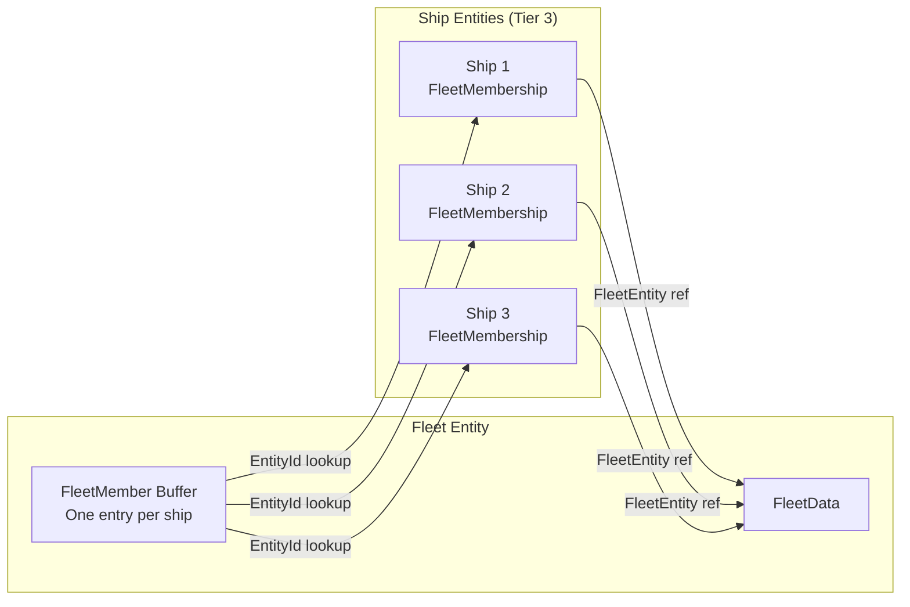

- **FleetMembership** (on ships): Tells a ship which fleet it belongs to
- **FleetMember** (buffer on fleet): Tells the fleet about its member ships

**Fleet Lifecycle:**
1. **Grouping (Tier 2 → 3):** Ships near each other with same faction form a fleet. Individual ships get `FleetMembership` component, fleet entity gets `FleetMember` buffer entries.
2. **Simulation:** Fleet AI runs at ~1 second intervals. Battles resolved abstractly. Fleet rotation tracks the fleet's facing direction.
3. **Unpacking (Tier 3 → 2):** Player approaches. Fleet dissolves. Ships placed using transformed offsets from `FleetMember` buffer:

```csharp
/// <summary>
/// Calculate ship position when unpacking from fleet.
/// FleetMember.FormationOffset is in local space - must be transformed by fleet rotation.
/// </summary>
public static double2 CalculateUnpackPosition(
    in FleetData fleet,
    in FleetMember member)
{
    // Transform local offset by fleet rotation
    float rotRad = math.radians(fleet.Rotation);
    float cos = math.cos(rotRad);
    float sin = math.sin(rotRad);

    double2 rotatedOffset = new double2(
        member.FormationOffset.x * cos - member.FormationOffset.y * sin,
        member.FormationOffset.x * sin + member.FormationOffset.y * cos
    );

    return fleet.Position + rotatedOffset;
}

/// <summary>
/// Calculate ship rotation when unpacking.
/// Ship faces fleet direction + its formation-relative rotation.
/// </summary>
public static float CalculateUnpackRotation(
    in FleetData fleet,
    in FleetMember member)
{
    return (fleet.Rotation + member.FormationRotation) % 360f;
}
```

---

## Module Components

Each module category is a **separate optional component**. Core modules (Hull, Shield, Sensor, Transponder) are always present on ships. Others vary by ship type.

### Module ID Optimization

**PERFORMANCE NOTE:** Using `FixedString64Bytes` for every ModuleId adds 64 bytes per module component. A ship with 6 modules = 384 bytes of string data. For production, consider:

```csharp
/// <summary>
/// Alternative: Use int IDs with runtime lookup table.
/// Reduces memory from 64 bytes to 4 bytes per module.
/// </summary>
public struct ModuleId
{
    public int Value;  // Index into ModuleRegistry

    public static ModuleId FromString(string moduleId)
    {
        return new ModuleId { Value = ModuleRegistry.GetOrCreateId(moduleId) };
    }

    public FixedString64Bytes ToFixedString()
    {
        return ModuleRegistry.GetString(Value);
    }
}

/// <summary>
/// Runtime registry mapping int IDs to string names.
/// Populated at startup from config files.
///
/// BURST COMPATIBILITY: This static class with managed Dictionary is NOT Burst-compatible.
/// For Burst jobs, use the singleton approach below instead.
/// </summary>
public static class ModuleRegistry
{
    private static Dictionary<string, int> _stringToId = new();
    private static List<FixedString64Bytes> _idToString = new();

    public static int GetOrCreateId(string moduleId)
    {
        if (_stringToId.TryGetValue(moduleId, out int id))
            return id;

        id = _idToString.Count;
        _stringToId[moduleId] = id;
        _idToString.Add(new FixedString64Bytes(moduleId));
        return id;
    }

    public static FixedString64Bytes GetString(int id)
    {
        return _idToString[id];
    }
}

/// <summary>
/// Burst-compatible module registry using NativeHashMap.
/// Initialize at startup, store as singleton for Burst job access.
/// </summary>
public struct ModuleRegistryBurstCompatible : IComponentData
{
    // Lookup table built at startup - read-only after initialization
    public NativeHashMap<FixedString64Bytes, int> StringToId;
    public NativeList<FixedString64Bytes> IdToString;
}

/// <summary>
/// System to initialize Burst-compatible registry from static ModuleRegistry.
/// Run after ConfigLoadSystem populates static registry.
/// </summary>
[UpdateInGroup(typeof(InitializationSystemGroup))]
[UpdateAfter(typeof(ConfigLoadSystem))]
public partial struct ModuleRegistryInitSystem : ISystem
{
    public void OnCreate(ref SystemState state)
    {
        var registry = new ModuleRegistryBurstCompatible
        {
            StringToId = new NativeHashMap<FixedString64Bytes, int>(256, Allocator.Persistent),
            IdToString = new NativeList<FixedString64Bytes>(256, Allocator.Persistent)
        };

        // Copy from static registry (populated by config loading)
        // ... initialization logic

        state.EntityManager.CreateSingleton(registry);
    }

    public void OnDestroy(ref SystemState state)
    {
        var registry = SystemAPI.GetSingleton<ModuleRegistryBurstCompatible>();
        registry.StringToId.Dispose();
        registry.IdToString.Dispose();
    }
}
```

**Trade-offs:**
- `FixedString64Bytes`: Simpler debugging, direct serialization, self-documenting
- `int` with lookup: 16x smaller, faster comparisons, requires initialization

**Recommendation:** Start with FixedString64Bytes for clarity, optimize to int IDs only if profiling shows memory pressure.

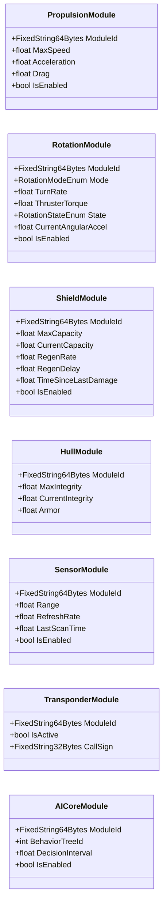

### PropulsionModule

```csharp
public struct PropulsionModule : IComponentData
{
    public FixedString64Bytes ModuleId;
    public float MaxSpeed;
    public float Acceleration;
    public float Drag;
    public bool IsEnabled;
}
```

### RotationModule (Complex - Has Modes)

```csharp
public struct RotationModule : IComponentData
{
    public FixedString64Bytes ModuleId;
    public RotationModeEnum Mode;  // Instant, Smooth, Physics, ThrusterBased
    public float TurnRate;
    public float ThrusterTorque;
    // State for thruster-based mode
    public RotationStateEnum State;  // Idle, Accelerate, Coast, Brake, Settling
    public float CurrentAngularAccel;
    public bool IsEnabled;
}

public enum RotationModeEnum : byte
{
    Instant = 0,
    Smooth = 1,
    Physics = 2,
    ThrusterBased = 3
}

public enum RotationStateEnum : byte
{
    Idle = 0,
    Accelerate = 1,
    Coast = 2,
    Brake = 3,
    Settling = 4
}
```

### ShieldModule

```csharp
public struct ShieldModule : IComponentData
{
    public FixedString64Bytes ModuleId;
    public float MaxCapacity;
    public float CurrentCapacity;
    public float RegenRate;
    public float RegenDelay;
    public float TimeSinceLastDamage;
    public bool IsEnabled;
}
```

### HullModule (Always Present)

```csharp
public struct HullModule : IComponentData
{
    public FixedString64Bytes ModuleId;
    public float MaxIntegrity;
    public float CurrentIntegrity;
    public float Armor;  // Damage reduction percentage
}
```

### SensorModule (Always Present)

```csharp
public struct SensorModule : IComponentData
{
    public FixedString64Bytes ModuleId;
    public float Range;
    public float RefreshRate;
    public float LastScanTime;
    public bool IsEnabled;
}
```

### TransponderModule (Always Present)

```csharp
public struct TransponderModule : IComponentData
{
    public FixedString64Bytes ModuleId;
    public bool IsActive;
    public FixedString32Bytes CallSign;
}
```

### AICoreModule (Optional)

```csharp
public struct AICoreModule : IComponentData
{
    public FixedString64Bytes ModuleId;
    public int BehaviorTreeId;  // Which BT to use
    public float DecisionInterval;
    public bool IsEnabled;
}
```

---

## Weapon Components (Buffer)

Weapons use `IBufferElementData` for variable count per ship.

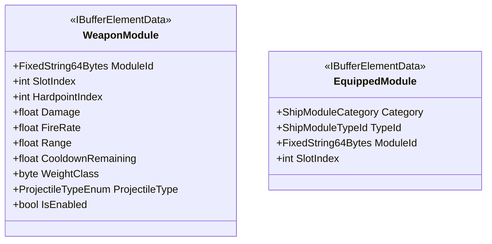

### WeaponModule (Buffer)

```csharp
public struct WeaponModule : IBufferElementData
{
    public FixedString64Bytes ModuleId;
    public int SlotIndex;
    public int HardpointIndex;
    public float Damage;
    public float FireRate;
    public float Range;
    public float CooldownRemaining;
    public byte WeightClass;
    public ProjectileTypeEnum ProjectileType;
    public bool IsEnabled;
}

public enum ProjectileTypeEnum : byte
{
    Kinetic = 0,
    Energy = 1,
    Missile = 2,
    Beam = 3
}
```

### EquippedModule (Buffer - Registry)
**Purpose:** Track which modules are equipped for save/load and UI display

```csharp
public struct EquippedModule : IBufferElementData
{
    public ShipModuleCategory Category;
    public ShipModuleTypeId TypeId;
    public FixedString64Bytes ModuleId;
    public int SlotIndex;
}
```

---

## AI/Behavior Tree Components

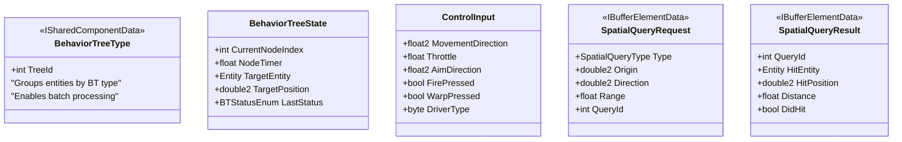

### BehaviorTreeType (Shared Component)
**Purpose:** Group entities by BT type for batch processing

```csharp
public struct BehaviorTreeType : ISharedComponentData, IEquatable<BehaviorTreeType>
{
    public int TreeId;  // Hash of BT asset

    public bool Equals(BehaviorTreeType other) => TreeId == other.TreeId;
    public override int GetHashCode() => TreeId;
}
```

### BehaviorTreeState
**Purpose:** BT execution state

```csharp
public struct BehaviorTreeState : IComponentData
{
    public int CurrentNodeIndex;
    public float NodeTimer;
    public EntityReference Target;  // Use EntityReference instead of raw Entity
    public double2 TargetPosition;
    public BTStatusEnum LastStatus;
}

public enum BTStatusEnum : byte
{
    Running = 0,
    Success = 1,
    Failure = 2
}
```

---

## Entity Reference Handling

**CRITICAL:** Raw `Entity` references can become stale when the target entity is destroyed or demoted to a higher tier. Use `EntityReference` for cross-entity references that must be validated.

### EntityReference Pattern

```csharp
/// <summary>
/// Safe entity reference that can be validated before use.
/// Stores both Entity and its EntityId for cross-tier lookups.
/// </summary>
public struct EntityReference
{
    public Entity Entity;        // Direct reference (fast, may be stale)
    public int EntityId;         // Stable ID for lookup if Entity invalid
    public int EntityVersion;    // Version at time of reference creation

    public static EntityReference Create(Entity entity, int entityId, int version)
    {
        return new EntityReference
        {
            Entity = entity,
            EntityId = entityId,
            EntityVersion = version
        };
    }

    public static readonly EntityReference Null = default;
    public bool IsNull => Entity == Entity.Null && EntityId == 0;
}

/// <summary>
/// Utility for validating and resolving entity references.
/// </summary>
public static class EntityReferenceUtil
{
    /// <summary>
    /// Check if reference is still valid (entity exists and hasn't been recycled).
    /// </summary>
    public static bool IsValid(EntityReference reference, EntityManager em)
    {
        if (reference.Entity == Entity.Null)
            return false;

        // Check entity still exists
        if (!em.Exists(reference.Entity))
            return false;

        // Check version matches (entity wasn't recycled)
        // Note: Entity.Version is internal, so we track our own version
        if (em.HasComponent<EntityId>(reference.Entity))
        {
            var id = em.GetComponentData<EntityId>(reference.Entity);
            return id.Value == reference.EntityId;
        }

        return false;
    }

    /// <summary>
    /// Try to resolve a stale reference using EntityId lookup.
    /// Used when Entity is invalid but EntityId might still exist (e.g., in different tier).
    /// </summary>
    public static bool TryResolve(
        EntityReference reference,
        EntityLookupService lookup,
        out Entity resolved)
    {
        resolved = Entity.Null;

        if (reference.EntityId == 0)
            return false;

        return lookup.TryGetEntityById(reference.EntityId, out resolved);
    }
}
```

### Components Using EntityReference

These components store entity references that require validation:

| Component | Field | Risk |
|-----------|-------|------|
| `BehaviorTreeState` | `Target` | Target destroyed during pursuit |
| `FleetMembership` | `FleetEntity` | Fleet disbanded |
| `Instigator` | `InstigatorEntity` | Shooter destroyed |
| `ProjectileData` | `Owner` | Owner destroyed before projectile hits |
| `FactionDetection` | `DetectedEntity` | Detected entity left sensor range |

**Best Practice:** Always validate `EntityReference` before dereferencing. If invalid, clear the reference or use fallback behavior.

### SpatialQueryRequest (Buffer)
**Purpose:** BT outputs spatial query requests

```csharp
public struct SpatialQueryRequest : IBufferElementData
{
    public SpatialQueryType Type;
    public double2 Origin;
    public double2 Direction;
    public float Range;
    public int QueryId;
}

public enum SpatialQueryType : byte
{
    Raycast = 0,
    OverlapCircle = 1,
    NearestEnemy = 2,
    NearestAlly = 3
}
```

### SpatialQueryResult (Buffer)
**Purpose:** Spatial system fills in results (Burst job)

```csharp
public struct SpatialQueryResult : IBufferElementData
{
    public int QueryId;
    public Entity HitEntity;
    public double2 HitPosition;
    public float Distance;
    public bool DidHit;
}
```

### ControlInput
**Purpose:** Final control output from driver (player or AI)

```csharp
public struct ControlInput : IComponentData
{
    public float2 MovementDirection;
    public float Throttle;
    public float2 AimDirection;
    public bool FirePressed;
    public bool WarpPressed;
    public byte DriverType;  // 0=None, 1=Player, 2=AI
}
```

---

## Combat Components

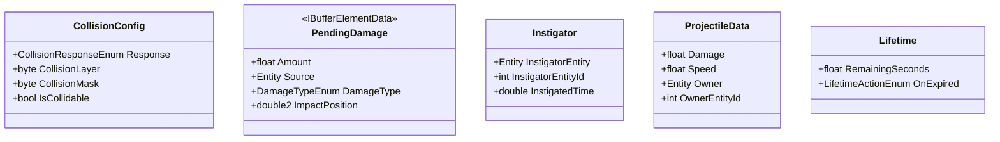

### CollisionConfig

```csharp
public struct CollisionConfig : IComponentData
{
    public CollisionResponseEnum Response;
    public byte CollisionLayer;
    public byte CollisionMask;
    public bool IsCollidable;
}

public enum CollisionResponseEnum : byte
{
    Bounce = 0,
    Damage = 1,
    Destroy = 2,
    None = 3
}
```

### PendingDamage (Buffer)
**Purpose:** Damage queue processed by combat systems

```csharp
public struct PendingDamage : IBufferElementData
{
    public float Amount;
    public Entity Source;
    public DamageTypeEnum DamageType;
    public double2 ImpactPosition;       // Absolute world position (set by ProjectileSystem)
    public float2 LocalImpactPosition;   // Position relative to target entity (set by DamageLocalizationSystem)
    public HitboxZoneType HitZone;       // Which zone was hit (set by DamageLocalizationSystem)
    public bool IsLocalized;             // True if damage uses hitbox zone system (false for Tier 2+)
}

public enum DamageTypeEnum : byte
{
    Kinetic = 0,
    Energy = 1,
    Explosive = 2,
    Collision = 3
}
```

**Localized Damage:** When `IsLocalized` is true, the `DamageLocalizationSystem` routes damage to specific modules based on `LocalImpactPosition`. See [[09-progressive-destruction]] for details.

### Instigator
**Purpose:** Blame tracking for collision chains

```csharp
public struct Instigator : IComponentData
{
    public Entity InstigatorEntity;
    public int InstigatorEntityId;  // For cross-tier reference
    public double InstigatedTime;
}
```

### ProjectileData

```csharp
public struct ProjectileData : IComponentData
{
    public float Damage;
    public float Speed;
    public Entity Owner;
    public int OwnerEntityId;
}
```

**Owner Destruction Handling:**
When `ProjectileData.Owner` becomes invalid (owner destroyed):
1. Damage attribution falls back to `Instigator.InstigatorEntityId`
2. Guided missiles lose tracking and continue on ballistic trajectory
3. Projectile lifetime continues normally (does not despawn)

The `ProjectileSystem` validates `Owner` using `EntityReferenceUtil.IsValid()` before any owner-dependent behavior.

### Lifetime

```csharp
public struct Lifetime : IComponentData
{
    public float RemainingSeconds;
    public LifetimeActionEnum OnExpired;
}

public enum LifetimeActionEnum : byte
{
    Destroy = 0,
    Stop = 1,
    MarkExpired = 2
}
```

---

## Module Damage Components

Components for the progressive destruction system. See [[09-progressive-destruction]] for full documentation.

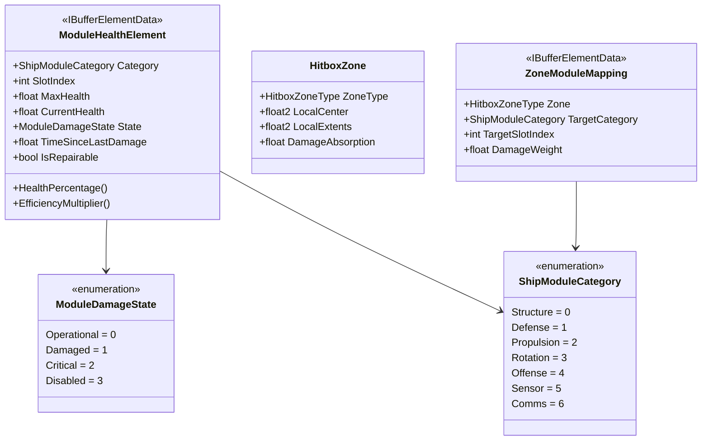

### ShipModuleCategory
**Purpose:** Identifies module types for damage routing and health tracking

```csharp
/// <summary>
/// Categories for ship modules. Used by damage routing and module health systems.
/// Maps to actual ECS components as follows:
/// </summary>
public enum ShipModuleCategory : byte
{
    Structure = 0,    // HullModule - structural integrity
    Defense = 1,      // ShieldModule - defensive systems
    Propulsion = 2,   // PropulsionModule - engines/thrusters
    Rotation = 3,     // RotationModule - maneuvering thrusters
    Offense = 4,      // WeaponModule (buffer) - weapons
    Sensor = 5,       // SensorModule - detection systems
    Comms = 6         // TransponderModule - communications
}
```

**Category to Component Mapping:**

| Category | ECS Component | Notes |
|----------|---------------|-------|
| `Structure` | `HullModule` | Core structural integrity, always present |
| `Defense` | `ShieldModule` | Shield generator, energy shields |
| `Propulsion` | `PropulsionModule` | Main engines, acceleration |
| `Rotation` | `RotationModule` | Maneuvering thrusters, turn rate |
| `Offense` | `WeaponModule` (buffer) | Weapons use SlotIndex to identify specific weapon |
| `Sensor` | `SensorModule` | Detection range, scan capabilities |
| `Comms` | `TransponderModule` | IFF, communications |

### ModuleDamageState
**Purpose:** Damage state for module degradation

```csharp
public enum ModuleDamageState : byte
{
    Operational = 0,   // 75-100% health, 100% efficiency
    Damaged = 1,       // 50-74% health, 75% efficiency
    Critical = 2,      // 25-49% health, 50% efficiency
    Disabled = 3       // 0-24% health, 0% efficiency (offline)
}
```

### ModuleHealthElement (Buffer)
**Purpose:** Per-module health tracking stored as a buffer on the entity

**Architecture Note:** In Unity ECS, components cannot be nested inside other components. Since ships have multiple damageable modules (propulsion, rotation, shields, weapons, etc.), we use a `DynamicBuffer<ModuleHealthElement>` to track health for each module. The `Category` and `SlotIndex` fields identify which module the health data applies to.

```csharp
/// <summary>
/// Tracks health for a single module. Stored as a buffer on ship entities.
/// Each damageable module has one entry in the buffer.
/// </summary>
public struct ModuleHealthElement : IBufferElementData
{
    public ShipModuleCategory Category;  // Which module type
    public int SlotIndex;                 // For Offense category: weapon slot index. -1 for others.
    public float MaxHealth;               // Maximum module health
    public float CurrentHealth;           // Current health (0 to MaxHealth)
    public ModuleDamageState State;       // Derived from health percentage
    public float TimeSinceLastDamage;     // For auto-repair delay
    public bool IsRepairable;             // Some modules may not be field-repairable

    public float HealthPercentage => MaxHealth > 0 ? CurrentHealth / MaxHealth : 0f;

    public float EfficiencyMultiplier => State switch
    {
        ModuleDamageState.Operational => 1.0f,
        ModuleDamageState.Damaged => 0.75f,
        ModuleDamageState.Critical => 0.5f,
        ModuleDamageState.Disabled => 0.0f,
        _ => 1.0f
    };
}
```

**Buffer Population Example:**

**Note:** The `Structure` category (HullModule) is intentionally NOT included in the ModuleHealthElement buffer. Hull integrity is tracked via `HullModule.CurrentIntegrity` and receives damage from the non-absorbed portion of zone damage plus module overflow. See [[09-progressive-destruction]] for the damage flow.

```csharp
// When spawning a ship, populate the ModuleHealthElement buffer:
var healthBuffer = em.GetBuffer<ModuleHealthElement>(entity);

// Core modules - one entry per damageable module type
healthBuffer.Add(new ModuleHealthElement {
    Category = ShipModuleCategory.Propulsion,
    SlotIndex = -1,
    MaxHealth = 100f,  // From config
    CurrentHealth = 100f,
    State = ModuleDamageState.Operational
});

healthBuffer.Add(new ModuleHealthElement {
    Category = ShipModuleCategory.Rotation,
    SlotIndex = -1,
    MaxHealth = 80f,   // From config
    CurrentHealth = 80f,
    State = ModuleDamageState.Operational
});

healthBuffer.Add(new ModuleHealthElement {
    Category = ShipModuleCategory.Defense,  // Shield generator
    SlotIndex = -1,
    MaxHealth = 60f,   // From config
    CurrentHealth = 60f,
    State = ModuleDamageState.Operational
});

healthBuffer.Add(new ModuleHealthElement {
    Category = ShipModuleCategory.Sensor,
    SlotIndex = -1,
    MaxHealth = 40f,   // From config
    CurrentHealth = 40f,
    State = ModuleDamageState.Operational
});

// For weapons, add one entry per weapon slot
for (int i = 0; i < weaponBuffer.Length; i++)
{
    healthBuffer.Add(new ModuleHealthElement {
        Category = ShipModuleCategory.Offense,
        SlotIndex = i,
        MaxHealth = 50f,  // From config
        CurrentHealth = 50f,
        State = ModuleDamageState.Operational
    });
}
```

**Querying Module Health:**
```csharp
/// <summary>
/// Helper to find module health by category and slot.
/// </summary>
public static bool TryGetModuleHealth(
    DynamicBuffer<ModuleHealthElement> buffer,
    ShipModuleCategory category,
    int slotIndex,
    out ModuleHealthElement health)
{
    for (int i = 0; i < buffer.Length; i++)
    {
        if (buffer[i].Category == category &&
            (slotIndex == -1 || buffer[i].SlotIndex == slotIndex))
        {
            health = buffer[i];
            return true;
        }
    }
    health = default;
    return false;
}
```

### HitboxZoneType
**Purpose:** Identifies different damage zones on an entity

```csharp
public enum HitboxZoneType : byte
{
    Center = 0,     // Default/fallback zone
    Fore = 1,       // Front of entity
    Aft = 2,        // Rear of entity
    Port = 3,       // Left side
    Starboard = 4,  // Right side
    Dorsal = 5,     // Top (for 3D or large entities)
    Ventral = 6,    // Bottom

    // Station-specific
    Upper = 10,
    Lower = 11,
    Ring = 12
}
```

### HitboxZone
**Purpose:** Defines a damage zone's geometry and absorption rate

```csharp
/// <summary>
/// Plain struct embedded in HitboxZoneElement buffer, not a standalone component.
/// </summary>
public struct HitboxZone
{
    public HitboxZoneType ZoneType;
    public float2 LocalCenter;           // Center relative to entity origin
    public float2 LocalExtents;          // Half-size for AABB
    public float DamageAbsorption;       // 0-1, percentage of damage routed to modules (remainder goes to hull)
}
```

### HitboxZoneElement (Buffer)
**Purpose:** Buffer of hitbox zones per entity

```csharp
public struct HitboxZoneElement : IBufferElementData
{
    public HitboxZone Zone;
}
```

### ZoneModuleMapping (Buffer)
**Purpose:** Maps zones to modules for damage routing

```csharp
public struct ZoneModuleMapping : IBufferElementData
{
    public HitboxZoneType Zone;
    public ShipModuleCategory TargetCategory;  // Which module category takes damage
    public int TargetSlotIndex;                 // -1 = all slots in category
    public float DamageWeight;                  // Weight when multiple modules in zone (0-1)
}
```

### RepairConfiguration
**Purpose:** Auto-repair settings per entity

```csharp
public struct RepairConfiguration : IComponentData
{
    public float RepairDelayAfterDamage;   // Seconds before auto-repair starts (default: 5s)
    public float BaseRepairRatePerSecond;  // Percentage of MaxHealth restored per second (0.02 = 2%)
    public bool CanAutoRepairDisabled;     // Can auto-repair fix Disabled modules? (default: false)
    public bool RequiresOutOfCombat;       // Must not be taking damage to repair? (default: false)
}
```

### EntityDamageEffects
**Purpose:** Tracks overall damage state for visual effects

```csharp
/// <summary>
/// Tracks the worst damage state across all modules for visual effects.
/// Used by DamageEffectsSystem to drive particles, audio, and visual degradation.
/// </summary>
public struct EntityDamageEffects : IComponentData
{
    public ModuleDamageState WorstModuleState;    // Most damaged module's state
    public ModuleDamageState PreviousWorstState;  // For detecting state transitions
    public int DisabledModuleCount;               // How many modules are currently disabled
}
```

**Usage:** The `DamageEffectsSystem` updates this component each frame for Tier 0 entities, scanning the `ModuleHealthElement` buffer to find the worst state. Visual effects (sparks, smoke, fire) are driven by `WorstModuleState` and `DisabledModuleCount`.

---

## Context Components

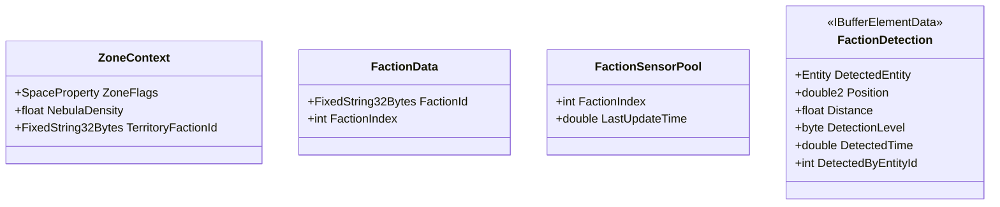

### ZoneContext
**Purpose:** Current zone properties from world fabric

```csharp
public struct ZoneContext : IComponentData
{
    public SpaceProperty ZoneFlags;  // Bitmask: Nebula, Asteroid, Void, Anomaly
    public float NebulaDensity;
    public FixedString32Bytes TerritoryFactionId;
}

[Flags]
public enum SpaceProperty : byte
{
    None = 0,
    Void = 1 << 0,
    Nebula = 1 << 1,
    Asteroids = 1 << 2,
    Anomaly = 1 << 3
}
```

### FactionData
**Purpose:** Entity faction identity

```csharp
public struct FactionData : IComponentData
{
    public FixedString32Bytes FactionId;
    public int FactionIndex;  // For fast relationship table lookup
}
```

### FactionRelationshipMatrix (Singleton)
**Purpose:** Lookup table for faction relationships. Required for AI friend/foe detection.

```csharp
/// <summary>
/// Singleton containing faction relationship matrix.
/// FactionRelation values: -100 (hostile) to +100 (allied), 0 = neutral
/// </summary>
public struct FactionRelationshipMatrix : IComponentData
{
    public const int MaxFactions = 16;

    // Fixed-size 2D array flattened to 1D (16x16 = 256 entries)
    public FixedList512Bytes<sbyte> Relations;

    public sbyte GetRelation(int factionA, int factionB)
    {
        return Relations[factionA * MaxFactions + factionB];
    }

    public void SetRelation(int factionA, int factionB, sbyte value)
    {
        Relations[factionA * MaxFactions + factionB] = value;
        Relations[factionB * MaxFactions + factionA] = value; // Symmetric
    }

    public bool IsHostile(int factionA, int factionB) => GetRelation(factionA, factionB) < -25;
    public bool IsAllied(int factionA, int factionB) => GetRelation(factionA, factionB) > 25;
    public bool IsNeutral(int factionA, int factionB)
    {
        var rel = GetRelation(factionA, factionB);
        return rel >= -25 && rel <= 25;
    }
}
```

### FactionSensorPool (Faction Entity)
**Purpose:** One entity per faction holds shared detection data

```csharp
public struct FactionSensorPool : IComponentData
{
    public int FactionIndex;
    public double LastUpdateTime;
}
```

### FactionDetection (Buffer on Faction Entity)
**Purpose:** All detections for this faction

```csharp
public struct FactionDetection : IBufferElementData
{
    public EntityReference DetectedEntity;  // Use EntityReference for validation
    public double2 Position;
    public double2 LastKnownVelocity;       // For dead reckoning when stale
    public float Distance;
    public byte DetectionLevel;  // 0=Blip, 1=Identified, 2=Full
    public double DetectedTime;
    public double ConfidenceDecayStart;     // When confidence starts decaying
    public int DetectedByEntityId;  // Which sensor found it
}
```

Ships query their faction's `FactionDetection` buffer rather than maintaining individual detection lists.

### Detection Cleanup Rules

Detections require regular cleanup to prevent stale data and memory growth:

```csharp
/// <summary>
/// System to clean up stale faction detections.
///
/// PERFORMANCE: With many factions (10+) and 500 detections each, processing all
/// factions every frame is expensive. Instead, process ONE faction per frame
/// (round-robin) to amortize the cost. Full cleanup cycle = NumFactions frames.
/// </summary>
[UpdateInGroup(typeof(SimulationSystemGroup))]
public partial struct FactionDetectionCleanupSystem : ISystem
{
    private const double DETECTION_TIMEOUT = 10.0;      // Remove after 10s without refresh
    private const double CONFIDENCE_DECAY_START = 3.0;  // Start decaying confidence after 3s
    private const int MAX_DETECTIONS_PER_FACTION = 500; // Cap to prevent memory issues

    private int _currentFactionIndex;  // Round-robin tracker

    public void OnUpdate(ref SystemState state)
    {
        double currentTime = SystemAPI.Time.ElapsedTime;

        // Get all faction entities for round-robin processing
        var factionQuery = SystemAPI.QueryBuilder()
            .WithAll<FactionSensorPool, FactionDetection>()
            .Build();
        var factionCount = factionQuery.CalculateEntityCount();
        if (factionCount == 0) return;

        _currentFactionIndex = (_currentFactionIndex + 1) % factionCount;
        int processed = 0;

        foreach (var (pool, detections) in
            SystemAPI.Query<RefRO<FactionSensorPool>, DynamicBuffer<FactionDetection>>())
        {
            // AMORTIZATION: Only process one faction per frame
            if (processed++ != _currentFactionIndex)
                continue;

            // Remove stale detections (oldest first if over limit)
            for (int i = detections.Length - 1; i >= 0; i--)
            {
                var detection = detections[i];
                double age = currentTime - detection.DetectedTime;

                // Remove if timed out
                if (age > DETECTION_TIMEOUT)
                {
                    detections.RemoveAt(i);
                    continue;
                }

                // Remove if entity no longer valid and old
                if (!EntityReferenceUtil.IsValid(detection.DetectedEntity, state.EntityManager)
                    && age > CONFIDENCE_DECAY_START)
                {
                    detections.RemoveAt(i);
                    continue;
                }
            }

            // Enforce maximum detections (remove oldest if over limit)
            while (detections.Length > MAX_DETECTIONS_PER_FACTION)
            {
                int oldestIndex = FindOldestDetection(detections);
                detections.RemoveAt(oldestIndex);
            }
        }
    }

    private int FindOldestDetection(DynamicBuffer<FactionDetection> detections)
    {
        int oldest = 0;
        double oldestTime = double.MaxValue;
        for (int i = 0; i < detections.Length; i++)
        {
            if (detections[i].DetectedTime < oldestTime)
            {
                oldestTime = detections[i].DetectedTime;
                oldest = i;
            }
        }
        return oldest;
    }
}
```

**Confidence Decay:**
- Fresh detection: 100% confidence, accurate position
- 3+ seconds old: Confidence decays, position extrapolated from LastKnownVelocity
- 10+ seconds: Detection removed entirely

**Duplicate Handling:** When a sensor detects an already-tracked entity, update the existing detection rather than adding a duplicate. Match by EntityId.

---

## Utility Components

These components support system infrastructure and entity lifecycle management.

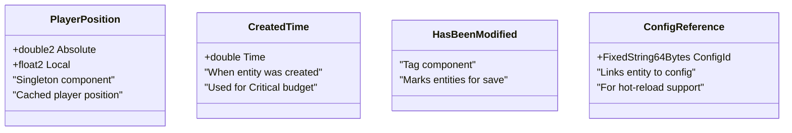

### PlayerPosition (Singleton)
**Purpose:** Cached player position for efficient distance queries

```csharp
public struct PlayerPosition : IComponentData
{
    public double2 Absolute;  // Player's absolute world position
    public float2 Local;      // Player's local position (relative to origin)
}
```

**Rationale:** Many systems need player position (tier calculation, AI targeting, chunk loading). Caching it as a singleton avoids repeated lookups.

### CreatedTime
**Purpose:** Track when an entity was created

```csharp
public struct CreatedTime : IComponentData
{
    public double Time;  // World time when entity was created
}
```

**Usage:** Used by `CriticalEntityBudgetSystem` to identify oldest Critical entities for potential downgrade.

### HasBeenModified (Tag)
**Purpose:** Mark entities that have been modified since chunk load

```csharp
public struct HasBeenModified : IComponentData { }
```

**Usage:** When unloading chunks, entities with this tag are saved to persistent storage rather than discarded. Add this tag when:
- Entity takes damage
- Entity changes faction
- Entity's modules change
- Entity's inventory changes

### ConfigReference
**Purpose:** Link entity to its source configuration for hot-reload support

```csharp
public struct ConfigReference : IComponentData
{
    public FixedString64Bytes ConfigId;  // ArchetypeId from config file
}
```

**Usage:** During editor hot-reload, entities with this component can be updated when their source config changes.

---

## Gravity Components

Components for the Newtonian gravity and orbital mechanics system. See [[10-gravity-system]] for full documentation.

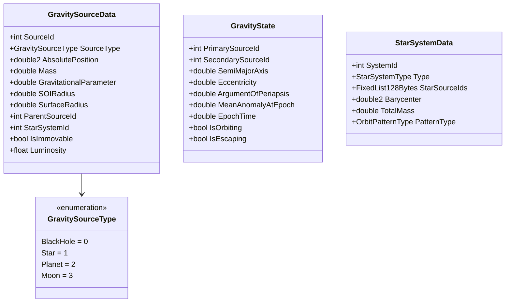

### GravitySourceData
**Purpose:** Burst-compatible gravity source data extracted from CelestialBodyInfo

```csharp
public struct GravitySourceData
{
    public int SourceId;
    public GravitySourceType SourceType;
    public double2 AbsolutePosition;        // Updated each frame for moving stars
    public double Mass;
    public double GravitationalParameter;   // GM (pre-computed)
    public double SOIRadius;
    public double SurfaceRadius;
    public int ParentSourceId;              // -1 for black holes
    public int StarSystemId;                // -1 if standalone
    public bool IsImmovable;                // Only true for black holes
    public float Luminosity;                // For heat system
}

public enum GravitySourceType : byte
{
    BlackHole = 0,
    Star = 1,
    Planet = 2,
    Moon = 3
}
```

### GravityState
**Purpose:** Per-entity gravity and orbital state. Stored in SimulatedEntity.TypeData.

```csharp
public struct GravityState
{
    public int PrimarySourceId;             // Current dominant gravity source
    public int SecondarySourceId;           // For perturbations (-1 if none)

    // Keplerian orbital elements (for Tier 2 prediction)
    public double SemiMajorAxis;
    public double Eccentricity;
    public double ArgumentOfPeriapsis;
    public double MeanAnomalyAtEpoch;
    public double EpochTime;

    public bool IsOrbiting;                 // True if in stable orbit
    public bool IsEscaping;                 // True if on escape trajectory
}
```

### StarSystemData
**Purpose:** Multi-star system configuration (binary, triple)

```csharp
public struct StarSystemData
{
    public int SystemId;
    public StarSystemType Type;
    public FixedList128Bytes<int> StarSourceIds;  // References to GravitySourceData
    public double2 Barycenter;                     // Updated each frame
    public double TotalMass;
    public OrbitPatternType PatternType;
}

public enum StarSystemType : byte
{
    Single = 0,
    Binary = 1,
    Triple = 2
}

public enum OrbitPatternType : byte
{
    None = 0,              // Single star
    SimpleBinary = 1,      // Two stars around barycenter
    HierarchicalTriple = 2,// Close binary + distant third
    Figure8Triple = 3      // Known stable three-body pattern
}
```

### PrecomputedOrbit
**Purpose:** Pre-calculated orbital path for stars in multi-body systems

```csharp
public struct PrecomputedOrbit
{
    public double SemiMajorAxis;
    public double Eccentricity;
    public double ArgumentOfPeriapsis;
    public double InitialMeanAnomaly;
    public double Period;
    public double2 OrbitCenter;

    public double2 SamplePosition(double time);
    public double2 SampleVelocity(double time);
}
```

---

## Heat Components

Components for the thermal radiation and heat damage system. See [[11-heat-system]] for full documentation.

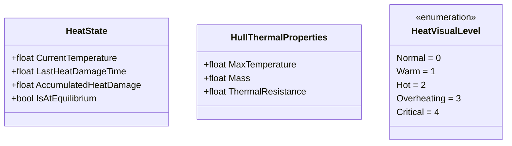

### HeatState
**Purpose:** Per-entity thermal state. Stored in SimulatedEntity.TypeData.

```csharp
public struct HeatState
{
    public float CurrentTemperature;       // Current hull temperature (Kelvin)
    public float LastHeatDamageTime;       // For damage rate limiting
    public float AccumulatedHeatDamage;    // Total heat damage taken
    public bool IsAtEquilibrium;           // True if heating ≈ cooling
}
```

### HullThermalProperties
**Purpose:** Thermal properties extracted from hull module

```csharp
public struct HullThermalProperties
{
    public float MaxTemperature;           // Hull max temperature tolerance
    public float Mass;                     // For thermal mass calculation
    public float ThermalResistance;        // 0-1, reduces thermal damage
}
```

**Integration with HullModule:**
- `MaxTemperature` from `IShipHullModule.MaxTemperature`
- `Mass` derived from `IShipHullModule.MaxIntegrity`
- `CurrentTemperature` synced via `IShipHullModule.CurrentTemperature`

### HeatVisualLevel
**Purpose:** Visual effect level based on temperature

```csharp
public enum HeatVisualLevel : byte
{
    Normal = 0,       // < 50% MaxTemp
    Warm = 1,         // 50-75% MaxTemp
    Hot = 2,          // 75-100% MaxTemp
    Overheating = 3,  // 100-110% MaxTemp
    Critical = 4      // > 110% MaxTemp
}
```

---

## State Machine Components (Tier 2 AI)

At Tier 2, ships use a simplified state machine instead of full behavior trees.

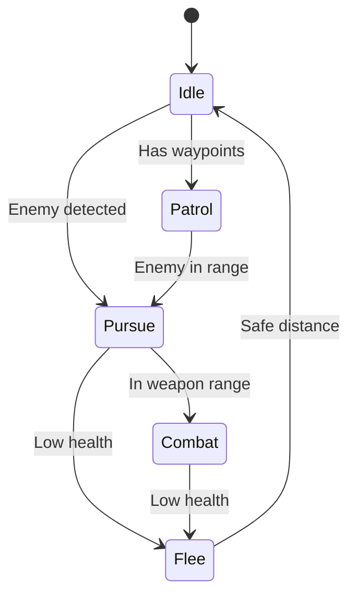

### StateMachineState
**Purpose:** State machine execution state for Tier 2 AI

```csharp
public struct StateMachineState : IComponentData
{
    public AIStateEnum CurrentState;
    public AIStateEnum PreviousState;
    public float StateTimer;              // Time in current state
    public EntityReference Target;        // Current target (if any)
    public double2 TargetPosition;        // Destination/waypoint
    public float StateParameter;          // State-specific parameter
}

public enum AIStateEnum : byte
{
    Idle = 0,
    Patrol = 1,
    Pursue = 2,
    Combat = 3,
    Flee = 4,
    Orbit = 5,
    Dock = 6
}
```

**State Descriptions:**
- **Idle:** No active goal, minimal movement corrections
- **Patrol:** Following waypoint sequence
- **Pursue:** Moving toward target entity
- **Combat:** In weapon range, engaging target
- **Flee:** Moving away from threat
- **Orbit:** Circling a point or entity
- **Dock:** Approaching station for docking

**Tier Transition:**
- **Tier 1 → Tier 2:** Add `StateMachineState`, derive initial state from `BehaviorTreeState`
- **Tier 2 → Tier 1:** Remove `StateMachineState`, restore `BehaviorTreeState` from state machine

---

## Related Documents

- [[02-system-architecture]] - Systems that process these components
- [[03-tiered-simulation]] - How entities transition between simulation tiers
- [[04-archetype-strategy]] - How components combine into entity archetypes
- [[05-configuration-layer]] - How components are initialized from JSON configs
- [[09-progressive-destruction]] - Module damage and hitbox zone systems
- [[10-gravity-system]] - Gravity components and orbital mechanics
- [[11-heat-system]] - Heat components and thermal radiation
