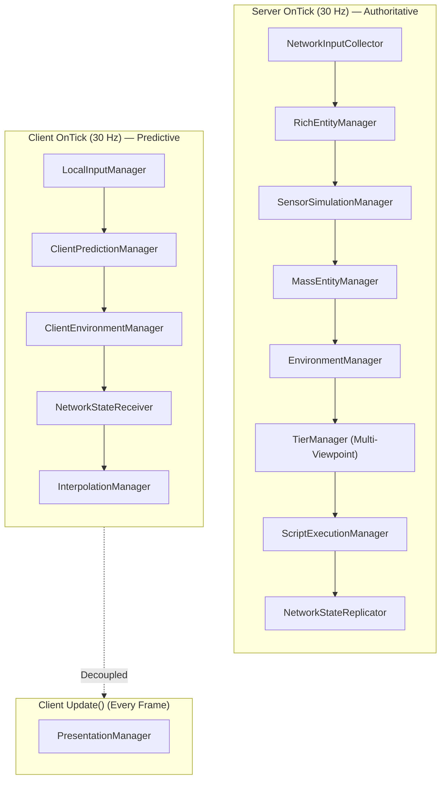
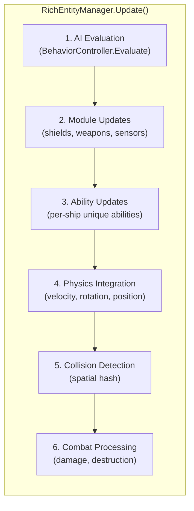
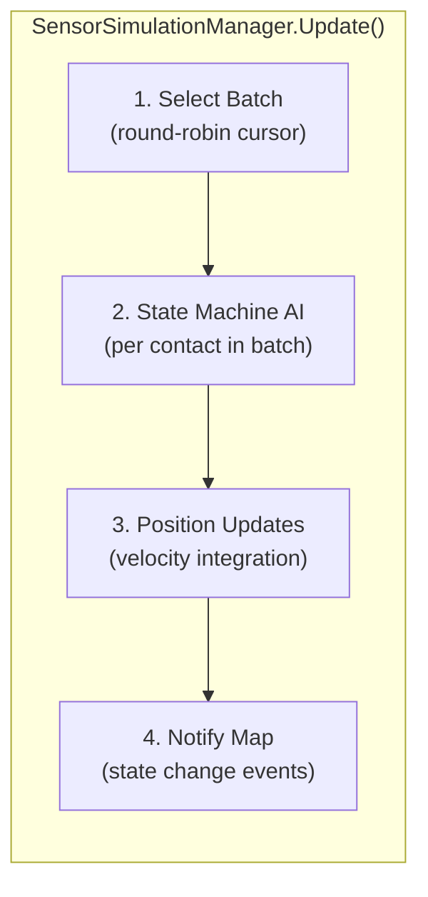
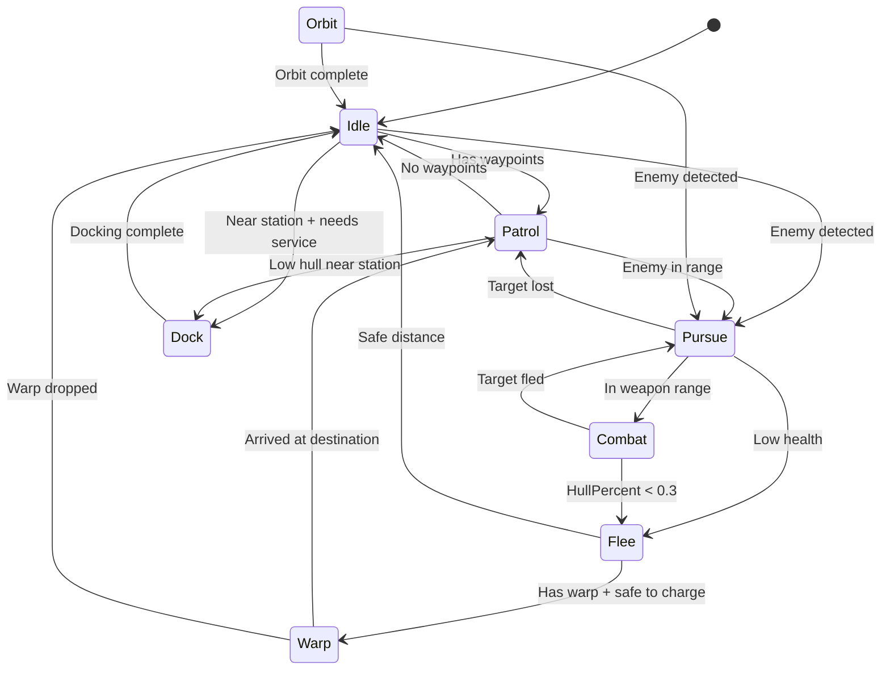
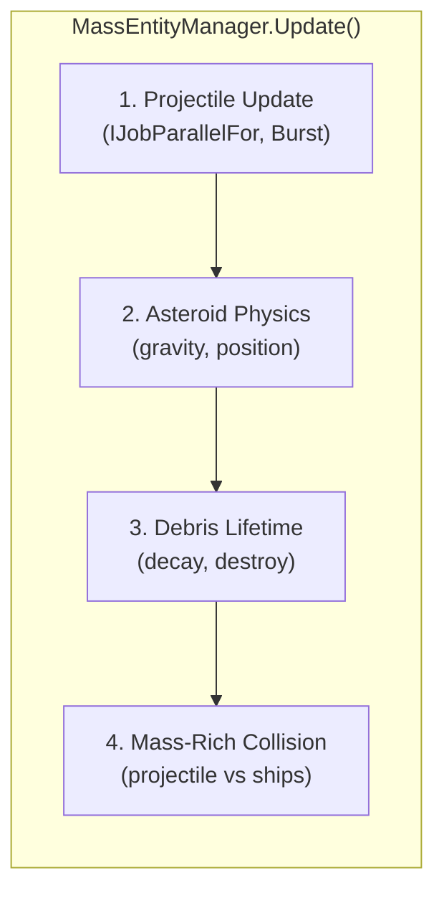
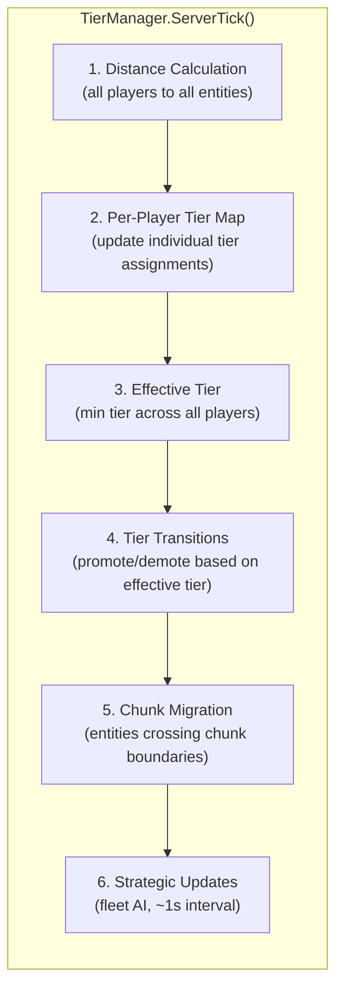
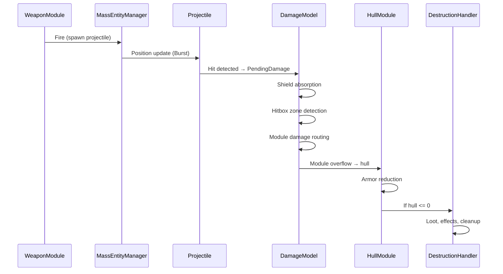

# System Architecture

This document defines the processing pipeline for each layer, execution order, and data flow.

> **Multiplayer Architecture:** The simulation runs on Fishnet's `TimeManager.OnTick` (30 Hz) instead of `Update()`. The pipeline splits into a **server pipeline** (authoritative simulation) and a **client pipeline** (prediction + rendering). Single-player is a local listen server — the networking stack is always active. See [[13-networking-architecture]] for full detail.

---

## Processing Overview

Each layer has its own manager class. Simulation managers run on Fishnet's tick (30 Hz), while `PresentationManager` runs in `Update()` for smooth rendering decoupled from tick rate.



On a listen server (including single-player), both pipelines execute in the same process. `IsServerStarted` and `IsClientStarted` flags determine which steps run.

---

## Layer Managers

### 1. Input: NetworkInputCollector (Server) + LocalInputManager (Client)

In multiplayer, input handling splits into two roles:

**Server — NetworkInputCollector:** Gathers `ControlInput` from per-client input buffers populated by ServerRpc calls. AI ships receive input from their `BehaviorController` as before.

```csharp
public class NetworkInputCollector : NetworkBehaviour
{
    private Dictionary<int, CircularBuffer<TickedInput>> _clientInputBuffers;

    [ServerRpc(RequireOwnership = false)]
    private void SendInput(uint tick, ControlInput input, NetworkConnection sender)
    {
        int clientId = sender.ClientId;
        _clientInputBuffers[clientId].Add(new TickedInput { Tick = tick, Input = input });
    }

    public ControlInput GetInputForPlayer(int clientId, uint tick)
    {
        if (_clientInputBuffers[clientId].TryGet(tick, out var tickedInput))
            return tickedInput.Input;

        return _clientInputBuffers[clientId].Latest.Input;
    }
}
```

**Client — LocalInputManager:** Reads Unity Input System, stores input in a replay buffer keyed by tick, sends to server via ServerRpc, and applies locally for prediction.

| Responsibility | Budget (Server) | Budget (Client) |
|---------------|----------------|-----------------|
| Gather inputs from N clients | 0.3ms | — |
| Read Unity Input System | — | 0.2ms |
| Store in replay buffer + send ServerRpc | — | 0.1ms |
| **Total** | **0.3ms** | **0.3ms** |

---

### 2. RichEntityManager (Server-Only)

Manages all Tier 0-1 ships and stations. This is the core gameplay simulation. Runs **server-side only** — the server applies both AI and player inputs, simulates physics, and resolves combat. Clients receive the resulting state via `NetworkStateReplicator`.



```csharp
public class RichEntityManager
{
    private Dictionary<int, ShipInstance> _ships;
    private Dictionary<int, StationInstance> _stations;
    private SpatialHashGrid _collisionGrid;
    private SimulationContext _context;

    public void Update(float deltaTime)
    {
        // 1. AI evaluation (behavior trees for AI ships)
        foreach (var ship in _ships.Values)
        {
            if (ship.BehaviorController != null)
            {
                var input = ship.BehaviorController.Evaluate(ship, _context);
                ship.ApplyControlInput(input);
            }
        }

        // 2. Module updates (shields regen, weapon cooldowns, sensor scans)
        foreach (var ship in _ships.Values)
            ship.UpdateModules(deltaTime);

        // 3. Ability updates (unique per-class abilities)
        foreach (var ship in _ships.Values)
            ship.UpdateAbilities(deltaTime);

        // 4. Physics integration
        foreach (var ship in _ships.Values)
            ship.IntegratePhysics(deltaTime);

        // 5. Collision detection
        _collisionGrid.Clear();
        _collisionGrid.InsertAll(_ships.Values);
        _collisionGrid.DetectAndResolve();

        // 6. Combat processing (damage routing, destruction)
        ProcessCombat(deltaTime);
    }
}
```

| Step | Responsibility | Budget |
|------|---------------|--------|
| AI Evaluation | Behavior trees for AI ships | 1.0ms |
| Module Updates | Shield regen, weapon cooldowns, sensors | 0.5ms |
| Ability Updates | Per-class unique abilities | 0.3ms |
| Physics Integration | Velocity, rotation, position updates | 0.3ms |
| Collision Detection | Spatial hash broad + narrow phase | 0.5ms |
| Combat Processing | Damage routing, destruction | 0.4ms |
| **Total** | | **3.0ms** |

> **Multiplayer Note:** Player ships always use Rigidbody2D on the server (regardless of tier) to match the client's prediction physics. The server applies `ControlInput` received from `NetworkInputCollector` the same way the client applies it locally during prediction.

**Collision System (Rich Layer):**

| Tier | Collision Approach |
|------|-------------------|
| Tier 0 | Unity Physics (Rigidbody2D colliders) |
| Tier 1 | Managed spatial hash with circle-circle tests |

```csharp
public class SpatialHashGrid
{
    private const float CellSize = 50f;
    private const int MaxEntitiesPerCell = 64;

    public void InsertAll(IEnumerable<ShipInstance> ships);
    public void DetectAndResolve();
}
```

---

### 3. SensorSimulationManager (Server-Only)

Manages Tier 2 entities visible on sensors. Amortized updates for realistic but efficient simulation. Runs **server-side only** — the server computes per-client sensor results based on each player's sensor module and sends `SensorContactSummary` batches via `TargetRpc` at 2-4 Hz.



```csharp
public class SensorSimulationManager
{
    private List<SensorContact> _contacts;
    private int _updateCursor;
    private int _batchSize = 30;

    public void Update(float deltaTime)
    {
        float scaledDt = deltaTime * (_contacts.Count / (float)_batchSize);
        int end = Math.Min(_updateCursor + _batchSize, _contacts.Count);

        for (int i = _updateCursor; i < end; i++)
        {
            ref var contact = ref _contacts[i];
            UpdateStateMachine(ref contact, scaledDt);
            IntegratePosition(ref contact, scaledDt);
            CheckStateChanges(ref contact);
        }

        _updateCursor = (end >= _contacts.Count) ? 0 : end;
    }
}
```

**State Machine AI:**



| Responsibility | Budget |
|---------------|--------|
| State machine evaluation (~30 contacts/frame) | 0.2ms |
| Position integration | 0.1ms |
| State change notifications | 0.1ms |
| **Total** | **0.5ms** |

At ~200 contacts / 30 per batch = full cycle every ~7 frames. At 60fps that is ~8.5 updates per second per entity.

---

### 4. MassEntityManager (Server-Authoritative)

Manages asteroids, debris, and projectiles using NativeArrays and Burst Jobs. The server runs the **authoritative** Burst jobs for gameplay (hit detection, physics). Clients run **visual-only** Burst jobs for projectile animation and asteroid rendering from deterministic seeds — no gameplay impact on client.



```csharp
public class MassEntityManager
{
    private NativeArray<ProjectileData> _projectiles;
    private NativeArray<AsteroidData> _asteroids;
    private NativeArray<DebrisData> _debris;
    private NativeArray<GravitySourceData> _gravitySources;

    public void Update(float deltaTime)
    {
        // 1. Projectile position update (Burst)
        new ProjectileUpdateJob
        {
            Projectiles = _projectiles,
            DeltaTime = deltaTime
        }.Schedule(_projectiles.Length, 64).Complete();

        // 2. Asteroid gravity + position (Burst)
        new AsteroidGravityJob
        {
            Asteroids = _asteroids,
            GravitySources = _gravitySources,
            DeltaTime = deltaTime
        }.Schedule(_asteroids.Length, 64).Complete();

        // 3. Debris lifetime
        new DebrisLifetimeJob
        {
            Debris = _debris,
            DeltaTime = deltaTime
        }.Schedule(_debris.Length, 64).Complete();

        // 4. Projectile vs Rich entity collision (queries RichEntityManager)
        CheckProjectileHits();
    }
}
```

**Burst Jobs:**

```csharp
[BurstCompile]
public struct AsteroidGravityJob : IJobParallelFor
{
    public NativeArray<AsteroidData> Asteroids;
    [ReadOnly] public NativeArray<GravitySourceData> GravitySources;
    public float DeltaTime;

    public void Execute(int index)
    {
        var asteroid = Asteroids[index];

        // Velocity Verlet integration with gravity
        double2 acceleration = CalculateGravity(asteroid.Position);
        asteroid.Position += asteroid.Velocity * DeltaTime
                          + 0.5 * acceleration * DeltaTime * DeltaTime;
        double2 newAcceleration = CalculateGravity(asteroid.Position);
        asteroid.Velocity += 0.5 * (acceleration + newAcceleration) * DeltaTime;

        asteroid.Rotation += asteroid.AngularVelocity * DeltaTime;

        Asteroids[index] = asteroid;
    }

    private double2 CalculateGravity(double2 position)
    {
        double2 totalAccel = double2.zero;
        for (int i = 0; i < GravitySources.Length; i++)
        {
            var source = GravitySources[i];
            double2 diff = source.AbsolutePosition - position;
            double distSq = math.lengthsq(diff);
            double dist = math.sqrt(distSq);
            if (dist < source.SurfaceRadius) continue;
            totalAccel += (source.GravitationalParameter / distSq)
                        * (diff / dist);
        }
        return totalAccel;
    }
}

[BurstCompile]
public struct ProjectileUpdateJob : IJobParallelFor
{
    public NativeArray<ProjectileData> Projectiles;
    public float DeltaTime;

    public void Execute(int index)
    {
        var proj = Projectiles[index];
        proj.Position += proj.Velocity * DeltaTime;
        proj.ElapsedTime += DeltaTime;
        Projectiles[index] = proj;
    }
}
```

| Step | Responsibility | Budget |
|------|---------------|--------|
| Projectile update | Position integration (Burst) | 0.3ms |
| Asteroid gravity | Velocity Verlet (Burst) | 1.0ms |
| Debris lifetime | Decay and cleanup | 0.2ms |
| Mass-Rich collision | Projectile hit detection | 0.5ms |
| **Total** | | **2.0ms** |

> **Multiplayer Note:** Player projectiles are predicted locally on the client (fire immediately, no wait for server). The server validates and runs authoritative hit detection. AI/remote projectiles arrive as spawn events (position, velocity, type) and the client runs local Burst for animation only. Debris is client-local cosmetic — not networked.

---

### 5. EnvironmentManager (Server + Partial Client)

Gravity source updates and heat simulation. Applies to both Rich and Mass layers. The server runs the **full** environment simulation. The client runs a **partial** version — gravity only, for player ship prediction. Heat is server-only.

```csharp
public class EnvironmentManager
{
    private NativeArray<GravitySourceData> _gravitySources;
    private List<StarSystemData> _starSystems;

    public void Update(float deltaTime)
    {
        // 1. Update star positions from pre-computed orbits
        UpdateStarOrbits(deltaTime);

        // 2. Recalculate barycenters for multi-star systems
        UpdateBarycenters();

        // 3. Apply gravity to Rich layer ships
        ApplyGravityToShips(deltaTime);

        // 4. Apply heat to Rich layer ships
        ApplyHeatToShips(deltaTime);
    }
}
```

See [[10-gravity-system]] and [[11-heat-system]] for detail.

> **Multiplayer Note:** Gravity sources are deterministic (pre-computed orbits). The server sends the `GravitySourceData` array once at connection. A `ClientEnvironmentManager` applies identical gravity during player ship prediction — no desync risk. Star position updates only sent on actual changes. Heat is server-only; clients receive temperature-driven VFX state via events.

| Responsibility | Budget (Server) | Budget (Client) |
|---------------|----------------|-----------------|
| Star orbit updates | 0.1ms | — |
| Barycenter calculation | 0.1ms | — |
| Ship gravity (Rich layer) | 0.4ms | 0.1ms (local ship only) |
| Ship heat (Rich layer) | 0.2ms | — |
| **Total** | **1.0ms** | **0.1ms** |

---

### 6. TierManager (Server-Only, Multi-Viewpoint)

Distance calculation and layer transitions. Runs **server-side only**. In multiplayer, the same entity can be at different tiers for different players, so the server maintains per-player tier maps.



```csharp
public class TierManager
{
    private RichEntityManager _richLayer;
    private SensorSimulationManager _sensorLayer;
    private StrategicManager _strategicLayer;
    private SimulationQualitySettings _settings;
    private Dictionary<int, Dictionary<int, int>> _playerEntityTiers;
    private Dictionary<int, int> _effectiveTiers;

    public void ServerTick(float deltaTime)
    {
        foreach (var connectionId in _connectedPlayers)
        {
            var playerPos = GetPlayerPosition(connectionId);
            UpdatePlayerTierMap(connectionId, playerPos);
        }

        RecalculateEffectiveTiers();

        CheckRichDemotions();
        CheckSensorPromotions();
        CheckSensorDemotions();
        CheckStrategicPromotions();

        _strategicLayer.Update(deltaTime);
    }

    public int GetEffectiveTier(int entityId)
    {
        return _effectiveTiers.GetValueOrDefault(entityId, 4);
    }

    public int GetTierForPlayer(int connectionId, int entityId)
    {
        if (_playerEntityTiers.TryGetValue(connectionId, out var tiers))
            return tiers.GetValueOrDefault(entityId, 4);
        return 4;
    }
}
```

**Effective tier** = minimum tier across all players (highest fidelity any player needs). The server simulates at the effective tier but sends data at each player's individual tier resolution.

**Transition with hysteresis:**
- Demote at boundary distance
- Promote at boundary - hysteresis (15%)
- 2-second cooldown between tier changes per entity
- Reference position = nearest player

**Performance mitigation for N players:**
- Spatial hashing to quickly find players near entities
- Amortize checks across ticks (not all players every tick)
- Hysteresis and cooldowns reduce transition churn

| Responsibility | Budget |
|---------------|--------|
| Distance calculation (N players) | 0.3ms |
| Per-player tier map updates | 0.2ms |
| Effective tier recalculation | 0.1ms |
| Tier transitions | 0.2ms |
| Strategic updates (amortized) | 0.1ms |
| **Total** | **0.9ms** |

---

### 7. ScriptExecutionManager (Server-Only)

Dispatches game events to Lua mod scripts and processes Lua API calls. Runs after all game simulation is complete for the tick, so Lua callbacks see consistent world state. Runs **server-side only** — Lua mods execute on the server for authority, determinism, and security. Changes made by Lua (e.g., `set_health()`) are picked up by `NetworkStateReplicator` and sent to clients.

```csharp
public class ScriptExecutionManager
{
    private LuaRuntime _lua;
    private GameEventBus _eventBus;
    private Queue<GameEvent> _pendingEvents;

    public void Update(float deltaTime)
    {
        // 1. Dispatch buffered events to Lua callbacks
        while (_pendingEvents.TryDequeue(out var evt))
            _lua.DispatchEvent(evt);

        // 2. Process Lua timer callbacks
        _lua.UpdateTimers(deltaTime);

        // 3. Execute any queued Lua API calls
        // (e.g., starfire.spawn() requests from Lua)
        _lua.ProcessPendingCommands();
    }
}
```

**Why events are buffered:** Most events originate from RichEntityManager (combat, spawning) and MassEntityManager (projectile hits) which run earlier in the tick. Events are queued to the `GameEventBus` during the tick and dispatched to Lua in a single batch during `ScriptExecutionManager.ServerTick()`. This guarantees Lua callbacks see a consistent world state where all simulation for the tick is complete.

**Burst constraint:** Mass layer events (projectile hits detected in Burst jobs) cannot call into managed code during the job. Instead, `MassEntityManager` collects hit results into a managed `NativeQueue` after the Burst job completes, then forwards them to `GameEventBus` for dispatch here.

**Direct Rich layer access:** Since `ShipInstance` is a managed C# class (not an ECS entity), Lua scripts interact with entities through `LuaEntityProxy` wrappers that read/write fields directly. Changes take effect immediately within the same frame — no deferred buffer or 1-frame delay.

| Responsibility | Budget |
|---------------|--------|
| Event dispatch to Lua | 0.2ms |
| Timer callbacks | 0.1ms |
| API call processing | 0.2ms |
| **Total** | **0.5ms** |

See [[12-modding-architecture]] for the full Lua API surface, sandbox configuration, and mod loading pipeline.

---

### 8. PresentationManager (Client-Only)

Syncs visual GameObjects for Tier 0 entities. Runs **client-side only** in `Update()` (not OnTick) for smooth rendering decoupled from tick rate. On the client, entity positions come from two sources: the player's own ship from `ClientPredictionManager`, and all remote entities from `InterpolationManager`.

```csharp
public class PresentationManager
{
    private Dictionary<int, ShipView> _activeViews;
    private GameObjectPool _pool;

    public void Update()
    {
        // Sync ShipInstance data → ShipView MonoBehaviour
        foreach (var (entityId, view) in _activeViews)
        {
            var ship = _richLayer.GetShip(entityId);
            view.SyncFromShip(ship);
        }
    }

    public void PromoteToView(ShipInstance ship)
    {
        var go = _pool.Get(ship.ShipConfigId);
        var view = go.GetComponent<ShipView>();
        view.Initialize(ship);
        _activeViews[ship.Id.Value] = view;
    }

    public void DemoteFromView(int entityId)
    {
        if (_activeViews.TryGetValue(entityId, out var view))
        {
            _pool.Return(view.gameObject);
            _activeViews.Remove(entityId);
        }
    }
}
```

**ShipView MonoBehaviour (Tier 0 only):**

```csharp
public class ShipView : MonoBehaviour
{
    private ShipInstance _ship;
    private SpriteRenderer _renderer;
    private ParticleSystem _thrusterFX;
    private ParticleSystem _shieldFX;

    public void SyncFromShip(ShipInstance ship)
    {
        // Position (using LocalPosition relative to floating origin)
        transform.position = WorldToLocal(ship.Position);
        transform.rotation = Quaternion.Euler(0, 0, ship.Rotation);

        // Visual effects based on ship state
        UpdateThrusterFX(ship);
        UpdateShieldFX(ship);
        UpdateDamageEffects(ship);
    }
}
```

| Responsibility | Budget |
|---------------|--------|
| Transform sync | 0.5ms |
| Visual effects update | 0.5ms |
| Audio management | 0.3ms |
| Map/minimap rendering | 0.7ms |
| **Total** | **2.0ms** |

---

### 9. NetworkStateReplicator (Server-Only)

Packages entity state and sends it to relevant observers based on per-player tier assignments. Runs as the final step of the server pipeline.

| Player's Tier for Entity | Data Sent | Rate |
|--------------------------|-----------|------|
| Tier 0-1 | `ShipStateDelta` (dirty flags) | 30 Hz |
| Tier 2 | `SensorContactSummary` batch | 2-4 Hz |
| Tier 3 | `FleetSummary` | 0.5-1 Hz |
| Tier 4 | Nothing | Never |

Initial spawn replication and observer-gain events use full `ShipSnapshot`. Ongoing replication uses `ShipStateDelta` with dirty flags — most ticks only Position changes (~16 bytes per entity).

| Responsibility | Budget |
|---------------|--------|
| Delta compression + packaging | 0.3ms |
| Observer filtering | 0.2ms |
| Network send | 0.1ms |
| **Total** | **0.6ms** |

---

### 10. ClientPredictionManager (Client-Only)

Predicts the local player's ship by applying input locally before the server confirms it. On server correction, replays buffered inputs from the corrected tick forward.

| What Is Predicted | Notes |
|-------------------|-------|
| Player movement | Position, velocity, rotation |
| Player weapons | Cooldowns only — fire events predicted, hit detection server-only |
| Gravity | Client has gravity source data for identical calculation |

| Responsibility | Budget |
|---------------|--------|
| Apply input to local ship | 0.1ms |
| Reconciliation (when triggered) | 0.3ms |
| **Total** | **0.4ms** |

---

### 11. InterpolationManager (Client-Only)

Buffers 2-3 server snapshots for remote entities and lerps between them for smooth rendering. Remote entities are never predicted — only interpolated.

| Responsibility | Budget |
|---------------|--------|
| Snapshot buffering | 0.1ms |
| Interpolation calculation | 0.2ms |
| **Total** | **0.3ms** |

---

### 12. NetworkStateReceiver (Client-Only)

Processes incoming server state, triggers reconciliation when predicted and server states diverge beyond a threshold, and feeds remote entity state to `InterpolationManager`.

| Responsibility | Budget |
|---------------|--------|
| State deserialization | 0.1ms |
| Prediction comparison | 0.1ms |
| **Total** | **0.2ms** |

---

## Combat Pipeline Detail

Combat runs within the RichEntityManager for Tier 0-1 entities. All combat is **server-authoritative** — hit detection, damage routing, and destruction happen on the server. Clients receive combat results via `NetworkEventBridge` for VFX/SFX (see [[13-networking-architecture]]).



**Damage Flow:**
1. Shields absorb damage first (reduce amount)
2. Remaining damage → hitbox zone detection (from impact position)
3. Zone → module mapping routes damage to specific modules
4. Module overflow → hull damage (armor reduction applied)
5. Hull <= 0 → destruction

See [[09-progressive-destruction]] for detail.

**Event dispatch:** Combat events (`OnEntityDamaged`, `OnEntityDestroyed`, `OnProjectileHit`) are queued to the `GameEventBus` during combat processing. They are not dispatched immediately — Lua callbacks receive them later in the tick during `ScriptExecutionManager.ServerTick()`, after all simulation is complete. `NetworkEventBridge` also subscribes to forward relevant events to clients for VFX/SFX.

---

## Warp Mode System Integration

When warp is engaged, processing changes across layers:

| System | Normal Mode | Warp Mode |
|--------|-------------|-----------|
| Rich Layer physics | Standard integration | WarpMovementSystem (high-speed) |
| Rich Layer collision | Full detection | Swept raycast only |
| Sensor Layer | Normal updates | Updates continue normally |
| Mass Entity spawning | Active | Suspended in warp corridor |
| Tier transitions | Distance-based | Corridor entities freeze |

See [[07-warp-system]] for detail.

---

## Audio Integration

| Tier | Audio Behavior |
|------|----------------|
| Tier 0 | Full 3D spatial audio, all sounds |
| Tier 1 | Distant sounds only (explosions, large weapons) |
| Tier 2+ | No audio (too far) |

---

## Performance Budget Summary

### Server Budget (30 Hz Tick — 33ms Available)

| Group | Target | Notes |
|-------|--------|-------|
| Input Collection | 0.3ms | Gather inputs from N clients |
| Rich Layer | 3.0ms | AI, modules, abilities, physics, collision, combat |
| Sensor Layer | 0.5ms | Amortized state machine (~30/tick) |
| Mass Entities | 2.0ms | Burst gravity, projectiles, debris |
| Environment | 1.0ms | Gravity sources, heat |
| Tier Management | 0.9ms | Multi-viewpoint distance, transitions, strategic |
| Script Execution | 0.5ms | Lua event dispatch, timer callbacks, mod API calls |
| State Replication | 0.6ms | Delta compression, observer filtering, send |
| **Total** | **8.8ms** | **24.2ms headroom at 30 Hz tick** |

### Client Budget (30 Hz Tick + Unlocked Render)

| Group | Target | Notes |
|-------|--------|-------|
| Input + Send | 0.3ms | Read input, store in buffer, send ServerRpc |
| Prediction | 0.4ms | Apply input, reconciliation when needed |
| Environment | 0.1ms | Gravity for local ship only |
| State Receive | 0.2ms | Deserialize, compare predictions |
| Interpolation | 0.3ms | Smooth remote entities |
| **Tick Total** | **1.3ms** | Per 30 Hz tick |
| Presentation | 2.0ms | View sync, effects, audio, map (per render frame) |
| **Render Total** | **2.0ms** | Per render frame (unlocked) |

> The client tick budget is intentionally lightweight — most simulation runs server-side. The client's main cost is `PresentationManager` which runs at the render framerate, not the tick rate.

---

## Related Documents

- [[01-component-model]] - Data types processed by each system
- [[03-tiered-simulation]] - Tier system driving layer membership
- [[07-warp-system]] - Warp mode system changes
- [[09-progressive-destruction]] - Combat damage pipeline
- [[10-gravity-system]] - Gravity simulation detail
- [[11-heat-system]] - Heat simulation detail
- [[12-modding-architecture]] - Mod loading, Lua scripting, event bridge
- [[13-networking-architecture]] - Fishnet integration, server/client pipeline, prediction, observer system
