# System Architecture

This document defines the ECS system execution order, responsibilities, and data flow for Starfire's DOTS architecture.

---

## System Execution Overview

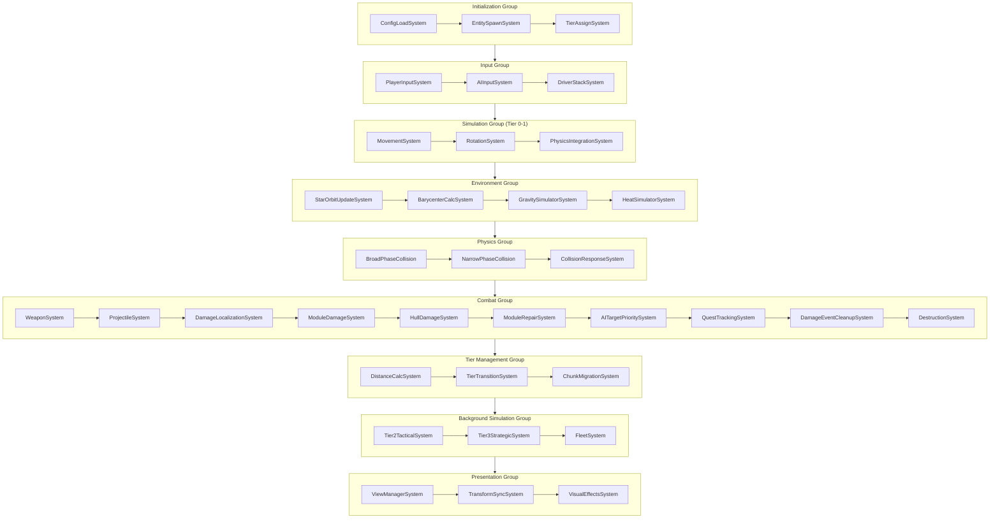

---

## System Groups

### 1. Initialization Group

Runs once at startup and when loading save data.

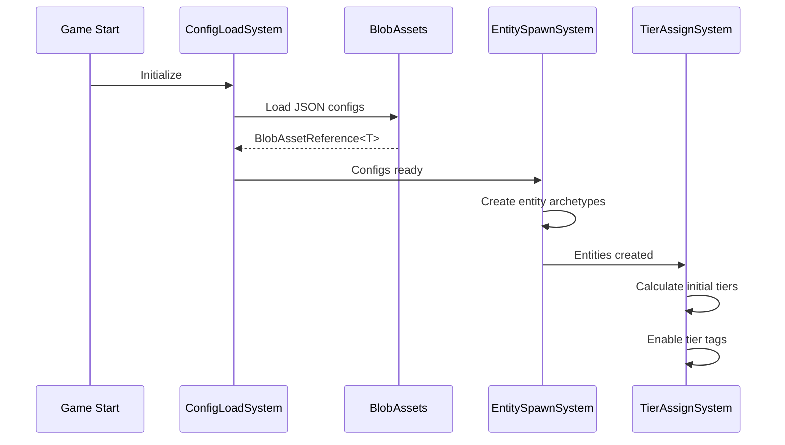

| System | Responsibility |
|--------|---------------|
| `ConfigLoadSystem` | Load JSON → BlobAsset conversion, validate schemas |
| `EntitySpawnSystem` | Create entities from archetype definitions |
| `TierAssignSystem` | Initial tier assignment based on player distance |

---

### 2. Input Group

Collects and resolves control inputs from all sources.

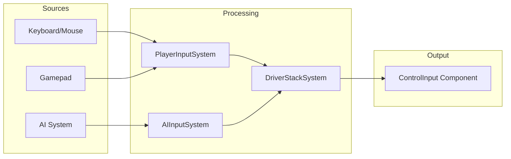

| System | Responsibility |
|--------|---------------|
| `PlayerInputSystem` | Read Unity Input System, populate `PlayerControlInput` |
| `AIInputSystem` | Execute behavior trees, populate `AIControlInput` |
| `DriverStackSystem` | Resolve priority, write final `ControlInput` |

**Driver Stack Resolution:**
```csharp
// Pseudo-code for driver stack priority
[BurstCompile]
public void Execute(ref ControlInput output,
                    in PlayerControlInput player,
                    in AIControlInput ai,
                    in DriverStack stack)
{
    if (stack.PlayerPriority > stack.AIPriority && player.IsActive)
        output = player.ToControlInput();
    else if (ai.IsActive)
        output = ai.ToControlInput();
    else
        output = ControlInput.None;
}
```

---

### 3. Simulation Group (Tier 0-1 Only)

Full physics simulation for nearby entities.

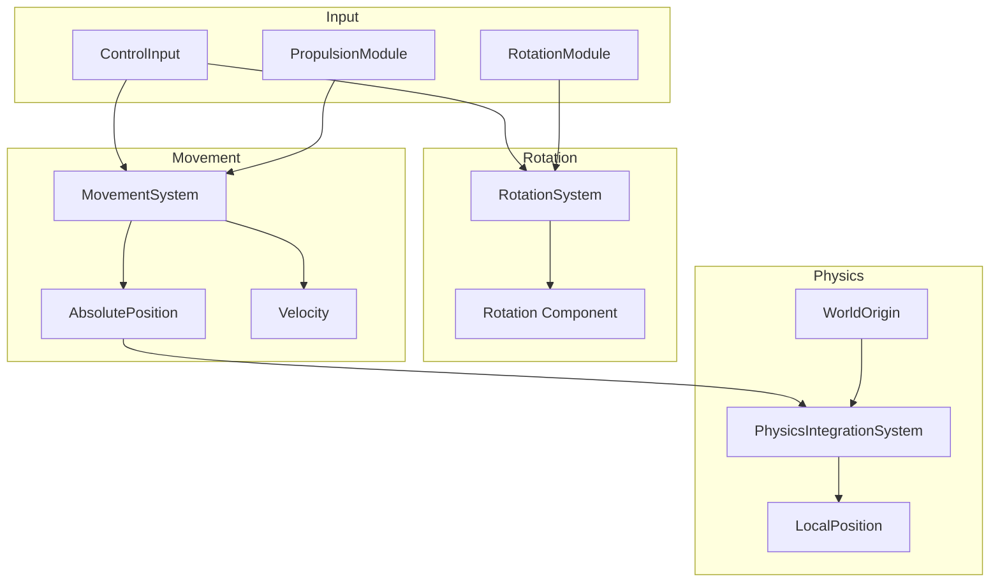

| System | Responsibility | Query Filter |
|--------|---------------|--------------|
| `MovementSystem` | Apply thrust, update velocity | `ActiveTag` enabled |
| `RotationSystem` | Apply rotation modes (instant/smooth/physics/thruster) | `ActiveTag` enabled |
| `PhysicsIntegrationSystem` | Integrate velocity → position, update local coords | `ActiveTag` OR `LoadedTag` enabled |

**Rotation Mode State Machine:**
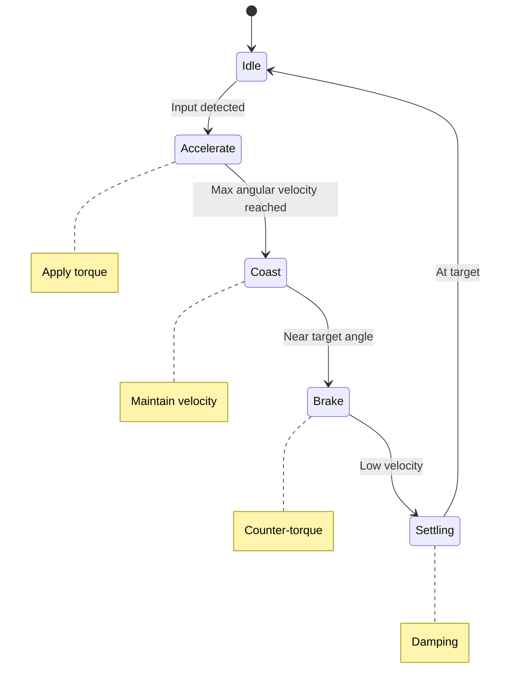

---

### 4. Environment Group

Gravity simulation, orbital mechanics, and heat systems. Runs between Simulation and Physics groups.

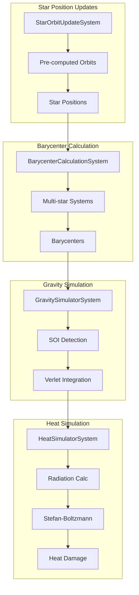

| System | Responsibility | Query Filter |
|--------|---------------|--------------|
| `StarOrbitUpdateSystem` | Update star positions from pre-computed orbits | Stars with PrecomputedOrbit |
| `BarycenterCalculationSystem` | Calculate barycenters for multi-star systems | StarSystemData |
| `GravitySimulatorSystem` | Velocity Verlet integration, SOI transitions | `ActiveTag` OR `LoadedTag` enabled |
| `HeatSimulatorSystem` | Calculate radiation, cooling, apply heat damage | `ActiveTag` OR `LoadedTag` enabled |

**Gravity Simulation (Tier 0-1):**
- Update star positions from pre-computed Keplerian orbits
- Recalculate barycenters for binary/triple star systems
- Detect SOI (Sphere of Influence) transitions
- Apply Velocity Verlet integration with configurable substeps
- Periodically update orbital elements for Tier 2 prediction

**Heat Simulation (Tier 0-1):**
- Query nearby stars (reuses gravity source data)
- Calculate incoming radiation (inverse-square law)
- Calculate radiative cooling (Stefan-Boltzmann)
- Update hull temperature
- Apply heat damage if exceeding MaxTemperature

See [[10-gravity-system]] and [[11-heat-system]] for detailed documentation.

---

### 5. Physics Group

Collision detection and response.

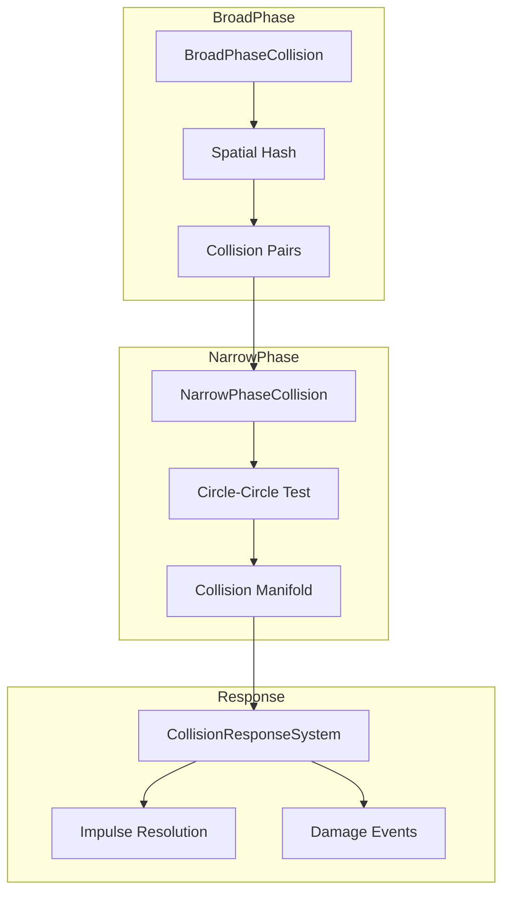

| System | Responsibility | Complexity |
|--------|---------------|------------|
| `BroadPhaseCollision` | Spatial hash grid, generate potential pairs | O(n) |
| `NarrowPhaseCollision` | Circle-circle intersection tests | O(pairs) |
| `CollisionResponseSystem` | Impulse resolution, damage event generation | O(collisions) |

**Spatial Hash Configuration:**
```csharp
public struct SpatialHashConfig : IComponentData
{
    public float CellSize;      // 50 units (covers most entities)
    public int MaxEntitiesPerCell;  // 64
    public int GridDimension;   // 256 (12,800 unit coverage)
}
```

---

### 6. Combat Group

Weapons, projectiles, and damage processing including progressive destruction.

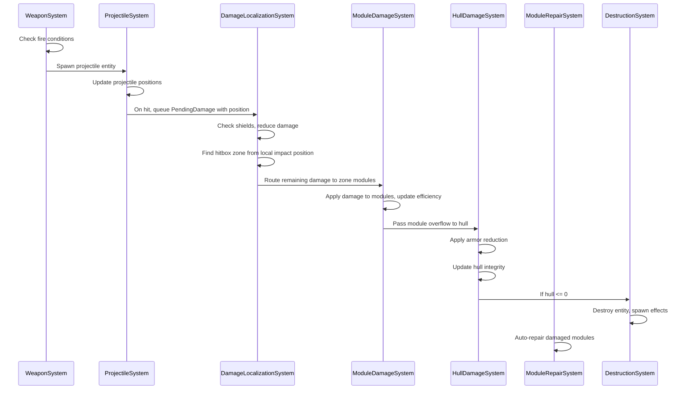

| System | Responsibility |
|--------|---------------|
| `WeaponSystem` | Cooldown management, fire commands, projectile spawning |
| `ProjectileSystem` | Projectile movement, lifetime, hit detection, queue `PendingDamage` with world position |
| `DamageLocalizationSystem` | **Shield absorption first**, calculate `LocalImpactPosition`, detect hitbox zone, set `HitZone` in `PendingDamage`. For Tier 2+, marks `IsLocalized = false` to skip zone routing. |
| `ModuleDamageSystem` | Read `HitZone` from `PendingDamage`, distribute damage to modules via zone mappings, update `ModuleHealthElement` states, fire damage events, calculate overflow |
| `HullDamageSystem` | Apply armor reduction to overflow damage, update `HullModule.CurrentIntegrity`, trigger destruction |
| `ModuleRepairSystem` | Auto-repair modules over time, handle repair delays |
| `AITargetPrioritySystem` | Recalculate AI target priority when modules disabled (reads damage events) |
| `QuestTrackingSystem` | Track quest objectives involving module damage (reads damage events) |
| `DamageEventCleanupSystem` | **Clear all damage event buffers** (`ModuleDamagedEvent`, `ModuleDisabledEvent`, `ModuleRepairedEvent`) - runs LAST in Combat Group |
| `DestructionSystem` | Entity destruction, loot drops, explosion effects |

**Damage Event Processing Order:**

Damage events (`ModuleDamagedEvent`, `ModuleDisabledEvent`, `ModuleRepairedEvent`) are stored as buffers on damaged entities. Systems that consume these events:

1. `AITargetPrioritySystem` (Combat Group) - AI recalculates target priority when modules disabled
2. `QuestTrackingSystem` (Combat Group) - Tracks quest objectives involving damage

**Note:** `DamageEffectsSystem` does NOT consume damage events. It runs in Presentation Group and reads `ModuleHealthElement` buffer directly, tracking state changes via `EntityDamageEffects.PreviousWorstState` comparison. This avoids timing issues with event cleanup.

**Critical:** `DamageEventCleanupSystem` runs **last** in the Combat Group and clears all event buffers. All event consumers **must** run within Combat Group and use `[UpdateBefore(typeof(DamageEventCleanupSystem))]` attribute to ensure they process events before cleanup.

See [[09-progressive-destruction]] for detailed documentation on the localized damage system.

### Destruction Pipeline Detail

When an entity's hull reaches 0, the following sequence executes:

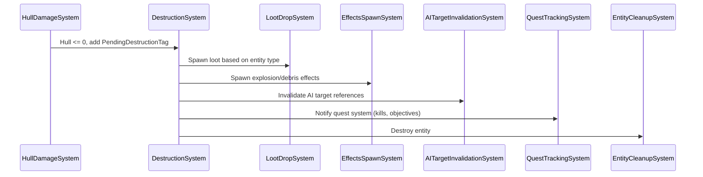

1. **DestructionSystem** marks entity with `PendingDestructionTag`
2. **LootDropSystem** spawns loot based on entity type and inventory
3. **EffectsSpawnSystem** creates explosion particles and debris entities
4. **AITargetInvalidationSystem** clears references from AI entities targeting this entity
5. **QuestTrackingSystem** updates quest objectives if entity was quest-relevant
6. **EntityCleanupSystem** destroys the entity on next frame

**Damage Pipeline (with Progressive Destruction):**
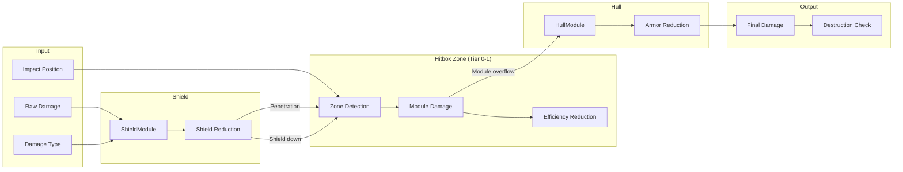

**Note:** All damage routes through zone detection (Tier 0-1) regardless of shield state. Shields reduce incoming damage, then remaining damage goes to zone detection → module damage → hull overflow. For Tier 2+, damage bypasses zone detection and goes directly to hull.

---

### 7. Tier Management Group

Distance calculation and tier transitions.

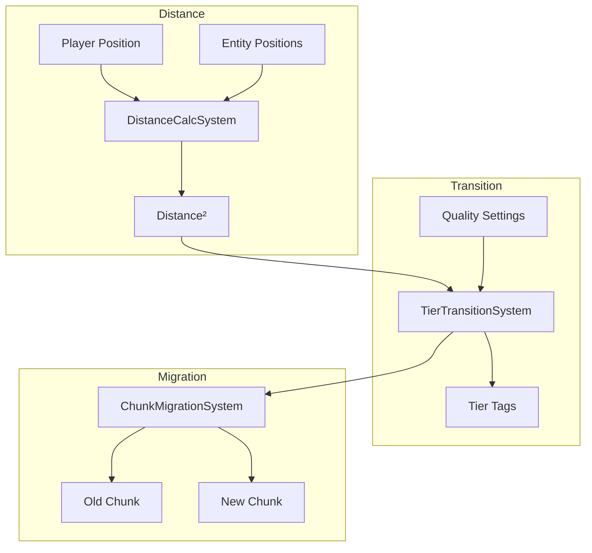

| System | Responsibility | Update Rate |
|--------|---------------|-------------|
| `DistanceCalcSystem` | Calculate squared distance to player | Every frame |
| `TierTransitionSystem` | Enable/disable tier tags, handle persistence rules | Every frame |
| `ChunkMigrationSystem` | Update ChunkLocation when entity crosses boundary | On transition |

**Tier Transition Rules (with 15% hysteresis to prevent oscillation):**
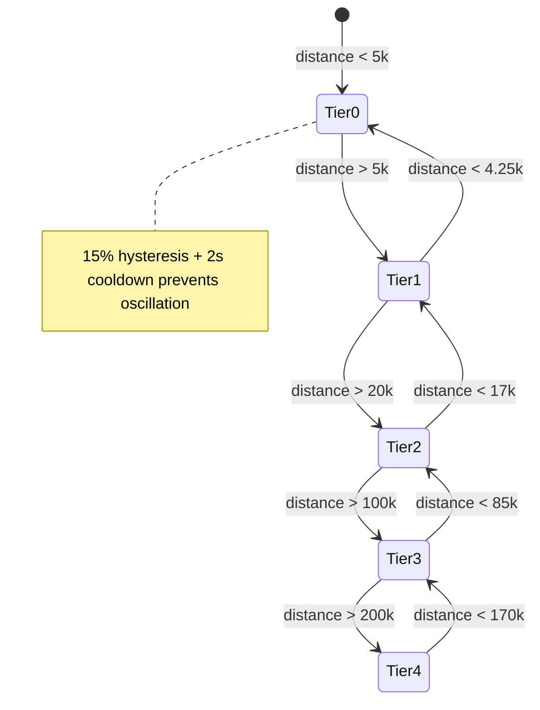

**Tier Change Cooldown:** After a tier change, entity cannot change tier again for 2 seconds. This prevents entities moving at boundary velocity from rapidly flickering between tiers.

---

### 8. Background Simulation Group

Reduced-fidelity simulation for distant entities.

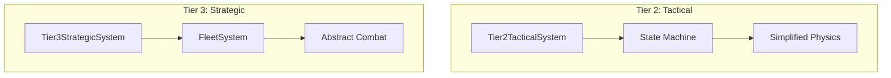

| System | Responsibility | Update Rate |
|--------|---------------|-------------|
| `Tier2TacticalSystem` | State machine AI, simplified physics | Every 5-10 frames |
| `Tier3StrategicSystem` | Fleet-level decisions, abstract combat | Every ~1 second |
| `FleetSystem` | Fleet formation, member grouping/unpacking | On demand |

**State Machine AI (Tier 2):**
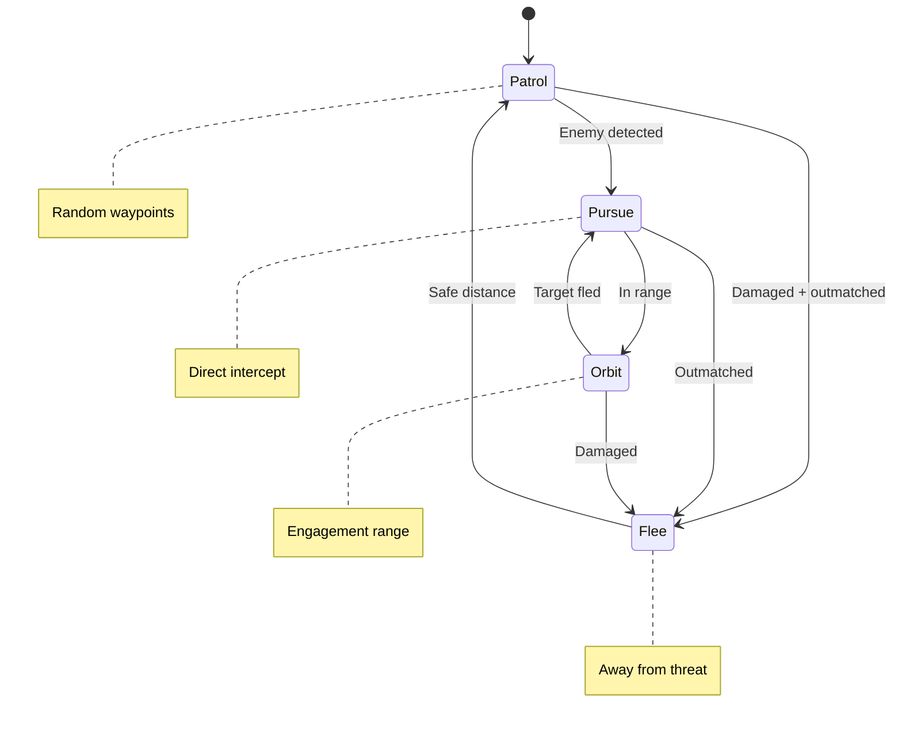

---

### 9. Presentation Group

GameObject synchronization and visual effects.

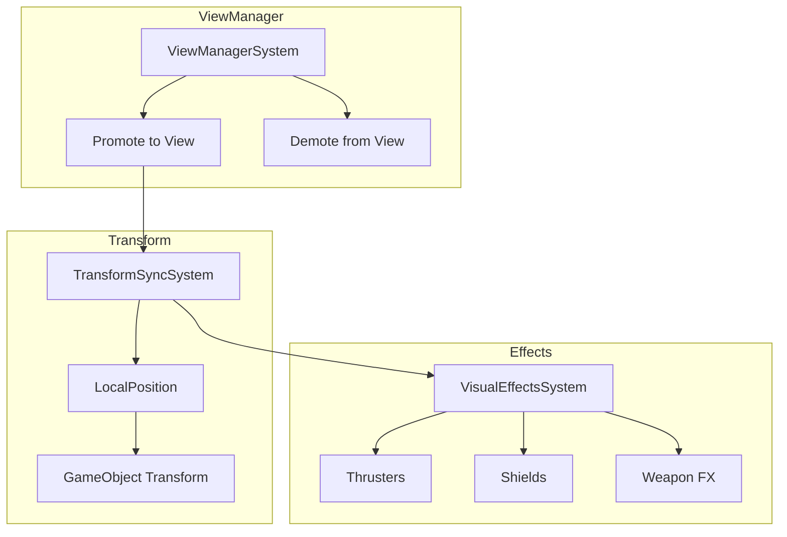

| System | Responsibility |
|--------|---------------|
| `ViewManagerSystem` | Create/destroy GameObjects for Tier 0 entities |
| `TransformSyncSystem` | Copy ECS LocalPosition → GameObject Transform |
| `VisualEffectsSystem` | Update particle systems, audio, visual state |

### Audio Integration

Audio is managed per-tier with priority-based mixing:

| Tier | Audio Behavior |
|------|----------------|
| Tier 0 | Full 3D spatial audio, all sounds play |
| Tier 1 | Distant sounds only (explosions, large weapons) |
| Tier 2+ | No audio (too far to hear) |

**AudioManager responsibilities:**
- Spatial audio positioning relative to camera
- Sound priority queue (max 32 concurrent sounds)
- Volume attenuation by distance from player
- Cross-fade when entities enter/exit Tier 0
- Sound culling for off-screen entities beyond audio range

**Tier 0 Distance:** Tier 0 (LoadedTag) is enabled for entities within 5,000 units of the player, OR within camera view (whichever is larger). The camera system should clamp maximum zoom to ensure visible range never exceeds the Tier 0 boundary, ensuring all visible entities have GameObjects.

**View Lifecycle:**
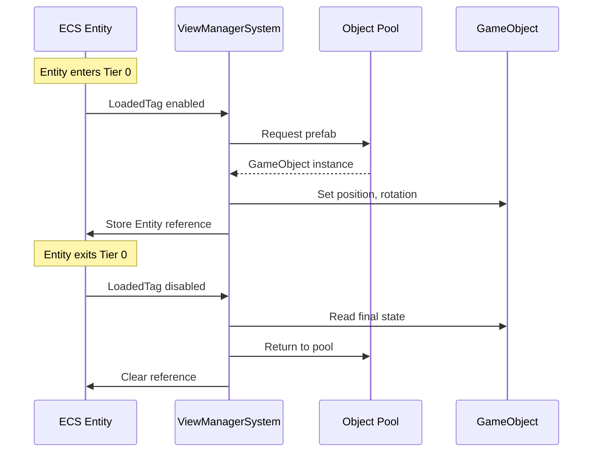

---

## System Dependencies

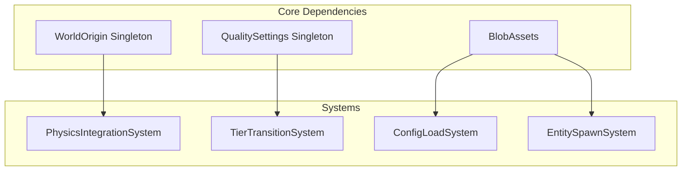

---

## Job Scheduling Strategy

### Parallel Jobs

Systems that can run in parallel within their group:

```csharp
// Movement and Rotation can run in parallel
[BurstCompile]
partial struct MovementJob : IJobEntity
{
    public float DeltaTime;

    void Execute(ref Velocity vel, in PropulsionModule prop, in ControlInput input)
    {
        // Update velocity based on input
    }
}

[BurstCompile]
partial struct RotationJob : IJobEntity
{
    public float DeltaTime;

    void Execute(ref Rotation rot, in RotationModule rotMod, in ControlInput input)
    {
        // Update rotation based on input
    }
}
```

### Sequential Dependencies

Systems that must wait for previous completion:

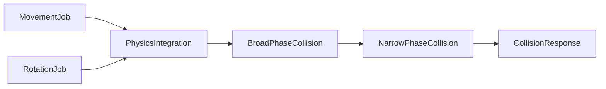

---

## Performance Budgets

| Group | Target Budget | Notes |
|-------|--------------|-------|
| Input | 0.5ms | Minimal, mostly reading |
| Simulation | 2ms | Tier 0-1 entities only |
| Environment | 1ms | Gravity + Heat simulation |
| Physics | 3ms | Burst-compiled spatial hash |
| Combat | 1ms | Projectile-heavy scenarios |
| Tier Management | 0.5ms | Distance checks are cheap |
| Background | 1ms | Amortized across frames |
| Presentation | 2ms | Transform sync, effects |
| **Total** | **11ms** | 5ms headroom for 60 FPS |

---

## Warp Mode System Integration

When warp is engaged, system execution changes:

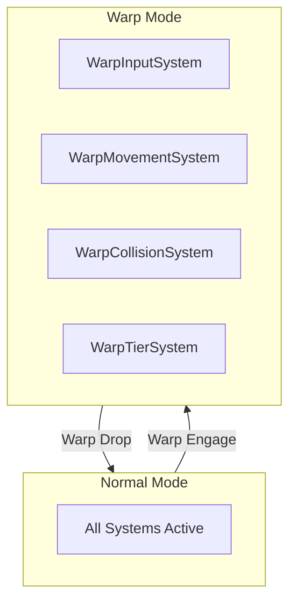

**Warp Mode Changes:**

| System | Normal Mode | Warp Mode |
|--------|-------------|-----------|
| `MovementSystem` | Standard physics | Disabled |
| `WarpMovementSystem` | Disabled | High-speed trajectory |
| `CollisionSystems` | Full detection | Swept raycast only |
| `EntitySpawnSystem` | Active | Suspended |
| `TierTransitionSystem` | Distance-based | Corridor entities → Tier 4 (Critical stays at Tier 2 min) |

See [07-warp-system.md](07-warp-system.md) for full warp mode documentation.

---

## System Registration

```csharp
[UpdateInGroup(typeof(SimulationSystemGroup))]
[UpdateBefore(typeof(RotationSystem))]
public partial struct MovementSystem : ISystem
{
    [BurstCompile]
    public void OnUpdate(ref SystemState state)
    {
        var job = new MovementJob
        {
            DeltaTime = SystemAPI.Time.DeltaTime
        };
        job.ScheduleParallel();
    }
}
```

---

## Related Documentation

- [01-component-model.md](01-component-model.md) - Component definitions
- [03-tiered-simulation.md](03-tiered-simulation.md) - Tier system details
- [04-archetype-strategy.md](04-archetype-strategy.md) - Entity archetypes
- [07-warp-system.md](07-warp-system.md) - Warp mode systems
- [09-progressive-destruction.md](09-progressive-destruction.md) - Localized damage and module degradation
- [10-gravity-system.md](10-gravity-system.md) - Newtonian gravity and orbital mechanics
- [11-heat-system.md](11-heat-system.md) - Thermal radiation and heat damage
