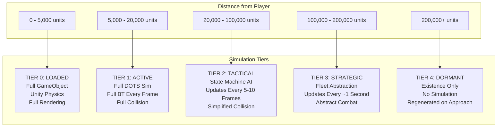
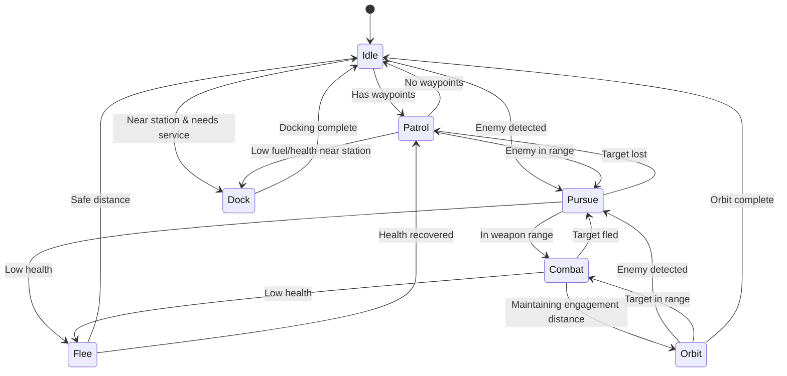
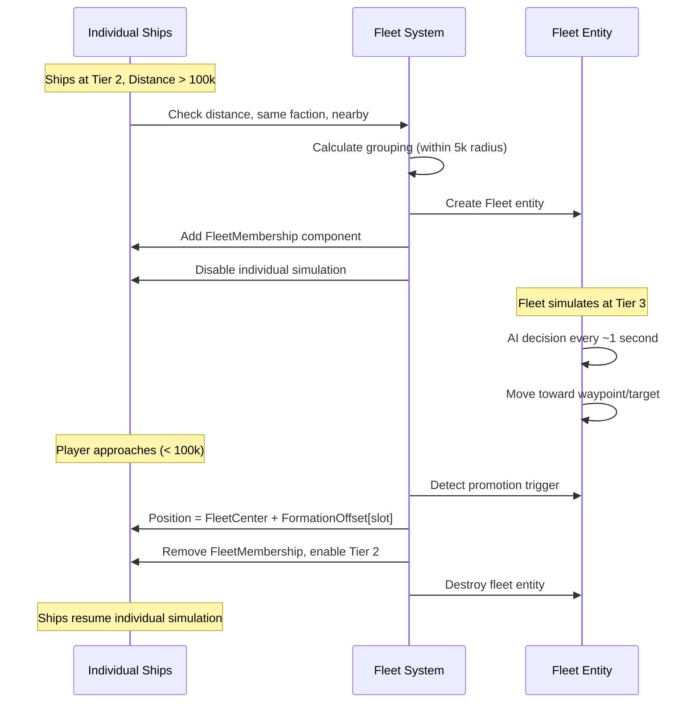
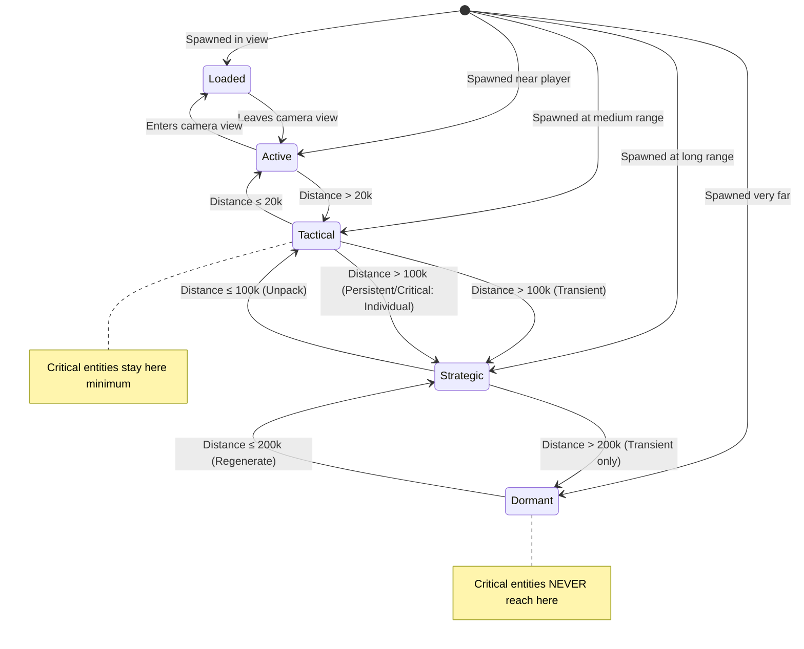

# 5-Tier Progressive Simulation System

## Overview

The simulation system uses **progressive degradation** to simulate massive numbers of entities. Entities closer to the player receive full simulation fidelity; distant entities use increasingly abstracted simulation.

---

## Tier Summary



---

## Tier Comparison Table

| Aspect | Tier 0 Loaded | Tier 1 Active | Tier 2 Tactical | Tier 3 Strategic | Tier 4 Dormant |
|--------|---------------|---------------|-----------------|------------------|----------------|
| **Range** | 0-5k | 5k-20k | 20k-100k | 100k-200k | 200k+ |
| **AI** | Full BT | Full BT | State Machine | Fleet-level | None |
| **Physics** | Unity | DOTS | Simplified | Abstracted | None |
| **Update Rate** | Every frame | Every frame | Every 5-10 frames | Every ~1 second | Never |
| **Collisions** | Unity Physics | DOTS Spatial | Major only | None | None |
| **Visual** | Full render | None | None | None | None |
| **Cost/Entity** | ~0.5ms | ~0.01ms | ~0.002ms | ~0.0005ms | ~0 |
| **Max Entities** | ~20 | ~500 | ~2,000 | ~100 fleets | Unlimited |

---

## Tier 0: Loaded (GameObject)

**Purpose:** Full fidelity for entities in camera view

```
┌─────────────────────────────────────────────────────────────────┐
│  TIER 0: LOADED                                                  │
│                                                                  │
│  Range: 0 - 5,000 units (camera view + buffer)                  │
│                                                                  │
│  Features:                                                       │
│  ✓ Unity GameObject with full component hierarchy               │
│  ✓ Unity Physics (Rigidbody2D)                                  │
│  ✓ Full visual rendering (sprites, particles, effects)         │
│  ✓ Full behavior tree evaluation every frame                    │
│  ✓ Audio, trails, and all visual feedback                       │
│  ✓ Full module updates (weapons, shields, sensors)             │
│                                                                  │
│  Transitions:                                                    │
│  → Tier 1: When entity leaves camera view + buffer              │
│  ← Tier 1: When entity enters camera view                       │
│                                                                  │
│  Data: Unity GameObject + ECS Entity (hybrid)                   │
│                                                                  │
│  Typical entities: Player ship, nearby enemies, projectiles     │
└─────────────────────────────────────────────────────────────────┘
```

---

## Tier 1: Active (Full DOTS Simulation)

**Purpose:** Full simulation without rendering overhead

```
┌─────────────────────────────────────────────────────────────────┐
│  TIER 1: ACTIVE                                                  │
│                                                                  │
│  Range: 5,000 - 20,000 units (near sensor range)                │
│                                                                  │
│  Features:                                                       │
│  ✓ Full DOTS physics integration every frame                    │
│  ✓ Full behavior tree evaluation                                │
│  ✓ Collision detection with Tier 0 and Tier 1 entities         │
│  ✓ Full AI decision making                                      │
│  ✓ Weapons can fire, shields regenerate                        │
│  ✓ Damage and destruction processing                            │
│                                                                  │
│  Processing (Burst Jobs):                                        │
│  - MovementSystem: Apply velocity, drag                         │
│  - RotationSystem: Process rotation modes                       │
│  - CollisionBroadPhase: Spatial hash population                 │
│  - CollisionNarrowPhase: Circle-circle detection                │
│  - BehaviorTreeSystem: Full BT evaluation                       │
│  - WeaponSystem: Fire projectiles, track cooldowns              │
│                                                                  │
│  Transitions:                                                    │
│  → Tier 0: Entity enters camera view                            │
│  → Tier 2: Distance > 20,000 units                              │
│  ← Tier 2: Distance ≤ 20,000 units                              │
│                                                                  │
│  Data: Pure ECS entities                                         │
└─────────────────────────────────────────────────────────────────┘
```

---

## Tier 2: Tactical (Simplified Individual Simulation)

**Purpose:** Reduced fidelity but still individual behavior

```
┌─────────────────────────────────────────────────────────────────┐
│  TIER 2: TACTICAL                                                │
│                                                                  │
│  Range: 20,000 - 100,000 units (medium sensor range)            │
│                                                                  │
│  Features:                                                       │
│  ✓ State machine AI (not full behavior tree)                    │
│  ✓ Updates every 5-10 frames (amortized)                        │
│  ✓ Ships make course adjustments, pursue targets                │
│  ✓ Simplified collision (only major impacts)                    │
│  ✓ Can detect and respond to player presence                    │
│                                                                  │
│  AI States:                                                      │
│  - Patrol: Follow waypoints                                      │
│  - Pursue: Head toward target                                    │
│  - Flee: Head away from threat                                   │
│  - Orbit: Circle a point/entity                                  │
│  - Idle: Drift with minor corrections                            │
│  - Combat: Engage nearby enemies                                 │
│                                                                  │
│  Update Schedule:                                                │
│  - Frame N: Update entities 0-99                                 │
│  - Frame N+1: Update entities 100-199                           │
│  - ... (round-robin across 5-10 frames)                         │
│                                                                  │
│  Transitions:                                                    │
│  → Tier 1: Distance ≤ 20,000 units                              │
│  → Tier 3: Distance > 100,000 units (Transient only)            │
│  ← Tier 3: Distance ≤ 100,000 units                              │
│                                                                  │
│  Note: Critical entities stay at Tier 2 with full BT (reduced)  │
└─────────────────────────────────────────────────────────────────┘
```

### State Machine AI Detail



**Note:** All states from `AIStateEnum` (Idle, Patrol, Pursue, Combat, Flee, Orbit, Dock) are now represented.

---

## Tier 3: Strategic (Fleet Abstraction)

**Purpose:** Group entities for efficient long-range simulation

```
┌─────────────────────────────────────────────────────────────────┐
│  TIER 3: STRATEGIC                                               │
│                                                                  │
│  Range: 100,000 - 200,000 units (long range sensors)            │
│                                                                  │
│  Features:                                                       │
│  ✓ Transient entities GROUPED INTO FLEETS                       │
│  ✓ Fleet-level AI decisions                                     │
│  ✓ Updates every ~1 second                                       │
│  ✓ Abstract combat resolution (strength vs strength)            │
│  ✓ Persistent/Critical entities remain individual               │
│                                                                  │
│  Fleet AI Behaviors:                                             │
│  - Patrol: Move between sector waypoints                        │
│  - Intercept: Move to engage enemy fleet                        │
│  - Retreat: Flee from superior force                            │
│  - Hold: Maintain position                                       │
│  - Escort: Follow another fleet/entity                          │
│                                                                  │
│  Combat Resolution:                                              │
│  - When fleets engage: compare TotalStrength                    │
│  - Calculate casualties per second                               │
│  - Reduce MemberCount and TotalHP                               │
│  - Losing fleet may retreat                                      │
│                                                                  │
│  Transitions:                                                    │
│  → Tier 2: Distance ≤ 100,000 (fleet "unpacks")                 │
│  → Tier 4: Distance > 200,000 (Transient only)                  │
│  ← Tier 4: Distance ≤ 200,000                                    │
│                                                                  │
│  Note: Critical entities NEVER reach Tier 3 fleet grouping      │
└─────────────────────────────────────────────────────────────────┘
```

### Fleet Grouping Process



### Fleet Dissolution (Below Minimum Size)

When a fleet's `MemberCount` drops below `MinFleetSize` (default: 3) due to combat casualties:

1. **Check dissolution threshold:** `FleetData.MemberCount < MinFleetSize`
2. **Unpack remaining ships:** All surviving ships transition to Tier 2
3. **Destroy fleet entity:** Fleet no longer needed
4. **State restoration:** Ships receive `StateMachineState` with state derived from fleet behavior:

| FleetBehavior | Maps to AIStateEnum |
|---------------|---------------------|
| Patrol | Patrol |
| Intercept | Pursue |
| Retreat | Flee |
| Hold | Idle |
| Escort | Orbit |

Ships are positioned using their stored `FleetMember.FormationOffset` transformed by `FleetData.Rotation`, same as normal fleet unpacking.

### Abstract Combat Example

```
Fleet A (Pirates):         Fleet B (Traders):
- 12 ships                 - 8 ships
- TotalStrength: 8,000     - TotalStrength: 4,000
- TotalHP: 15,000          - TotalHP: 10,000
- Behavior: Intercept      - Behavior: Flee

Combat Resolution (per second):
- A deals: 8,000 * 0.1 = 800 damage to B
- B deals: 4,000 * 0.1 = 400 damage to A

After 10 seconds:
- A: HP remaining ~11,000 (lost ~1 ship equivalent)
- B: HP remaining ~2,000 (lost ~4 ships)
- B triggers Retreat (HP < 30%)

Result when player approaches:
- Fleet A: 11 ships unpacked
- Fleet B: 4 ships unpacked (scattered, fleeing)
```

### Fleet Casualty Selection Rules

When a fleet takes abstract damage and ships are destroyed, the system must determine **which specific ships** are lost. This matters because fleets may contain a mix of Transient and Persistent members.

```csharp
public static class FleetCasualtySelector
{
    /// <summary>
    /// Select which ships are destroyed when fleet takes casualties.
    /// Rules (in priority order):
    /// 1. Never destroy Critical entities (quest targets, allies)
    /// 2. Prefer destroying weakest ships first (lowest HP contribution)
    /// 3. Persistent entities (named NPCs) have 50% survival bonus
    /// 4. Use deterministic random based on fleet seed for consistency
    /// </summary>
    public static NativeList<int> SelectCasualties(
        ref FleetData fleet,
        DynamicBuffer<FleetMember> members,
        int casualtyCount,
        uint randomSeed)
    {
        var casualties = new NativeList<int>(casualtyCount, Allocator.Temp);
        var random = new Unity.Mathematics.Random(randomSeed);

        // Build sorted list by priority (lowest = dies first)
        var sortedMembers = new NativeList<(int index, float priority)>(
            members.Length, Allocator.Temp);

        for (int i = 0; i < members.Length; i++)
        {
            var member = members[i];
            float priority = member.Strength;  // Base priority = combat strength

            // Persistence modifiers
            if (member.Persistence == EntityPersistence.Critical)
                priority = float.MaxValue;  // Never select
            else if (member.Persistence == EntityPersistence.Persistent)
                priority *= 1.5f;  // 50% survival bonus

            // Add some randomness (±20%)
            priority *= random.NextFloat(0.8f, 1.2f);

            sortedMembers.Add((i, priority));
        }

        // Sort by priority ascending (weakest first)
        sortedMembers.Sort((a, b) => a.priority.CompareTo(b.priority));

        // Select casualties from weakest
        for (int i = 0; i < math.min(casualtyCount, sortedMembers.Length); i++)
        {
            if (sortedMembers[i].priority < float.MaxValue)  // Skip Critical
            {
                casualties.Add(sortedMembers[i].index);
            }
        }

        sortedMembers.Dispose();
        return casualties;
    }
}
```

**Important:** When a Persistent NPC is killed in abstract combat, their death is recorded in the PersistentEntityRegistry so they remain dead when their area is revisited.

---

## Tier 4: Dormant (Existence Tracking)

**Purpose:** Minimal overhead for very distant entities

```
┌─────────────────────────────────────────────────────────────────┐
│  TIER 4: DORMANT                                                 │
│                                                                  │
│  Range: 200,000+ units                                           │
│                                                                  │
│  Features:                                                       │
│  ✓ Tracks existence only ("47 pirates in sector X")            │
│  ✓ No simulation whatsoever                                      │
│  ✓ No position updates                                          │
│  ✓ Regenerated from procedural seed when player approaches     │
│                                                                  │
│  Data Stored:                                                    │
│  - ChunkLocation (which chunk they're in)                       │
│  - EntityType                                                    │
│  - FactionIndex                                                  │
│  - Count (for grouped transients)                               │
│  - Seed (for procedural regeneration)                           │
│                                                                  │
│  What Happens When Player Approaches:                            │
│  1. System detects chunk entering Tier 3 range                  │
│  2. For grouped transients: Generate fleet from seed            │
│  3. For persistent: Restore individual with last known state    │
│  4. Promote to appropriate tier                                  │
│                                                                  │
│  CRITICAL ENTITIES NEVER REACH TIER 4                           │
│  They stay at minimum Tier 2 regardless of distance             │
│                                                                  │
│  CRITICAL ENTITY BUDGET:                                        │
│  - Max 50 Critical entities tracked globally                    │
│  - If over budget: reduce update rate (0.5s intervals)          │
│  - Oldest Critical tags can be demoted to Persistent            │
└─────────────────────────────────────────────────────────────────┘
```

### Critical Entity Budget Management

Critical entities (quest targets, allies) never demote below Tier 2, which could cause performance issues if too many exist. The system enforces a budget:

```csharp
[UpdateInGroup(typeof(SimulationSystemGroup))]
public partial struct CriticalEntityBudgetSystem : ISystem
{
    private const int MAX_CRITICAL_ENTITIES = 50;
    private const float REDUCED_UPDATE_RATE = 0.5f;  // seconds

    public void OnUpdate(ref SystemState state)
    {
        var criticalEntities = new NativeList<(Entity, double createdTime)>(
            Allocator.Temp);

        // Count and collect critical entities
        foreach (var (persistence, createdTime, entity) in
            SystemAPI.Query<RefRO<EntityPersistenceData>, RefRO<CreatedTime>>()
                     .WithEntityAccess())
        {
            if (persistence.ValueRO.Level == EntityPersistence.Critical)
            {
                criticalEntities.Add((entity, createdTime.ValueRO.Time));
            }
        }

        int criticalCount = criticalEntities.Length;

        if (criticalCount > MAX_CRITICAL_ENTITIES)
        {
            // Sort by age (oldest first)
            criticalEntities.Sort((a, b) => a.createdTime.CompareTo(b.createdTime));

            // Option 1: Reduce update rate for all critical entities
            var settings = SystemAPI.GetSingletonRW<SimulationSettings>();
            settings.ValueRW.CriticalUpdateInterval = REDUCED_UPDATE_RATE;

            // Option 2: Demote oldest Critical → Persistent (if quest allows)
            // This requires checking quest state to ensure we don't break active quests
            int toDowngrade = criticalCount - MAX_CRITICAL_ENTITIES;
            for (int i = 0; i < toDowngrade; i++)
            {
                var entity = criticalEntities[i].Item1;
                var canDowngrade = CheckQuestAllowsDowngrade(entity);
                if (canDowngrade)
                {
                    var persistence = SystemAPI.GetComponentRW<EntityPersistenceData>(entity);
                    persistence.ValueRW.Level = EntityPersistence.Persistent;
                }
            }
        }
        else
        {
            // Under budget - restore normal update rate
            var settings = SystemAPI.GetSingletonRW<SimulationSettings>();
            settings.ValueRW.CriticalUpdateInterval = 0;  // Full rate
        }

        criticalEntities.Dispose();
    }

    private bool CheckQuestAllowsDowngrade(Entity entity)
    {
        // Check if entity is referenced by any active quest objective
        if (!SystemAPI.HasSingleton<ActiveQuestData>())
            return true;  // No quest system active, allow downgrade

        var questData = SystemAPI.GetSingleton<ActiveQuestData>();

        // Check if entity has an EntityId we can match against
        if (!SystemAPI.HasComponent<EntityId>(entity))
            return true;

        var entityId = SystemAPI.GetComponent<EntityId>(entity);

        // Check each active objective - if entity is a target, don't downgrade
        var objectives = SystemAPI.GetBuffer<ActiveQuestObjective>(
            SystemAPI.GetSingletonEntity<ActiveQuestData>());

        foreach (var objective in objectives)
        {
            if (objective.TargetEntityId == entityId.Value &&
                objective.Status == ObjectiveStatus.InProgress)
            {
                return false;  // Entity needed for active quest
            }
        }

        return true;  // Safe to downgrade
    }
}
```

---

## Entity Persistence Behavior

Different entity types degrade differently:

```mermaid
graph TD
    subgraph "TRANSIENT (Generic Pirates, Patrols)"
        TA[Tier 0-1: Full sim]
        TB[Tier 2: State machine]
        TC[Tier 3: GROUPED INTO FLEET]
        TD[Tier 4: Can despawn/regenerate]
        TA --> TB --> TC --> TD
    end

    subgraph "PERSISTENT (Named NPCs, Merchants)"
        PA[Tier 0-1: Full sim]
        PB[Tier 2: State machine]
        PC[Tier 3: Individual, slow updates]
        PD[Tier 4: Minimal tracking, no despawn]
        PA --> PB --> PC --> PD
    end

    subgraph "CRITICAL (Quest Targets, Allies)"
        CA[Tier 0-1: Full sim]
        CB[Tier 2: Full BT at reduced rate]
        CC[NEVER BELOW TIER 2]
        CA --> CB
        CB -.-> CC
    end
```



### Examples

**Generic Pirate (Transient):**
- At 150,000 units → Part of "Pirate Fleet #47" (Tier 3)
- Player approaches to 80,000 → Fleet unpacks, pirate is individual (Tier 2)
- Player approaches to 15,000 → Full behavior tree (Tier 1)
- Player leaves to 250,000 → Returns to fleet or goes dormant (Tier 4)

**Captain Vex (Persistent):**
- At 150,000 units → Individual entity, updates every ~1 second (Tier 3)
- Never grouped into a fleet (named NPC)
- Always trackable on minimap
- If destroyed far away, death is recorded

**Quest Target "Stolen Cargo" (Critical):**
- At ANY distance → Minimum Tier 2 simulation
- Full behavior tree (reduced update rate when far)
- Never dormant, never grouped
- Quest state always accurate

---

## Transition System



---

## Quality Settings

All tier boundaries are configurable for different hardware:

```csharp
public class SimulationQualitySettings : ScriptableObject
{
    [Header("Tier Boundaries (World Units)")]
    public float Tier0MaxDistance = 5000;      // Loaded → Active
    public float Tier1MaxDistance = 20000;     // Active → Tactical
    public float Tier2MaxDistance = 100000;    // Tactical → Strategic
    public float Tier3MaxDistance = 200000;    // Strategic → Dormant

    [Header("Hysteresis Settings (15% of tier boundary to prevent oscillation)")]
    // Hysteresis = 15% of tier boundary. Entity promotes at boundary, demotes at boundary - hysteresis.
    // Example: Tier 1 boundary = 20k, hysteresis = 3k → promotes at 20k, demotes at 17k
    public float Tier0Hysteresis = 750;        // 15% of 5k = 750 → demote at 4,250
    public float Tier1Hysteresis = 3000;       // 15% of 20k = 3k → demote at 17,000
    public float Tier2Hysteresis = 15000;      // 15% of 100k = 15k → demote at 85,000
    public float Tier3Hysteresis = 30000;      // 15% of 200k = 30k → demote at 170,000

    [Header("Hysteresis Cooldowns (prevent rapid tier changes)")]
    public float TierChangeCooldown = 2.0f;    // Seconds before entity can change tier again

    [Header("Update Rates")]
    public int Tier2UpdateInterval = 5;        // Frames between updates
    public float Tier3UpdateInterval = 1.0f;   // Seconds between updates

    [Header("Capacity Limits")]
    public int Tier0MaxEntities = 20;
    public int Tier1MaxEntities = 500;
    public int Tier2MaxEntities = 2000;
    public int Tier3MaxFleets = 100;

    [Header("Critical Entity Limits")]
    public int MaxCriticalEntities = 50;       // Cap to prevent budget blow-up
    public float CriticalReducedUpdateRate = 0.5f;  // Update every 0.5s when over budget

    [Header("Persistence Overrides")]
    public float PersistentTier2MaxDistance = 150000;  // Larger range for named NPCs
    public SimulationTier CriticalMinTier = SimulationTier.Tactical;

    [Header("Fleet Settings")]
    public int MinFleetSize = 3;               // Don't group fewer ships
    public float FleetGroupingRadius = 5000;   // Ships within this form fleet
}
```

### Preset Examples

**High Quality (Powerful PC):**
```
Tier1MaxDistance = 30000
Tier2MaxDistance = 150000
Tier2UpdateInterval = 3
Tier1MaxEntities = 1000
```

**Performance (Lower-end Hardware):**
```
Tier1MaxDistance = 15000
Tier2MaxDistance = 80000
Tier2UpdateInterval = 10
Tier1MaxEntities = 300
```

---

## Minimap Integration

The minimap displays entities differently based on tier:

| Tier | Minimap Display |
|------|-----------------|
| 0-1 | Individual ship icons, real-time position |
| 2 | Individual dots, slightly delayed position |
| 3 (Transient) | Fleet icon with member count badge |
| 3 (Persistent) | Individual icon, slow position updates |
| 4 | Sector markers ("Pirates active in sector") |

**Zoom Behavior:**
- Zoomed out: Shows fleet icons, abstracted movement
- Zoomed in: Shows individual ships (queries Tier 3 for positions)

---

## Related Documents

- [[01-component-model]] - Components for each tier
- [[02-system-architecture]] - Systems that process each tier
- [[04-archetype-strategy]] - How archetypes change between tiers
- [[06-chunk-integration]] - How chunks trigger tier transitions
