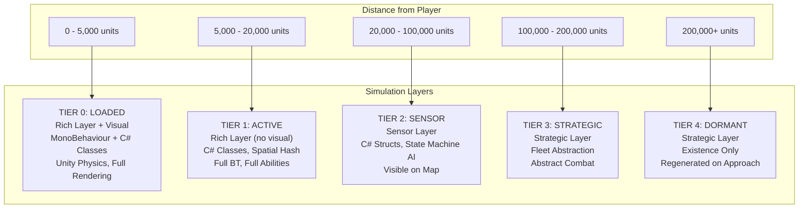
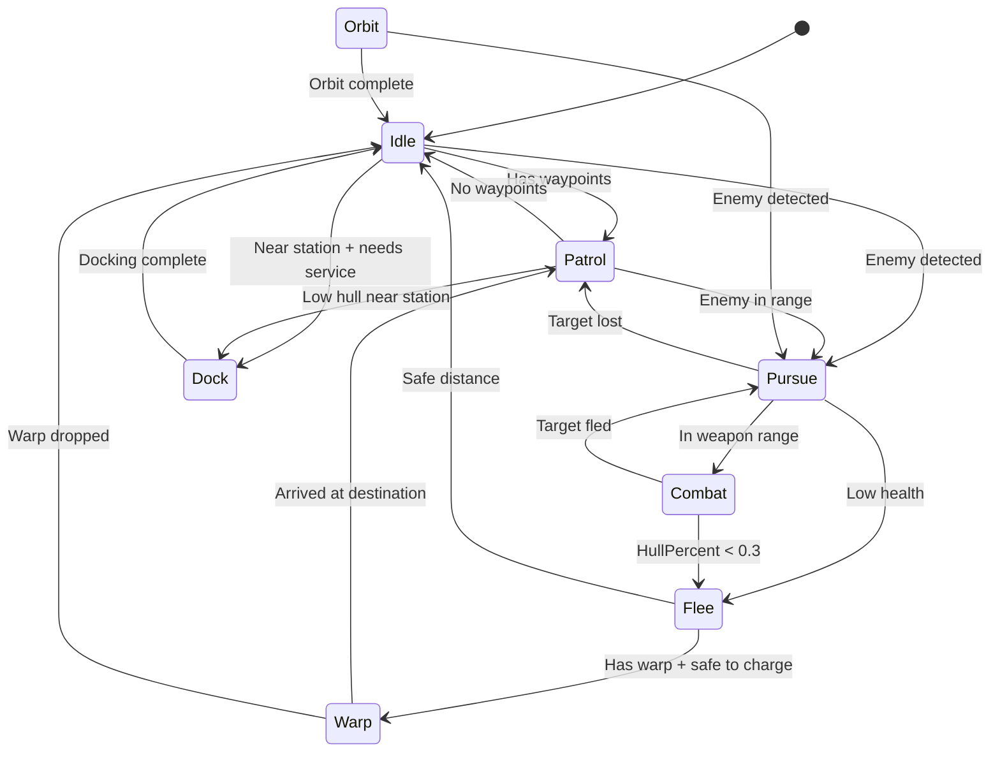
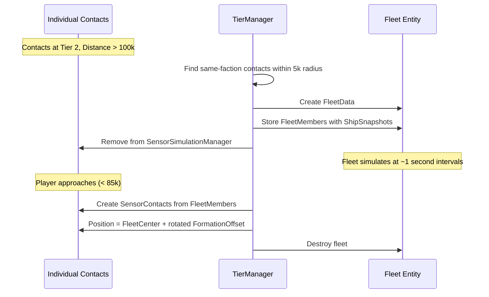
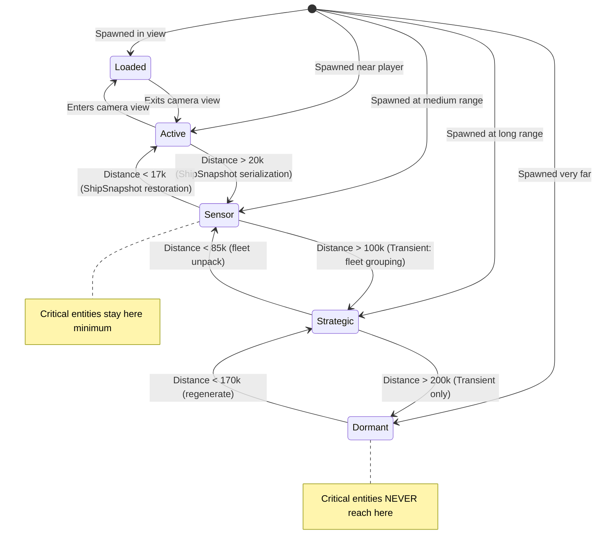

# Tiered Simulation System

## Overview

The simulation system uses **progressive degradation** across three processing layers. Entities closer to the player receive full OOP simulation with unique abilities; distant entities use increasingly abstracted representations.

> **Multiplayer:** With 8-16 players, the same entity can be at different tiers for different players. The server maintains **per-player tier maps** and computes an **effective tier** (minimum across all players) for simulation fidelity. Each player receives data at their individual tier resolution. See [[13-networking-architecture]] for observer system mapping. The tier system runs **server-side only**.

Each tier maps to a processing layer:

| Tier | Layer | Range | Technology |
|------|-------|-------|-----------|
| 0 (Loaded) | Rich Entity Layer | 0-5k | C# classes + MonoBehaviour visual |
| 1 (Active) | Rich Entity Layer | 5k-20k | C# classes (no visual) |
| 2 (Sensor) | Sensor Simulation Layer | 20k-100k | C# structs in arrays |
| 3 (Strategic) | Strategic Layer | 100k-200k | Fleet abstraction |
| 4 (Dormant) | Strategic Layer | 200k+ | Existence tracking |

---

## Tier Summary



---

## Tier Comparison

| Aspect | Tier 0 Loaded | Tier 1 Active | Tier 2 Sensor | Tier 3 Strategic | Tier 4 Dormant |
|--------|---------------|---------------|---------------|------------------|----------------|
| **Range** | 0-5k | 5k-20k | 20k-100k | 100k-200k | 200k+ |
| **Layer** | Rich | Rich | Sensor | Strategic | Strategic |
| **Data** | ShipInstance + ShipView | ShipInstance | SensorContact struct | FleetData struct | DormantRecord |
| **AI** | Full BT | Full BT | State Machine | Fleet-level | None |
| **Physics** | Unity Physics | Managed spatial hash | Velocity integration | Abstracted | None |
| **Abilities** | Full unique abilities | Full unique abilities | None | None | None |
| **Damage** | Full progressive destruction | Full progressive destruction | Aggregate HP only | Abstract combat | None |
| **Visual** | Full render | None | Map dot | Map fleet icon | Sector marker |
| **Update Rate** | Every frame | Every frame | Every 5-10 frames | Every ~1 second | Never |
| **Cost/Entity** | ~0.5ms | ~0.01ms | ~0.002ms | ~0.0005ms | ~0 |
| **Max Entities** | ~20 | ~500 | ~200 | ~100 fleets | Unlimited |

---

## Tier 0: Loaded (Rich Layer + Visual)

**Purpose:** Full fidelity for entities in camera view

- **ShipInstance** C# class with full module system, unique abilities, behavior tree
- **ShipView** MonoBehaviour for rendering (sprites, particles, audio, trails)
- **Unity Physics** via Rigidbody2D for pixel-accurate collision
- Full progressive destruction with hitbox zones
- All visual effects active

**Transition to Tier 1:** Entity leaves camera view + buffer
- ShipView returned to object pool
- ShipInstance remains (no data loss)

**Transition from Tier 1:** Entity enters camera view
- ShipView instantiated from pool
- Synced to ShipInstance state

---

## Tier 1: Active (Rich Layer, No Visual)

**Purpose:** Full simulation without rendering overhead

- **ShipInstance** C# class (same object as Tier 0)
- No GameObject, no rendering
- **Managed spatial hash** for collision detection (circle-circle)
- Full behavior tree evaluation
- Full unique abilities active
- Full module simulation
- Weapons fire, shields regenerate, sensors scan

**Transition to Tier 2:** Distance > 20k units
- Create **ShipSnapshot** from ShipInstance (compressed state)
- Create **SensorContact** struct with observable state
- Store ShipSnapshot in SensorContact for later restoration
- Destroy ShipInstance
- Register SensorContact with SensorSimulationManager

**Transition from Tier 2:** Distance < 17k units (hysteresis)
- Load ShipConfig from ConfigRegistry
- Create **ShipInstance** from config + ShipSnapshot
- Restore module health, ability cooldowns, AI state
- Destroy SensorContact
- Register ShipInstance with RichEntityManager

---

## Tier 2: Sensor (Sensor Simulation Layer)

**Purpose:** Realistic behavior visible on the map - the "Star Trek sensor" experience

Each entity is an individual dot on the map. State machine AI creates observable, realistic behavior. Players can detect:
- Ships changing heading
- Warp signatures (a ship suddenly going to warp)
- Combat engagements (two contacts converging, one fleeing)
- Patrol patterns
- Docking at stations

### State Machine AI



### Sensor Detection Levels

What the player's sensors reveal depends on range and sensor module capability:

| Detection Level | Range Factor | Info Shown on Map |
|----------------|-------------|-------------------|
| Blip | Max range | Dot, faction unknown |
| Contact | 75% range | Faction color, heading arrow, speed |
| Identified | 50% range | Ship class icon, hull/shield bars |
| Full Read | 25% range | Weapons, warp state, who they're targeting |

### Processing

~200 contacts, ~30 updated per frame = full cycle every ~7 frames (~8.5 updates/second per entity). Enough for realistic-looking movement and observable state changes.

### Critical Entities at Tier 2

Critical entities (quest targets, allies) at Tier 2 receive enhanced simulation:
- Full behavior tree evaluation (at reduced rate, every ~0.5s)
- Individual tracking (never fleet-grouped)
- Always show as Identified or better on map regardless of range

**Transition to Tier 3:** Distance > 100k units (Transient entities only)
- Group same-faction contacts within grouping radius into FleetData
- Store each contact's ShipSnapshot in FleetMember
- Create fleet entity with FleetData + FleetMember list

**Transition from Tier 3:** Distance < 85k units (hysteresis)
- Unpack fleet: create SensorContact per FleetMember
- Calculate positions from formation offsets + fleet rotation
- Restore observable state from ShipSnapshot
- Destroy fleet

---

## Tier 3: Strategic (Fleet Abstraction)

**Purpose:** Group entities for efficient long-range simulation

### Transient Entities: Fleet Grouping

Same-faction transient entities within grouping radius form a fleet:



### Fleet AI

| Behavior | Description |
|----------|-------------|
| Patrol | Move between sector waypoints |
| Intercept | Move to engage enemy fleet |
| Retreat | Flee from superior force |
| Hold | Maintain position |
| Escort | Follow another fleet/entity |

### Abstract Combat

When fleets engage, combat is resolved abstractly:
- Compare TotalStrength
- Calculate casualties per second
- Reduce MemberCount and TotalHP
- Losing fleet may retreat

### Fleet Casualty Selection

When ships are destroyed in abstract combat:
1. Never destroy Critical entities
2. Prefer destroying weakest ships first
3. Persistent entities get 50% survival bonus
4. Deterministic random based on fleet seed

### Persistent Entities at Tier 3

Named NPCs (Persistent) at Tier 3:
- Remain individual, not fleet-grouped
- Update every ~1 second
- Track position and basic state
- Individual dot on far-range map

### Fleet Dissolution

When MemberCount drops below MinFleetSize (default: 3):
- Unpack remaining ships to Tier 2
- Destroy fleet entity
- Map fleet behavior to SensorAIState

| FleetBehavior | Maps to SensorAIState |
|---------------|----------------------|
| Patrol | Patrol |
| Intercept | Pursue |
| Retreat | Flee |
| Hold | Idle |
| Escort | Orbit |

---

## Tier 4: Dormant (Existence Tracking)

**Purpose:** Minimal overhead for very distant entities

- Tracks existence only: "47 pirates in sector X"
- No simulation whatsoever
- Regenerated from procedural seed when player approaches
- **Critical entities NEVER reach Tier 4**

### Dormant Data

```csharp
public struct DormantRecord
{
    public ChunkCoord Chunk;
    public EntityTypeEnum EntityType;
    public int FactionIndex;
    public int Count;           // For grouped transients
    public uint Seed;           // For procedural regeneration
    public EntityPersistence Persistence;
    public FixedString32Bytes UniqueId;
    public ShipSnapshot Snapshot;   // Only for Persistent entities
}
```

### Restoration

When player approaches (< 170k):
- **Grouped transients:** Generate fleet from seed + count
- **Persistent entities:** Restore individual from DormantRecord snapshot
- Promote to appropriate tier

---

## Entity Persistence Behavior

```mermaid
graph TD
    subgraph "TRANSIENT (Generic Pirates, Patrols)"
        TA[Tier 0-1: Full OOP sim]
        TB[Tier 2: State machine on map]
        TC[Tier 3: GROUPED INTO FLEET]
        TD[Tier 4: Can despawn/regenerate]
        TA --> TB --> TC --> TD
    end

    subgraph "PERSISTENT (Named NPCs, Merchants)"
        PA[Tier 0-1: Full OOP sim]
        PB[Tier 2: State machine on map]
        PC[Tier 3: Individual, slow updates]
        PD[Tier 4: Tracked, no sim]
        PA --> PB --> PC --> PD
    end

    subgraph "CRITICAL (Quest Targets, Allies)"
        CA[Tier 0-1: Full OOP sim]
        CB[Tier 2: Full BT at reduced rate]
        CC[NEVER BELOW TIER 2]
        CA --> CB
        CB -.-> CC
    end
```



### Examples

**Generic Pirate (Transient):**
- At 80,000 units → Individual dot on map, state machine AI (Tier 2)
- Player sees it patrolling, then pursuing something, then going to warp
- At 150,000 units → Part of "Pirate Fleet #47" (Tier 3)
- Player approaches to 15,000 → Full ShipInstance with BT and abilities (Tier 1)

**Captain Vex (Persistent):**
- At 150,000 units → Individual entity, updates every ~1 second (Tier 3)
- Never grouped into a fleet
- Always trackable on map
- If destroyed far away, death is recorded

**Quest Target "Stolen Cargo" (Critical):**
- At ANY distance → Minimum Tier 2 with full BT
- Always shows on map as identified contact
- Quest state always accurate

---

## Transition System



### Hysteresis and Cooldowns

- **15% hysteresis** on all tier boundaries to prevent oscillation
- **2-second cooldown** after any tier change before the next change is allowed
- Entity moving at boundary velocity does not rapidly flicker between tiers

| Tier Boundary | Promote At | Demote At | Hysteresis |
|--------------|-----------|-----------|-----------|
| 0 ↔ 1 | 4,250 | 5,000 | 750 |
| 1 ↔ 2 | 17,000 | 20,000 | 3,000 |
| 2 ↔ 3 | 85,000 | 100,000 | 15,000 |
| 3 ↔ 4 | 170,000 | 200,000 | 30,000 |

---

## Critical Entity Budget

Critical entities never demote below Tier 2, which could cause performance issues if too many exist:

- **Maximum:** 50 Critical entities globally
- **Over budget:** Reduce update rate to 0.5s intervals
- **Still over:** Oldest Critical tags demoted to Persistent (if quest allows)

---

## Minimap Integration

| Tier | Minimap Display |
|------|-----------------|
| 0-1 (Rich) | Individual ship icons, real-time position |
| 2 (Sensor) | Individual dots/icons based on detection level |
| 3 (Strategic, Transient) | Fleet icon with member count badge |
| 3 (Strategic, Persistent) | Individual icon, slow position updates |
| 4 (Dormant) | Sector markers ("Pirates active in sector") |

---

## Quality Settings

All tier boundaries are configurable:

```csharp
public class SimulationQualitySettings : ScriptableObject
{
    [Header("Tier Boundaries (World Units)")]
    public float Tier0MaxDistance = 5000;
    public float Tier1MaxDistance = 20000;
    public float Tier2MaxDistance = 100000;
    public float Tier3MaxDistance = 200000;

    [Header("Hysteresis (15% of tier boundary)")]
    public float Tier0Hysteresis = 750;
    public float Tier1Hysteresis = 3000;
    public float Tier2Hysteresis = 15000;
    public float Tier3Hysteresis = 30000;

    [Header("Cooldowns")]
    public float TierChangeCooldown = 2.0f;

    [Header("Sensor Layer")]
    public int SensorUpdateBatchSize = 30;

    [Header("Capacity")]
    public int Tier0MaxEntities = 20;
    public int RichLayerMaxEntities = 500;
    public int SensorLayerMaxEntities = 2000;
    public int MaxFleets = 100;
    public int MaxCriticalEntities = 50;

    [Header("Fleet")]
    public int MinFleetSize = 3;
    public float FleetGroupingRadius = 5000;
}
```

### Preset Examples

**High Quality (Powerful PC):**
```
Tier1MaxDistance = 30000
Tier2MaxDistance = 150000
SensorUpdateBatchSize = 50
RichLayerMaxEntities = 1000
```

**Performance (Lower-end Hardware):**
```
Tier1MaxDistance = 15000
Tier2MaxDistance = 80000
SensorUpdateBatchSize = 20
RichLayerMaxEntities = 300
```

---

## Multi-Viewpoint Tier Management (Multiplayer)

With multiple players, the single-player assumption of "one reference position" no longer holds. The server manages per-player tier maps:

### Per-Player Tier Map

```csharp
// Server maintains: for each player, what tier is each entity at?
Dictionary<int, Dictionary<int, int>> _playerEntityTiers;
// connectionId -> (entityId -> tier)

// Effective tier = min across all players (highest fidelity any player needs)
Dictionary<int, int> _effectiveTiers;
// entityId -> tier
```

**Effective tier** determines how the server simulates the entity. **Per-player tier** determines what data each player receives:

| Player's Tier for Entity | Observer State | Data Sent | Rate |
|--------------------------|---------------|-----------|------|
| Tier 0-1 | Full observer | `NetworkShipState` (delta compressed) | 30 Hz |
| Tier 2 | Sensor observer | `SensorContactSummary` batch | 2-4 Hz |
| Tier 3 | Fleet observer | `FleetSummary` | 0.5-1 Hz |
| Tier 4 | Not observed | Nothing | Never |

### Example Scenario

Player A is at position (10,000, 0). Player B is at position (80,000, 0). An entity at position (50,000, 0):
- **Player A's tier for entity:** Tier 2 (40k away — sensor range)
- **Player B's tier for entity:** Tier 1 (30k away — rich layer... wait, 30k > 20k so Tier 2)
- Actually: Player A distance = 40k → Tier 2. Player B distance = 30k → Tier 2.
- **Effective tier:** min(2, 2) = 2 → Server simulates at Sensor layer
- If Player B moves to (45,000, 0): distance = 5k → Tier 0-1. Effective tier becomes 1, server promotes to Rich layer

### Performance Mitigation

Tier calculations multiply by N players:
- **Spatial hashing** to quickly find which players are near which entities
- **Amortize across ticks** — not all player×entity pairs checked every tick
- **Hysteresis and cooldowns** still apply; reference = nearest player for each entity

### Fishnet Observer Integration

The tier system drives Fishnet's observer conditions. Entities at Tier 0-1 for a given player are `NetworkObject` observers for that player. Tier 2+ entities are NOT observers — they receive data through separate `TargetRpc` channels (sensor summaries, fleet summaries).

```csharp
public class TierBasedObserverCondition : ObserverCondition
{
    public override bool ConditionMet(
        NetworkConnection connection, bool currentlyAdded, out bool notProcessed)
    {
        notProcessed = false;
        int playerConnectionId = connection.ClientId;
        int entityId = NetworkObject.ObjectId;
        int tier = _tierManager.GetTierForPlayer(playerConnectionId, entityId);

        return tier <= 1;
    }
}
```

---

## Related Documents

- [[01-component-model]] - Data types for each tier
- [[02-system-architecture]] - Processing pipeline per layer
- [[04-archetype-strategy]] - Entity composition patterns
- [[06-chunk-integration]] - How chunks trigger tier transitions
- [[13-networking-architecture]] - Multi-viewpoint tier management, observer system mapping
