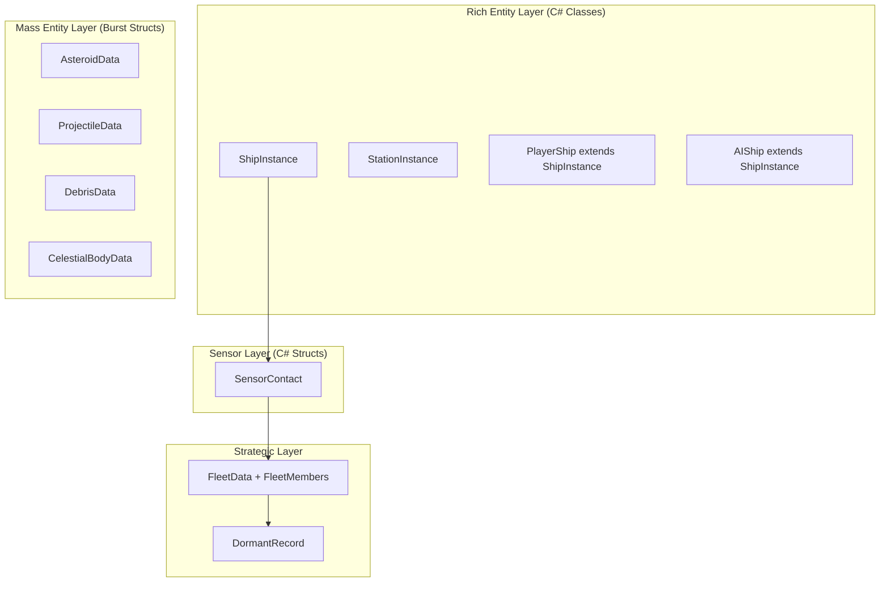
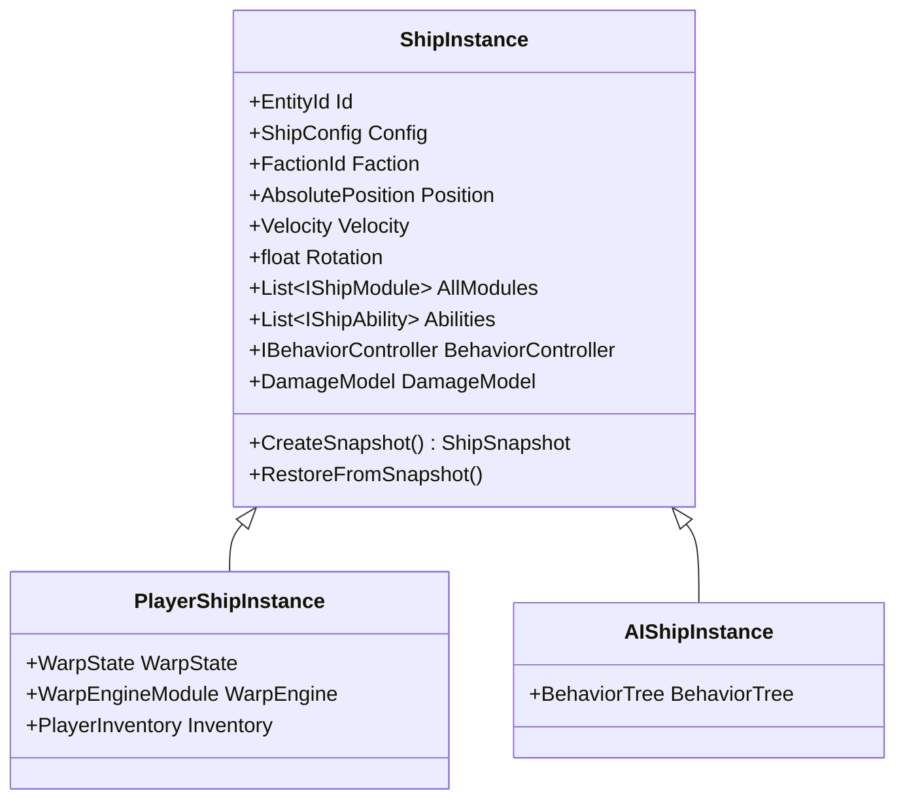
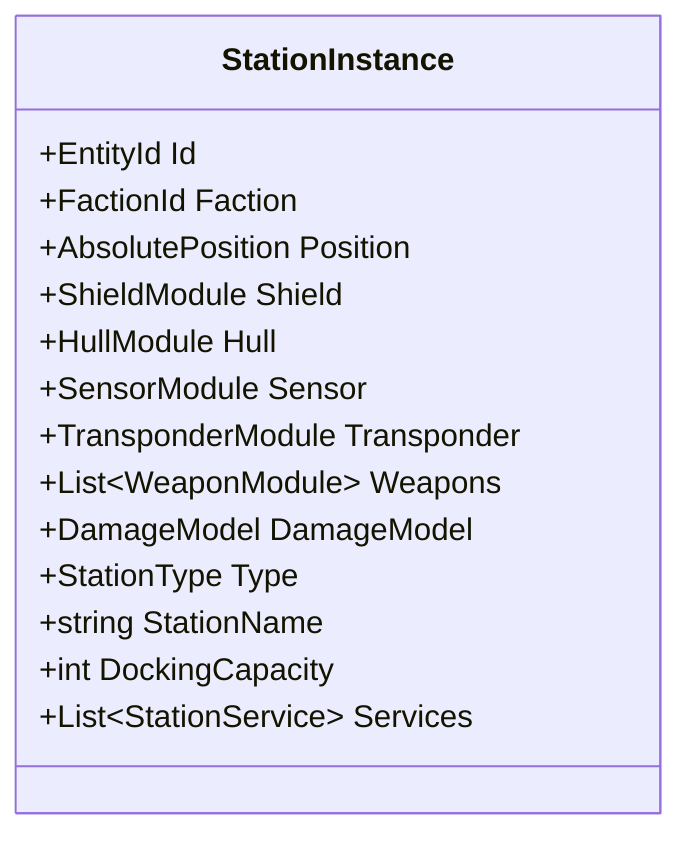
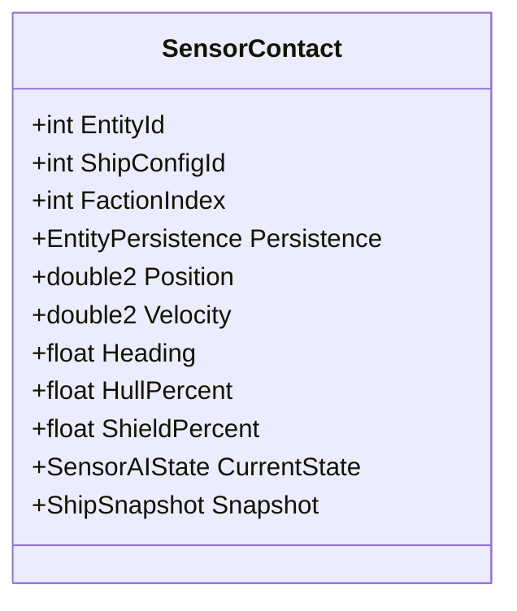
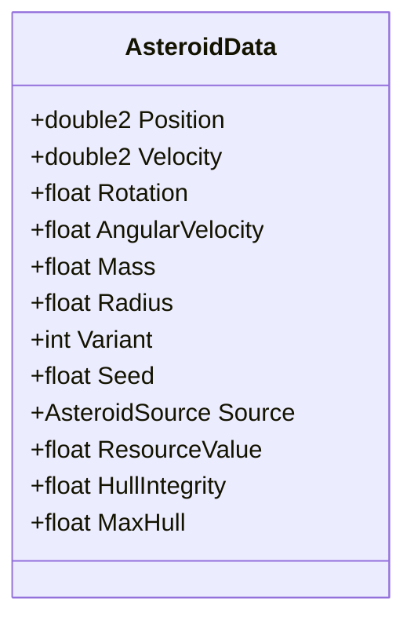
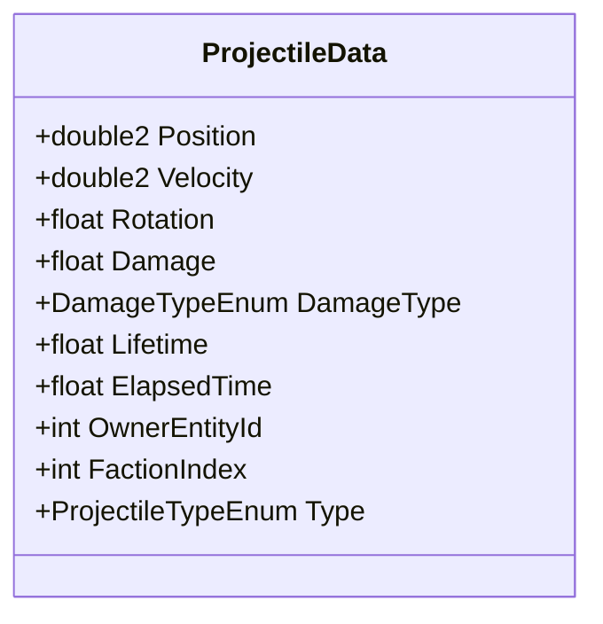
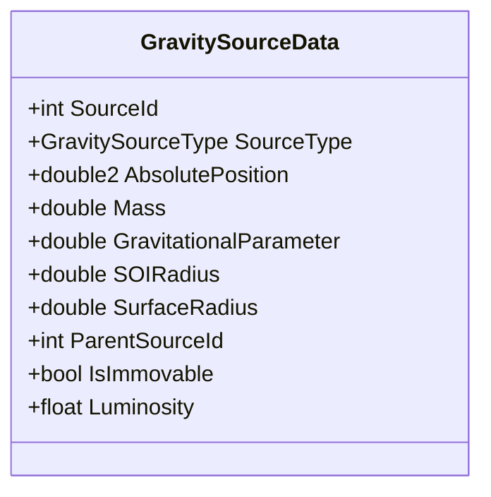
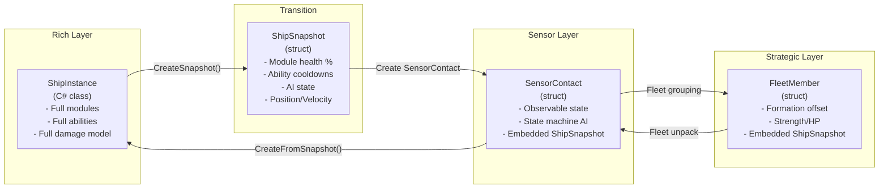

# Entity Composition Strategy

This document defines how entities are composed in each layer. The Rich Entity Layer uses C# class composition with interfaces. The Mass Entity Layer uses simple data structs.

---

## Composition Overview



---

## Rich Entity Layer: Ship Composition

Ships use **interface-based composition** - each ship class is defined by which modules and abilities it has. This replaces the ECS archetype approach.

### Ship Class Hierarchy



### Module Composition Matrix

Which modules each ship type has. All ships have Hull, Shield, Sensor, Transponder. Other modules vary.

| Module | Player | AI Fighter | AI Trader | AI Miner | Station |
|--------|:------:|:----------:|:---------:|:--------:|:-------:|
| HullModule | always | always | always | always | always |
| ShieldModule | always | always | always | always | always |
| SensorModule | always | always | always | always | always |
| TransponderModule | always | always | always | always | always |
| PropulsionModule | always | always | always | always | - |
| RotationModule | always | always | always | always | - |
| WeaponModule[] | variable | variable | optional | optional | variable |
| WarpEngineModule | yes | optional | yes | optional | - |

### Ability Composition by Ship Class

Each ship class has a unique set of abilities defined by its config:

| Ship Class | Unique Abilities |
|-----------|-----------------|
| **Scout** | CloakAbility, SensorBoostAbility |
| **Fighter** | AfterburnerAbility, MissileBarrageAbility |
| **Bomber** | MineDeployerAbility, TorpedoAbility |
| **Support** | ShieldBoostAbility, RepairBeamAbility |
| **Interceptor** | WarpJammerAbility, EMPAbility |
| **Hacker** | HackingAbility, DecoyAbility |
| **Trader** | CargoJettisonAbility, DistressBeaconAbility |
| **Miner** | TractorBeamAbility, MiningLaserAbility |

**Adding a new ability:** Create a class implementing `IShipAbility`. Add it to the ship class config. No system-level changes needed.

### Ship Factory

Ships are created from configuration data:

```csharp
public class ShipFactory
{
    private ConfigRegistry _configs;

    public ShipInstance Create(int shipConfigId, FactionId faction,
                               AbsolutePosition position, bool isPlayer)
    {
        var config = _configs.GetShipConfig(shipConfigId);

        ShipInstance ship = isPlayer
            ? new PlayerShipInstance()
            : new AIShipInstance();

        ship.Id = EntityIdGenerator.Next();
        ship.ShipConfigId = shipConfigId;
        ship.Faction = faction;
        ship.Position = position;

        // Create modules from config
        ship.Hull = new HullModule(config.Hull);
        ship.Shield = new ShieldModule(config.Shield);
        ship.Propulsion = new PropulsionModule(config.Propulsion);
        ship.RotationMod = new RotationModule(config.Rotation);
        ship.Sensor = new SensorModule(config.Sensor);
        ship.Transponder = new TransponderModule(config.Transponder);

        foreach (var weaponConfig in config.Weapons)
            ship.Weapons.Add(new WeaponModule(weaponConfig));

        // Create abilities from config
        foreach (var abilityDef in config.Abilities)
            ship.Abilities.Add(AbilityFactory.Create(abilityDef));

        // AI setup
        if (ship is AIShipInstance aiShip)
            aiShip.BehaviorTree = BehaviorTreeFactory.Create(config.BehaviorTreeId);

        // Damage model from config
        ship.DamageModel = DamageModelFactory.Create(config.HitboxZones, ship);

        return ship;
    }

    public ShipInstance CreateFromSnapshot(ShipSnapshot snapshot)
    {
        var ship = Create(snapshot.ShipConfigId, ...);
        ship.RestoreFromSnapshot(snapshot, _configs.GetShipConfig(snapshot.ShipConfigId));
        return ship;
    }
}
```

---

## Rich Entity Layer: Station Composition



Stations are simpler than ships - no propulsion, no abilities, no behavior tree. They have shields, weapons (defensive turrets), sensors, and services.

---

## Sensor Layer: Contact Composition

SensorContacts are flat structs - no composition, no polymorphism. All fields are always present.



The SensorContact struct contains everything needed for:
1. Map display (position, heading, faction, hull/shield status)
2. State machine AI (state, target, waypoint, capabilities)
3. Layer transition (ShipSnapshot for restoring to Rich layer)

---

## Mass Entity Layer: Data Structs

Mass entities are simple data structs in NativeArrays. No composition - every asteroid has the same fields.

### Asteroid



### Projectile



### Celestial Body



---

## Layer Transition Data Flow

How entity data transforms between layers:



### What Data Survives Each Transition

| Data | Rich → Sensor | Sensor → Strategic | Strategic → Dormant |
|------|:-------------:|:------------------:|:-------------------:|
| Position | exact | exact | chunk only |
| Velocity | exact | fleet velocity | lost |
| Module health % | compressed | in snapshot | in snapshot (Persistent) |
| Ability cooldowns | compressed | in snapshot | in snapshot (Persistent) |
| AI state | mapped to SensorAIState | mapped to FleetBehavior | lost |
| Damage model | compressed | in snapshot | in snapshot (Persistent) |
| Unique identity | preserved | preserved | preserved (Persistent) |

---

## Configuration-Driven Composition

Ship configs define which modules and abilities a ship has. The composition is determined at spawn time, not at compile time.

```
StreamingAssets/Configs/
├── Ships/
│   ├── player_starter.json     → PlayerShipInstance with basic modules
│   ├── fighter_light.json      → AIShipInstance with combat abilities
│   ├── trader_medium.json      → AIShipInstance with trade abilities
│   ├── scout_fast.json         → AIShipInstance with cloak + sensor boost
│   └── bomber_heavy.json       → AIShipInstance with mines + torpedoes
├── Modules/
│   ├── propulsion/
│   ├── weapons/
│   ├── shields/
│   └── rotation/
├── Abilities/
│   ├── cloak.json
│   ├── tractor_beam.json
│   ├── mine_deployer.json
│   └── ...
├── Asteroids/
├── Stations/
└── Factions/
```

See [[05-configuration-layer]] for JSON schema details.

---

## Memory Layout Comparison

### Old Approach (DOTS ECS)

Every ship had 30+ components spread across ECS chunks. Archetype fragmentation from different module combinations. Burst constraints prevented polymorphic behavior.

### New Approach (Hybrid)

| Layer | Memory Layout | Access Pattern |
|-------|--------------|----------------|
| Rich | Heap-allocated C# objects | Sequential iteration, ~500 objects |
| Sensor | Contiguous struct array | Sequential iteration, ~200 structs |
| Mass | NativeArray (Burst) | Parallel batch, thousands of structs |

The Rich layer trades cache coherency for expressiveness (virtual dispatch, managed types, inheritance). At ~500 entities this is not a bottleneck. The Mass layer maintains full cache coherency and Burst compatibility where it matters (thousands of entities).

---

## Related Documents

- [[01-component-model]] - Detailed data type definitions
- [[02-system-architecture]] - How each layer processes entities
- [[03-tiered-simulation]] - Tier transitions between layers
- [[05-configuration-layer]] - JSON configuration for ship composition
- [[09-progressive-destruction]] - Damage model details
