# Archetype Strategy

This document defines the entity archetype patterns for Starfire's ECS architecture. Archetypes determine which components an entity has and how entities are batched for efficient processing.

---

## Archetype Overview

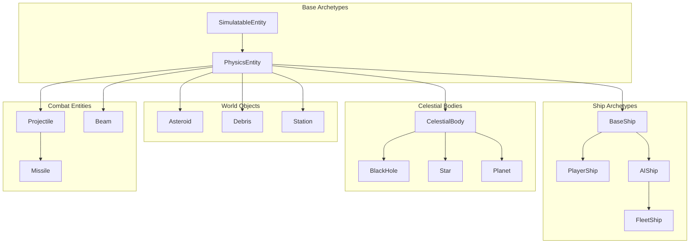

---

## Component Composition Matrix

| Component | Player | AI Ship | Asteroid | Projectile | Station | Fleet | CelestialBody |
|-----------|:------:|:-------:|:--------:|:----------:|:-------:|:-----:|:-------------:|
| `EntityId` | ✓ | ✓ | ✓ | ✓ | ✓ | ✓ | ✓ |
| `AbsolutePosition` | ✓ | ✓ | ✓ | ✓ | ✓ | ✓ | ✓ |
| `LocalPosition` | ✓ | ✓ | ✓ | ✓ | ✓ | - | ✓ |
| `Velocity` | ✓ | ✓ | ✓ | ✓ | - | ✓ | opt |
| `Rotation` | ✓ | ✓ | ✓ | ✓ | - | - | - |
| `PhysicsBody` | ✓ | ✓ | ✓ | ✓ | ✓ | - | ✓ |
| `ChunkLocation` | ✓ | ✓ | ✓ | ✓ | ✓ | ✓ | ✓ |
| `SimulationTier` | ✓ | ✓ | ✓ | - | ✓ | - | - |
| `EntityPersistence` | ✓ | ✓ | - | - | ✓ | - | - |
| `CollisionConfig` | ✓ | ✓ | ✓ | ✓ | ✓ | - | ✓ |
| `FactionData` | ✓ | ✓ | - | ✓ | ✓ | ✓ | - |
| `GravityState` | ✓ | ✓ | ✓ | - | - | - | - |
| `HeatState` | ✓ | ✓ | - | - | - | - | - |
| `GravitySourceData` | - | - | - | - | - | - | ✓ |
| `PrecomputedOrbit` | - | - | - | - | - | - | opt |
| `StarSystemData` | - | - | - | - | - | - | opt |
| `PropulsionModule` | ✓ | ✓ | - | - | - | - | - |
| `RotationModule` | ✓ | ✓ | - | - | - | - | - |
| `ShieldModule` | ✓ | ✓ | - | - | ✓ | - | - |
| `HullModule` | ✓ | ✓ | ✓ | - | ✓ | - | - |
| `SensorModule` | ✓ | ✓ | - | - | ✓ | - | - |
| `TransponderModule` | ✓ | ✓ | - | - | ✓ | - | - |
| `AICoreModule` | - | ✓ | - | - | - | - | - |
| `WeaponModule` (buffer) | ✓ | ✓ | - | - | ✓ | - | - |
| `ControlInput` | ✓ | ✓ | - | - | - | - | - |
| `BehaviorTreeState` | - | ✓ | - | - | - | - | - |
| `FleetData` | - | - | - | - | - | ✓ | - |
| `FleetMembership` | - | opt | - | - | - | - | - |
| `ProjectileData` | - | - | - | ✓ | - | - | - |
| `AsteroidData` | - | - | ✓ | - | - | - | - |
| `ModuleHealthElement` (buffer) | ✓ | ✓ | - | - | ✓ | - | - |
| `HitboxZoneElement` (buffer) | ✓ | ✓ | - | - | ✓ | - | - |
| `ZoneModuleMapping` (buffer) | ✓ | ✓ | - | - | ✓ | - | - |
| `RepairConfiguration` | ✓ | ✓ | - | - | ✓ | - | - |
| `EntityDamageEffects` | ✓ | ✓ | - | - | ✓ | - | - |
| `ModuleDamagedEvent` (buffer) | ✓ | ✓ | - | - | ✓ | - | - |
| `ModuleDisabledEvent` (buffer) | ✓ | ✓ | - | - | ✓ | - | - |
| `ModuleRepairedEvent` (buffer) | ✓ | ✓ | - | - | ✓ | - | - |

**Notes:**
- Module health is tracked via `DynamicBuffer<ModuleHealthElement>`, with one entry per damageable module (Propulsion, Rotation, Shield, Weapons, Sensors). Each entry includes a `ShipModuleCategory` to identify which module it applies to.
- Damage event buffers (`ModuleDamagedEvent`, `ModuleDisabledEvent`, `ModuleRepairedEvent`) are stored on the **damaged entity** and should be cleared each frame after processing.
- `GravityState` is stored in `SimulatedEntity.TypeData` for background simulation, not as an ECS component. Ships and asteroids in Tier 0-1 have gravity applied.
- `HeatState` is stored in `SimulatedEntity.TypeData`. Ships track hull temperature and can take heat damage from nearby stars.
- `CelestialBody` entities (stars, planets, black holes) provide gravity sources. Stars in multi-body systems have `PrecomputedOrbit` and may belong to a `StarSystemData`.
- See [[09-progressive-destruction]] for damage details, [[10-gravity-system]] for gravity, [[11-heat-system]] for heat.

---

## Core Archetypes

### 1. SimulatableEntity (Abstract Base)

All entities that participate in the simulation share these components:

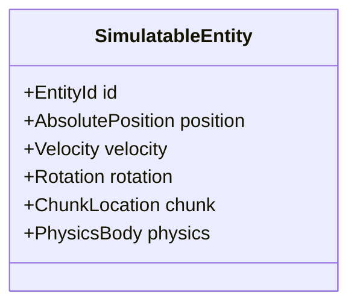

```csharp
public static EntityArchetype CreateSimulatableBase(EntityManager em)
{
    return em.CreateArchetype(
        typeof(EntityId),            // Required for cross-tier references
        typeof(AbsolutePosition),
        typeof(LocalPosition),
        typeof(Velocity),
        typeof(Rotation),
        typeof(PhysicsBody),
        typeof(ChunkLocation),
        // Tier tags (all disabled by default)
        typeof(LoadedTag),
        typeof(ActiveTag),
        typeof(TacticalTag),
        typeof(StrategicTag),
        typeof(DormantTag)
    );
}
```

---

### 2. BaseShip Archetype

Foundation for all ship types (player and AI).

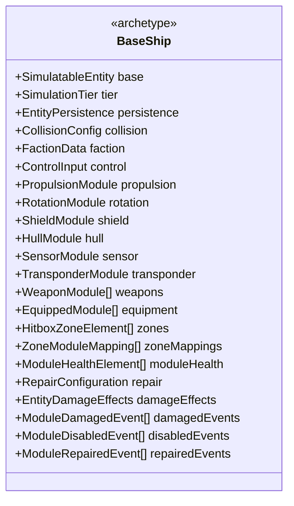

```csharp
public static EntityArchetype CreateBaseShip(EntityManager em)
{
    return em.CreateArchetype(
        // Identity
        typeof(EntityId),            // Required for cross-tier references

        // Base simulatable
        typeof(AbsolutePosition),
        typeof(LocalPosition),
        typeof(Velocity),
        typeof(Rotation),
        typeof(PhysicsBody),
        typeof(ChunkLocation),

        // Tier management
        typeof(SimulationTier),
        typeof(EntityPersistence),
        typeof(LoadedTag),
        typeof(ActiveTag),
        typeof(TacticalTag),
        typeof(StrategicTag),
        typeof(DormantTag),

        // Identity
        typeof(CollisionConfig),
        typeof(FactionData),

        // Control
        typeof(ControlInput),

        // Core modules (always present)
        typeof(PropulsionModule),
        typeof(RotationModule),
        typeof(ShieldModule),
        typeof(HullModule),
        typeof(SensorModule),
        typeof(TransponderModule),

        // Progressive destruction
        typeof(RepairConfiguration),
        typeof(EntityDamageEffects),  // Tracks worst damage state for visual effects

        // Buffers
        typeof(WeaponModule),           // IBufferElementData
        typeof(EquippedModule),         // IBufferElementData
        typeof(PendingDamage),          // IBufferElementData
        typeof(HitboxZoneElement),      // IBufferElementData
        typeof(ZoneModuleMapping),      // IBufferElementData
        typeof(ModuleHealthElement),    // IBufferElementData - one entry per damageable module

        // Damage event buffers (stored on damaged entity, cleared each frame after processing)
        typeof(ModuleDamagedEvent),     // IBufferElementData
        typeof(ModuleDisabledEvent),    // IBufferElementData
        typeof(ModuleRepairedEvent)     // IBufferElementData
    );
}

// Note: ModuleHealthElement buffer is populated at spawn time with one entry per
// damageable module (Propulsion, Rotation, Shield, Sensors, each Weapon slot).
// See [[09-progressive-destruction]] for module health integration.
```

---

### 3. PlayerShip Archetype

Extends BaseShip with player-specific components.

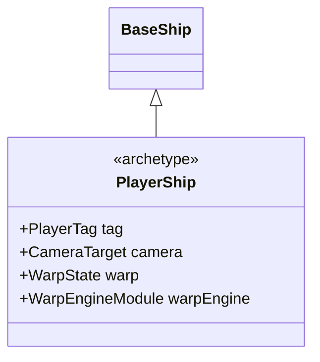

```csharp
public static EntityArchetype CreatePlayerShip(EntityManager em)
{
    var components = new NativeList<ComponentType>(Allocator.Temp);

    // Include all BaseShip components
    AddBaseShipComponents(ref components);

    // Player-specific
    components.Add(typeof(PlayerTag));
    components.Add(typeof(CameraTarget));
    components.Add(typeof(WarpState));
    components.Add(typeof(WarpEngineModule));
    components.Add(typeof(PlayerInventory));  // If applicable

    return em.CreateArchetype(components.AsArray());
}
```

**Player-Specific Components:**
```csharp
// Singleton-like tag (only one entity should have this)
public struct PlayerTag : IComponentData { }

// Camera follows this entity
public struct CameraTarget : IComponentData
{
    public float ZoomLevel;
    public float2 Offset;
}

// Warp drive state (see 07-warp-system.md for full details)
public struct WarpState : IComponentData
{
    public WarpPhase Phase;
    public double WarpStartTime;
    public double2 WarpDirection;        // Normalized direction
    public float CurrentSpeed;           // Current warp speed
    public float TargetSpeed;            // Max warp speed from engine
    public float ChargeProgress;         // 0-1 during charging
    public double DistanceTraveled;      // Total distance this warp
    public WarpDropReason LastDropReason;
}

// Warp engine capabilities (see 07-warp-system.md for full details)
public struct WarpEngineModule : IComponentData
{
    public FixedString64Bytes ModuleId;
    public float MaxWarpSpeed;      // e.g., 10,000 units/second
    public float ChargeTime;        // Seconds to reach max speed
    public float DropTime;          // Seconds to decelerate
    public float FuelPerSecond;     // Warp fuel consumption rate
    public float CurrentFuel;
    public float MaxFuel;
    public float CooldownRemaining;
    public bool IsEnabled;
}
```

---

### 4. AIShip Archetype

Extends BaseShip with AI behavior components.

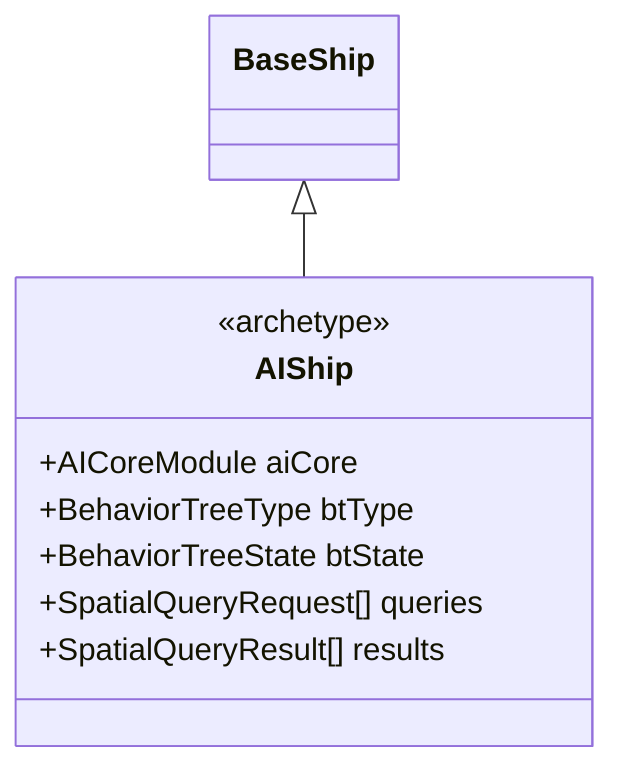

```csharp
public static EntityArchetype CreateAIShip(EntityManager em)
{
    var components = new NativeList<ComponentType>(Allocator.Temp);

    // Include all BaseShip components
    AddBaseShipComponents(ref components);

    // AI-specific
    components.Add(typeof(AICoreModule));
    components.Add(typeof(BehaviorTreeType));      // ISharedComponentData
    components.Add(typeof(BehaviorTreeState));
    components.Add(typeof(SpatialQueryRequest));   // IBufferElementData
    components.Add(typeof(SpatialQueryResult));    // IBufferElementData

    // Optional: Fleet membership (added dynamically in Tier 3)
    // components.Add(typeof(FleetMembership));

    return em.CreateArchetype(components.AsArray());
}
```

---

### 5. Asteroid Archetype

Simple physics object with no behavior.

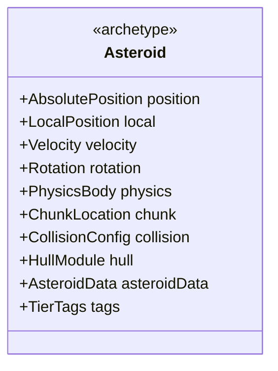

```csharp
public static EntityArchetype CreateAsteroid(EntityManager em)
{
    return em.CreateArchetype(
        typeof(EntityId),            // Required for cross-tier references
        typeof(AbsolutePosition),
        typeof(LocalPosition),
        typeof(Velocity),
        typeof(Rotation),
        typeof(PhysicsBody),
        typeof(ChunkLocation),
        typeof(SimulationTier),
        typeof(CollisionConfig),
        typeof(HullModule),
        typeof(AsteroidData),
        typeof(PendingDamage),

        // Tier tags
        typeof(LoadedTag),
        typeof(ActiveTag),
        typeof(TacticalTag),
        typeof(StrategicTag),
        typeof(DormantTag)
    );
}

public struct AsteroidData : IComponentData
{
    public int Variant;          // Visual variant index
    public float Seed;           // Procedural seed
    public AsteroidSource Source; // Belt, Ring, Scatter
    public float ResourceValue;  // Mining yield
}
```

---

### 6. Projectile Archetype

Fast-moving combat entities with limited lifetime.

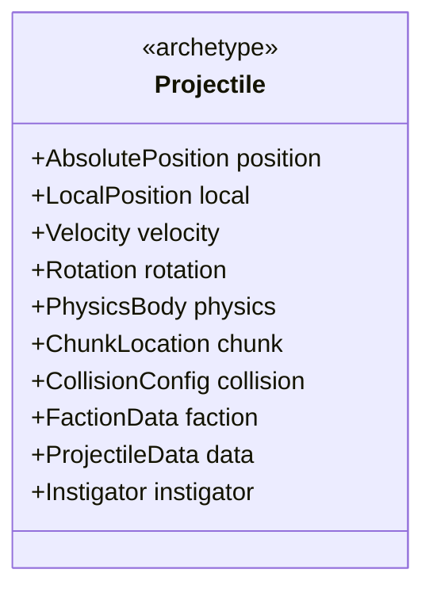

```csharp
public static EntityArchetype CreateProjectile(EntityManager em)
{
    return em.CreateArchetype(
        typeof(EntityId),            // Required for cross-tier references
        typeof(AbsolutePosition),
        typeof(LocalPosition),
        typeof(Velocity),
        typeof(Rotation),
        typeof(PhysicsBody),
        typeof(ChunkLocation),
        typeof(CollisionConfig),
        typeof(FactionData),
        typeof(ProjectileData),
        typeof(Instigator),

        // Only Loaded/Active tiers (projectiles don't persist far)
        typeof(LoadedTag),
        typeof(ActiveTag)
    );
}

public struct ProjectileData : IComponentData
{
    public float Damage;
    public DamageType DamageType;
    public float Lifetime;
    public float ElapsedTime;
    public Entity SourceWeapon;
    public Entity TargetEntity;  // For homing
    public ProjectileType Type;  // Ballistic, Homing, Beam
}
```

---

### 7. Fleet Archetype (Tier 3 Abstraction)

Represents a group of ships as a single entity.

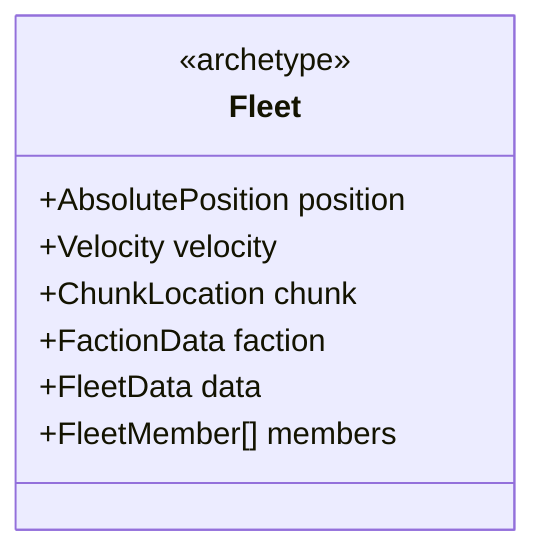

```csharp
public static EntityArchetype CreateFleet(EntityManager em)
{
    return em.CreateArchetype(
        typeof(EntityId),            // Required for cross-tier references
        typeof(AbsolutePosition),
        typeof(Velocity),
        typeof(ChunkLocation),
        typeof(FactionData),
        typeof(FleetData),
        typeof(FleetMember)    // IBufferElementData - see 01-component-model.md for full definition
    );
}

// Note: FleetData and FleetMember are fully defined in 01-component-model.md
// FleetData includes: FleetId, FactionIndex, Position, Velocity, Rotation, MemberCount,
//                     Formation, TotalStrength, TotalHP, CurrentBehavior, TargetFleetId
// FleetMember includes: EntityId, FormationSlot, FormationOffset, FormationRotation,
//                       Strength, HP, Persistence
```

**Why No Rotation Component:**

Fleet entities do NOT have the `Rotation` IComponentData component. Instead, rotation is stored in `FleetData.Rotation` field. This is intentional:

1. Fleet rotation is static between updates (no per-frame physics simulation)
2. Rotation is needed only during unpacking to transform member `FormationOffset` to world space
3. Avoids adding a component that would never be processed by `RotationSystem`

When unpacking fleet members, use `FleetData.Rotation` with the helper functions in [[01-component-model#Fleet Lifecycle]]:
- `CalculateUnpackPosition()` - transforms local offset by fleet rotation
- `CalculateUnpackRotation()` - adds fleet rotation to member's formation rotation

---

### 8. Station Archetype

Static (or slow-moving) structures with services.

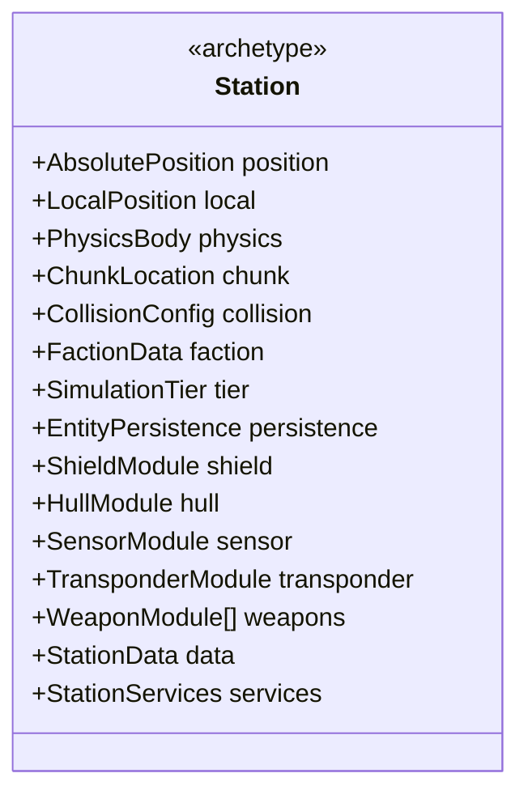

```csharp
public struct StationData : IComponentData
{
    public StationType Type;      // Trading, Military, Mining, etc.
    public FixedString64Bytes StationName;
    public int DockingCapacity;
    public int CurrentDocked;
}

public struct StationServices : IBufferElementData
{
    public ServiceType Type;      // Refuel, Repair, Trade, Mission
    public bool IsAvailable;
    public float PriceModifier;
}
```

---

### 9. CelestialBody Archetype

Stars, planets, moons, and black holes that provide gravity sources.

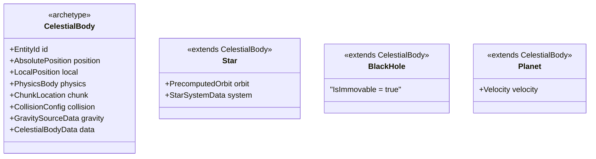

```csharp
public static EntityArchetype CreateCelestialBody(EntityManager em)
{
    return em.CreateArchetype(
        typeof(EntityId),
        typeof(AbsolutePosition),
        typeof(LocalPosition),
        typeof(PhysicsBody),           // Mass, Radius, GravityRadius
        typeof(ChunkLocation),
        typeof(CollisionConfig),
        typeof(GravitySourceData),     // Gravity source properties
        typeof(CelestialBodyData),     // Kind, Luminosity, etc.

        // Tier tags (celestial bodies don't tier-transition like ships)
        typeof(LoadedTag),
        typeof(ActiveTag)
    );
}

public struct CelestialBodyData : IComponentData
{
    public CelestialBodyKind Kind;          // BlackHole, Star, Planet, Moon
    public float Luminosity;                // Heat output (0 for non-stars)
    public float Seed;                      // Procedural variation
    public int ParentSourceId;              // Parent in gravity hierarchy
    public int StarSystemId;                // Multi-star system ID (-1 if standalone)
}

public enum CelestialBodyKind : byte
{
    BlackHole = 0,
    Star = 1,
    Planet = 2,
    Moon = 3
}
```

**Celestial Body Variants:**

| Kind | Has Velocity | Has PrecomputedOrbit | IsImmovable | Luminosity |
|------|:-----------:|:--------------------:|:-----------:|:----------:|
| BlackHole | - | - | ✓ | 0 |
| Star (standalone) | - | - | ✓ | High |
| Star (in system) | - | ✓ | - | High |
| Planet | ✓ | - | - | 0 |
| Moon | ✓ | - | - | 0 |

**Notes:**
- Black holes are the only truly immovable gravity sources
- Stars in multi-body systems (binary, triple) have `PrecomputedOrbit` and `StarSystemData`
- Planets and moons have `Velocity` for orbital motion but follow Keplerian paths
- Celestial bodies don't participate in tier transitions - they're always simulated when in loaded chunks

See [[10-gravity-system]] for gravity hierarchy and orbital mechanics.

---

## Archetype Transitions

### Ship Tier Transitions

Ships can transition between archetypes when changing simulation tiers:

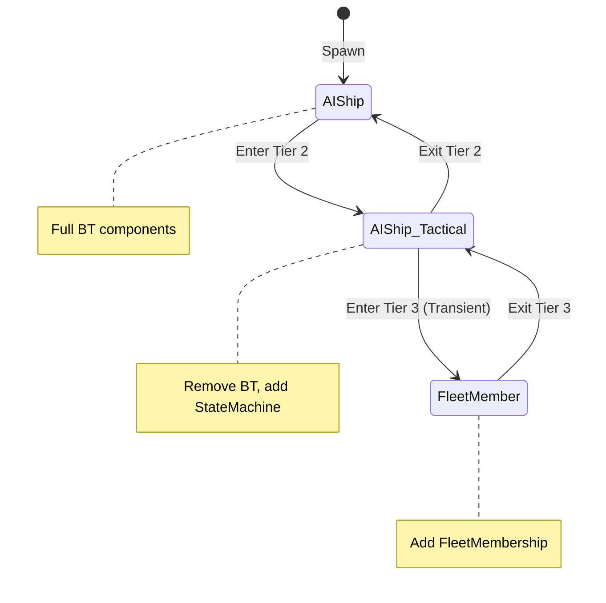

**Structural Changes for Tier Transitions:**

| Transition | Add Components | Remove Components |
|------------|----------------|-------------------|
| Tier 1 → Tier 2 | `StateMachineState` | (none, disable BT) |
| Tier 2 → Tier 3 (Transient) | `FleetMembership` | `StateMachineState` |
| Tier 3 → Tier 2 (Unpack) | `StateMachineState` | `FleetMembership` |
| Tier 2 → Tier 1 | (none, enable BT) | `StateMachineState` |

---

## Shared Component Batching

### BehaviorTreeType (AI Batching)

AI ships are batched by their behavior tree type for efficient processing:

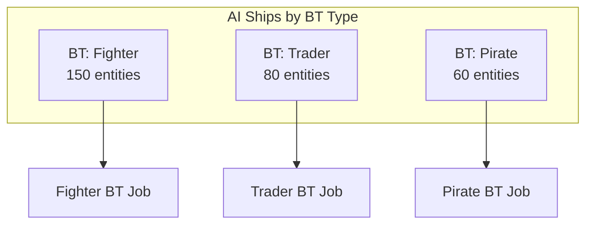

```csharp
// Shared component groups entities by BT type
public struct BehaviorTreeType : ISharedComponentData
{
    public int TreeId;
}

// Query filters by shared component
[BurstCompile]
partial struct AISystemJob : IJobEntity
{
    public void Execute(ref BehaviorTreeState state,
                        ref ControlInput output,
                        in AbsolutePosition pos)
    {
        // Process all entities with same BT type together
    }
}
```

---

## Archetype Creation Factory

**BURST COMPATIBILITY:** The static Dictionary approach below is NOT Burst-compatible.
For Burst jobs that need to create entities, use `EntityCommandBuffer` with pre-created
prefab entities instead. Archetype creation must happen on the main thread.

```csharp
public static class EntityArchetypeFactory
{
    // WARNING: Dictionary<string, EntityArchetype> is NOT Burst-compatible
    // This is main-thread only. For Burst jobs, use prefab entities.
    private static Dictionary<string, EntityArchetype> _archetypes;

    public static void Initialize(EntityManager em)
    {
        _archetypes = new Dictionary<string, EntityArchetype>
        {
            ["PlayerShip"] = CreatePlayerShip(em),
            ["AIShip"] = CreateAIShip(em),
            ["Asteroid"] = CreateAsteroid(em),
            ["Projectile"] = CreateProjectile(em),
            ["Fleet"] = CreateFleet(em),
            ["Station"] = CreateStation(em),
            ["Debris"] = CreateDebris(em),
        };
    }

    public static EntityArchetype Get(string archetypeId)
    {
        return _archetypes[archetypeId];
    }

    public static Entity CreateEntity(EntityManager em, string archetypeId)
    {
        return em.CreateEntity(_archetypes[archetypeId]);
    }
}

/// <summary>
/// Burst-compatible entity creation using prefab entities.
/// Store prefabs in a singleton, instantiate via EntityCommandBuffer in jobs.
/// </summary>
public struct PrefabEntityRegistry : IComponentData
{
    public Entity PlayerShipPrefab;
    public Entity AIShipPrefab;
    public Entity AsteroidPrefab;
    public Entity ProjectilePrefab;
    public Entity FleetPrefab;
    public Entity StationPrefab;
    public Entity DebrisPrefab;
}

// Usage in Burst job:
// var prefabs = SystemAPI.GetSingleton<PrefabEntityRegistry>();
// ecb.Instantiate(prefabs.ProjectilePrefab);
```

---

## Prefab Entities

For frequently spawned entities (projectiles, effects), use prefab entities:

```csharp
public struct PrefabRegistry : IComponentData
{
    public Entity ProjectileLaser;
    public Entity ProjectileMissile;
    public Entity AsteroidSmall;
    public Entity AsteroidMedium;
    public Entity AsteroidLarge;
    public Entity DebrisGeneric;
}

// Spawn from prefab (efficient)
Entity projectile = em.Instantiate(prefabRegistry.ProjectileLaser);
```

---

## Memory Layout Considerations

### Hot/Cold Data Separation

Frequently accessed data should be in smaller components:

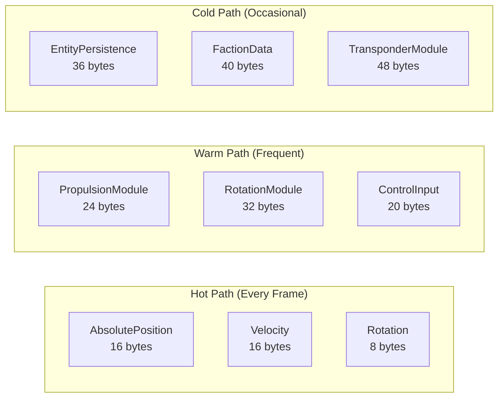

### Cache Line Optimization

Target 64-byte cache line alignment for hot components:

| Component | Size | Per Cache Line |
|-----------|------|----------------|
| `AbsolutePosition` | 16 bytes | 4 entities |
| `Velocity` | 16 bytes | 4 entities |
| `Rotation` | 8 bytes | 8 entities |
| `ControlInput` | 20 bytes | 3 entities |

---

## Related Documentation

- [01-component-model.md](01-component-model.md) - Component definitions
- [02-system-architecture.md](02-system-architecture.md) - System execution
- [05-configuration-layer.md](05-configuration-layer.md) - JSON archetype configs
- [09-progressive-destruction.md](09-progressive-destruction.md) - Damage components and zone system
- [10-gravity-system.md](10-gravity-system.md) - Gravity hierarchy and orbital mechanics
- [11-heat-system.md](11-heat-system.md) - Heat radiation and thermal damage
