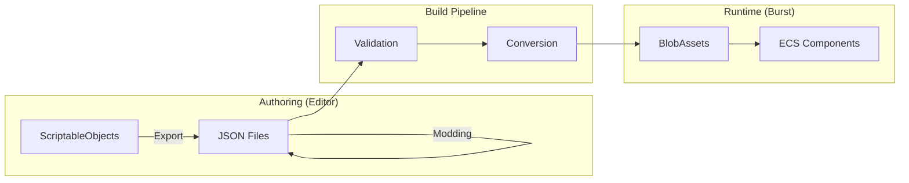
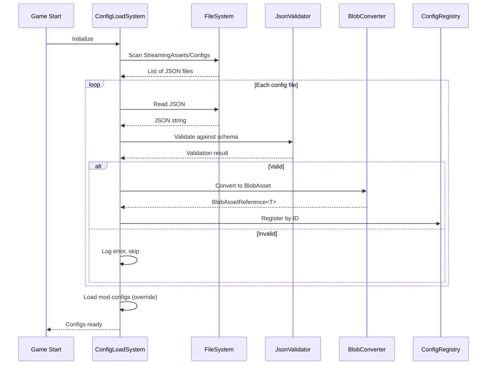
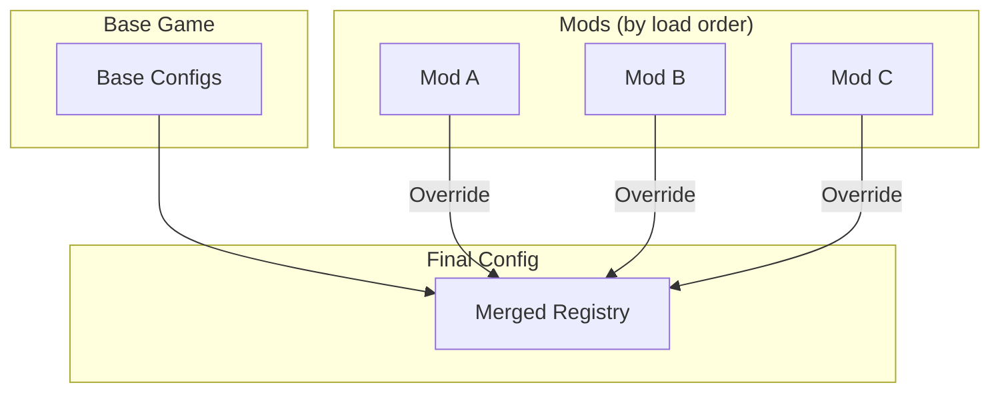

# Configuration Layer

This document defines the JSON-based configuration system for Starfire, enabling moddability while maintaining Burst-compatible runtime performance through BlobAssets.

---

## Configuration Pipeline Overview



---

## Directory Structure

```
StreamingAssets/
├── Configs/
│   ├── Ships/
│   │   ├── player_starter.json
│   │   ├── fighter_light.json
│   │   ├── fighter_heavy.json
│   │   ├── trader_small.json
│   │   └── pirate_raider.json
│   ├── Modules/
│   │   ├── propulsion/
│   │   │   ├── engine_basic.json
│   │   │   └── engine_military.json
│   │   ├── weapons/
│   │   │   ├── laser_light.json
│   │   │   └── missile_standard.json
│   │   ├── shields/
│   │   │   └── shield_basic.json
│   │   └── rotation/
│   │       └── thruster_standard.json
│   ├── Asteroids/
│   │   ├── asteroid_small.json
│   │   └── asteroid_large.json
│   ├── Stations/
│   │   └── station_trading.json
│   ├── Factions/
│   │   ├── faction_player.json
│   │   └── faction_pirate.json
│   ├── HitboxZones/
│   │   ├── hitbox_fighter_light.json
│   │   ├── hitbox_fighter_heavy.json
│   │   └── hitbox_station_default.json
│   └── Schemas/
│       ├── ship.schema.json
│       ├── module.schema.json
│       ├── faction.schema.json
│       └── hitbox-zones.schema.json
└── Mods/
    └── [mod_name]/
        └── Configs/
            └── ... (same structure)
```

---

## JSON Schema Definitions

### Ship Configuration Schema

```json
{
  "$schema": "https://json-schema.org/draft/2020-12/schema",
  "$id": "starfire://schemas/ship.schema.json",
  "title": "Ship Configuration",
  "type": "object",
  "required": ["entityType", "archetypeId", "displayName", "physics", "modules"],
  "properties": {
    "entityType": {
      "const": "Ship"
    },
    "archetypeId": {
      "type": "string",
      "pattern": "^[a-z_]+$",
      "description": "Unique identifier for this ship type"
    },
    "displayName": {
      "type": "string",
      "maxLength": 64
    },
    "description": {
      "type": "string",
      "maxLength": 512
    },
    "physics": {
      "$ref": "#/$defs/physicsConfig"
    },
    "modules": {
      "$ref": "#/$defs/modulesConfig"
    },
    "persistence": {
      "enum": ["Transient", "Persistent", "Critical"],
      "default": "Transient"
    },
    "faction": {
      "type": "string",
      "description": "Default faction ID"
    },
    "visualPrefab": {
      "type": "string",
      "description": "Path to visual prefab"
    },
    "hitboxConfig": {
      "type": "string",
      "description": "Reference to hitbox zone configuration ID (from HitboxZones/)"
    }
  },
  "$defs": {
    "physicsConfig": {
      "type": "object",
      "required": ["mass", "drag", "collisionRadius"],
      "properties": {
        "mass": { "type": "number", "minimum": 0.1 },
        "drag": { "type": "number", "minimum": 0 },
        "angularDrag": { "type": "number", "minimum": 0 },
        "collisionRadius": { "type": "number", "minimum": 0.1 },
        "restitution": { "type": "number", "minimum": 0, "maximum": 1 }
      }
    },
    "modulesConfig": {
      "type": "object",
      "properties": {
        "propulsion": { "$ref": "module.schema.json#/$defs/propulsion" },
        "rotation": { "$ref": "module.schema.json#/$defs/rotation" },
        "shield": { "$ref": "module.schema.json#/$defs/shield" },
        "hull": { "$ref": "module.schema.json#/$defs/hull" },
        "sensor": { "$ref": "module.schema.json#/$defs/sensor" },
        "transponder": { "$ref": "module.schema.json#/$defs/transponder" },
        "weapons": {
          "type": "array",
          "items": { "$ref": "module.schema.json#/$defs/weapon" }
        }
      }
    }
  }
}
```

### Example Ship Configuration

```json
{
  "$schema": "starfire://schemas/ship.schema.json",
  "entityType": "Ship",
  "archetypeId": "fighter_light",
  "displayName": "Light Fighter",
  "description": "Fast and agile interceptor craft",

  "physics": {
    "mass": 100.0,
    "drag": 0.5,
    "angularDrag": 0.8,
    "collisionRadius": 2.0,
    "restitution": 0.3
  },

  "modules": {
    "propulsion": {
      "moduleId": "engine_military",
      "maxSpeed": 15.0,
      "acceleration": 8.0,
      "drag": 0.5,
      "maxHealth": 120
    },
    "rotation": {
      "moduleId": "thruster_standard",
      "mode": "ThrusterBased",
      "turnRate": 180.0,
      "thrusterTorque": 500.0,
      "maxHealth": 80
    },
    "shield": {
      "moduleId": "shield_basic",
      "maxCapacity": 50.0,
      "regenRate": 5.0,
      "regenDelay": 3.0,
      "maxHealth": 60
    },
    "hull": {
      "moduleId": "hull_light",
      "maxIntegrity": 100.0,
      "armor": 5.0
    },
    "sensor": {
      "moduleId": "sensor_standard",
      "range": 500.0,
      "refreshRate": 0.5,
      "maxHealth": 40
    },
    "transponder": {
      "moduleId": "transponder_basic",
      "isActive": true
    },
    "weapons": [
      {
        "moduleId": "laser_light",
        "slotIndex": 0,
        "hardpointIndex": 0,
        "damage": 10.0,
        "fireRate": 2.0,
        "range": 300.0,
        "weightClass": 1,
        "projectileType": "Energy",
        "maxHealth": 50
      },
      {
        "moduleId": "laser_light",
        "slotIndex": 1,
        "hardpointIndex": 1,
        "damage": 10.0,
        "fireRate": 2.0,
        "range": 300.0,
        "weightClass": 1,
        "projectileType": "Energy",
        "maxHealth": 50
      }
    ]
  },

  "persistence": "Transient",
  "faction": "pirate",
  "visualPrefab": "Prefabs/Ships/FighterLight",
  "hitboxConfig": "hitbox_fighter_light"
}
```

---

## Module Configuration Schema

```json
{
  "$schema": "https://json-schema.org/draft/2020-12/schema",
  "$id": "starfire://schemas/module.schema.json",
  "title": "Module Configuration",
  "$defs": {
    "propulsion": {
      "type": "object",
      "required": ["moduleId", "maxSpeed", "acceleration"],
      "properties": {
        "moduleId": { "type": "string" },
        "maxSpeed": { "type": "number", "minimum": 0 },
        "acceleration": { "type": "number", "minimum": 0 },
        "drag": { "type": "number", "minimum": 0 },
        "maxHealth": { "type": "number", "minimum": 1, "default": 100, "description": "Module health when damaged" }
      }
    },
    "rotation": {
      "type": "object",
      "required": ["moduleId", "mode", "turnRate"],
      "properties": {
        "moduleId": { "type": "string" },
        "mode": {
          "enum": ["Instant", "Smooth", "Physics", "ThrusterBased"]
        },
        "turnRate": { "type": "number", "minimum": 0 },
        "thrusterTorque": { "type": "number", "minimum": 0 },
        "maxHealth": { "type": "number", "minimum": 1, "default": 80, "description": "Module health when damaged" }
      }
    },
    "shield": {
      "type": "object",
      "required": ["moduleId", "maxCapacity"],
      "properties": {
        "moduleId": { "type": "string" },
        "maxCapacity": { "type": "number", "minimum": 0 },
        "regenRate": { "type": "number", "minimum": 0 },
        "regenDelay": { "type": "number", "minimum": 0 },
        "maxHealth": { "type": "number", "minimum": 1, "default": 60, "description": "Generator health when damaged" }
      }
    },
    "hull": {
      "type": "object",
      "required": ["moduleId", "maxIntegrity"],
      "properties": {
        "moduleId": { "type": "string" },
        "maxIntegrity": { "type": "number", "minimum": 1 },
        "armor": { "type": "number", "minimum": 0 }
      }
    },
    "sensor": {
      "type": "object",
      "required": ["moduleId", "range"],
      "properties": {
        "moduleId": { "type": "string" },
        "range": { "type": "number", "minimum": 0 },
        "refreshRate": { "type": "number", "minimum": 0.1 },
        "maxHealth": { "type": "number", "minimum": 1, "default": 40, "description": "Module health when damaged" }
      }
    },
    "transponder": {
      "type": "object",
      "required": ["moduleId"],
      "properties": {
        "moduleId": { "type": "string" },
        "isActive": { "type": "boolean", "default": true }
      }
    },
    "weapon": {
      "type": "object",
      "required": ["moduleId", "damage", "fireRate", "range"],
      "properties": {
        "moduleId": { "type": "string" },
        "slotIndex": { "type": "integer", "minimum": 0 },
        "hardpointIndex": { "type": "integer", "minimum": 0 },
        "damage": { "type": "number", "minimum": 0 },
        "fireRate": { "type": "number", "minimum": 0.1 },
        "range": { "type": "number", "minimum": 0 },
        "weightClass": { "type": "integer", "minimum": 1, "maximum": 5 },
        "projectileType": {
          "enum": ["Kinetic", "Energy", "Missile", "Beam"],
          "description": "Matches ProjectileTypeEnum: Kinetic=0, Energy=1, Missile=2, Beam=3"
        },
        "maxHealth": { "type": "number", "minimum": 1, "default": 50, "description": "Module health when damaged" }
      }
    }
  }
}
```

---

## Behavior Tree Configuration

### Behavior Tree Manifest

Ships reference behavior trees via `AICoreModule.BehaviorTreeId`. The mapping between names and IDs is defined in a manifest:

```json
{
  "$schema": "starfire://schemas/behavior-tree-manifest.schema.json",
  "behaviorTrees": [
    {
      "treeId": 1,
      "name": "fighter_aggressive",
      "assetPath": "BehaviorTrees/Fighter_Aggressive",
      "description": "Aggressive pursuit and engagement"
    },
    {
      "treeId": 2,
      "name": "trader_defensive",
      "assetPath": "BehaviorTrees/Trader_Defensive",
      "description": "Flee from threats, follow trade routes"
    },
    {
      "treeId": 3,
      "name": "pirate_opportunist",
      "assetPath": "BehaviorTrees/Pirate_Opportunist",
      "description": "Attack weak targets, flee from strong opposition"
    }
  ]
}
```

### Ship Configuration Integration

In ship JSON configs, reference behavior trees by name:

```json
{
  "modules": {
    "aiCore": {
      "moduleId": "ai_standard",
      "behaviorTree": "fighter_aggressive",
      "decisionInterval": 0.1
    }
  }
}
```

The `ConfigLoadSystem` resolves `behaviorTree` name to `BehaviorTreeId` integer during loading. If the referenced behavior tree doesn't exist, a validation error is logged.

---

## BlobAsset Definitions

### Ship Configuration BlobAsset

```csharp
public struct ShipConfigBlob
{
    public FixedString64Bytes ArchetypeId;
    public FixedString64Bytes DisplayName;

    // Physics
    public float Mass;
    public float Drag;
    public float AngularDrag;
    public float CollisionRadius;
    public float Restitution;

    // Core modules (always present)
    public PropulsionConfigBlob Propulsion;
    public RotationConfigBlob Rotation;
    public ShieldConfigBlob Shield;
    public HullConfigBlob Hull;
    public SensorConfigBlob Sensor;
    public TransponderConfigBlob Transponder;

    // Weapons (variable count)
    public BlobArray<WeaponConfigBlob> Weapons;

    // Metadata
    public EntityPersistence Persistence;
    public FixedString32Bytes DefaultFaction;
    public FixedString128Bytes VisualPrefabPath;
    public FixedString64Bytes HitboxConfigId;  // Reference to hitbox zone config
}
```

### Module Configuration BlobAssets

```csharp
public struct PropulsionConfigBlob
{
    public FixedString64Bytes ModuleId;
    public float MaxSpeed;
    public float Acceleration;
    public float Drag;
    public float MaxHealth;  // Module health when damaged (default: 100)
}

public struct RotationConfigBlob
{
    public FixedString64Bytes ModuleId;
    public RotationMode Mode;
    public float TurnRate;
    public float ThrusterTorque;
    public float MaxHealth;  // Module health when damaged (default: 80)
}

public struct ShieldConfigBlob
{
    public FixedString64Bytes ModuleId;
    public float MaxCapacity;
    public float RegenRate;
    public float RegenDelay;
    public float MaxHealth;  // Generator health when damaged (default: 60)
}

public struct HullConfigBlob
{
    public FixedString64Bytes ModuleId;
    public float MaxIntegrity;
    public float Armor;
}

public struct SensorConfigBlob
{
    public FixedString64Bytes ModuleId;
    public float Range;
    public float RefreshRate;
    public float MaxHealth;  // Module health when damaged (default: 40)
}

public struct TransponderConfigBlob
{
    public FixedString64Bytes ModuleId;
    public bool DefaultActive;
}

public struct WeaponConfigBlob
{
    public FixedString64Bytes ModuleId;
    public int SlotIndex;
    public int HardpointIndex;
    public float Damage;
    public float FireRate;
    public float Range;
    public byte WeightClass;
    public ProjectileType ProjectileType;
    public float MaxHealth;  // Module health when damaged (default: 50)
}
```

### Hitbox Zone Configuration BlobAssets

For progressive destruction. See [[09-progressive-destruction]] for full documentation.

```csharp
public struct HitboxZoneConfigBlob
{
    public FixedString64Bytes ConfigId;
    public BlobArray<HitboxZoneDef> Zones;
    public BlobArray<ZoneModuleMappingDef> Mappings;
    public RepairConfigDef RepairConfig;
}

public struct HitboxZoneDef
{
    public HitboxZoneType Type;
    public float2 LocalCenter;
    public float2 LocalExtents;
    public float DamageAbsorption;
}

public struct ZoneModuleMappingDef
{
    public HitboxZoneType Zone;
    public ShipModuleCategory Category;
    public int SlotIndex;
    public float DamageWeight;
}

public struct RepairConfigDef
{
    public float RepairDelayAfterDamage;
    public float BaseRepairRatePerSecond;
    public bool CanAutoRepairDisabled;
    public bool RequiresOutOfCombat;
}
```

### Hitbox Zone JSON Schema

```json
{
  "$schema": "https://json-schema.org/draft/2020-12/schema",
  "$id": "starfire://schemas/hitbox-zones.schema.json",
  "title": "Hitbox Zone Configuration",
  "type": "object",
  "required": ["configId", "zones", "mappings"],
  "properties": {
    "configId": {
      "type": "string",
      "pattern": "^[a-z_]+$",
      "description": "Unique identifier for this hitbox configuration"
    },
    "zones": {
      "type": "array",
      "description": "VALIDATION: Must include a zone with type 'Center' - it serves as the fallback for impacts outside other zones. This constraint is enforced at runtime by ConfigLoadSystem.",
      "items": {
        "type": "object",
        "required": ["type", "center", "extents"],
        "properties": {
          "type": {
            "enum": ["Center", "Fore", "Aft", "Port", "Starboard", "Dorsal", "Ventral", "Upper", "Lower", "Ring"]
          },
          "center": {
            "type": "array",
            "items": { "type": "number" },
            "minItems": 2,
            "maxItems": 2,
            "description": "Local position relative to entity origin"
          },
          "extents": {
            "type": "array",
            "items": { "type": "number" },
            "minItems": 2,
            "maxItems": 2,
            "description": "Half-size of zone AABB"
          },
          "damageAbsorption": {
            "type": "number",
            "minimum": 0,
            "maximum": 1,
            "default": 0.8,
            "description": "How much damage zone absorbs before passing to hull"
          }
        }
      }
    },
    "mappings": {
      "type": "array",
      "items": {
        "type": "object",
        "required": ["zone", "category", "weight"],
        "properties": {
          "zone": { "type": "string", "description": "Zone type this mapping applies to" },
          "category": {
            "enum": ["Defense", "Offense", "Propulsion", "Rotation", "Sensor", "Comms"],
            "description": "Maps to ShipModuleCategory enum. Defense=ShieldModule, Offense=WeaponModule, Propulsion=PropulsionModule, Rotation=RotationModule, Sensor=SensorModule, Comms=TransponderModule. Note: Structure is intentionally excluded - hull damage comes from non-absorbed damage and module overflow."
          },
          "slotIndex": {
            "type": "integer",
            "default": -1,
            "description": "-1 = all slots in category"
          },
          "weight": {
            "type": "number",
            "minimum": 0,
            "maximum": 1,
            "description": "Damage distribution weight when multiple modules in zone"
          }
        }
      }
    },
    "repair": {
      "type": "object",
      "properties": {
        "delayAfterDamage": { "type": "number", "default": 5.0 },
        "ratePerSecond": { "type": "number", "default": 0.02 },
        "canRepairDisabled": { "type": "boolean", "default": false },
        "requiresOutOfCombat": { "type": "boolean", "default": false }
      }
    }
  }
}
```

### Example Hitbox Configuration: Light Fighter

```json
{
  "configId": "hitbox_fighter_light",
  "zones": [
    { "type": "Fore", "center": [2.0, 0.0], "extents": [1.0, 0.8], "damageAbsorption": 0.7 },
    { "type": "Center", "center": [0.0, 0.0], "extents": [1.5, 1.0], "damageAbsorption": 0.9 },
    { "type": "Aft", "center": [-2.0, 0.0], "extents": [1.0, 0.6], "damageAbsorption": 0.6 },
    { "type": "Port", "center": [0.0, 1.5], "extents": [1.0, 0.5], "damageAbsorption": 0.5 },
    { "type": "Starboard", "center": [0.0, -1.5], "extents": [1.0, 0.5], "damageAbsorption": 0.5 }
  ],
  "mappings": [
    { "zone": "Fore", "category": "Sensor", "slotIndex": -1, "weight": 1.0 },
    { "zone": "Aft", "category": "Propulsion", "slotIndex": -1, "weight": 1.0 },
    { "zone": "Port", "category": "Offense", "slotIndex": 0, "weight": 1.0 },
    { "zone": "Starboard", "category": "Offense", "slotIndex": 1, "weight": 1.0 },
    { "zone": "Center", "category": "Defense", "slotIndex": -1, "weight": 0.5 },
    { "zone": "Center", "category": "Rotation", "slotIndex": -1, "weight": 0.5 }
  ],
  "repair": {
    "delayAfterDamage": 5.0,
    "ratePerSecond": 0.02,
    "canRepairDisabled": false,
    "requiresOutOfCombat": false
  }
}
```

---

## Configuration Loading Pipeline



---

## ConfigLoadSystem Implementation

```csharp
[UpdateInGroup(typeof(InitializationSystemGroup))]
public partial class ConfigLoadSystem : SystemBase
{
    private ConfigRegistry _registry;

    protected override void OnCreate()
    {
        _registry = new ConfigRegistry();
        LoadAllConfigs();
    }

    private void LoadAllConfigs()
    {
        var basePath = Path.Combine(Application.streamingAssetsPath, "Configs");

        // Load base configs
        LoadConfigsFromPath(basePath);

        // Load mod overrides (later configs override earlier)
        var modsPath = Path.Combine(Application.streamingAssetsPath, "Mods");
        if (Directory.Exists(modsPath))
        {
            foreach (var modDir in Directory.GetDirectories(modsPath))
            {
                var modConfigPath = Path.Combine(modDir, "Configs");
                if (Directory.Exists(modConfigPath))
                {
                    LoadConfigsFromPath(modConfigPath);
                }
            }
        }
    }

    private void LoadConfigsFromPath(string basePath)
    {
        // Hitbox Zones (load first - ships reference these)
        LoadConfigs<HitboxConfigJson, HitboxZoneConfigBlob>(
            Path.Combine(basePath, "HitboxZones"),
            ConvertHitboxConfig);

        // Ships
        LoadConfigs<ShipConfigJson, ShipConfigBlob>(
            Path.Combine(basePath, "Ships"),
            ConvertShipConfig);

        // Modules (for standalone module definitions)
        LoadModuleConfigs(Path.Combine(basePath, "Modules"));

        // Asteroids
        LoadConfigs<AsteroidConfigJson, AsteroidConfigBlob>(
            Path.Combine(basePath, "Asteroids"),
            ConvertAsteroidConfig);

        // Factions
        LoadConfigs<FactionConfigJson, FactionConfigBlob>(
            Path.Combine(basePath, "Factions"),
            ConvertFactionConfig);
    }

    private void LoadConfigs<TJson, TBlob>(
        string path,
        Func<TJson, BlobAssetReference<TBlob>> converter)
        where TBlob : unmanaged
    {
        if (!Directory.Exists(path)) return;

        foreach (var file in Directory.GetFiles(path, "*.json"))
        {
            try
            {
                var json = File.ReadAllText(file);
                var config = JsonUtility.FromJson<TJson>(json);
                var blob = converter(config);
                _registry.Register(blob);
            }
            catch (Exception e)
            {
                Debug.LogError($"Failed to load config {file}: {e.Message}");
            }
        }
    }
```

---

## JsonUtility Limitations

**IMPORTANT:** Unity's `JsonUtility` has significant limitations that may affect modding support:

| Limitation | Impact | Workaround |
|------------|--------|------------|
| No polymorphic types | Can't deserialize interfaces or abstract classes | Use concrete types with type discriminator field |
| No custom converters | Can't handle special serialization logic | Pre/post-process JSON strings |
| No comments | Modders can't document their configs | Use separate README or // gets stripped |
| No Dictionary | Can't serialize Dictionary<K,V> directly | Use arrays of key-value pairs |
| Private fields ignored | Only public fields serialized | Make fields public or use [SerializeField] |
| No null handling | Null becomes default(T) | Use sentinel values or Optional<T> wrapper |

### Recommended Alternative: Newtonsoft.Json

For better modding support, consider using Newtonsoft.Json (Json.NET):

```csharp
// Package: com.unity.nuget.newtonsoft-json

private void LoadConfigsWithNewtonsoft<TJson, TBlob>(
    string path,
    Func<TJson, BlobAssetReference<TBlob>> converter)
    where TBlob : unmanaged
{
    if (!Directory.Exists(path)) return;

    var settings = new JsonSerializerSettings
    {
        // Allow comments in JSON (great for modders)
        // Note: Use Newtonsoft.Json.JsonTextReader with CommentHandling.Ignore
        MissingMemberHandling = MissingMemberHandling.Ignore,
        NullValueHandling = NullValueHandling.Include,

        // Support polymorphic types with $type field
        TypeNameHandling = TypeNameHandling.Auto,

        // Custom converters for complex types
        Converters = new List<JsonConverter>
        {
            new Vector2Converter(),
            new FixedStringConverter()
        }
    };

    foreach (var file in Directory.GetFiles(path, "*.json"))
    {
        try
        {
            var json = File.ReadAllText(file);
            var config = JsonConvert.DeserializeObject<TJson>(json, settings);
            var blob = converter(config);
            _registry.Register(blob);
        }
        catch (Exception e)
        {
            Debug.LogError($"Failed to load config {file}: {e.Message}");
        }
    }
}
```

**Trade-offs:**
- JsonUtility: Built-in, faster, simpler, but limited
- Newtonsoft.Json: More features, better for modding, adds dependency

**Recommendation:** Use JsonUtility for initial development, switch to Newtonsoft.Json if modding support is a priority.

---

## BlobAsset Conversion

```csharp
public static class BlobAssetConverter
{
    public static BlobAssetReference<ShipConfigBlob> ConvertShipConfig(
        ShipConfigJson json)
    {
        using var builder = new BlobBuilder(Allocator.Temp);
        ref var root = ref builder.ConstructRoot<ShipConfigBlob>();

        // Basic fields
        root.ArchetypeId = new FixedString64Bytes(json.archetypeId);
        root.DisplayName = new FixedString64Bytes(json.displayName);

        // Physics
        root.Mass = json.physics.mass;
        root.Drag = json.physics.drag;
        root.AngularDrag = json.physics.angularDrag;
        root.CollisionRadius = json.physics.collisionRadius;
        root.Restitution = json.physics.restitution;

        // Modules
        root.Propulsion = ConvertPropulsion(json.modules.propulsion);
        root.Rotation = ConvertRotation(json.modules.rotation);
        root.Shield = ConvertShield(json.modules.shield);
        root.Hull = ConvertHull(json.modules.hull);
        root.Sensor = ConvertSensor(json.modules.sensor);
        root.Transponder = ConvertTransponder(json.modules.transponder);

        // Weapons array
        var weapons = builder.Allocate(ref root.Weapons, json.modules.weapons.Length);
        for (int i = 0; i < json.modules.weapons.Length; i++)
        {
            weapons[i] = ConvertWeapon(json.modules.weapons[i]);
        }

        // Metadata
        root.Persistence = Enum.Parse<EntityPersistence>(json.persistence);
        root.DefaultFaction = new FixedString32Bytes(json.faction);
        root.VisualPrefabPath = new FixedString128Bytes(json.visualPrefab);

        return builder.CreateBlobAssetReference<ShipConfigBlob>(Allocator.Persistent);
    }

    private static PropulsionConfigBlob ConvertPropulsion(PropulsionJson json)
    {
        return new PropulsionConfigBlob
        {
            ModuleId = new FixedString64Bytes(json.moduleId),
            MaxSpeed = json.maxSpeed,
            Acceleration = json.acceleration,
            Drag = json.drag
        };
    }

    // ... similar for other modules
}
```

---

## ConfigRegistry

```csharp
public class ConfigRegistry
{
    private Dictionary<FixedString64Bytes, BlobAssetReference<ShipConfigBlob>> _ships;
    private Dictionary<FixedString64Bytes, BlobAssetReference<ModuleConfigBlob>> _modules;
    private Dictionary<FixedString32Bytes, BlobAssetReference<FactionConfigBlob>> _factions;
    private Dictionary<FixedString64Bytes, BlobAssetReference<HitboxZoneConfigBlob>> _hitboxConfigs;

    public ConfigRegistry()
    {
        _ships = new Dictionary<FixedString64Bytes, BlobAssetReference<ShipConfigBlob>>();
        _modules = new Dictionary<FixedString64Bytes, BlobAssetReference<ModuleConfigBlob>>();
        _factions = new Dictionary<FixedString32Bytes, BlobAssetReference<FactionConfigBlob>>();
        _hitboxConfigs = new Dictionary<FixedString64Bytes, BlobAssetReference<HitboxZoneConfigBlob>>();
    }

    public void Register(BlobAssetReference<ShipConfigBlob> config)
    {
        var id = config.Value.ArchetypeId;
        _ships[id] = config;  // Override if exists (mod support)
    }

    public void Register(BlobAssetReference<HitboxZoneConfigBlob> config)
    {
        var id = config.Value.ConfigId;
        _hitboxConfigs[id] = config;  // Override if exists (mod support)
    }

    public BlobAssetReference<ShipConfigBlob> GetShipConfig(FixedString64Bytes id)
    {
        return _ships[id];
    }

    public bool TryGetShipConfig(
        FixedString64Bytes id,
        out BlobAssetReference<ShipConfigBlob> config)
    {
        return _ships.TryGetValue(id, out config);
    }

    /// <summary>
    /// Get hitbox zone configuration by ID.
    /// Throws KeyNotFoundException if ID doesn't exist.
    /// </summary>
    public BlobAssetReference<HitboxZoneConfigBlob> GetHitboxConfig(FixedString64Bytes id)
    {
        if (!_hitboxConfigs.TryGetValue(id, out var config))
        {
            throw new KeyNotFoundException(
                $"Hitbox config '{id}' not found. Check HitboxZones/ directory.");
        }
        return config;
    }

    /// <summary>
    /// Try to get hitbox zone configuration by ID.
    /// Returns false if ID doesn't exist (allows fallback to default config).
    /// </summary>
    public bool TryGetHitboxConfig(
        FixedString64Bytes id,
        out BlobAssetReference<HitboxZoneConfigBlob> config)
    {
        return _hitboxConfigs.TryGetValue(id, out config);
    }

    // Dispose all blob assets on shutdown
    public void Dispose()
    {
        foreach (var blob in _ships.Values)
            blob.Dispose();
        foreach (var blob in _modules.Values)
            blob.Dispose();
        foreach (var blob in _factions.Values)
            blob.Dispose();
        foreach (var blob in _hitboxConfigs.Values)
            blob.Dispose();
    }
}
```

---

## Entity Spawning from Config

```csharp
public static class EntitySpawner
{
    public static Entity SpawnShip(
        EntityManager em,
        ConfigRegistry configs,
        FixedString64Bytes archetypeId,
        double2 position,
        FixedString32Bytes factionOverride = default)
    {
        var config = configs.GetShipConfig(archetypeId);
        ref var cfg = ref config.Value;

        // Create entity from archetype
        var entity = EntityArchetypeFactory.CreateEntity(em, "AIShip");

        // Set position
        em.SetComponentData(entity, new AbsolutePosition { X = position.x, Y = position.y });

        // Set physics
        em.SetComponentData(entity, new PhysicsBody
        {
            Mass = cfg.Mass,
            Drag = cfg.Drag,
            Radius = cfg.CollisionRadius,
            Restitution = cfg.Restitution
        });

        // Set modules
        em.SetComponentData(entity, new PropulsionModule
        {
            ModuleId = cfg.Propulsion.ModuleId,
            MaxSpeed = cfg.Propulsion.MaxSpeed,
            Acceleration = cfg.Propulsion.Acceleration,
            Drag = cfg.Propulsion.Drag,
            IsEnabled = true
        });

        em.SetComponentData(entity, new RotationModule
        {
            ModuleId = cfg.Rotation.ModuleId,
            Mode = cfg.Rotation.Mode,
            TurnRate = cfg.Rotation.TurnRate,
            ThrusterTorque = cfg.Rotation.ThrusterTorque,
            IsEnabled = true
        });

        // ... set other modules

        // Set weapons buffer
        var weaponBuffer = em.GetBuffer<WeaponModule>(entity);
        foreach (ref var wpnCfg in cfg.Weapons)
        {
            weaponBuffer.Add(new WeaponModule
            {
                ModuleId = wpnCfg.ModuleId,
                SlotIndex = wpnCfg.SlotIndex,
                HardpointIndex = wpnCfg.HardpointIndex,
                Damage = wpnCfg.Damage,
                FireRate = wpnCfg.FireRate,
                Range = wpnCfg.Range,
                WeightClass = wpnCfg.WeightClass,
                ProjectileType = wpnCfg.ProjectileType,
                IsEnabled = true
            });
        }

        // --- Progressive Destruction Setup ---
        // See [[09-progressive-destruction]] for full documentation

        // Load hitbox configuration (referenced by ship config or use default)
        var hitboxConfig = configs.GetHitboxConfig(cfg.HitboxConfigId);
        ref var hbCfg = ref hitboxConfig.Value;

        // Populate hitbox zones
        var zoneBuffer = em.GetBuffer<HitboxZoneElement>(entity);
        foreach (ref var zoneDef in hbCfg.Zones)
        {
            zoneBuffer.Add(new HitboxZoneElement
            {
                Zone = new HitboxZone
                {
                    ZoneType = zoneDef.Type,
                    LocalCenter = zoneDef.LocalCenter,
                    LocalExtents = zoneDef.LocalExtents,
                    DamageAbsorption = zoneDef.DamageAbsorption
                }
            });
        }

        // Populate zone-to-module mappings
        var mappingBuffer = em.GetBuffer<ZoneModuleMapping>(entity);
        foreach (ref var mapping in hbCfg.Mappings)
        {
            mappingBuffer.Add(new ZoneModuleMapping
            {
                Zone = mapping.Zone,
                TargetCategory = mapping.Category,
                TargetSlotIndex = mapping.SlotIndex,
                DamageWeight = mapping.DamageWeight
            });
        }

        // Populate module health buffer (one entry per damageable module)
        // Health values come from each module's config (maxHealth field)
        var healthBuffer = em.GetBuffer<ModuleHealthElement>(entity);

        // Core modules - health from module config
        healthBuffer.Add(new ModuleHealthElement
        {
            Category = ShipModuleCategory.Propulsion,
            SlotIndex = -1,
            MaxHealth = cfg.Propulsion.MaxHealth,
            CurrentHealth = cfg.Propulsion.MaxHealth,
            State = ModuleDamageState.Operational,
            IsRepairable = true
        });
        healthBuffer.Add(new ModuleHealthElement
        {
            Category = ShipModuleCategory.Rotation,
            SlotIndex = -1,
            MaxHealth = cfg.Rotation.MaxHealth,
            CurrentHealth = cfg.Rotation.MaxHealth,
            State = ModuleDamageState.Operational,
            IsRepairable = true
        });
        healthBuffer.Add(new ModuleHealthElement
        {
            Category = ShipModuleCategory.Defense,
            SlotIndex = -1,
            MaxHealth = cfg.Shield.MaxHealth,
            CurrentHealth = cfg.Shield.MaxHealth,
            State = ModuleDamageState.Operational,
            IsRepairable = true
        });
        healthBuffer.Add(new ModuleHealthElement
        {
            Category = ShipModuleCategory.Sensor,
            SlotIndex = -1,
            MaxHealth = cfg.Sensor.MaxHealth,
            CurrentHealth = cfg.Sensor.MaxHealth,
            State = ModuleDamageState.Operational,
            IsRepairable = true
        });

        // Weapon modules - health from each weapon's config
        for (int i = 0; i < cfg.Weapons.Length; i++)
        {
            healthBuffer.Add(new ModuleHealthElement
            {
                Category = ShipModuleCategory.Offense,
                SlotIndex = i,
                MaxHealth = cfg.Weapons[i].MaxHealth,
                CurrentHealth = cfg.Weapons[i].MaxHealth,
                State = ModuleDamageState.Operational,
                IsRepairable = true
            });
        }

        // Set repair configuration
        em.SetComponentData(entity, new RepairConfiguration
        {
            RepairDelayAfterDamage = hbCfg.RepairConfig.RepairDelayAfterDamage,
            BaseRepairRatePerSecond = hbCfg.RepairConfig.BaseRepairRatePerSecond,
            CanAutoRepairDisabled = hbCfg.RepairConfig.CanAutoRepairDisabled,
            RequiresOutOfCombat = hbCfg.RepairConfig.RequiresOutOfCombat
        });

        // Initialize damage effects tracker
        em.SetComponentData(entity, new EntityDamageEffects
        {
            WorstModuleState = ModuleDamageState.Operational,
            PreviousWorstState = ModuleDamageState.Operational,
            DisabledModuleCount = 0
        });

        // --- End Progressive Destruction Setup ---

        // Set faction (override or default)
        var faction = factionOverride.Length > 0 ? factionOverride : cfg.DefaultFaction;
        em.SetComponentData(entity, new FactionData { FactionId = faction });

        // Set persistence
        em.SetComponentData(entity, new EntityPersistenceData { Level = cfg.Persistence });

        // Store config reference for hot-reload
        em.SetComponentData(entity, new ConfigReference { ShipConfigId = cfg.ArchetypeId });

        return entity;
    }
}
```

---

## Hot-Reload Support (Editor Only)

```csharp
#if UNITY_EDITOR
public class ConfigHotReload : MonoBehaviour
{
    private FileSystemWatcher _watcher;
    private ConcurrentQueue<string> _changedFiles;

    void OnEnable()
    {
        _changedFiles = new ConcurrentQueue<string>();
        _watcher = new FileSystemWatcher(
            Path.Combine(Application.streamingAssetsPath, "Configs"));
        _watcher.Filter = "*.json";
        _watcher.IncludeSubdirectories = true;
        _watcher.Changed += OnFileChanged;
        _watcher.EnableRaisingEvents = true;
    }

    void OnFileChanged(object sender, FileSystemEventArgs e)
    {
        _changedFiles.Enqueue(e.FullPath);
    }

    void Update()
    {
        while (_changedFiles.TryDequeue(out var path))
        {
            ReloadConfig(path);
        }
    }

    void ReloadConfig(string path)
    {
        // Determine config type from path
        // Reload and update registry
        // Optionally update live entities
        Debug.Log($"Config hot-reloaded: {path}");
    }

    void OnDisable()
    {
        _watcher?.Dispose();
    }
}
#endif
```

---

## Mod Loading Order



**Load Order Rules:**
1. Base game configs load first
2. Mods load in alphabetical order (or from mod manifest)
3. Later configs override earlier ones (by archetypeId)
4. Mods can add new configs without overriding

---

## Validation Errors

```csharp
public enum ConfigValidationError
{
    None,
    InvalidSchema,
    MissingRequiredField,
    InvalidValue,
    InvalidReference,
    DuplicateId,
    MissingCenterZone    // Hitbox config must have a Center zone
}

public struct ValidationResult
{
    public bool IsValid;
    public ConfigValidationError Error;
    public string ErrorMessage;
    public string FilePath;
    public int LineNumber;
}

/// <summary>
/// Validates hitbox zone configurations.
/// Called by ConfigLoadSystem after JSON parsing, before BlobAsset conversion.
/// </summary>
public static ValidationResult ValidateHitboxConfig(HitboxConfigJson config, string filePath)
{
    // Validate Center zone exists (mandatory fallback zone)
    bool hasCenterZone = false;
    foreach (var zone in config.zones)
    {
        if (zone.type == "Center")
        {
            hasCenterZone = true;
            break;
        }
    }

    if (!hasCenterZone)
    {
        return new ValidationResult
        {
            IsValid = false,
            Error = ConfigValidationError.MissingCenterZone,
            ErrorMessage = "Hitbox configuration must include a 'Center' zone as fallback",
            FilePath = filePath
        };
    }

    return new ValidationResult { IsValid = true };
}
```

---

## Related Documentation

- [01-component-model.md](01-component-model.md) - Component definitions
- [04-archetype-strategy.md](04-archetype-strategy.md) - Entity archetypes
- [06-chunk-integration.md](06-chunk-integration.md) - World integration
- [09-progressive-destruction.md](09-progressive-destruction.md) - Hitbox zone and module damage configuration
