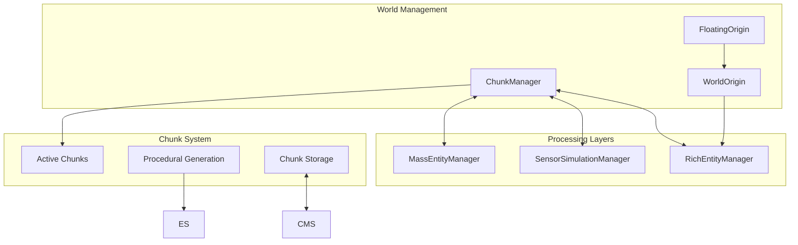
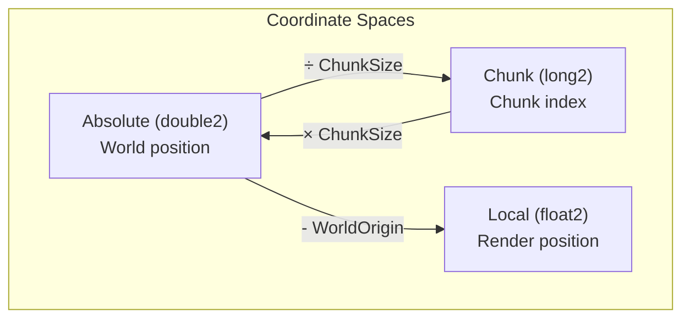
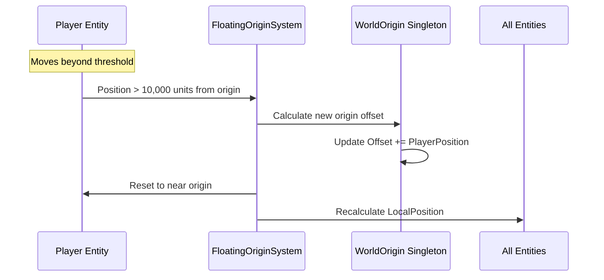
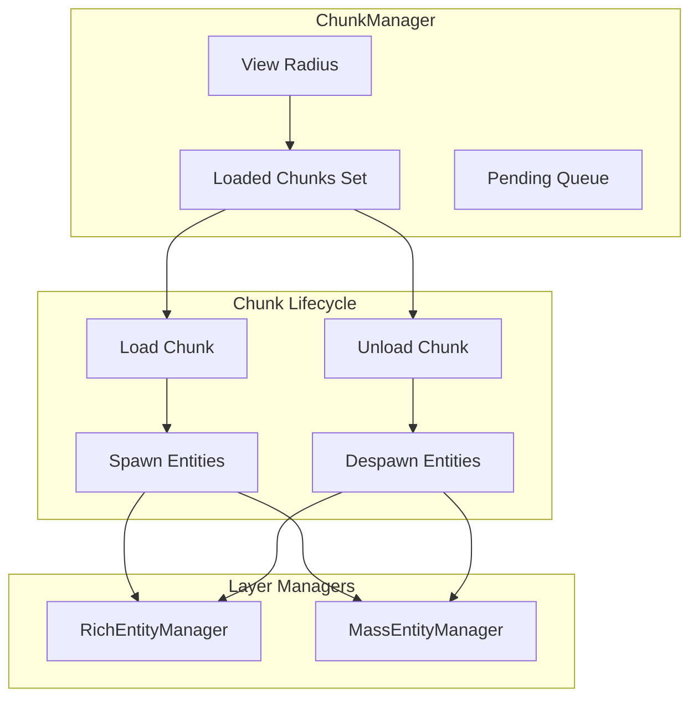
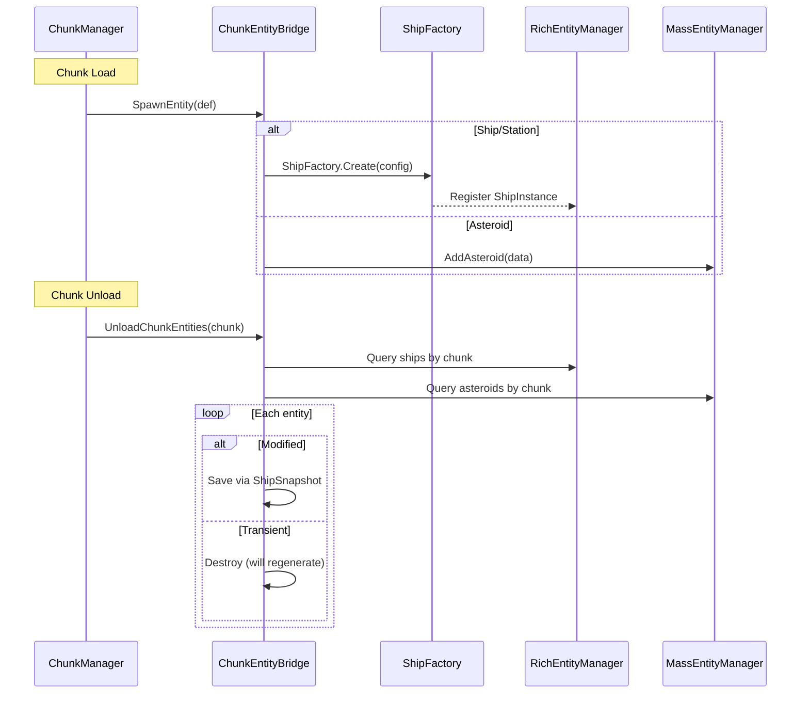
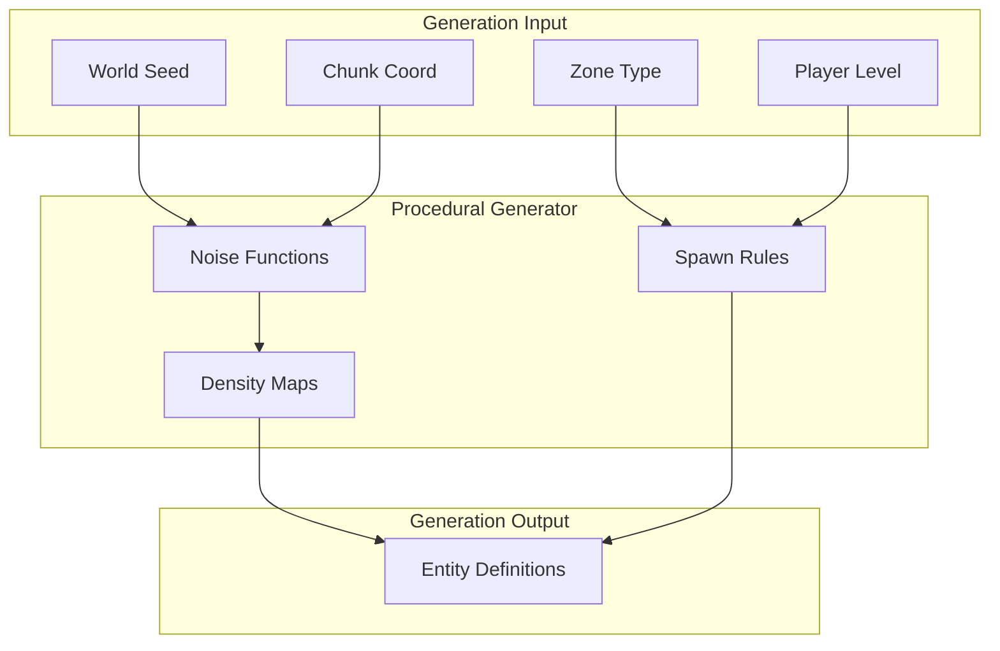
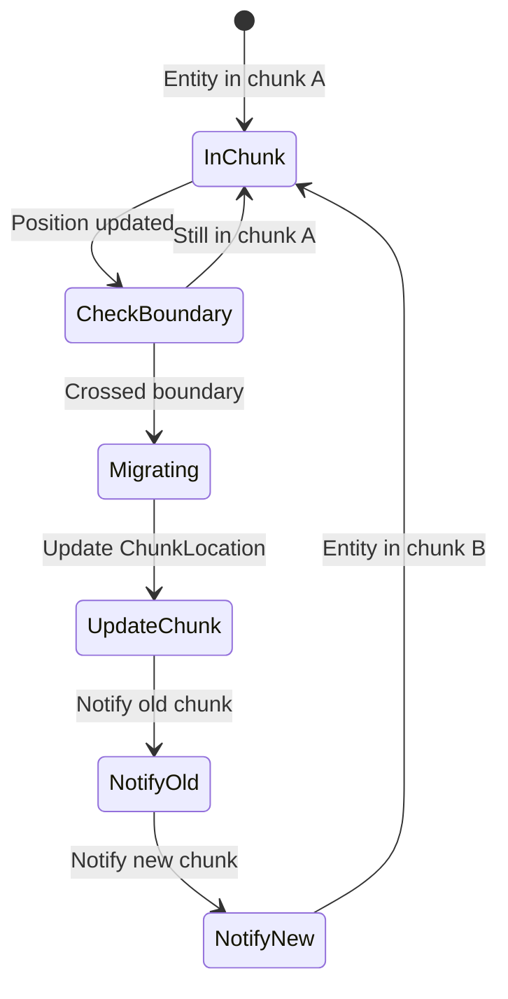
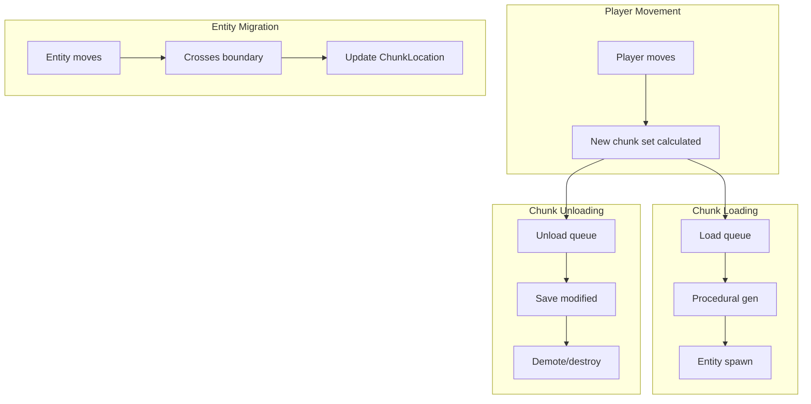

# Chunk Integration

This document defines how the world chunk system integrates with the layer architecture, handling spatial partitioning, entity spawning/despawning, and floating origin management.

> **Architecture Note:** In the hybrid architecture, the ChunkManager coordinates with all three layers. When a chunk loads, it spawns entities into the appropriate layer based on distance: Rich layer (close), Sensor layer (medium), Strategic layer (far). When a chunk unloads, entities are serialized via ShipSnapshot and stored or demoted. The floating origin system applies to all layers uniformly.

---

## Overview



---

## Chunk Coordinate System



### ChunkCoord

```csharp
public struct ChunkCoord
{
    public long ChunkX;
    public long ChunkY;

    public long OriginChunkX;
    public long OriginChunkY;
}
```

Each `ShipInstance` tracks its own `ChunkCoord` as a field. Mass layer entities (asteroids, projectiles) store chunk coordinates inline in their `NativeArray` data structs.

### Conversion Helpers

```csharp
public static class ChunkCoordExtensions
{
    public const double ChunkSize = 1000.0;  // World units per chunk

    public static (long x, long y) ToChunkCoord(double2 absolutePos)
    {
        return (
            (long)Math.Floor(absolutePos.x / ChunkSize),
            (long)Math.Floor(absolutePos.y / ChunkSize)
        );
    }

    public static double2 ChunkCenter(long chunkX, long chunkY)
    {
        return new double2(
            (chunkX + 0.5) * ChunkSize,
            (chunkY + 0.5) * ChunkSize
        );
    }
}
```

---

## Floating Origin System

Large worlds require floating origin to prevent floating-point precision loss.



### WorldOrigin Service

`WorldOrigin` is a global service (see [[00-overview#Global Services]]) that tracks the accumulated floating origin offset:

```csharp
public class WorldOrigin
{
    public double2 Offset { get; private set; }

    private const double RebaseThreshold = 10000.0;

    public void CheckRebase(double2 playerAbsolutePosition)
    {
        double distSq = math.lengthsq(playerAbsolutePosition);
        if (distSq > RebaseThreshold * RebaseThreshold)
            Rebase(playerAbsolutePosition);
    }

    private void Rebase(double2 playerAbsolute)
    {
        Offset += playerAbsolute;

        // Rich layer: iterate ships and shift AbsolutePosition
        foreach (var ship in RichEntityManager.Ships)
        {
            ship.AbsolutePosition -= playerAbsolute;
        }

        // Mass layer: shift NativeArray positions via Burst job
        MassEntityManager.ShiftAllPositions(playerAbsolute);
    }
}
```

`EnvironmentManager.Update()` calls `WorldOrigin.CheckRebase()` each frame with the player's current position. The rebase shifts Rich layer entities in a managed loop and Mass layer entities via a Burst job (appropriate for thousands of asteroids/projectiles).

### Player Death and Respawn

When the player entity is destroyed:

1. **WorldOrigin:** Suspends origin updates (no player to track)
2. **GameManager:** Retains last known player position until respawn
3. **ChunkManager:** Freezes chunk loading around last position
4. **TierManager:** All entities retain current tier (no distance recalculation)

On respawn:

1. **Spawn at checkpoint/station:** New player entity created at spawn point
2. **Update PlayerPosition singleton:** New position set
3. **Origin rebase if needed:** If spawn point is far (>10k units) from current origin
4. **Resume normal systems:** Chunk loading, tier calculation resume

**Edge case - Teleport/Non-continuous movement:** If player teleports (e.g., via warp gate or debug command), the system must:
- Load destination chunks before teleport completes
- Unload origin chunks after teleport
- Perform origin rebase if destination is far from current origin

### Local Position Calculation

For Rich layer entities, local position is derived directly from `AbsolutePosition` (which is already rebased):

```csharp
// Rich layer - PresentationManager syncs to Transform:
localPosition = new float2((float)ship.AbsolutePosition.x, (float)ship.AbsolutePosition.y);
```

For Mass layer entities, a Burst job updates local positions across the NativeArrays:

```csharp
[BurstCompile]
struct UpdateMassLocalPositionJob : IJobParallelFor
{
    [ReadOnly] public NativeArray<double2> AbsolutePositions;
    public NativeArray<float2> LocalPositions;

    public void Execute(int index)
    {
        LocalPositions[index] = new float2(
            (float)AbsolutePositions[index].x,
            (float)AbsolutePositions[index].y);
    }
}
```

---

## Chunk Manager

The `ChunkManager` orchestrates chunk loading/unloading and coordinates with the layer managers.



### ChunkManager Implementation

```csharp
public class ChunkManager
{
    private readonly int _viewRadiusChunks = 5;
    private readonly int _loadBatchSize = 4;
    private readonly int _unloadBatchSize = 2;

    private readonly HashSet<(long, long)> _loadedChunks = new();
    private readonly Queue<(long, long)> _loadQueue = new();
    private readonly Queue<(long, long)> _unloadQueue = new();

    private readonly HashSet<(long, long)> _pendingLoads = new();
    private readonly HashSet<(long, long)> _pendingUnloads = new();

    private readonly RichEntityManager _richEntityManager;
    private readonly MassEntityManager _massEntityManager;
    private readonly ChunkEntityBridge _bridge;

    public bool SpawningEnabled { get; set; } = true;

    public void Update()
    {
        var playerChunk = GetPlayerChunk();
        UpdateChunkQueues(playerChunk);
        ProcessLoadQueue();
        ProcessUnloadQueue();
    }

    private (long, long) GetPlayerChunk()
    {
        var playerPos = GetPlayerAbsolutePosition();
        return ChunkCoordExtensions.ToChunkCoord(playerPos);
    }

    private void UpdateChunkQueues((long, long) centerChunk)
    {
        // Determine which chunks should be loaded
        var targetChunks = new HashSet<(long, long)>();

        for (long dx = -_viewRadiusChunks; dx <= _viewRadiusChunks; dx++)
        {
            for (long dy = -_viewRadiusChunks; dy <= _viewRadiusChunks; dy++)
            {
                targetChunks.Add((centerChunk.Item1 + dx, centerChunk.Item2 + dy));
            }
        }

        // Queue chunks to load (O(1) lookup via HashSet instead of O(n) Queue.Contains)
        foreach (var chunk in targetChunks)
        {
            if (!_loadedChunks.Contains(chunk) && !_pendingLoads.Contains(chunk))
            {
                _loadQueue.Enqueue(chunk);
                _pendingLoads.Add(chunk);
            }
        }

        // Queue chunks to unload (O(1) lookup)
        foreach (var chunk in _loadedChunks)
        {
            if (!targetChunks.Contains(chunk) && !_pendingUnloads.Contains(chunk))
            {
                _unloadQueue.Enqueue(chunk);
                _pendingUnloads.Add(chunk);
            }
        }
    }

    private void ProcessLoadQueue()
    {
        int processed = 0;
        while (_loadQueue.Count > 0 && processed < _loadBatchSize)
        {
            var chunk = _loadQueue.Dequeue();
            _pendingLoads.Remove(chunk);  // Maintain parallel HashSet
            LoadChunk(chunk);
            processed++;
        }
    }

    private void LoadChunk((long, long) chunk)
    {
        _loadedChunks.Add(chunk);

        if (!SpawningEnabled) return;

        var entities = ProceduralGenerator.GenerateChunkEntities(chunk);

        foreach (var entityDef in entities)
        {
            _bridge.SpawnEntity(entityDef);
        }
    }

    private void ProcessUnloadQueue()
    {
        // PERFORMANCE: Dynamic batch size based on queue depth.
        // If player warps quickly through many chunks, queue can back up.
        // Increase batch size to prevent backlog.
        int dynamicBatchSize = _unloadQueue.Count switch
        {
            > 20 => 8,   // Large backlog, process faster
            > 10 => 4,   // Moderate backlog
            _ => _unloadBatchSize  // Normal (default: 2)
        };

        int processed = 0;
        while (_unloadQueue.Count > 0 && processed < dynamicBatchSize)
        {
            var chunk = _unloadQueue.Dequeue();
            _pendingUnloads.Remove(chunk);  // Maintain parallel HashSet
            UnloadChunk(chunk);
            processed++;
        }
    }

    private void UnloadChunk((long, long) chunk)
    {
        _loadedChunks.Remove(chunk);

        // Move entities to background simulation or despawn
        _bridge.UnloadChunkEntities(chunk);
    }
}
```

---

## Chunk Entity Bridge

Routes entity spawning/despawning to the appropriate layer manager based on entity type.



### ChunkEntityBridge Implementation

```csharp
public class ChunkEntityBridge
{
    private readonly RichEntityManager _richEntityManager;
    private readonly MassEntityManager _massEntityManager;
    private readonly TierManager _tierManager;
    private readonly ConfigRegistry _configs;

    public void SpawnEntity(ProceduralEntityDef def)
    {
        switch (def.Type)
        {
            case EntityType.Asteroid:
                _massEntityManager.AddAsteroid(new AsteroidData
                {
                    Position = def.Position,
                    Velocity = def.Velocity,
                    Variant = def.Variant,
                    Seed = def.Seed,
                    Source = def.AsteroidSource,
                    Mass = def.Mass,
                    Radius = def.Radius,
                    ChunkX = def.ChunkX,
                    ChunkY = def.ChunkY
                });
                break;

            case EntityType.Ship:
                var shipConfig = _configs.GetShipConfig(def.ArchetypeId);
                var ship = ShipFactory.Create(shipConfig, def.Position, def.FactionId);
                ship.ChunkCoord = new ChunkCoord
                {
                    ChunkX = def.ChunkX, ChunkY = def.ChunkY,
                    OriginChunkX = def.ChunkX, OriginChunkY = def.ChunkY
                };
                _richEntityManager.Register(ship);
                break;

            case EntityType.Station:
                var stationConfig = _configs.GetStationConfig(def.ArchetypeId);
                var station = StationFactory.Create(stationConfig, def.Position, def.FactionId);
                _richEntityManager.Register(station);
                break;
        }
    }

    public void UnloadChunkEntities((long, long) chunk)
    {
        var shipsInChunk = _richEntityManager.GetShipsInChunk(chunk);

        foreach (var ship in shipsInChunk)
        {
            if (ship.HasBeenModified)
                ShipSnapshot.Save(ship);

            DemoteOrDestroy(ship);
        }

        _massEntityManager.RemoveAsteroidsInChunk(chunk);
    }

    private void DemoteOrDestroy(ShipInstance ship)
    {
        switch (ship.PersistenceLevel)
        {
            case EntityPersistence.Transient:
                _richEntityManager.Destroy(ship);
                break;

            case EntityPersistence.Persistent:
                _tierManager.ForceTier(ship, 4);
                break;

            case EntityPersistence.Critical:
                _tierManager.ForceTier(ship, 2);
                break;
        }
    }
}
```

---

## Procedural Generation Integration



### ProceduralGenerator

```csharp
public static class ProceduralGenerator
{
    public static List<ProceduralEntityDef> GenerateChunkEntities((long, long) chunk)
    {
        var defs = new List<ProceduralEntityDef>();
        var random = new Unity.Mathematics.Random(ChunkSeed(chunk));

        // Get zone type for this chunk
        var zone = WorldFabric.GetZoneType(chunk);

        // Generate based on zone
        switch (zone)
        {
            case ZoneType.AsteroidBelt:
                GenerateAsteroids(chunk, ref random, defs);
                break;
            case ZoneType.Nebula:
                GenerateNebula(chunk, ref random, defs);
                break;
            case ZoneType.TradeRoute:
                GenerateTradeRoute(chunk, ref random, defs);
                break;
            // etc.
        }

        return defs;
    }

    private static void GenerateAsteroids(
        (long, long) chunk,
        ref Unity.Mathematics.Random random,
        List<ProceduralEntityDef> defs)
    {
        var chunkCenter = ChunkCoordExtensions.ChunkCenter(chunk.Item1, chunk.Item2);
        int count = random.NextInt(10, 50);

        for (int i = 0; i < count; i++)
        {
            var offset = random.NextDouble2(-500, 500);
            var velocity = random.NextDouble2(-5, 5);

            defs.Add(new ProceduralEntityDef
            {
                Type = EntityType.Asteroid,
                ChunkX = chunk.Item1,
                ChunkY = chunk.Item2,
                Position = chunkCenter + offset,
                Velocity = velocity,
                Variant = random.NextInt(0, 5),
                Seed = random.NextFloat(),
                Mass = random.NextFloat(10, 1000),
                Radius = random.NextFloat(1, 10),
                AsteroidSource = AsteroidSource.Belt
            });
        }
    }

    private static uint ChunkSeed((long, long) chunk)
    {
        // Deterministic seed from chunk coordinates + world seed
        return (uint)(WorldSettings.Seed ^
            (chunk.Item1 * 73856093) ^
            (chunk.Item2 * 19349663));
    }
}
```

---

## Chunk Migration System

Handles entities moving between chunks.



### Chunk Migration

`ChunkManager` handles entity migration between chunks as a managed method called each frame:

**EDGE CASE:** Fast entities (missiles, projectiles, entities in warp) can skip multiple chunks in a single frame. The system handles this by calculating all intermediate chunks and firing events for each.

```csharp
// In ChunkManager:
public void UpdateMigration()
{
    // Rich layer: iterate ships and check chunk boundaries
    foreach (var ship in _richEntityManager.Ships)
    {
        var currentChunk = ChunkCoordExtensions.ToChunkCoord(ship.AbsolutePosition);

        if (currentChunk.x != ship.ChunkCoord.ChunkX ||
            currentChunk.y != ship.ChunkCoord.ChunkY)
        {
            long2 oldChunk = new long2(ship.ChunkCoord.ChunkX, ship.ChunkCoord.ChunkY);
            long2 newChunk = new long2(currentChunk.x, currentChunk.y);

            ship.ChunkCoord = new ChunkCoord
            {
                ChunkX = currentChunk.x,
                ChunkY = currentChunk.y,
                OriginChunkX = ship.ChunkCoord.OriginChunkX,
                OriginChunkY = ship.ChunkCoord.OriginChunkY
            };

            GameEventBus.Raise(new ChunkBoundaryEvent(ship.EntityId, oldChunk, newChunk));
        }
    }

    // Mass layer: Burst job checks asteroid chunk boundaries
    _massEntityManager.UpdateChunkMigration();
}
```

### ChunkBoundaryEvent

```csharp
public struct ChunkBoundaryEvent
{
    public int EntityId;
    public long2 OldChunk;
    public long2 NewChunk;
}
```

Mass layer migration uses a Burst job since there may be thousands of asteroids, while Rich layer migration iterates the managed ship collection directly.

---

## Visual Sync

Visual synchronization between entity data and Unity GameObjects is handled by `PresentationManager`, which manages Tier 0 entities with active GameObjects. See [[02-system-architecture#8. PresentationManager]] for the full visual sync pipeline including:

- ShipView promotion/demotion (pooled GameObjects)
- Transform sync from `ShipInstance.AbsolutePosition` to `Transform`
- Damage effect state sync
- Sprite/animation state updates

---

## Chunk Data Flow Summary



---

## Performance Considerations

| Operation | Target Time | Notes |
|-----------|-------------|-------|
| Chunk Load | <50ms | Batch entity creation |
| Chunk Unload | <10ms | Fast despawn, async save |
| Migration Check | <0.5ms | Per-frame distance check |
| Transform Sync | <1ms | PresentationManager |

---

## Modding Integration

Chunk and procedural generation provide key modding extension points:

- **Zone configurations** and spawn rules are moddable via JSON (see [[05-configuration-layer]]). Mods can define new zone types with custom density maps and entity distributions.
- **Chunk load events** (`OnChunkLoaded`, `OnChunkUnloaded`) are dispatched to Lua via GameEventBus, enabling scripts to react to world streaming.
- **Procedural generation** uses seed-based determinism, so mod-defined zones produce consistent results across sessions.

```lua
starfire.on("chunk_loaded", function(chunk)
    if chunk.zone_type == "nebula" then
        -- Spawn mod-specific content in nebula chunks
    end
end)
```

---

## Related Documentation

- [[01-component-model]] - Component definitions
- [[02-system-architecture]] - Manager pipeline, PresentationManager
- [[03-tiered-simulation]] - Tier system details
- [[07-warp-system]] - Warp mode chunk handling
- [[12-modding-architecture]] - Lua event hooks and JSON zone configs
