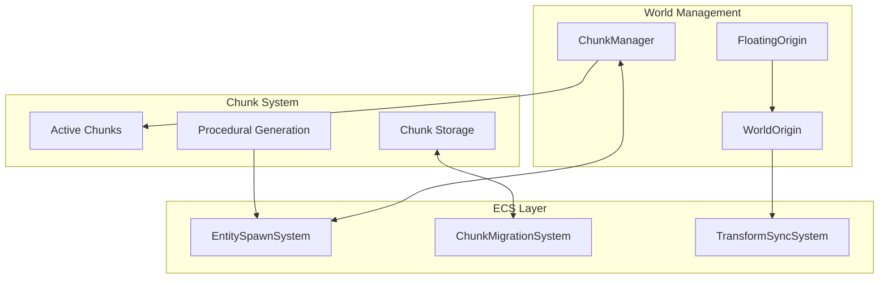
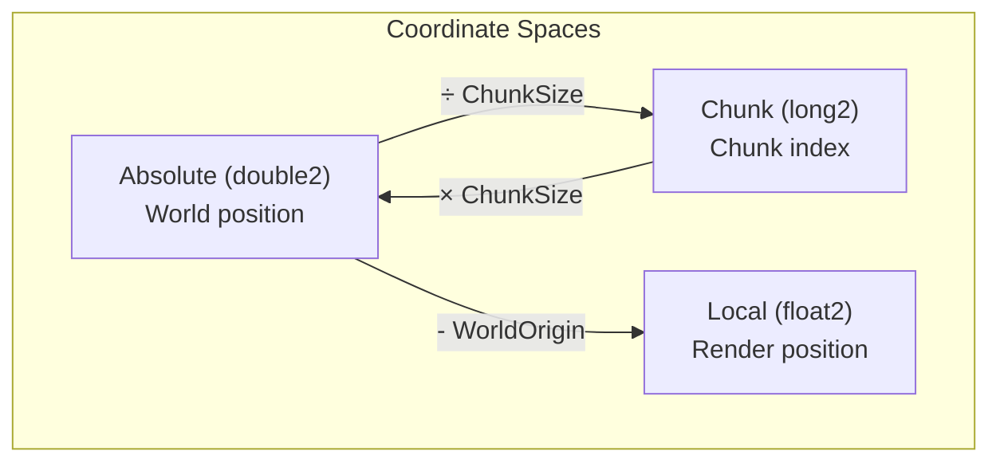
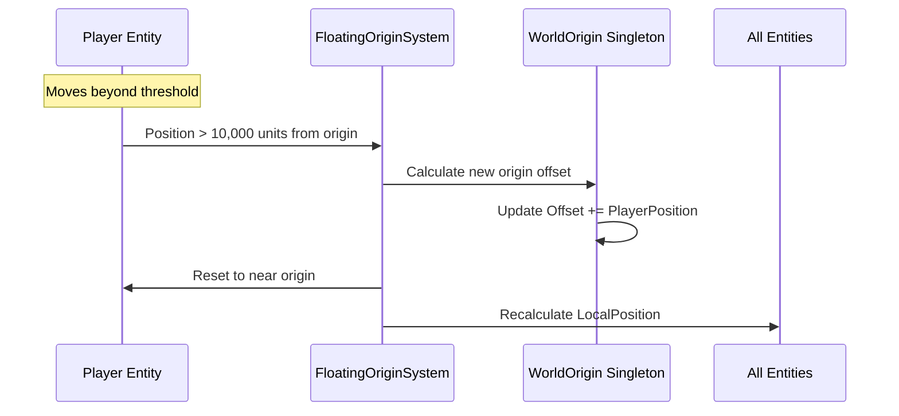
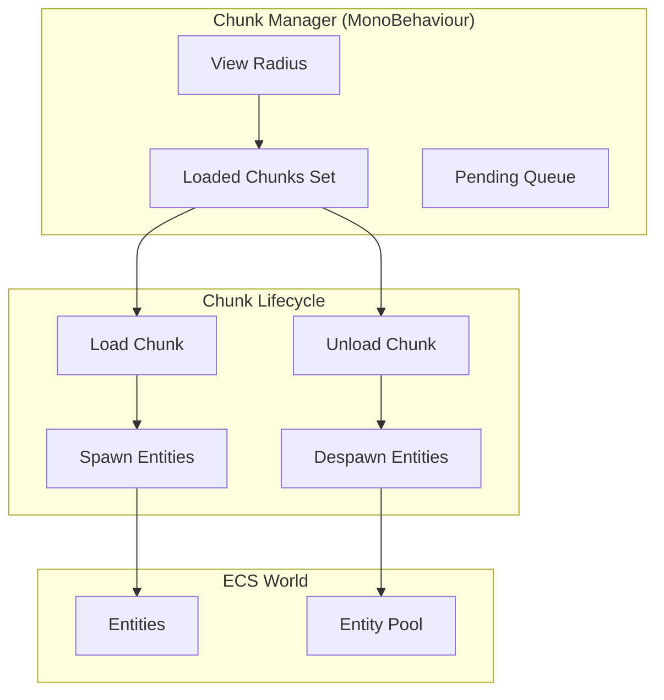
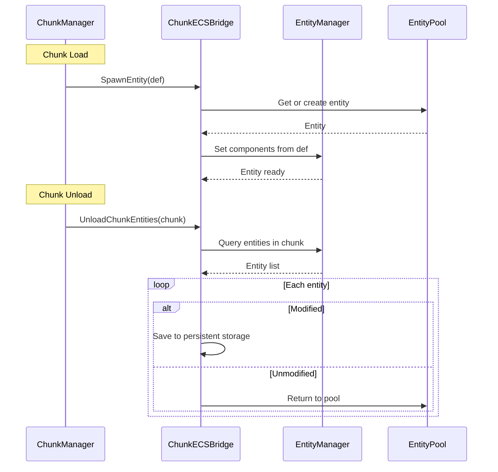
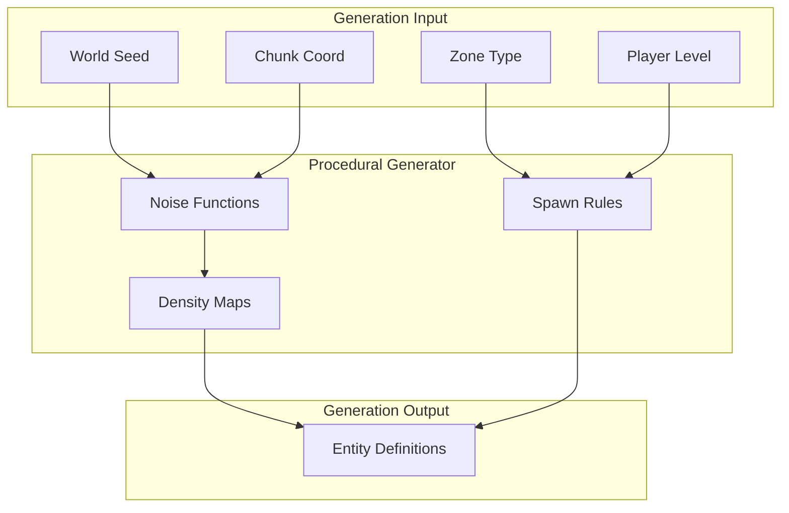
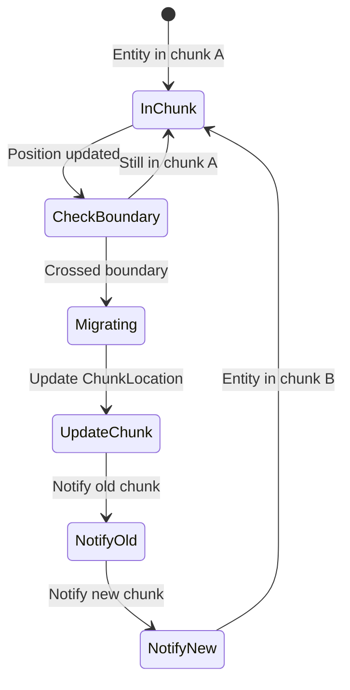
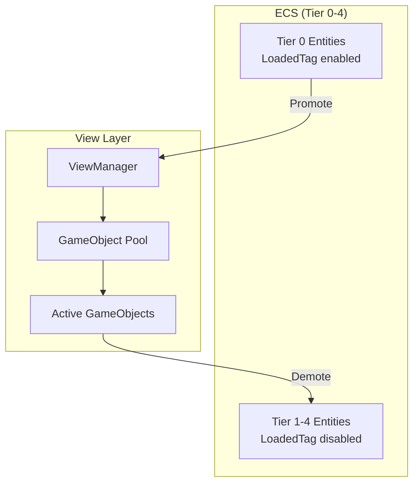
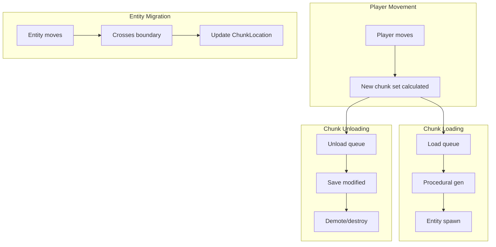

# Chunk Integration

This document defines how the world chunk system integrates with the ECS architecture, handling spatial partitioning, entity spawning/despawning, and floating origin management.

---

## Overview



---

## Chunk Coordinate System



### ChunkCoord Component

```csharp
public struct ChunkLocation : IComponentData
{
    // Current chunk (changes as entity moves)
    public long ChunkX;
    public long ChunkY;

    // Origin chunk (where entity was spawned - for procedural regeneration)
    public long OriginChunkX;
    public long OriginChunkY;
}

// Conversion helpers
public static class ChunkCoordExtensions
{
    public const double ChunkSize = 1000.0;  // World units per chunk

    public static (long x, long y) ToChunkCoord(double2 absolutePos)
    {
        return (
            (long)Math.Floor(absolutePos.x / ChunkSize),
            (long)Math.Floor(absolutePos.y / ChunkSize)
        );
    }

    public static double2 ChunkCenter(long chunkX, long chunkY)
    {
        return new double2(
            (chunkX + 0.5) * ChunkSize,
            (chunkY + 0.5) * ChunkSize
        );
    }
}
```

---

## Floating Origin System

Large worlds require floating origin to prevent floating-point precision loss.



### WorldOrigin Singleton

```csharp
// Singleton component - only one in world
public struct WorldOrigin : IComponentData
{
    public double2 Offset;  // Accumulated offset from true (0,0)
}

// System that manages floating origin
[UpdateInGroup(typeof(SimulationSystemGroup))]
[UpdateBefore(typeof(PhysicsIntegrationSystem))]
public partial struct FloatingOriginSystem : ISystem
{
    private const double RebaseThreshold = 10000.0;

    [BurstCompile]
    public void OnUpdate(ref SystemState state)
    {
        // Get player position
        var playerPos = SystemAPI.GetSingleton<PlayerPosition>();

        // Check if rebase needed
        double distSq = playerPos.Absolute.x * playerPos.Absolute.x +
                        playerPos.Absolute.y * playerPos.Absolute.y;

        if (distSq > RebaseThreshold * RebaseThreshold)
        {
            RebaseOrigin(ref state, playerPos.Absolute);
        }
    }

    private void RebaseOrigin(ref SystemState state, double2 playerAbsolute)
    {
        // Update world origin singleton
        var worldOrigin = SystemAPI.GetSingletonRW<WorldOrigin>();
        worldOrigin.ValueRW.Offset += playerAbsolute;

        // Shift all absolute positions
        foreach (var (absPos, localPos) in
            SystemAPI.Query<RefRW<AbsolutePosition>, RefRW<LocalPosition>>())
        {
            // Shift absolute position relative to new origin
            absPos.ValueRW.X -= playerAbsolute.x;
            absPos.ValueRW.Y -= playerAbsolute.y;

            // Recalculate local position
            localPos.ValueRW.Value = new float2(
                (float)absPos.ValueRO.X,
                (float)absPos.ValueRO.Y
            );
        }
    }
}
```

### Player Death and Respawn

When the player entity is destroyed:

1. **FloatingOriginSystem:** Suspends origin updates (no player to track)
2. **PlayerPosition singleton:** Retains last known position until respawn
3. **ChunkManager:** Freezes chunk loading around last position
4. **TierSystem:** All entities retain current tier (no distance recalculation)

On respawn:

1. **Spawn at checkpoint/station:** New player entity created at spawn point
2. **Update PlayerPosition singleton:** New position set
3. **Origin rebase if needed:** If spawn point is far (>10k units) from current origin
4. **Resume normal systems:** Chunk loading, tier calculation resume

**Edge case - Teleport/Non-continuous movement:** If player teleports (e.g., via warp gate or debug command), the system must:
- Load destination chunks before teleport completes
- Unload origin chunks after teleport
- Perform origin rebase if destination is far from current origin

### Local Position Calculation

```csharp
[BurstCompile]
partial struct UpdateLocalPositionJob : IJobEntity
{
    [ReadOnly] public double2 WorldOriginOffset;

    void Execute(in AbsolutePosition abs, ref LocalPosition local)
    {
        // LocalPosition = AbsolutePosition - WorldOrigin
        // But WorldOrigin is already factored into AbsolutePosition after rebase
        local.Value = new float2((float)abs.X, (float)abs.Y);
    }
}
```

---

## Chunk Manager Bridge

The ChunkManager orchestrates chunk loading/unloading and communicates with ECS.



### ChunkManager Implementation

```csharp
public class ChunkManager : MonoBehaviour
{
    [SerializeField] private int _viewRadiusChunks = 5;
    [SerializeField] private int _loadBatchSize = 4;
    [SerializeField] private int _unloadBatchSize = 2;  // Batch unloads to prevent frame spikes

    private HashSet<(long, long)> _loadedChunks;
    private Queue<(long, long)> _loadQueue;
    private Queue<(long, long)> _unloadQueue;

    // PERFORMANCE: Parallel HashSets to avoid O(n) Queue.Contains() calls
    private HashSet<(long, long)> _pendingLoads;
    private HashSet<(long, long)> _pendingUnloads;

    private World _ecsWorld;
    private EntityManager _entityManager;
    private ChunkECSBridge _bridge;

    void Start()
    {
        _ecsWorld = World.DefaultGameObjectInjectionWorld;
        _entityManager = _ecsWorld.EntityManager;
        _bridge = new ChunkECSBridge(_entityManager, _ecsWorld);
        _loadedChunks = new HashSet<(long, long)>();
        _loadQueue = new Queue<(long, long)>();
        _unloadQueue = new Queue<(long, long)>();
        _pendingLoads = new HashSet<(long, long)>();
        _pendingUnloads = new HashSet<(long, long)>();
    }

    void Update()
    {
        var playerChunk = GetPlayerChunk();
        UpdateChunkQueues(playerChunk);
        ProcessLoadQueue();
        ProcessUnloadQueue();
    }

    private (long, long) GetPlayerChunk()
    {
        var playerPos = GetPlayerAbsolutePosition();
        return ChunkCoordExtensions.ToChunkCoord(playerPos);
    }

    private void UpdateChunkQueues((long, long) centerChunk)
    {
        // Determine which chunks should be loaded
        var targetChunks = new HashSet<(long, long)>();

        for (long dx = -_viewRadiusChunks; dx <= _viewRadiusChunks; dx++)
        {
            for (long dy = -_viewRadiusChunks; dy <= _viewRadiusChunks; dy++)
            {
                targetChunks.Add((centerChunk.Item1 + dx, centerChunk.Item2 + dy));
            }
        }

        // Queue chunks to load (O(1) lookup via HashSet instead of O(n) Queue.Contains)
        foreach (var chunk in targetChunks)
        {
            if (!_loadedChunks.Contains(chunk) && !_pendingLoads.Contains(chunk))
            {
                _loadQueue.Enqueue(chunk);
                _pendingLoads.Add(chunk);
            }
        }

        // Queue chunks to unload (O(1) lookup)
        foreach (var chunk in _loadedChunks)
        {
            if (!targetChunks.Contains(chunk) && !_pendingUnloads.Contains(chunk))
            {
                _unloadQueue.Enqueue(chunk);
                _pendingUnloads.Add(chunk);
            }
        }
    }

    private void ProcessLoadQueue()
    {
        int processed = 0;
        while (_loadQueue.Count > 0 && processed < _loadBatchSize)
        {
            var chunk = _loadQueue.Dequeue();
            _pendingLoads.Remove(chunk);  // Maintain parallel HashSet
            LoadChunk(chunk);
            processed++;
        }
    }

    private void LoadChunk((long, long) chunk)
    {
        _loadedChunks.Add(chunk);

        // Generate procedural content
        var entities = ProceduralGenerator.GenerateChunkEntities(chunk);

        // Spawn into ECS
        foreach (var entityDef in entities)
        {
            _bridge.SpawnEntity(entityDef);
        }
    }

    private void ProcessUnloadQueue()
    {
        // PERFORMANCE: Dynamic batch size based on queue depth.
        // If player warps quickly through many chunks, queue can back up.
        // Increase batch size to prevent backlog.
        int dynamicBatchSize = _unloadQueue.Count switch
        {
            > 20 => 8,   // Large backlog, process faster
            > 10 => 4,   // Moderate backlog
            _ => _unloadBatchSize  // Normal (default: 2)
        };

        int processed = 0;
        while (_unloadQueue.Count > 0 && processed < dynamicBatchSize)
        {
            var chunk = _unloadQueue.Dequeue();
            _pendingUnloads.Remove(chunk);  // Maintain parallel HashSet
            UnloadChunk(chunk);
            processed++;
        }
    }

    private void UnloadChunk((long, long) chunk)
    {
        _loadedChunks.Remove(chunk);

        // Move entities to background simulation or despawn
        _bridge.UnloadChunkEntities(chunk);
    }
}
```

---

## Chunk-ECS Bridge

Handles communication between chunk system and ECS.



### ChunkECSBridge Implementation

**IMPORTANT:** The bridge must use `EntityCommandBuffer` for deferred operations to avoid race conditions with scheduled ECS jobs.

```csharp
public class ChunkECSBridge
{
    private EntityManager _em;
    private EntityQuery _chunkQuery;
    private ConfigRegistry _configs;

    // Thread-safe command buffer for deferred entity operations
    private EntityCommandBufferSystem _ecbSystem;

    public ChunkECSBridge(EntityManager em, World world)
    {
        _em = em;
        _chunkQuery = em.CreateEntityQuery(
            typeof(ChunkLocation),
            typeof(AbsolutePosition)
        );
        // Get the ECB system for safe deferred operations
        _ecbSystem = world.GetOrCreateSystemManaged<EndSimulationEntityCommandBufferSystem>();
    }

    /// <summary>
    /// Must be called before any direct EntityManager access.
    /// Ensures all scheduled jobs complete first.
    /// </summary>
    private void EnsureJobsComplete()
    {
        _em.CompleteAllTrackedJobs();
    }

    public Entity SpawnEntity(ProceduralEntityDef def)
    {
        Entity entity;

        switch (def.Type)
        {
            case EntityType.Asteroid:
                entity = SpawnAsteroid(def);
                break;
            case EntityType.Ship:
                entity = SpawnShip(def);
                break;
            case EntityType.Station:
                entity = SpawnStation(def);
                break;
            default:
                throw new ArgumentException($"Unknown entity type: {def.Type}");
        }

        // Set common components
        _em.SetComponentData(entity, new ChunkLocation
        {
            ChunkX = def.ChunkX,
            ChunkY = def.ChunkY,
            OriginChunkX = def.ChunkX,
            OriginChunkY = def.ChunkY
        });

        _em.SetComponentData(entity, new AbsolutePosition
        {
            X = def.Position.x,
            Y = def.Position.y
        });

        return entity;
    }

    private Entity SpawnAsteroid(ProceduralEntityDef def)
    {
        var entity = EntityArchetypeFactory.CreateEntity(_em, "Asteroid");

        _em.SetComponentData(entity, new AsteroidData
        {
            Variant = def.Variant,
            Seed = def.Seed,
            Source = def.AsteroidSource,
            ResourceValue = def.ResourceValue
        });

        _em.SetComponentData(entity, new PhysicsBody
        {
            Mass = def.Mass,
            Radius = def.Radius,
            Drag = 0.1f
        });

        _em.SetComponentData(entity, new Velocity
        {
            X = def.Velocity.x,
            Y = def.Velocity.y
        });

        return entity;
    }

    private Entity SpawnShip(ProceduralEntityDef def)
    {
        return EntitySpawner.SpawnShip(
            _em,
            _configs,
            new FixedString64Bytes(def.ArchetypeId),
            def.Position,
            new FixedString32Bytes(def.FactionId)
        );
    }

    public void UnloadChunkEntities((long, long) chunk)
    {
        // IMPORTANT: Ensure all jobs are complete before direct EntityManager access
        EnsureJobsComplete();

        var entities = new NativeList<Entity>(Allocator.Temp);

        // Find all entities in this chunk using EntityQuery (not SystemAPI which is ISystem-only)
        var allEntities = _chunkQuery.ToEntityArray(Allocator.Temp);
        var chunkLocations = _chunkQuery.ToComponentDataArray<ChunkLocation>(Allocator.Temp);

        for (int i = 0; i < allEntities.Length; i++)
        {
            if (chunkLocations[i].ChunkX == chunk.Item1 &&
                chunkLocations[i].ChunkY == chunk.Item2)
            {
                entities.Add(allEntities[i]);
            }
        }

        allEntities.Dispose();
        chunkLocations.Dispose();

        // Process each entity
        foreach (var entity in entities)
        {
            var persistence = _em.GetComponentData<EntityPersistenceData>(entity);

            if (_em.HasComponent<HasBeenModified>(entity))
            {
                // Save modified entity state
                SaveModifiedEntity(entity);
            }

            // Demote to higher tier or destroy
            DemoteOrDestroy(entity, persistence.Level);
        }

        entities.Dispose();
    }

    private void DemoteOrDestroy(Entity entity, EntityPersistence level)
    {
        switch (level)
        {
            case EntityPersistence.Transient:
                // Can be safely destroyed (will regenerate)
                _em.DestroyEntity(entity);
                break;

            case EntityPersistence.Persistent:
                // Move to Tier 4 (dormant)
                _em.SetComponentEnabled<LoadedTag>(entity, false);
                _em.SetComponentEnabled<ActiveTag>(entity, false);
                _em.SetComponentEnabled<TacticalTag>(entity, false);
                _em.SetComponentEnabled<StrategicTag>(entity, false);
                _em.SetComponentEnabled<DormantTag>(entity, true);
                break;

            case EntityPersistence.Critical:
                // Never unload - keep in simulation
                // Just disable view (LoadedTag)
                _em.SetComponentEnabled<LoadedTag>(entity, false);
                break;
        }
    }
}
```

---

## Procedural Generation Integration



### ProceduralGenerator

```csharp
public static class ProceduralGenerator
{
    public static List<ProceduralEntityDef> GenerateChunkEntities((long, long) chunk)
    {
        var defs = new List<ProceduralEntityDef>();
        var random = new Unity.Mathematics.Random(ChunkSeed(chunk));

        // Get zone type for this chunk
        var zone = WorldFabric.GetZoneType(chunk);

        // Generate based on zone
        switch (zone)
        {
            case ZoneType.AsteroidBelt:
                GenerateAsteroids(chunk, ref random, defs);
                break;
            case ZoneType.Nebula:
                GenerateNebula(chunk, ref random, defs);
                break;
            case ZoneType.TradeRoute:
                GenerateTradeRoute(chunk, ref random, defs);
                break;
            // etc.
        }

        return defs;
    }

    private static void GenerateAsteroids(
        (long, long) chunk,
        ref Unity.Mathematics.Random random,
        List<ProceduralEntityDef> defs)
    {
        var chunkCenter = ChunkCoordExtensions.ChunkCenter(chunk.Item1, chunk.Item2);
        int count = random.NextInt(10, 50);

        for (int i = 0; i < count; i++)
        {
            var offset = random.NextDouble2(-500, 500);
            var velocity = random.NextDouble2(-5, 5);

            defs.Add(new ProceduralEntityDef
            {
                Type = EntityType.Asteroid,
                ChunkX = chunk.Item1,
                ChunkY = chunk.Item2,
                Position = chunkCenter + offset,
                Velocity = velocity,
                Variant = random.NextInt(0, 5),
                Seed = random.NextFloat(),
                Mass = random.NextFloat(10, 1000),
                Radius = random.NextFloat(1, 10),
                AsteroidSource = AsteroidSource.Belt
            });
        }
    }

    private static uint ChunkSeed((long, long) chunk)
    {
        // Deterministic seed from chunk coordinates + world seed
        return (uint)(WorldSettings.Seed ^
            (chunk.Item1 * 73856093) ^
            (chunk.Item2 * 19349663));
    }
}
```

---

## Chunk Migration System

Handles entities moving between chunks.



### ChunkMigrationSystem

**EDGE CASE:** Fast entities (missiles, projectiles, entities in warp) can skip multiple chunks in a single frame. The system handles this by calculating all intermediate chunks and firing events for each.

```csharp
[UpdateInGroup(typeof(SimulationSystemGroup))]
[UpdateAfter(typeof(TierTransitionSystem))]
public partial struct ChunkMigrationSystem : ISystem
{
    [BurstCompile]
    public void OnUpdate(ref SystemState state)
    {
        var ecb = new EntityCommandBuffer(Allocator.Temp);

        foreach (var (absPos, chunkLoc, entity) in
            SystemAPI.Query<RefRO<AbsolutePosition>, RefRW<ChunkLocation>>()
                     .WithEntityAccess())
        {
            var currentChunk = ChunkCoordExtensions.ToChunkCoord(
                new double2(absPos.ValueRO.X, absPos.ValueRO.Y));

            // Check if entity crossed chunk boundary
            if (currentChunk.x != chunkLoc.ValueRO.ChunkX ||
                currentChunk.y != chunkLoc.ValueRO.ChunkY)
            {
                long2 oldChunk = new long2(chunkLoc.ValueRO.ChunkX, chunkLoc.ValueRO.ChunkY);
                long2 newChunk = new long2(currentChunk.x, currentChunk.y);

                // FAST ENTITY HANDLING: If entity skipped multiple chunks, fire
                // events for each intermediate chunk along the path
                var skippedChunks = CalculateIntermediateChunks(oldChunk, newChunk);
                foreach (var intermediateChunk in skippedChunks)
                {
                    var eventEntity = ecb.CreateEntity();
                    ecb.AddComponent(eventEntity, new ChunkBoundaryEvent
                    {
                        Entity = entity,
                        OldChunk = intermediateChunk.from,
                        NewChunk = intermediateChunk.to,
                        WasSkipped = true  // Flag for systems that need to know
                    });
                }

                // Update chunk location to final position
                chunkLoc.ValueRW.ChunkX = currentChunk.x;
                chunkLoc.ValueRW.ChunkY = currentChunk.y;

                // Fire final boundary event
                var finalEventEntity = ecb.CreateEntity();
                ecb.AddComponent(finalEventEntity, new ChunkBoundaryEvent
                {
                    Entity = entity,
                    OldChunk = oldChunk,
                    NewChunk = newChunk,
                    WasSkipped = false
                });
            }
        }

        ecb.Playback(state.EntityManager);
        ecb.Dispose();
    }

    /// <summary>
    /// Calculate intermediate chunks when an entity skips multiple chunks.
    /// Uses proper Bresenham line algorithm to capture ALL traversed chunks,
    /// not just diagonal steps which can skip chunks the trajectory passes through.
    /// </summary>
    private static NativeList<(long2 from, long2 to)> CalculateIntermediateChunks(
        long2 start, long2 end)
    {
        var results = new NativeList<(long2, long2)>(8, Allocator.Temp);

        // If only one chunk difference, no intermediate chunks
        long dx = math.abs(end.x - start.x);
        long dy = math.abs(end.y - start.y);
        if (dx <= 1 && dy <= 1)
            return results;

        long stepX = start.x < end.x ? 1 : -1;
        long stepY = start.y < end.y ? 1 : -1;
        long2 current = start;

        // Bresenham-style stepping to ensure all traversed chunks are captured
        long err = dx - dy;

        while (current.x != end.x || current.y != end.y)
        {
            long e2 = 2 * err;

            // Step in X direction
            if (e2 > -dy && current.x != end.x)
            {
                err -= dy;
                long2 next = new long2(current.x + stepX, current.y);
                results.Add((current, next));
                current = next;
            }

            // Step in Y direction (separate step to capture all chunks)
            if (e2 < dx && current.y != end.y)
            {
                err += dx;
                long2 next = new long2(current.x, current.y + stepY);
                results.Add((current, next));
                current = next;
            }
        }

        return results;
    }
}

public struct ChunkBoundaryEvent : IComponentData
{
    public Entity Entity;
    public long2 OldChunk;
    public long2 NewChunk;
    public bool WasSkipped;  // True if this was an intermediate chunk in a multi-chunk jump
}
```

---

## View Manager Integration

Coordinates between ECS entities and Unity GameObjects.



### ViewManager Implementation

```csharp
public class ViewManager : MonoBehaviour
{
    private Dictionary<Entity, GameObject> _activeViews;
    private Dictionary<string, GameObjectPool> _pools;

    private World _ecsWorld;
    private EntityManager _em;

    void Update()
    {
        SyncPromotions();
        SyncDemotions();
        SyncTransforms();
    }

    private void SyncPromotions()
    {
        // Find entities that just got LoadedTag enabled
        var query = _em.CreateEntityQuery(
            ComponentType.ReadOnly<LoadedTag>(),
            ComponentType.ReadOnly<AbsolutePosition>(),
            ComponentType.Exclude<ViewReference>()  // Not yet linked
        );

        var entities = query.ToEntityArray(Allocator.Temp);
        foreach (var entity in entities)
        {
            PromoteToView(entity);
        }
        entities.Dispose();
    }

    private void PromoteToView(Entity entity)
    {
        // Determine prefab from entity type
        var prefabPath = GetPrefabPath(entity);

        // Get from pool
        var go = _pools[prefabPath].Get();

        // Position
        var pos = _em.GetComponentData<AbsolutePosition>(entity);
        var rot = _em.GetComponentData<Rotation>(entity);
        go.transform.position = new Vector3((float)pos.X, (float)pos.Y, 0);
        go.transform.rotation = Quaternion.Euler(0, 0, rot.Angle);

        // Link
        _activeViews[entity] = go;
        _em.AddComponentData(entity, new ViewReference { GameObjectId = go.GetInstanceID() });

        // Initialize view components
        var entityView = go.GetComponent<EntityView>();
        entityView?.Initialize(entity, _em);
    }

    private void SyncDemotions()
    {
        // Find entities with ViewReference but LoadedTag disabled
        var query = _em.CreateEntityQuery(
            ComponentType.ReadOnly<ViewReference>(),
            ComponentType.Exclude<LoadedTag>()
        );

        var entities = query.ToEntityArray(Allocator.Temp);
        foreach (var entity in entities)
        {
            DemoteFromView(entity);
        }
        entities.Dispose();
    }

    private void DemoteFromView(Entity entity)
    {
        if (!_activeViews.TryGetValue(entity, out var go))
            return;

        // Sync final state from GameObject
        var entityView = go.GetComponent<EntityView>();
        entityView?.SyncToECS();

        // Return to pool
        var prefabPath = GetPrefabPath(entity);
        _pools[prefabPath].Return(go);

        // Unlink
        _activeViews.Remove(entity);
        _em.RemoveComponent<ViewReference>(entity);
    }

    private void SyncTransforms()
    {
        // PERFORMANCE: Dictionary iteration creates GC pressure from KeyValuePair allocations.
        // For better performance, maintain a parallel List<(Entity, GameObject)> that mirrors
        // the dictionary, and iterate the list instead:
        //
        // private List<(Entity, GameObject)> _activeViewsList = new();
        // Update _activeViewsList in PromoteToView/DemoteFromView
        // Then iterate _activeViewsList here instead of _activeViews

        // Sync LocalPosition → GameObject Transform for all active views
        foreach (var (entity, go) in _activeViews)
        {
            var local = _em.GetComponentData<LocalPosition>(entity);
            var rot = _em.GetComponentData<Rotation>(entity);

            go.transform.position = new Vector3(local.Value.x, local.Value.y, 0);
            go.transform.rotation = Quaternion.Euler(0, 0, rot.Angle);
        }
    }
}

public struct ViewReference : IComponentData
{
    public int GameObjectId;
}
```

---

## Chunk Data Flow Summary



---

## Performance Considerations

| Operation | Target Time | Notes |
|-----------|-------------|-------|
| Chunk Load | <50ms | Batch entity creation |
| Chunk Unload | <10ms | Fast despawn, async save |
| Migration Check | <0.5ms | Per-frame distance check |
| Transform Sync | <1ms | Burst-compiled job |

---

## Related Documentation

- [01-component-model.md](01-component-model.md) - Component definitions
- [03-tiered-simulation.md](03-tiered-simulation.md) - Tier system details
- [07-warp-system.md](07-warp-system.md) - Warp mode chunk handling
