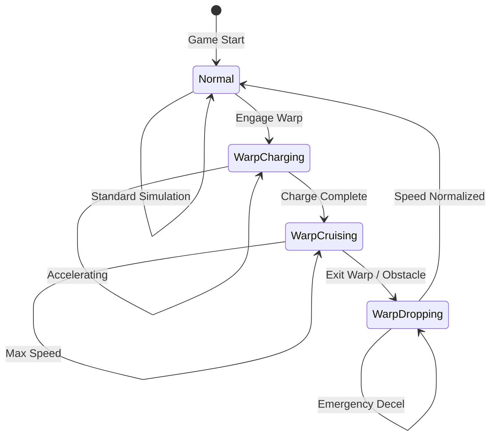
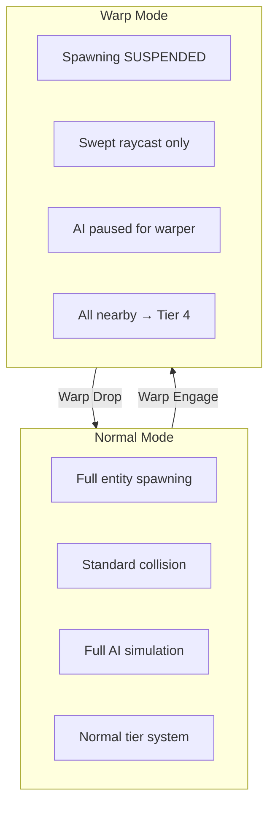
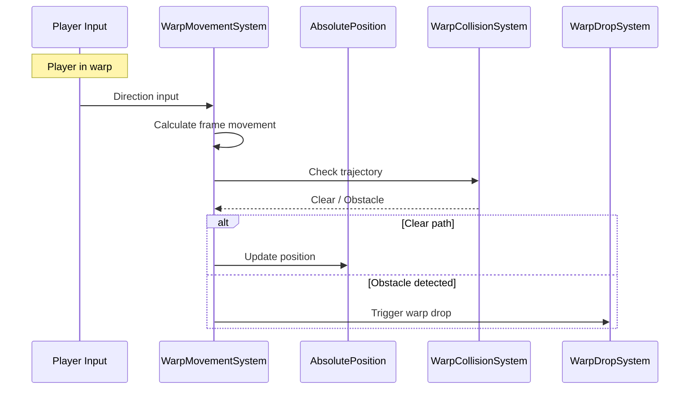
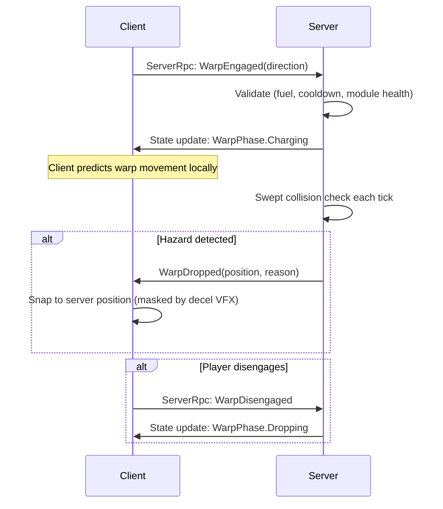
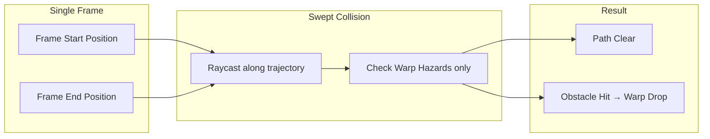
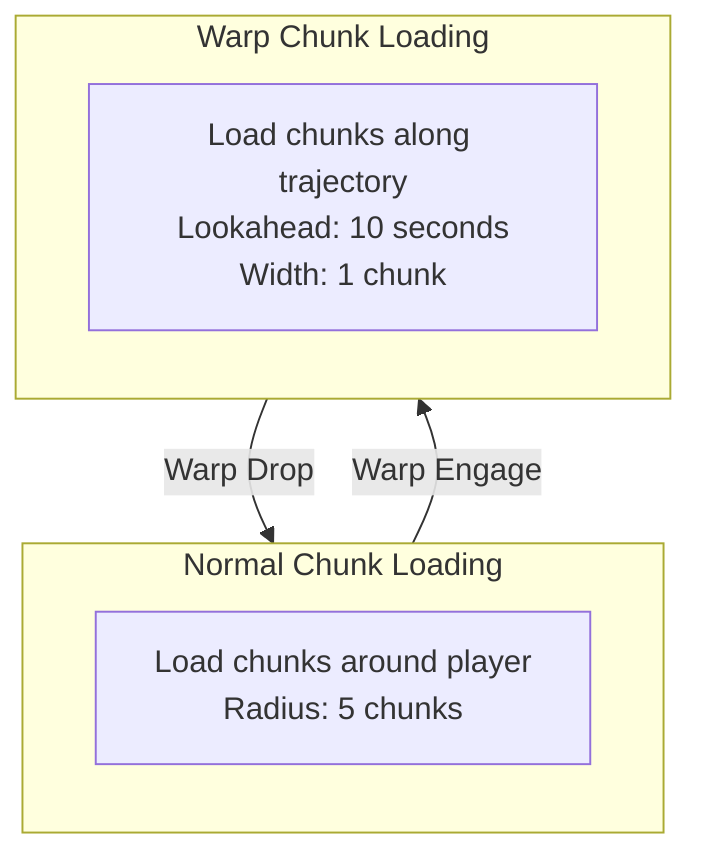
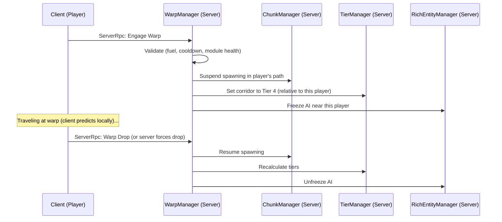
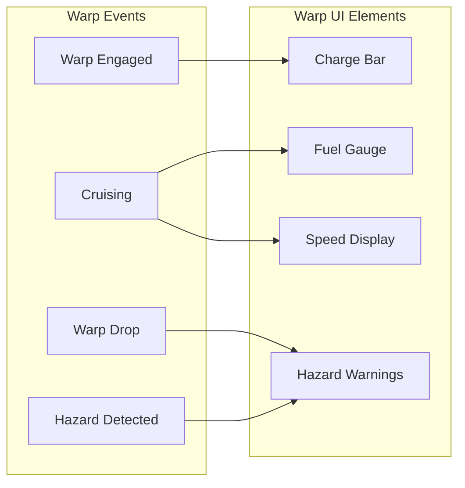
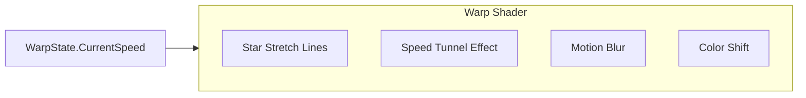

# Warp System

This document defines the warp travel system for Starfire, enabling high-speed movement (10,000+ units/second) while maintaining world integrity and simulation consistency.

> **Architecture Note:** In the hybrid architecture, warp is a state on the PlayerShipInstance (WarpState + WarpEngineModule). The RichEntityManager checks WarpState and switches to swept-raycast collision during warp. Sensor layer contacts can also enter warp (SensorAIState.Warp) - visible as a signature on the player's map. Warp mode changes are coordinated through the TierManager to freeze/unfreeze corridor entities.

> **Multiplayer:** Warp is **server-authoritative**. The client sends a `WarpEngaged` ServerRpc; the server validates (fuel, cooldown, module health) and enters the charging phase. The client **predicts warp movement locally** for responsive feel. The server runs **swept collision detection authoritatively** — on hazard, the server sends `WarpDropped` and the client snaps to the server position (masked by warp-exit VFX deceleration effect). At 10,000 u/s and 100ms latency, the client predicts ~1,000 units ahead; the warp-exit deceleration animation hides this correction. See [[13-networking-architecture]].

---

## Design Philosophy

**Key Requirements:**
1. Player ACTUALLY moves through the world (real position change, not interpolation)
2. Only visual difference is a shader effect
3. Warp engines accelerate to extreme speeds
4. World simulation continues but in a modified state
5. Obstacles must be handled without frame-by-frame collision

**Core Principle:** Warp is a special simulation mode, not a teleport or animation.

---

## Warp Mode Overview



---

## Warp State Component

```csharp
public struct WarpState
{
    public WarpPhase Phase;
    public double WarpStartTime;
    public double2 WarpDirection;       // Normalized direction
    public float CurrentSpeed;          // Current warp speed
    public float TargetSpeed;           // Max warp speed from engine
    public float ChargeProgress;        // 0-1 during charging
    public double DistanceTraveled;     // Total distance this warp
    public WarpDropReason LastDropReason;
}
```

`WarpState` is a field on `ShipInstance`, accessed directly by the `WarpManager`.

```csharp

public enum WarpPhase : byte
{
    None = 0,
    Charging = 1,      // Building up speed
    Cruising = 2,      // At max warp speed
    Dropping = 3       // Emergency deceleration
}

public enum WarpDropReason : byte
{
    None = 0,
    Manual = 1,           // Player disengaged
    Obstacle = 2,         // Major obstacle ahead
    Interdiction = 3,     // Pulled out by interdiction field
    Destination = 4,      // Reached target
    FuelDepleted = 5,     // Out of warp fuel
    Damage = 6            // Ship damaged during warp
}
```

### Warp Engagement Edge Cases

**Double-tap warp (already warping):**
- If `WarpPhase != None`, ignore new warp input
- Player must fully exit warp before re-engaging

**Warp with 0 fuel:**
- Check fuel before entering Charging phase
- If `CurrentFuel <= MinimumWarpFuel`, reject warp engagement
- UI should show "Insufficient Fuel" warning

**Warp drop exactly on chunk boundary:**
- After warp drop, force tier recalculation on next frame
- Ensure entity is assigned to correct chunk before tier logic runs
- `ChunkManager` handles boundary cases

**Cooldown handling:**
- On warp drop, set `WarpEngineModule.CooldownRemaining` (e.g., 5 seconds)
- Consume cooldown each frame: `CooldownRemaining -= deltaTime`
- Block warp engagement while `CooldownRemaining > 0`

---

## Speed and Distance Parameters

```csharp
public class WarpEngineModule : IShipModule
{
    public string ModuleId { get; set; }
    public ShipModuleCategory Category => ShipModuleCategory.Warp;

    // Speed parameters
    public float MaxWarpSpeed;      // e.g., 10,000 units/second
    public float ChargeTime;        // Seconds to reach max speed
    public float DropTime;          // Seconds to decelerate

    // Fuel consumption
    public float FuelPerSecond;     // Warp fuel consumption rate
    public float CurrentFuel;
    public float MaxFuel;

    // Engine state
    public float CooldownRemaining;
    public bool IsEnabled;

    // IShipModule health tracking
    public float MaxHealth { get; set; }
    public float CurrentHealth { get; set; }
    public ModuleDamageState DamageState { get; set; }
    public float TimeSinceLastDamage { get; set; }
    public float EfficiencyMultiplier => /* see doc 09 */;
}
```

**Speed Tiers Example:**

| Engine Class | Max Speed | Charge Time | Units/Frame @60fps |
|--------------|-----------|-------------|-------------------|
| Basic | 5,000 u/s | 3s | 83 units |
| Military | 10,000 u/s | 2s | 167 units |
| Advanced | 20,000 u/s | 1.5s | 333 units |

---

## Simulation Mode Changes During Warp



### What Changes in Warp Mode

| System | Normal Mode | Warp Mode |
|--------|-------------|-----------|
| **Entity Spawning** | Full procedural gen | SUSPENDED in player's path |
| **Collision** | Frame-by-frame | Swept raycast along trajectory |
| **AI (other ships)** | Full BT/State Machine | Frozen relative to warper |
| **Tier Assignment** | Distance-based | All in warp corridor → Tier 4 |
| **Chunk Loading** | Normal radius | Extended predictive loading |
| **Physics** | Standard integration | Direct position update |

---

## Warp Movement System



### WarpManager.UpdateMovement

The `WarpManager` is called by `RichEntityManager` each frame for ships in warp:

```csharp
public void UpdateMovement(ShipInstance ship, float deltaTime)
{
    ref var warp = ref ship.WarpState;
    var engine = ship.GetModule<WarpEngineModule>();

    if (warp.Phase == WarpPhase.None)
        return;

    switch (warp.Phase)
    {
        case WarpPhase.Charging:
            ProcessCharging(ref warp, engine, deltaTime);
            break;

        case WarpPhase.Cruising:
            ProcessCruising(ship, ref warp, engine, deltaTime);
            break;

        case WarpPhase.Dropping:
            ProcessDropping(ship, ref warp, deltaTime);
            break;
    }
}

private void ProcessCharging(ref WarpState warp, WarpEngineModule engine, float dt)
{
    warp.ChargeProgress += dt / engine.ChargeTime;

    if (warp.ChargeProgress >= 1.0f)
    {
        warp.Phase = WarpPhase.Cruising;
        warp.CurrentSpeed = engine.MaxWarpSpeed;
        warp.ChargeProgress = 1.0f;
    }
    else
    {
        warp.CurrentSpeed = engine.MaxWarpSpeed * EaseInCubic(warp.ChargeProgress);
    }
}

private void ProcessCruising(
    ShipInstance ship, ref WarpState warp,
    WarpEngineModule engine, float dt)
{
    engine.CurrentFuel -= engine.FuelPerSecond * dt;
    if (engine.CurrentFuel <= 0)
    {
        warp.Phase = WarpPhase.Dropping;
        warp.LastDropReason = WarpDropReason.FuelDepleted;
        return;
    }

    var control = ship.ControlInput;
    if (math.lengthsq(control.MovementDirection) > 0.1f)
    {
        var targetDir = math.normalize(new double2(
            control.MovementDirection.x, control.MovementDirection.y));
        warp.WarpDirection = RotateTowards(warp.WarpDirection, targetDir, math.radians(5) * dt);
    }

    double movement = warp.CurrentSpeed * dt;
    double2 delta = warp.WarpDirection * movement;

    ship.AbsolutePosition += delta;
    warp.DistanceTraveled += movement;
}

private void ProcessDropping(ShipInstance ship, ref WarpState warp, float dt)
{
    float decelRate = warp.CurrentSpeed / 0.5f;
    warp.CurrentSpeed = math.max(0, warp.CurrentSpeed - decelRate * dt);

    double2 delta = warp.WarpDirection * warp.CurrentSpeed * dt;
    ship.AbsolutePosition += delta;

    if (warp.CurrentSpeed <= 0)
    {
        warp.Phase = WarpPhase.None;
        warp.DistanceTraveled = 0;
    }
}

private static float EaseInCubic(float t) => t * t * t;
```

---

### Warp Networking Flow



**Latency analysis:** At 10,000 u/s and 100ms round-trip latency, the client predicts ~500 units ahead when the server detects a hazard. The warp-exit deceleration animation (0.5s) covers ~2,500 units of deceleration, which comfortably hides the correction snap.

---

## Warp Collision System (Swept Raycast)

At high speeds, frame-by-frame collision misses obstacles. Use swept collision. All collision detection is **server-authoritative** — the client does not run collision checks during warp prediction.



### Warp Hazards

Only check collision against major obstacles during warp:

| Hazard Type | Description | Detection Range |
|-------------|-------------|-----------------|
| **Stations** | Large structures | 500 units |
| **Planets/Moons** | Celestial bodies | 5000 units |
| **Gravity Wells** | Dangerous zones | 2000 units |
| **Interdiction Fields** | Anti-warp zones | 1000 units |
| **Capital Ships** | Very large ships | 200 units |

Small objects (asteroids, debris, fighters) are IGNORED - at warp speeds, the ship would pass through faster than they could react, and visually it would just be a blur.

### WarpManager.CheckCollisions

Called after movement for ships in warp cruise phase:

```csharp
public void CheckCollisions(ShipInstance ship)
{
    ref var warp = ref ship.WarpState;
    if (warp.Phase != WarpPhase.Cruising)
        return;

    double2 currentPos = ship.AbsolutePosition;
    double lookAheadDist = warp.CurrentSpeed * 0.5;
    double2 lookAheadPos = currentPos + warp.WarpDirection * lookAheadDist;

    var hazard = CheckWarpHazards(currentPos, lookAheadPos);

    if (hazard.HasValue)
    {
        ship.AbsolutePosition = hazard.Value.IntersectionPoint;

        warp.Phase = WarpPhase.Dropping;
        warp.LastDropReason = hazard.Value.DropReason;

        GameEventBus.Raise(new WarpDropEvent(
            ship.EntityId, hazard.Value.IntersectionPoint,
            hazard.Value.DropReason, warp.DistanceTraveled, hazard.Value.EntityId));
    }
}

private WarpHazard? CheckWarpHazards(double2 start, double2 end)
{
    double2 min = math.min(start, end);
    double2 max = math.max(start, end);
    const double MAX_HAZARD_RADIUS = 5000.0;
    min -= MAX_HAZARD_RADIUS;
    max += MAX_HAZARD_RADIUS;

    var potentialHazards = _hazardSpatialHash.Query(min, max);

    foreach (var hazardData in potentialHazards)
    {
        if (LineCircleIntersection(start, end, hazardData.Position, hazardData.DetectionRadius))
        {
            double2 intersectionPoint = CalculateIntersectionPoint(
                start, end, hazardData.Position, hazardData.DetectionRadius);

            return new WarpHazard
            {
                EntityId = hazardData.EntityId,
                Position = hazardData.Position,
                IntersectionPoint = intersectionPoint,
                Type = hazardData.HazardType,
                DropReason = hazardData.HazardType switch
                {
                    WarpHazardType.Station => WarpDropReason.Obstacle,
                    WarpHazardType.Planet => WarpDropReason.Obstacle,
                    WarpHazardType.GravityWell => WarpDropReason.Obstacle,
                    WarpHazardType.Interdiction => WarpDropReason.Interdiction,
                    _ => WarpDropReason.Obstacle
                }
            };
        }
    }

    return null;
}

private double2 CalculateIntersectionPoint(
    double2 lineStart, double2 lineEnd, double2 circleCenter, double radius)
{
    double2 d = lineEnd - lineStart;
    double2 f = lineStart - circleCenter;

    double a = math.dot(d, d);
    double b = 2 * math.dot(f, d);
    double c = math.dot(f, f) - radius * radius;

    double discriminant = b * b - 4 * a * c;
    double t = (-b - math.sqrt(discriminant)) / (2 * a);

    const double SAFE_MARGIN = 100.0;
    double safeT = math.max(0, t - SAFE_MARGIN / math.length(d));

    return lineStart + d * safeT;
}

private static bool LineCircleIntersection(
    double2 lineStart, double2 lineEnd,
    double2 circleCenter, double radius)
{
    double2 d = lineEnd - lineStart;
    double2 f = lineStart - circleCenter;

    double a = math.dot(d, d);
    double b = 2 * math.dot(f, d);
    double c = math.dot(f, f) - radius * radius;

    double discriminant = b * b - 4 * a * c;

    if (discriminant < 0)
        return false;

    discriminant = math.sqrt(discriminant);

    double t1 = (-b - discriminant) / (2 * a);
    double t2 = (-b + discriminant) / (2 * a);

    return (t1 >= 0 && t1 <= 1) || (t2 >= 0 && t2 <= 1);
}
```

### Warp Hazard Data

```csharp
public struct WarpHazardData
{
    public int EntityId;
    public double2 Position;
    public WarpHazardType HazardType;
    public float DetectionRadius;
}

public enum WarpHazardType : byte
{
    Station,
    Planet,
    GravityWell,
    Interdiction,
    CapitalShip
}

public struct WarpHazard
{
    public int EntityId;
    public double2 Position;
    public double2 IntersectionPoint;
    public WarpHazardType Type;
    public WarpDropReason DropReason;
}
```

`WarpHazardData` is populated from `StationInstance` and gravity source data. The `WarpManager` maintains a spatial hash of all registered hazards.

---

## Warp Hazard Spatial Hash

To avoid O(n) iteration over all hazards every frame, warp hazards are indexed in a spatial hash maintained by the `WarpManager`.

```csharp
public class WarpHazardSpatialHash
{
    private const double CellSize = 5000.0;
    private readonly Dictionary<long, List<WarpHazardData>> _cells = new();

    public void Insert(WarpHazardData hazard)
    {
        long key = HashKey(hazard.Position);
        if (!_cells.TryGetValue(key, out var list))
        {
            list = new List<WarpHazardData>();
            _cells[key] = list;
        }
        list.Add(hazard);
    }

    public void Remove(int entityId, double2 position)
    {
        long key = HashKey(position);
        if (_cells.TryGetValue(key, out var list))
            list.RemoveAll(h => h.EntityId == entityId);
    }

    public List<WarpHazardData> Query(double2 min, double2 max)
    {
        var results = new List<WarpHazardData>(8);

        long minX = (long)math.floor(min.x / CellSize);
        long maxX = (long)math.floor(max.x / CellSize);
        long minY = (long)math.floor(min.y / CellSize);
        long maxY = (long)math.floor(max.y / CellSize);

        for (long x = minX; x <= maxX; x++)
        {
            for (long y = minY; y <= maxY; y++)
            {
                long key = HashKey(x, y);
                if (_cells.TryGetValue(key, out var list))
                    results.AddRange(list);
            }
        }

        return results;
    }

    private static long HashKey(double2 position)
    {
        long x = (long)math.floor(position.x / CellSize);
        long y = (long)math.floor(position.y / CellSize);
        return (x * 0x1f1f1f1f) ^ y;
    }
}
```

Hazards are typically static or slow-moving (stations, planets), so the hash is updated infrequently — on spawn, despawn, or rare position changes.

---

## Warp Chunk Loading

Predictive chunk loading along warp trajectory.



### WarpChunkLoader

```csharp
public class WarpChunkLoader : MonoBehaviour
{
    [SerializeField] private float _lookAheadSeconds = 10f;
    [SerializeField] private int _corridorWidth = 1;

    public void UpdateWarpChunks(double2 position, double2 direction, float speed)
    {
        // Calculate chunks along trajectory
        var chunksToLoad = new HashSet<(long, long)>();

        double lookAheadDist = speed * _lookAheadSeconds;
        double stepSize = ChunkCoordExtensions.ChunkSize * 0.5;
        int steps = (int)(lookAheadDist / stepSize);

        for (int i = 0; i <= steps; i++)
        {
            double2 checkPos = position + direction * (i * stepSize);
            var centerChunk = ChunkCoordExtensions.ToChunkCoord(checkPos);

            // Add corridor width
            for (int dx = -_corridorWidth; dx <= _corridorWidth; dx++)
            {
                for (int dy = -_corridorWidth; dy <= _corridorWidth; dy++)
                {
                    chunksToLoad.Add((centerChunk.x + dx, centerChunk.y + dy));
                }
            }
        }

        // Load chunks (metadata only, not full entities)
        foreach (var chunk in chunksToLoad)
        {
            LoadChunkMetadata(chunk);
        }
    }

    private void LoadChunkMetadata((long, long) chunk)
    {
        // Only load warp hazard data, not full entities
        // Full entity spawning is suspended during warp
    }
}
```

---

## Warp Mode World State Changes (Server-Only)

All warp world state coordination runs **server-side only**. When ANY player warps, the server adjusts the corridor for that player's path without affecting other players' simulation.



### WarpManager World State Coordination

The `WarpManager` coordinates world state changes when warp engages and drops. In multiplayer, each player's warp is tracked independently:

```csharp
public class WarpManager
{
    private bool _wasWarping;
    private readonly ChunkManager _chunkManager;
    private readonly TierManager _tierManager;
    private readonly RichEntityManager _richEntityManager;
    private readonly WarpHazardSpatialHash _hazardSpatialHash;

    public bool IsPlayerWarping { get; private set; }

    public void Update(float deltaTime)
    {
        var playerShip = _richEntityManager.PlayerShip;
        bool isWarping = playerShip.WarpState.Phase != WarpPhase.None;

        if (isWarping && !_wasWarping)
            OnWarpEngage(playerShip);
        else if (!isWarping && _wasWarping)
            OnWarpDrop(playerShip);

        _wasWarping = isWarping;

        if (isWarping)
            UpdateWarpCorridor(playerShip);
    }

    private void OnWarpEngage(ShipInstance player)
    {
        IsPlayerWarping = true;
        _chunkManager.SpawningEnabled = false;

        GameEventBus.Raise(new WarpEngagedEvent(
            player.EntityId, player.AbsolutePosition,
            player.WarpState.WarpDirection, player.WarpState.TargetSpeed));
    }

    private void OnWarpDrop(ShipInstance player)
    {
        IsPlayerWarping = false;
        _chunkManager.SpawningEnabled = true;
        _tierManager.ForceRecalculation();

        GameEventBus.Raise(new WarpDropEvent(
            player.EntityId, player.AbsolutePosition,
            player.WarpState.LastDropReason, player.WarpState.DistanceTraveled, 0));
    }

    private void UpdateWarpCorridor(ShipInstance player)
    {
        double corridorLength = player.WarpState.CurrentSpeed * 2.0;
        double corridorWidth = 500.0;

        foreach (var ship in _richEntityManager.Ships)
        {
            if (!IsInWarpCorridor(player.AbsolutePosition, player.WarpState.WarpDirection,
                                   corridorLength, corridorWidth, ship.AbsolutePosition))
                continue;

            if (ship.PersistenceLevel == EntityPersistence.Critical)
            {
                _tierManager.ForceTier(ship, 2);
                continue;
            }

            _tierManager.ForceTier(ship, 4);
        }
    }

    private bool IsInWarpCorridor(
        double2 origin, double2 direction,
        double length, double width, double2 point)
    {
        double2 toPoint = point - origin;
        double along = math.dot(toPoint, direction);

        if (along < 0 || along > length)
            return false;

        double perpDist = math.length(toPoint - direction * along);
        return perpDist <= width;
    }
}
```

---

## Warp UI Integration



---

## Speed Limit Rationale

**Why 10,000-20,000 units/second max?**

| Factor | Consideration |
|--------|---------------|
| **Chunk crossing** | At 10k u/s, cross ~10 chunks/second (1000u chunks) |
| **Collision window** | 0.5s lookahead = 5000 unit detection range |
| **Memory streaming** | Can pre-load metadata for 10s = 100 chunks ahead |
| **Visual coherence** | Background shader can still show star streaks |
| **Game balance** | Cross 500k unit world in ~50 seconds |

**Frame-rate independence:**

| Speed | Distance/Frame @60fps | Distance/Frame @30fps |
|-------|----------------------|----------------------|
| 10,000 u/s | 166.7 units | 333.3 units |
| 20,000 u/s | 333.3 units | 666.7 units |

Swept collision handles these large movements correctly.

---

## Warp Visual Effects (Shader Only)

Per your requirement: the only visual change is a shader effect.



**Shader Parameters:**
- `_WarpIntensity`: 0-1 based on speed/maxSpeed
- `_StretchDirection`: Normalized warp direction
- `_TimeInWarp`: For animation

The actual world doesn't change - entities still exist, they're just in Tier 4 (dormant) so not rendered or simulated.

---

## Warp Events

Warp events fire via `GameEventBus` and are dispatched to Lua in `ScriptExecutionManager`:

```csharp
public struct WarpEngagedEvent
{
    public int ShipEntityId;
    public double2 StartPosition;
    public double2 Direction;
    public float TargetSpeed;
}

public struct WarpDropEvent
{
    public int ShipEntityId;
    public double2 DropPosition;
    public WarpDropReason Reason;
    public double DistanceTraveled;
    public int CausedByEntityId;  // For interdiction/obstacle (0 if none)
}

public struct WarpHazardWarningEvent
{
    public int ShipEntityId;
    public int HazardEntityId;
    public float SecondsToImpact;
    public WarpHazardType HazardType;
}
```

Lua scripts can listen for warp events:

```lua
starfire.on("warp_engaged", function(event)
    log("Ship " .. event.ship_id .. " entering warp")
end)

starfire.on("warp_dropped", function(event)
    if event.reason == "interdiction" then
        log("Interdicted!")
    end
end)
```

---

## Summary

| Aspect | Implementation |
|--------|----------------|
| **Movement** | Real position updates, not interpolation |
| **Speed** | 10,000-20,000 units/second |
| **Collision** | Swept raycast against Warp Hazards only |
| **Spawning** | Suspended during warp |
| **Other entities** | Demoted to Tier 4 in warp corridor |
| **Chunks** | Predictive metadata loading |
| **Visuals** | Shader effect only |
| **Exit** | Manual, obstacle, interdiction, fuel, damage |

---

## Modding Integration

Warp system modding extension points:

- **Warp engine configurations** are moddable via JSON ship configs (see [[05-configuration-layer]]). Mods can define new engine types with custom speeds, charge times, and fuel consumption.
- **Warp events** (`warp_engaged`, `warp_dropped`, `warp_hazard_warning`) are dispatched to Lua via GameEventBus, enabling custom warp mechanics or UI.
- **Warp hazard types** can be extended through mod-defined station and celestial body configurations.

---

## Related Documentation

- [[02-system-architecture]] - System execution order
- [[03-tiered-simulation]] - Tier system details
- [[06-chunk-integration]] - Chunk loading during warp
- [[12-modding-architecture]] - Lua event hooks and JSON overrides
- [[13-networking-architecture]] - Warp prediction, server validation, correction masking
