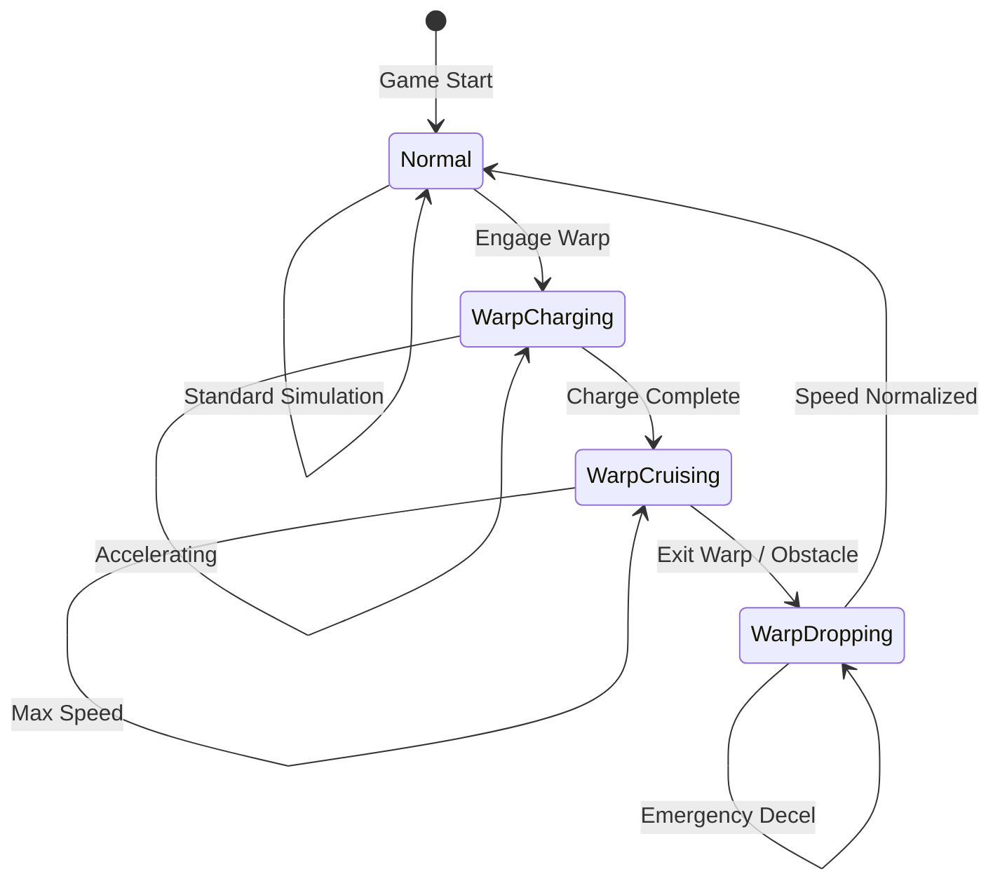
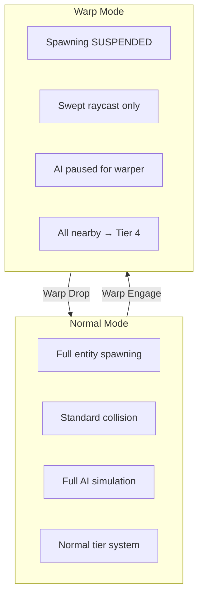
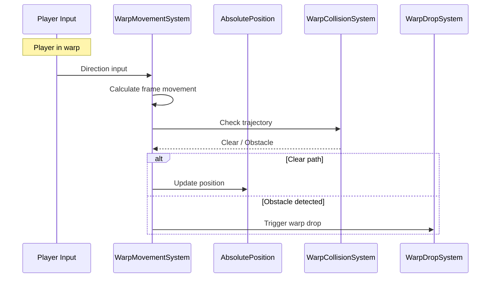
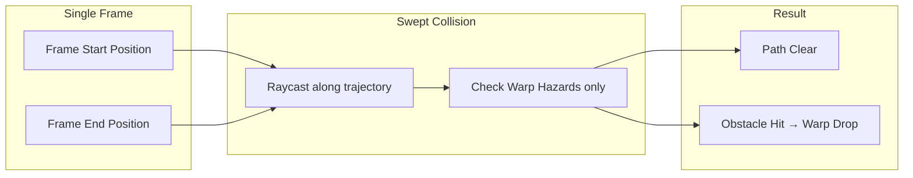
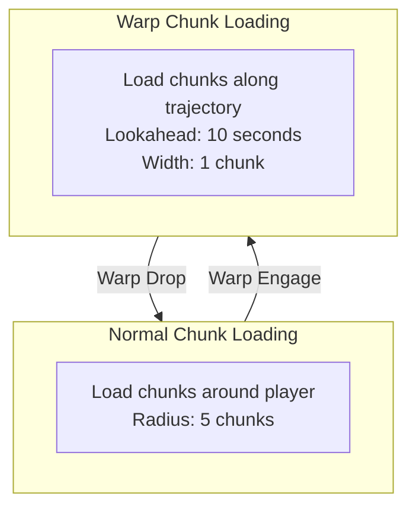
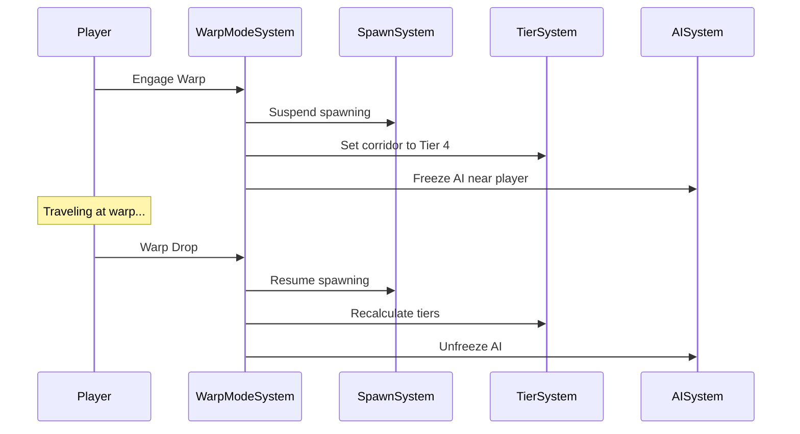
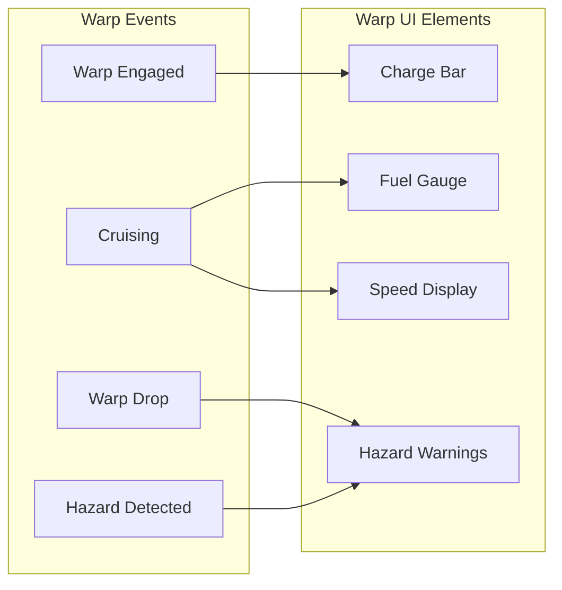
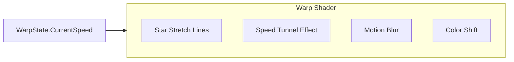

# Warp System

This document defines the warp travel system for Starfire, enabling high-speed movement (10,000+ units/second) while maintaining world integrity and simulation consistency.

---

## Design Philosophy

**Key Requirements:**
1. Player ACTUALLY moves through the world (real position change, not interpolation)
2. Only visual difference is a shader effect
3. Warp engines accelerate to extreme speeds
4. World simulation continues but in a modified state
5. Obstacles must be handled without frame-by-frame collision

**Core Principle:** Warp is a special simulation mode, not a teleport or animation.

---

## Warp Mode Overview



---

## Warp State Component

```csharp
public struct WarpState : IComponentData
{
    public WarpPhase Phase;
    public double WarpStartTime;
    public double2 WarpDirection;       // Normalized direction
    public float CurrentSpeed;          // Current warp speed
    public float TargetSpeed;           // Max warp speed from engine
    public float ChargeProgress;        // 0-1 during charging
    public double DistanceTraveled;     // Total distance this warp
    public WarpDropReason LastDropReason;
}

public enum WarpPhase : byte
{
    None = 0,
    Charging = 1,      // Building up speed
    Cruising = 2,      // At max warp speed
    Dropping = 3       // Emergency deceleration
}

public enum WarpDropReason : byte
{
    None = 0,
    Manual = 1,           // Player disengaged
    Obstacle = 2,         // Major obstacle ahead
    Interdiction = 3,     // Pulled out by interdiction field
    Destination = 4,      // Reached target
    FuelDepleted = 5,     // Out of warp fuel
    Damage = 6            // Ship damaged during warp
}
```

### Warp Engagement Edge Cases

**Double-tap warp (already warping):**
- If `WarpPhase != None`, ignore new warp input
- Player must fully exit warp before re-engaging

**Warp with 0 fuel:**
- Check fuel before entering Charging phase
- If `CurrentFuel <= MinimumWarpFuel`, reject warp engagement
- UI should show "Insufficient Fuel" warning

**Warp drop exactly on chunk boundary:**
- After warp drop, force tier recalculation on next frame
- Ensure entity is assigned to correct chunk before tier logic runs
- `ChunkMigrationSystem` handles boundary cases

**Cooldown handling:**
- On warp drop, set `WarpEngineModule.CooldownRemaining` (e.g., 5 seconds)
- Consume cooldown each frame: `CooldownRemaining -= deltaTime`
- Block warp engagement while `CooldownRemaining > 0`

---

## Speed and Distance Parameters

```csharp
public struct WarpEngineModule : IComponentData
{
    public FixedString64Bytes ModuleId;

    // Speed parameters
    public float MaxWarpSpeed;      // e.g., 10,000 units/second
    public float ChargeTime;        // Seconds to reach max speed
    public float DropTime;          // Seconds to decelerate

    // Fuel consumption
    public float FuelPerSecond;     // Warp fuel consumption rate
    public float CurrentFuel;
    public float MaxFuel;

    // Engine state
    public float CooldownRemaining;
    public bool IsEnabled;
}
```

**Speed Tiers Example:**

| Engine Class | Max Speed | Charge Time | Units/Frame @60fps |
|--------------|-----------|-------------|-------------------|
| Basic | 5,000 u/s | 3s | 83 units |
| Military | 10,000 u/s | 2s | 167 units |
| Advanced | 20,000 u/s | 1.5s | 333 units |

---

## Simulation Mode Changes During Warp



### What Changes in Warp Mode

| System | Normal Mode | Warp Mode |
|--------|-------------|-----------|
| **Entity Spawning** | Full procedural gen | SUSPENDED in player's path |
| **Collision** | Frame-by-frame | Swept raycast along trajectory |
| **AI (other ships)** | Full BT/State Machine | Frozen relative to warper |
| **Tier Assignment** | Distance-based | All in warp corridor → Tier 4 |
| **Chunk Loading** | Normal radius | Extended predictive loading |
| **Physics** | Standard integration | Direct position update |

---

## Warp Movement System



### WarpMovementSystem Implementation

```csharp
[UpdateInGroup(typeof(SimulationSystemGroup))]
[UpdateBefore(typeof(MovementSystem))]
public partial struct WarpMovementSystem : ISystem
{
    [BurstCompile]
    public void OnUpdate(ref SystemState state)
    {
        float dt = SystemAPI.Time.DeltaTime;

        foreach (var (warp, absPos, control, engine) in
            SystemAPI.Query<
                RefRW<WarpState>,
                RefRW<AbsolutePosition>,
                RefRO<ControlInput>,
                RefRW<WarpEngineModule>>()
            .WithAll<PlayerTag>())
        {
            if (warp.ValueRO.Phase == WarpPhase.None)
                continue;

            // Handle warp based on phase
            switch (warp.ValueRO.Phase)
            {
                case WarpPhase.Charging:
                    ProcessCharging(ref warp.ValueRW, ref engine.ValueRW, dt);
                    break;

                case WarpPhase.Cruising:
                    ProcessCruising(ref warp.ValueRW, ref absPos.ValueRW,
                                   ref engine.ValueRW, control.ValueRO, dt);
                    break;

                case WarpPhase.Dropping:
                    ProcessDropping(ref warp.ValueRW, ref absPos.ValueRW, dt);
                    break;
            }
        }
    }

    private void ProcessCharging(
        ref WarpState warp,
        ref WarpEngineModule engine,
        float dt)
    {
        warp.ChargeProgress += dt / engine.ChargeTime;

        if (warp.ChargeProgress >= 1.0f)
        {
            warp.Phase = WarpPhase.Cruising;
            warp.CurrentSpeed = engine.MaxWarpSpeed;
            warp.ChargeProgress = 1.0f;
        }
        else
        {
            // Accelerating - speed ramps up during charge
            warp.CurrentSpeed = engine.MaxWarpSpeed * EaseInCubic(warp.ChargeProgress);
        }
    }

    private void ProcessCruising(
        ref WarpState warp,
        ref AbsolutePosition absPos,
        ref WarpEngineModule engine,
        in ControlInput control,
        float dt)
    {
        // Consume fuel
        engine.CurrentFuel -= engine.FuelPerSecond * dt;
        if (engine.CurrentFuel <= 0)
        {
            warp.Phase = WarpPhase.Dropping;
            warp.LastDropReason = WarpDropReason.FuelDepleted;
            return;
        }

        // Update direction from input (limited turn rate during warp)
        if (math.lengthsq(control.MovementDirection) > 0.1f)
        {
            var targetDir = math.normalize(new double2(
                control.MovementDirection.x,
                control.MovementDirection.y));

            // Slow turn during warp (e.g., 5 degrees/second)
            warp.WarpDirection = RotateTowards(
                warp.WarpDirection,
                targetDir,
                math.radians(5) * dt);
        }

        // Calculate movement this frame
        double movement = warp.CurrentSpeed * dt;
        double2 delta = warp.WarpDirection * movement;

        // Update position (actual movement, not interpolation)
        absPos.X += delta.x;
        absPos.Y += delta.y;
        warp.DistanceTraveled += movement;
    }

    private void ProcessDropping(
        ref WarpState warp,
        ref AbsolutePosition absPos,
        float dt)
    {
        // Rapid deceleration
        float decelRate = warp.CurrentSpeed / 0.5f;  // Stop in 0.5 seconds
        warp.CurrentSpeed = math.max(0, warp.CurrentSpeed - decelRate * dt);

        // Still moving during decel
        double2 delta = warp.WarpDirection * warp.CurrentSpeed * dt;
        absPos.X += delta.x;
        absPos.Y += delta.y;

        if (warp.CurrentSpeed <= 0)
        {
            // Warp complete, return to normal
            warp.Phase = WarpPhase.None;
            warp.DistanceTraveled = 0;
        }
    }

    private static float EaseInCubic(float t) => t * t * t;
}
```

---

## Warp Collision System (Swept Raycast)

At high speeds, frame-by-frame collision misses obstacles. Use swept collision.



### Warp Hazards

Only check collision against major obstacles during warp:

| Hazard Type | Description | Detection Range |
|-------------|-------------|-----------------|
| **Stations** | Large structures | 500 units |
| **Planets/Moons** | Celestial bodies | 5000 units |
| **Gravity Wells** | Dangerous zones | 2000 units |
| **Interdiction Fields** | Anti-warp zones | 1000 units |
| **Capital Ships** | Very large ships | 200 units |

Small objects (asteroids, debris, fighters) are IGNORED - at warp speeds, the ship would pass through faster than they could react, and visually it would just be a blur.

### WarpCollisionSystem Implementation

```csharp
[UpdateInGroup(typeof(SimulationSystemGroup))]
[UpdateAfter(typeof(WarpMovementSystem))]
public partial struct WarpCollisionSystem : ISystem
{
    [BurstCompile]
    public void OnUpdate(ref SystemState state)
    {
        foreach (var (warp, absPos, entity) in
            SystemAPI.Query<RefRW<WarpState>, RefRO<AbsolutePosition>>()
                     .WithAll<PlayerTag>()
                     .WithEntityAccess())
        {
            if (warp.ValueRO.Phase != WarpPhase.Cruising)
                continue;

            // Calculate trajectory for this frame + lookahead
            double2 currentPos = new double2(absPos.ValueRO.X, absPos.ValueRO.Y);
            double lookAheadDist = warp.ValueRO.CurrentSpeed * 0.5;  // 0.5 second lookahead
            double2 lookAheadPos = currentPos + warp.ValueRO.WarpDirection * lookAheadDist;

            // Check for warp hazards
            var hazard = CheckWarpHazards(currentPos, lookAheadPos);

            if (hazard.HasValue)
            {
                // CRITICAL: Clamp position to just before hazard to prevent
                // ending up inside the obstacle during deceleration
                absPos.ValueRW.X = hazard.Value.IntersectionPoint.x;
                absPos.ValueRW.Y = hazard.Value.IntersectionPoint.y;

                // Trigger warp drop
                warp.ValueRW.Phase = WarpPhase.Dropping;
                warp.ValueRW.LastDropReason = hazard.Value.DropReason;

                // Fire event
                CreateWarpDropEvent(ref state, entity, hazard.Value);
            }
        }
    }

    private WarpHazard? CheckWarpHazards(double2 start, double2 end)
    {
        // PERFORMANCE: Use spatial hash to avoid O(n) iteration over all hazards
        // WarpHazardSpatialHash is populated on hazard spawn/despawn and updated
        // when hazards move (which is rare - stations don't move, planets move slowly)

        // Calculate AABB of the trajectory for broad-phase query
        double2 min = math.min(start, end);
        double2 max = math.max(start, end);
        const double MAX_HAZARD_RADIUS = 5000.0;  // Largest possible hazard detection radius
        min -= MAX_HAZARD_RADIUS;
        max += MAX_HAZARD_RADIUS;

        // Query spatial hash for hazards in AABB (typically returns 0-5 hazards)
        var potentialHazards = WarpHazardSpatialHash.Query(min, max);

        foreach (var hazardEntity in potentialHazards)
        {
            if (!SystemAPI.Exists(hazardEntity))
                continue;

            var hazardPos = SystemAPI.GetComponent<AbsolutePosition>(hazardEntity);
            var hazardData = SystemAPI.GetComponent<WarpHazardData>(hazardEntity);

            double2 hazardCenter = new double2(hazardPos.X, hazardPos.Y);
            double hazardRadius = hazardData.DetectionRadius;

            // Line-circle intersection test
            if (LineCircleIntersection(start, end, hazardCenter, hazardRadius))
            {
                // Calculate exact intersection point for position clamping
                double2 intersectionPoint = CalculateIntersectionPoint(
                    start, end, hazardCenter, hazardRadius);

                return new WarpHazard
                {
                    Entity = hazardEntity,
                    Position = hazardCenter,
                    IntersectionPoint = intersectionPoint,
                    Type = hazardData.HazardType,
                    DropReason = hazardData.HazardType switch
                    {
                        WarpHazardType.Station => WarpDropReason.Obstacle,
                        WarpHazardType.Planet => WarpDropReason.Obstacle,
                        WarpHazardType.GravityWell => WarpDropReason.Obstacle,
                        WarpHazardType.Interdiction => WarpDropReason.Interdiction,
                        _ => WarpDropReason.Obstacle
                    }
                };
            }
        }

        return null;
    }

    private double2 CalculateIntersectionPoint(
        double2 lineStart, double2 lineEnd, double2 circleCenter, double radius)
    {
        // Find the point just outside the hazard radius along trajectory
        double2 d = lineEnd - lineStart;
        double2 f = lineStart - circleCenter;

        double a = math.dot(d, d);
        double b = 2 * math.dot(f, d);
        double c = math.dot(f, f) - radius * radius;

        double discriminant = b * b - 4 * a * c;
        double t = (-b - math.sqrt(discriminant)) / (2 * a);

        // Return point slightly before intersection (safe exit point)
        const double SAFE_MARGIN = 100.0;  // 100 units before hazard
        double safeT = math.max(0, t - SAFE_MARGIN / math.length(d));

        return lineStart + d * safeT;
    }

    private static bool LineCircleIntersection(
        double2 lineStart,
        double2 lineEnd,
        double2 circleCenter,
        double radius)
    {
        double2 d = lineEnd - lineStart;
        double2 f = lineStart - circleCenter;

        double a = math.dot(d, d);
        double b = 2 * math.dot(f, d);
        double c = math.dot(f, f) - radius * radius;

        double discriminant = b * b - 4 * a * c;

        if (discriminant < 0)
            return false;

        discriminant = math.sqrt(discriminant);

        double t1 = (-b - discriminant) / (2 * a);
        double t2 = (-b + discriminant) / (2 * a);

        // Check if intersection is within line segment
        return (t1 >= 0 && t1 <= 1) || (t2 >= 0 && t2 <= 1);
    }
}

public struct WarpHazardData : IComponentData
{
    public WarpHazardType HazardType;
    public float DetectionRadius;
}

public enum WarpHazardType : byte
{
    Station,
    Planet,
    GravityWell,
    Interdiction,
    CapitalShip
}

// Internal struct for hazard detection results
public struct WarpHazard
{
    public Entity Entity;
    public double2 Position;
    public double2 IntersectionPoint;  // Safe exit point before hazard
    public WarpHazardType Type;
    public WarpDropReason DropReason;
}
```

---

## Warp Hazard Spatial Hash

To avoid O(n) iteration over all hazards every frame, warp hazards are indexed in a spatial hash.

**BURST COMPATIBILITY:** The static class with managed Dictionary below is NOT Burst-compatible.
For Burst jobs, use the `NativeParallelMultiHashMap` singleton approach shown after.

```csharp
/// <summary>
/// Spatial hash specifically for warp hazards. Hazards are typically static or
/// slow-moving, so this hash is updated infrequently (on spawn/despawn/move).
/// Cell size is large (5000 units) since hazards have large detection radii.
///
/// WARNING: This static class is NOT Burst-compatible. See WarpHazardSpatialHashNative below.
/// </summary>
public static class WarpHazardSpatialHash
{
    private const double CellSize = 5000.0;
    private static Dictionary<long, List<Entity>> _cells = new();

    public static void Insert(Entity entity, double2 position)
    {
        long key = HashKey(position);
        if (!_cells.TryGetValue(key, out var list))
        {
            list = new List<Entity>();
            _cells[key] = list;
        }
        list.Add(entity);
    }

    public static void Remove(Entity entity, double2 position)
    {
        long key = HashKey(position);
        if (_cells.TryGetValue(key, out var list))
        {
            list.Remove(entity);
        }
    }

    /// <summary>
    /// Query all hazards that might intersect the given AABB.
    /// Returns typically 0-5 entities for a single frame's trajectory.
    /// </summary>
    public static NativeList<Entity> Query(double2 min, double2 max)
    {
        var results = new NativeList<Entity>(8, Allocator.Temp);

        long minX = (long)math.floor(min.x / CellSize);
        long maxX = (long)math.floor(max.x / CellSize);
        long minY = (long)math.floor(min.y / CellSize);
        long maxY = (long)math.floor(max.y / CellSize);

        for (long x = minX; x <= maxX; x++)
        {
            for (long y = minY; y <= maxY; y++)
            {
                long key = HashKey(x, y);
                if (_cells.TryGetValue(key, out var list))
                {
                    foreach (var entity in list)
                    {
                        results.Add(entity);
                    }
                }
            }
        }

        return results;
    }

    private static long HashKey(double2 position)
    {
        long x = (long)math.floor(position.x / CellSize);
        long y = (long)math.floor(position.y / CellSize);
        return HashKey(x, y);
    }

    private static long HashKey(long x, long y)
    {
        // XOR-based hash - simpler and doesn't overflow like Cantor pairing
        // Cantor pairing ((x + y) * (x + y + 1) / 2) + y can overflow for large coordinates
        return (x * 0x1f1f1f1f) ^ y;
    }
}

/// <summary>
/// Burst-compatible warp hazard spatial hash using NativeParallelMultiHashMap.
/// Store as singleton, access in Burst jobs.
/// </summary>
public struct WarpHazardSpatialHashNative : IComponentData
{
    public NativeParallelMultiHashMap<long, Entity> Cells;
}

/// <summary>
/// System to maintain the Burst-compatible spatial hash.
/// </summary>
[UpdateInGroup(typeof(InitializationSystemGroup))]
public partial struct WarpHazardSpatialHashSystem : ISystem
{
    private const double CellSize = 5000.0;

    public void OnCreate(ref SystemState state)
    {
        state.EntityManager.CreateSingleton(new WarpHazardSpatialHashNative
        {
            Cells = new NativeParallelMultiHashMap<long, Entity>(256, Allocator.Persistent)
        });
    }

    public void OnDestroy(ref SystemState state)
    {
        var hash = SystemAPI.GetSingleton<WarpHazardSpatialHashNative>();
        hash.Cells.Dispose();
    }

    public static long HashKey(long x, long y)
    {
        // XOR-based hash - overflow-safe for large coordinates
        return (x * 0x1f1f1f1f) ^ y;
    }
}
```

---

## Warp Chunk Loading

Predictive chunk loading along warp trajectory.



### WarpChunkLoader

```csharp
public class WarpChunkLoader : MonoBehaviour
{
    [SerializeField] private float _lookAheadSeconds = 10f;
    [SerializeField] private int _corridorWidth = 1;

    public void UpdateWarpChunks(double2 position, double2 direction, float speed)
    {
        // Calculate chunks along trajectory
        var chunksToLoad = new HashSet<(long, long)>();

        double lookAheadDist = speed * _lookAheadSeconds;
        double stepSize = ChunkCoordExtensions.ChunkSize * 0.5;
        int steps = (int)(lookAheadDist / stepSize);

        for (int i = 0; i <= steps; i++)
        {
            double2 checkPos = position + direction * (i * stepSize);
            var centerChunk = ChunkCoordExtensions.ToChunkCoord(checkPos);

            // Add corridor width
            for (int dx = -_corridorWidth; dx <= _corridorWidth; dx++)
            {
                for (int dy = -_corridorWidth; dy <= _corridorWidth; dy++)
                {
                    chunksToLoad.Add((centerChunk.x + dx, centerChunk.y + dy));
                }
            }
        }

        // Load chunks (metadata only, not full entities)
        foreach (var chunk in chunksToLoad)
        {
            LoadChunkMetadata(chunk);
        }
    }

    private void LoadChunkMetadata((long, long) chunk)
    {
        // Only load warp hazard data, not full entities
        // Full entity spawning is suspended during warp
    }
}
```

---

## Warp Mode World State Changes



### WarpModeSystem

```csharp
[UpdateInGroup(typeof(SimulationSystemGroup))]
public partial struct WarpModeSystem : ISystem
{
    private bool _wasWarping;

    public void OnUpdate(ref SystemState state)
    {
        var warpState = GetPlayerWarpState(ref state);
        bool isWarping = warpState.Phase != WarpPhase.None;

        if (isWarping && !_wasWarping)
        {
            OnWarpEngage(ref state);
        }
        else if (!isWarping && _wasWarping)
        {
            OnWarpDrop(ref state);
        }

        _wasWarping = isWarping;

        if (isWarping)
        {
            UpdateWarpMode(ref state, warpState);
        }
    }

    private void OnWarpEngage(ref SystemState state)
    {
        // Set global warp mode flag
        var globalWarp = SystemAPI.GetSingletonRW<GlobalWarpState>();
        globalWarp.ValueRW.IsPlayerWarping = true;

        // Suspend entity spawning
        var spawnControl = SystemAPI.GetSingletonRW<SpawnControl>();
        spawnControl.ValueRW.SpawningEnabled = false;

        // Mark AI ships to freeze (handled by AISystem)
    }

    private void OnWarpDrop(ref SystemState state)
    {
        // Clear global warp mode
        var globalWarp = SystemAPI.GetSingletonRW<GlobalWarpState>();
        globalWarp.ValueRW.IsPlayerWarping = false;

        // Resume entity spawning
        var spawnControl = SystemAPI.GetSingletonRW<SpawnControl>();
        spawnControl.ValueRW.SpawningEnabled = true;

        // Trigger tier recalculation
        // (handled by TierTransitionSystem on next frame)
    }

    private void UpdateWarpMode(ref SystemState state, WarpState warpState)
    {
        // Get player position
        var playerPos = GetPlayerPosition(ref state);

        // Calculate warp corridor bounds
        double corridorLength = warpState.CurrentSpeed * 2.0;  // 2 second corridor
        double corridorWidth = 500.0;  // 500 units wide

        // Demote entities in corridor (EXCEPT Critical persistence level)
        foreach (var (absPos, persistence, entity) in
            SystemAPI.Query<RefRO<AbsolutePosition>, RefRO<EntityPersistenceData>>()
                     .WithAny<ActiveTag, TacticalTag, StrategicTag>()
                     .WithEntityAccess())
        {
            double2 entityPos = new double2(absPos.ValueRO.X, absPos.ValueRO.Y);

            if (IsInWarpCorridor(playerPos, warpState.WarpDirection,
                                 corridorLength, corridorWidth, entityPos))
            {
                // CRITICAL: Never demote Critical entities below Tier 2
                // They must remain active for quest tracking, ally coordination, etc.
                if (persistence.ValueRO.Level == EntityPersistence.Critical)
                {
                    // Keep at Tier 2 minimum - just disable view
                    state.EntityManager.SetComponentEnabled<LoadedTag>(entity, false);
                    state.EntityManager.SetComponentEnabled<ActiveTag>(entity, false);
                    state.EntityManager.SetComponentEnabled<TacticalTag>(entity, true);
                    continue;
                }

                // Demote to Tier 4 (dormant) for Transient and Persistent entities
                state.EntityManager.SetComponentEnabled<ActiveTag>(entity, false);
                state.EntityManager.SetComponentEnabled<TacticalTag>(entity, false);
                state.EntityManager.SetComponentEnabled<StrategicTag>(entity, false);
                state.EntityManager.SetComponentEnabled<DormantTag>(entity, true);
            }
        }
    }

    private bool IsInWarpCorridor(
        double2 origin,
        double2 direction,
        double length,
        double width,
        double2 point)
    {
        double2 toPoint = point - origin;

        // Project onto direction
        double along = math.dot(toPoint, direction);

        // Check if within length (ahead of player)
        if (along < 0 || along > length)
            return false;

        // Check if within width
        double perpDist = math.length(toPoint - direction * along);
        return perpDist <= width;
    }
}

// Singleton components
public struct GlobalWarpState : IComponentData
{
    public bool IsPlayerWarping;
    public double2 WarpDirection;
    public float WarpSpeed;
}

public struct SpawnControl : IComponentData
{
    public bool SpawningEnabled;
}
```

---

## Warp UI Integration



---

## Speed Limit Rationale

**Why 10,000-20,000 units/second max?**

| Factor | Consideration |
|--------|---------------|
| **Chunk crossing** | At 10k u/s, cross ~10 chunks/second (1000u chunks) |
| **Collision window** | 0.5s lookahead = 5000 unit detection range |
| **Memory streaming** | Can pre-load metadata for 10s = 100 chunks ahead |
| **Visual coherence** | Background shader can still show star streaks |
| **Game balance** | Cross 500k unit world in ~50 seconds |

**Frame-rate independence:**

| Speed | Distance/Frame @60fps | Distance/Frame @30fps |
|-------|----------------------|----------------------|
| 10,000 u/s | 166.7 units | 333.3 units |
| 20,000 u/s | 333.3 units | 666.7 units |

Swept collision handles these large movements correctly.

---

## Warp Visual Effects (Shader Only)

Per your requirement: the only visual change is a shader effect.



**Shader Parameters:**
- `_WarpIntensity`: 0-1 based on speed/maxSpeed
- `_StretchDirection`: Normalized warp direction
- `_TimeInWarp`: For animation

The actual world doesn't change - entities still exist, they're just in Tier 4 (dormant) so not rendered or simulated.

---

## Warp Events

```csharp
public struct WarpEngagedEvent : IComponentData
{
    public Entity ShipEntity;
    public double2 StartPosition;
    public double2 Direction;
    public float TargetSpeed;
}

public struct WarpDropEvent : IComponentData
{
    public Entity ShipEntity;
    public double2 DropPosition;
    public WarpDropReason Reason;
    public double DistanceTraveled;
    public Entity? CausedByEntity;  // For interdiction/obstacle
}

public struct WarpHazardWarningEvent : IComponentData
{
    public Entity ShipEntity;
    public Entity HazardEntity;
    public float SecondsToImpact;
    public WarpHazardType HazardType;
}
```

---

## Summary

| Aspect | Implementation |
|--------|----------------|
| **Movement** | Real position updates, not interpolation |
| **Speed** | 10,000-20,000 units/second |
| **Collision** | Swept raycast against Warp Hazards only |
| **Spawning** | Suspended during warp |
| **Other entities** | Demoted to Tier 4 in warp corridor |
| **Chunks** | Predictive metadata loading |
| **Visuals** | Shader effect only |
| **Exit** | Manual, obstacle, interdiction, fuel, damage |

---

## Related Documentation

- [02-system-architecture.md](02-system-architecture.md) - System execution order
- [03-tiered-simulation.md](03-tiered-simulation.md) - Tier system details
- [06-chunk-integration.md](06-chunk-integration.md) - Chunk loading during warp
