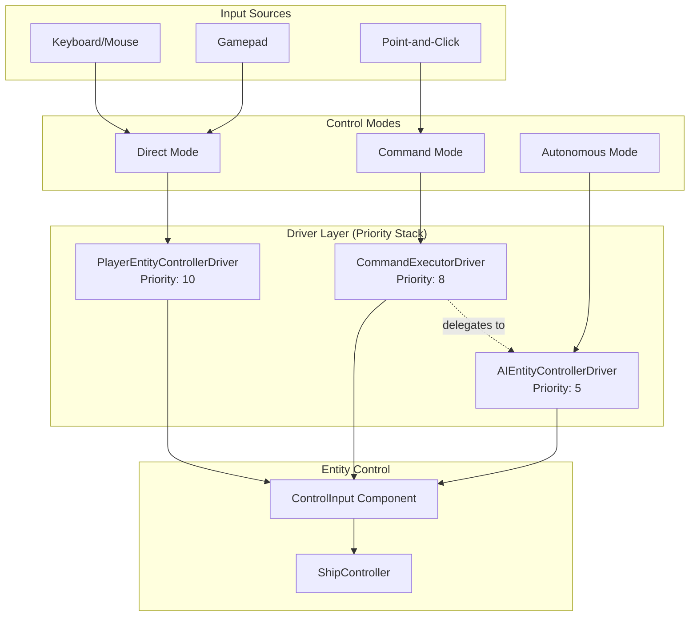
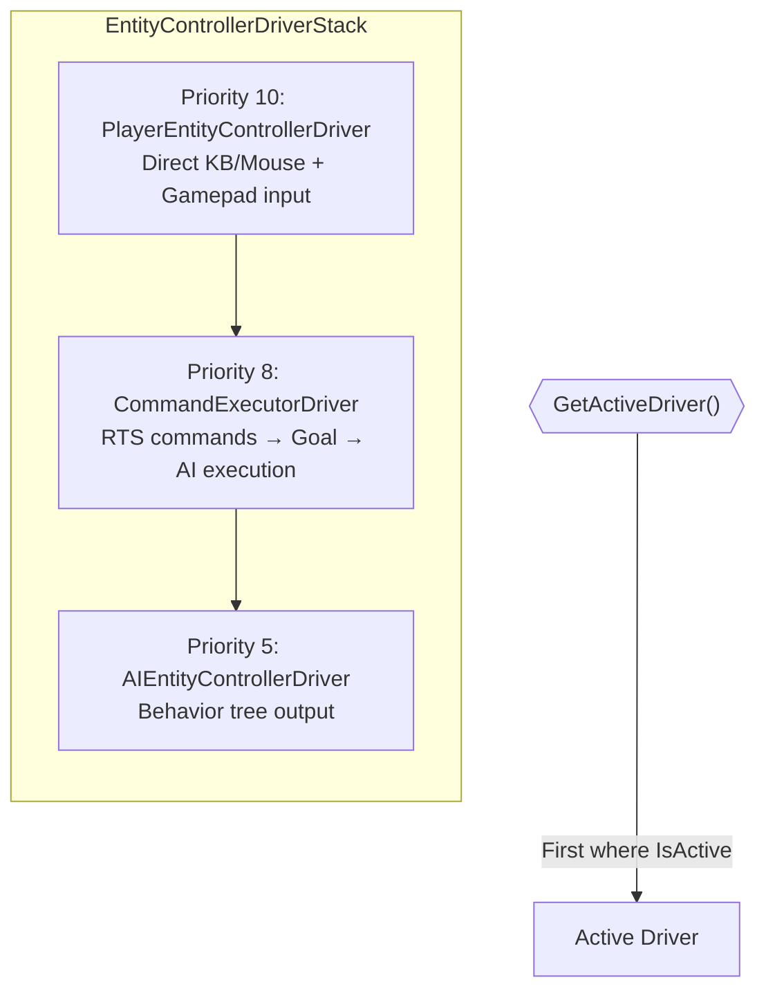
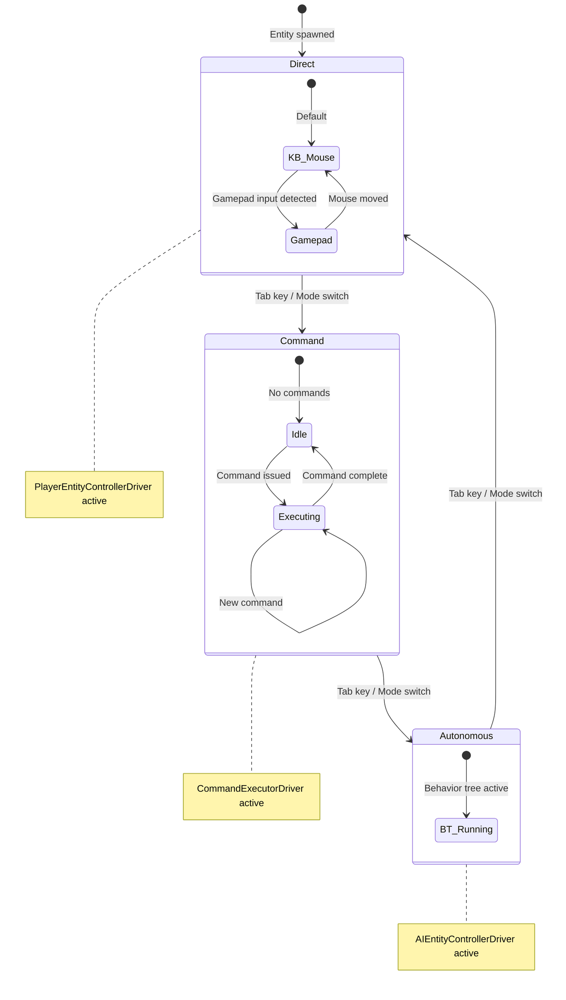
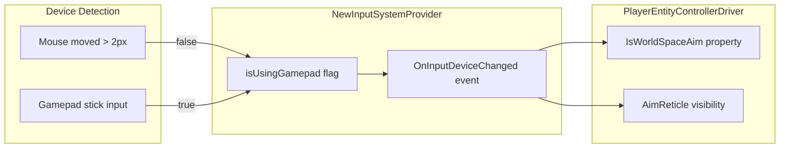
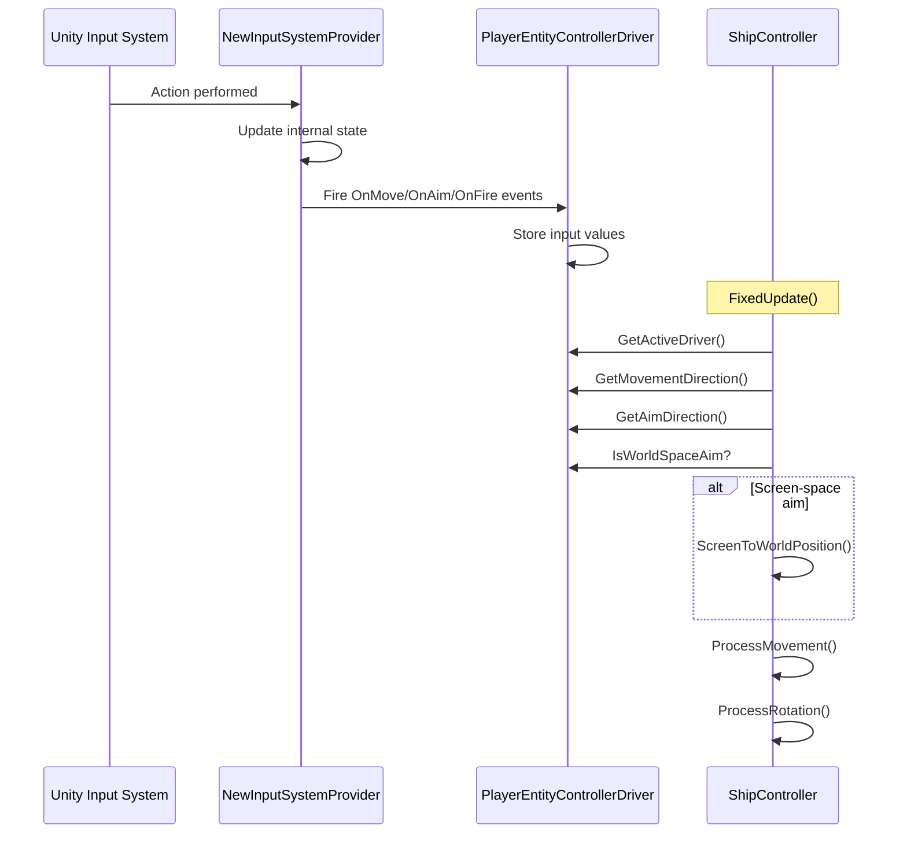
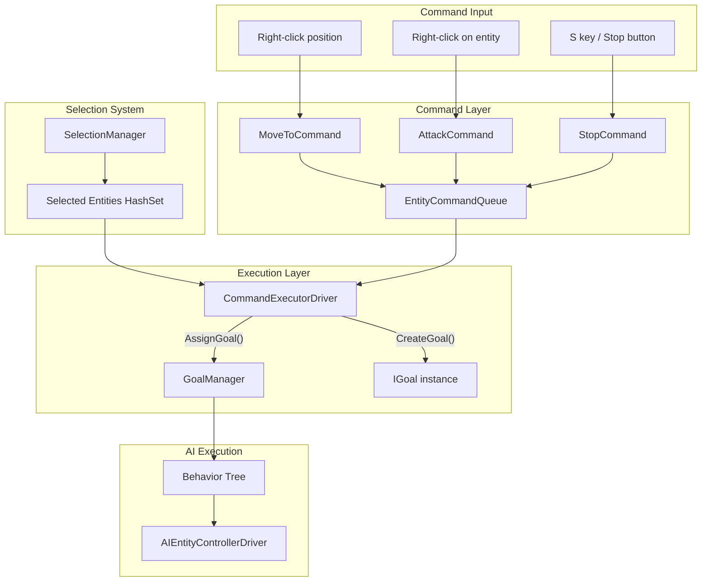
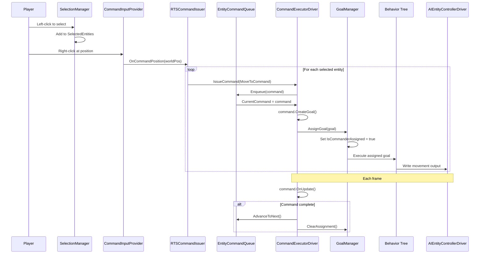
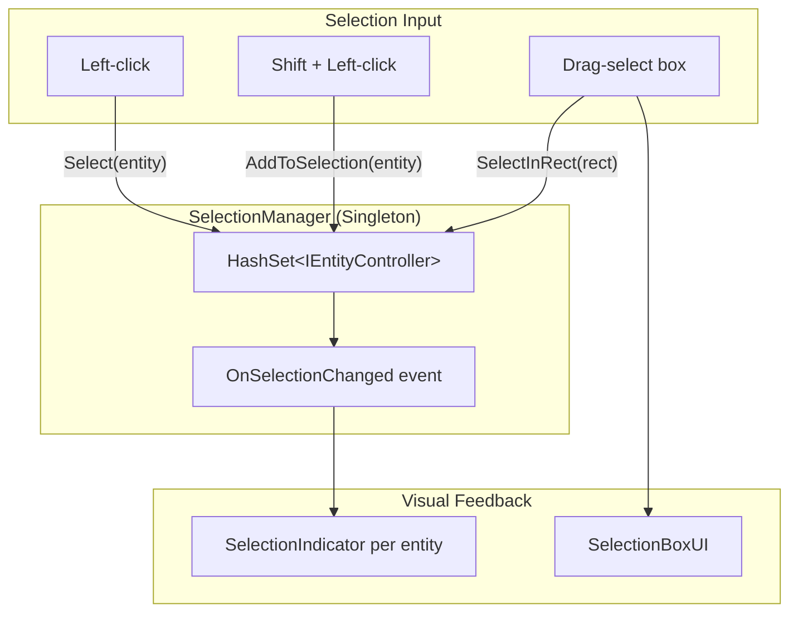
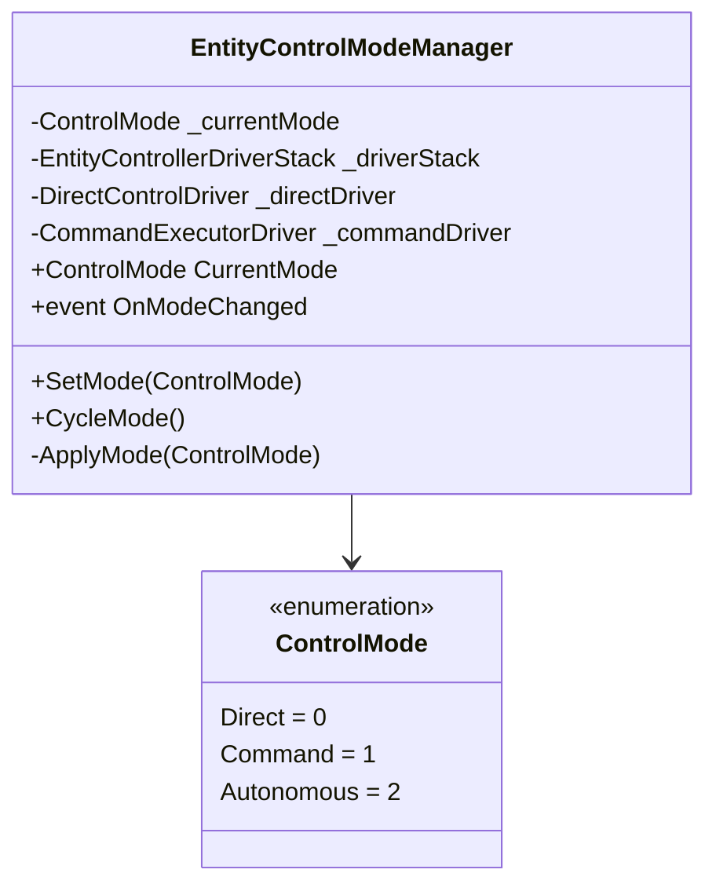
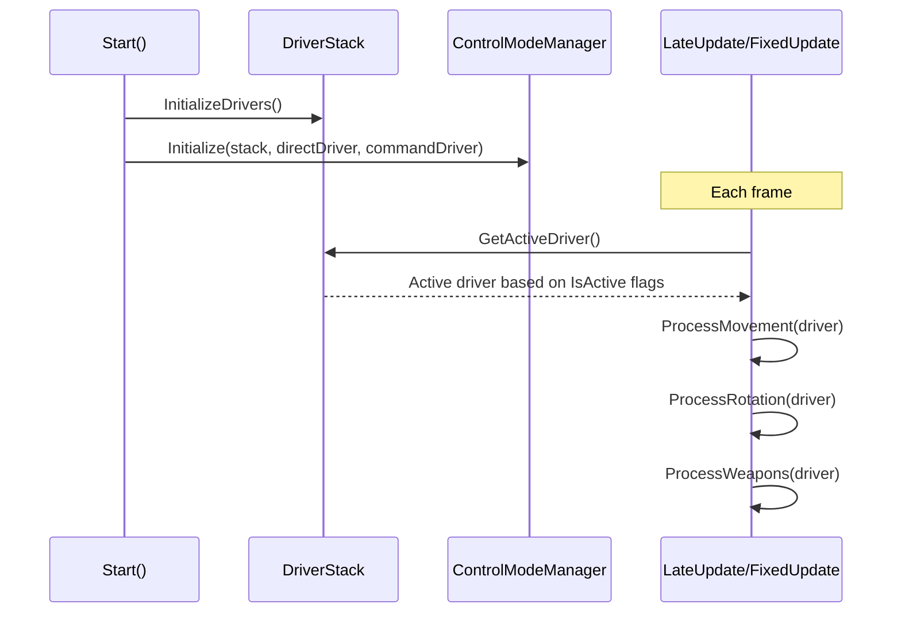

# Entity Control Modes

This document describes the 3-mode entity control system that allows entities to be controlled via direct input, RTS-style commands, or fully autonomous AI.

> **Architecture Note:** In the hybrid architecture, control modes are implemented through the `IBehaviorController` interface on ShipInstance. Direct mode uses `PlayerInputController`, Command mode uses `CommandExecutorController`, and Autonomous mode uses `BehaviorTreeController`. The DriverStack logic lives in ShipInstance, selecting which controller produces the ControlInput each tick. This only applies to Rich Entity Layer (Tier 0-1) ships.

> **Multiplayer:** Each control mode has a distinct networking pattern. **Direct mode:** client sends `ControlInput` via ServerRpc each tick; server applies it authoritatively; client predicts locally. **Command mode:** client sends command events (`MoveTo`, `Attack`, `Stop`) via ServerRpc; server creates goals and runs the AI behavior tree; client sees result via state replication. **Autonomous mode:** fully server-side AI; client interpolates the result. The server validates authority — only the owning player can send input/commands for their ship. See [[13-networking-architecture]].

---

## Overview

Each entity supports three distinct control modes:

| Mode | Description | Active Driver |
|------|-------------|---------------|
| **Direct** | Frame-by-frame input from keyboard/mouse or gamepad | PlayerInputController |
| **Command** | RTS-style point-and-click, AI executes commands | CommandExecutorController |
| **Autonomous** | Full AI behavior tree control, no player input | BehaviorTreeController |

**Key Design Principle:** Control modes are per-entity. In a fleet scenario, the player can directly control one ship while issuing commands to others.

### Network Authority Per Mode

| Mode | Client Sends | Server Does | Client Sees |
|------|-------------|-------------|-------------|
| **Direct** | `ControlInput` via ServerRpc (30 Hz) | Applies input, simulates physics | Local prediction + server corrections |
| **Command** | Command RPCs (`MoveTo`, `Attack`, `Stop`) | Creates goals, runs BT | State replication (interpolation) |
| **Autonomous** | Nothing | Full AI via BehaviorTree | State replication (interpolation) |

---

## Architecture



---

## Driver Priority Stack

The `EntityControllerDriverStack` maintains drivers sorted by priority. The first driver with `IsActive = true` becomes the active driver.



**Mode Switching Logic:**

| Mode | PlayerEntityControllerDriver | CommandExecutorDriver | AIEntityControllerDriver |
|------|------------------------------|----------------------|--------------------------|
| Direct | `IsActive = true` | `IsActive = false` | `IsActive = false` |
| Command | `IsActive = false` | `IsActive = true` | `IsActive = false` |
| Autonomous | `IsActive = false` | `IsActive = false` | `IsActive = true` |

---

## Control Mode State Machine



---

## Direct Mode

Direct mode provides immediate, frame-by-frame control. The `PlayerEntityControllerDriver` handles both keyboard/mouse and gamepad input through a unified interface.

### Input Device Detection

The `NewInputSystemProvider` detects which device is being used and fires `OnInputDeviceChanged`:



### IsWorldSpaceAim Behavior

| Device | IsWorldSpaceAim | GetAimDirection() Returns |
|--------|-----------------|---------------------------|
| Keyboard/Mouse | `false` | Screen-space mouse position |
| Gamepad | `true` | World-space reticle position |

**Why this matters:** The `ShipController` uses `IsWorldSpaceAim` to determine whether to convert aim input from screen-space to world-space.

### Direct Mode Data Flow



---

## Command Mode (RTS)

Command mode allows the player to issue high-level commands that the AI executes. This creates an RTS-style control scheme where the player directs entities rather than controlling them directly.

### Supported Commands

| Command | Description | Creates Goal |
|---------|-------------|--------------|
| **MoveTo** | Move to position and stop | PatrolGoal (single waypoint) |
| **Attack** | Engage specific target | CombatGoal |
| **Stop** | Cancel current command, halt | Clears queue, zeroes velocity |

### Command System Architecture



### EntityCommandQueue

The command queue supports RTS-style command queuing:

| Action | Behavior |
|--------|----------|
| Right-click | **Replace**: Clear queue, set as current command |
| Shift + Right-click | **Queue**: Add to end of queue |

```
Queue State Example:
┌─────────────────────────────────────────────────────┐
│ CurrentCommand: MoveToCommand(100, 200)  [Executing]│
│ Queue[0]: AttackCommand(EnemyShip)       [Pending]  │
│ Queue[1]: MoveToCommand(500, 300)        [Pending]  │
└─────────────────────────────────────────────────────┘
```

### Command Mode Data Flow



### GoalManager Integration

Commands leverage the existing `GoalManager.AssignGoal()` system:

```csharp
// Commander-assigned goals take priority
GoalManager.AssignGoal(goal);  // Sets IsCommanderAssigned = true

// When command completes
GoalManager.ClearAssignment(); // Returns to autonomous goal selection
```

The `IsCommanderAssigned` flag ensures the assigned goal takes precedence over the AI's autonomous goal selection via utility scoring.

---

## Selection System

Command mode requires a selection system for multi-entity control.

### SelectionManager



### Selection Visual Feedback

| Element | Description |
|---------|-------------|
| **SelectionIndicator** | Circle/outline around selected entities |
| **SelectionBoxUI** | Drag-select rectangle overlay |
| **CommandQueueVisualizer** | Waypoint lines and markers |

---

## Input Bindings

### Keyboard/Mouse

| Action | Binding | Context |
|--------|---------|---------|
| Cycle Control Mode | `Tab` | Always |
| Move | `WASD` | Direct mode |
| Aim | Mouse position | Direct mode |
| Fire | `Left Mouse` / `Space` | Direct mode |
| Warp | `Left Shift` | Direct mode |
| Hyperdrive | `H` | Direct mode |
| Select | `Left Mouse` | Command mode |
| Add to Selection | `Shift + Left Mouse` | Command mode |
| Issue Command | `Right Mouse` | Command mode |
| Queue Command | `Shift + Right Mouse` | Command mode |
| Stop | `S` | Command mode |

### Gamepad

| Action | Binding | Context |
|--------|---------|---------|
| Cycle Control Mode | `Start` | Always |
| Move | `Left Stick` | Direct mode |
| Aim | `Right Stick` | Direct mode |
| Fire | `Right Trigger` | Direct mode |
| Warp | `Left Bumper` | Direct mode |
| Hyperdrive | `Y / Triangle` | Direct mode |
| Issue Command | `A / Cross` | Command mode |
| Queue Command | `LT + A` | Command mode |
| Stop | `B / Circle` | Command mode |

---

## EntityControlModeManager

The `EntityControlModeManager` coordinates mode transitions:



**ApplyMode Logic:**

```
ApplyMode(Direct):
    DirectDriver.IsActive = true
    CommandDriver.IsActive = false
    // AIDriver becomes inactive by priority

ApplyMode(Command):
    DirectDriver.IsActive = false
    CommandDriver.IsActive = true
    // CommandDriver delegates to AIDriver

ApplyMode(Autonomous):
    DirectDriver.IsActive = false
    CommandDriver.IsActive = false
    // AIDriver becomes active (lowest priority)
```

---

## Integration with ShipController

The `ShipController` integrates control modes through the driver stack:



---

## Tier Considerations

Control modes only affect **Tier 0-1** entities (see [[03-tiered-simulation]]):

| Tier | Control Mode Support |
|------|---------------------|
| **Tier 0 (Loaded)** | Full support - all 3 modes |
| **Tier 1 (Active)** | Full support - all 3 modes |
| **Tier 2+ (Tactical/Strategic)** | Autonomous only - state machines |

When a controlled entity transitions to Tier 2+:
1. Control mode is forced to Autonomous
2. Commands in queue are preserved
3. When entity returns to Tier 0-1, previous mode can be restored

---

## Related Documents

- [[01-component-model]] - ControlInput component definition
- [[02-system-architecture]] - Input Group system execution
- [[03-tiered-simulation]] - Tier-based control restrictions
- [[04-archetype-strategy]] - Ship archetypes with control components
- [[12-modding-architecture]] - Mod-defined behaviors and control overrides
- [[13-networking-architecture]] - Input networking, command RPCs, prediction per control mode
