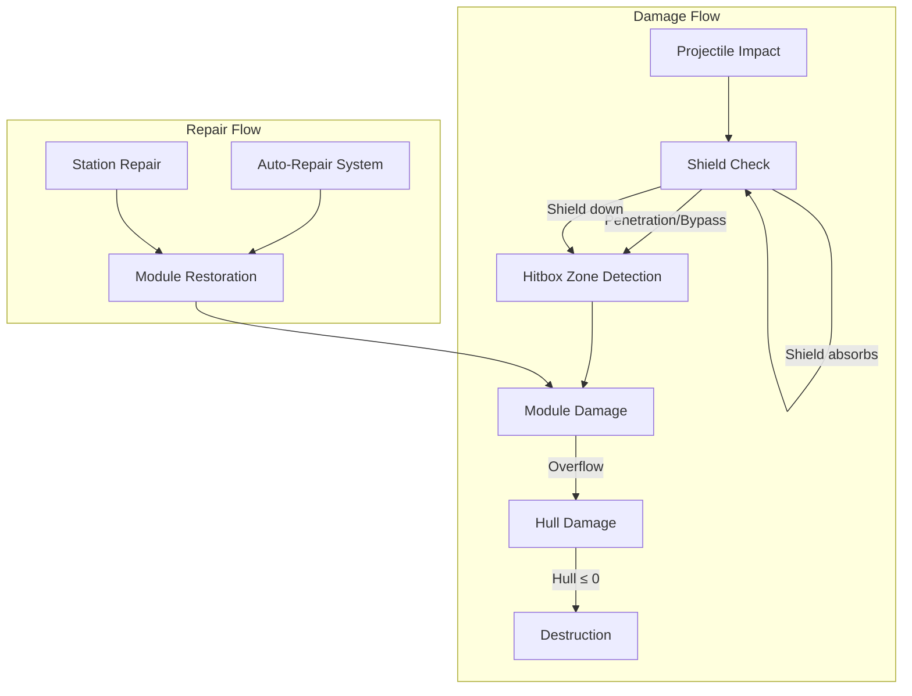
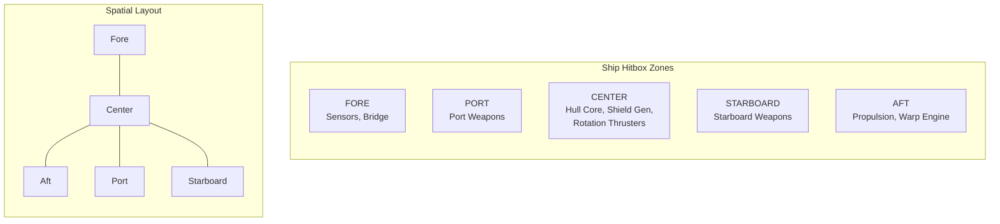
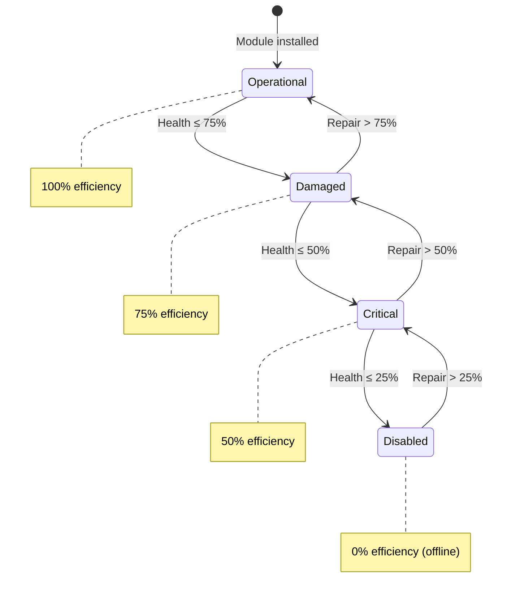
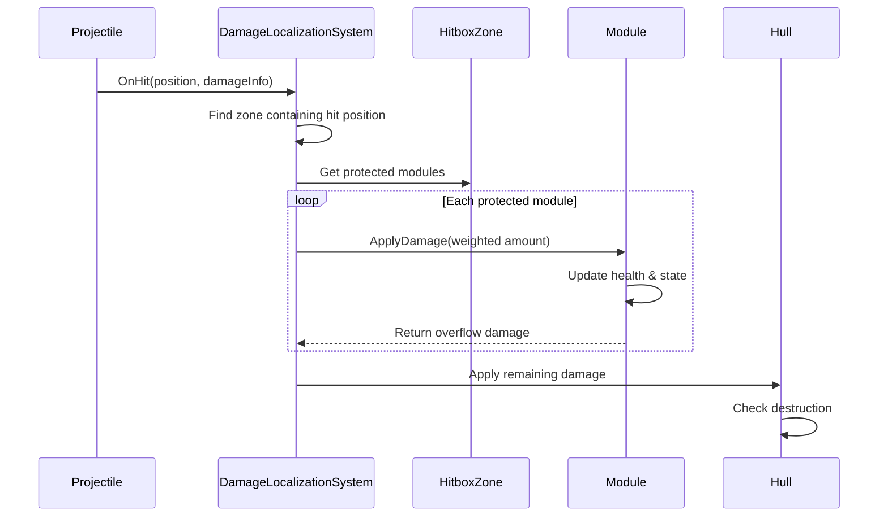
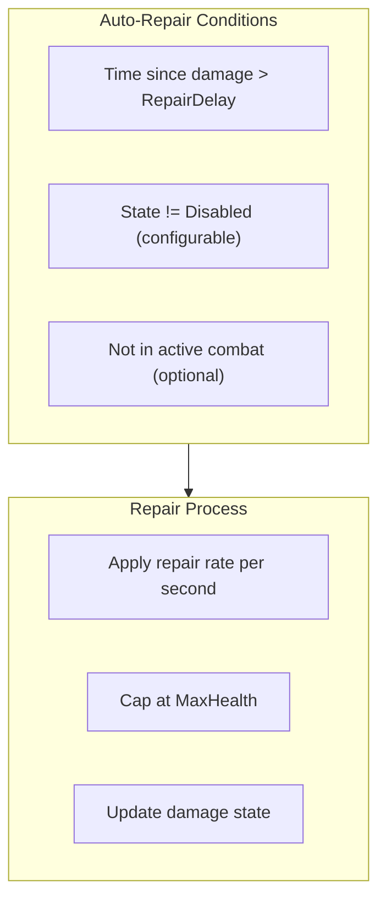
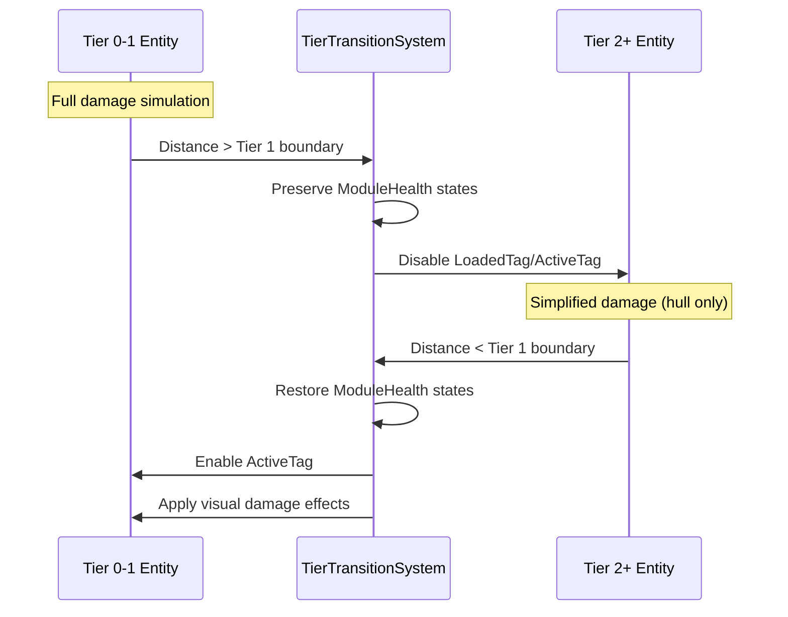

# Progressive Destruction System

This document defines the progressive destruction system for Starfire, enabling localized damage to entity subsystems based on impact location, with modules experiencing gradual degradation rather than binary destruction.

---

## Design Philosophy

**Key Principles:**
1. **Localized damage** - Where a projectile hits matters; different areas protect different systems
2. **Progressive degradation** - Modules degrade through states rather than instant destruction
3. **Meaningful choices** - Targeting specific systems creates tactical depth
4. **Performance-conscious** - Full simulation only for Tier 0-1 entities

**Integration with Existing Systems:**
- Extends the Shield → Hull damage pipeline with zone-based routing
- Uses existing module architecture (IShipModule, ShipModuleCategory)
- Respects tier system boundaries

---

## Overview



---

## Hitbox Zone System

### Zone Types

Entities are divided into hitbox zones, each protecting specific modules:



### HitboxZoneType Enum

```csharp
public enum HitboxZoneType : byte
{
    Center = 0,     // Default/fallback zone
    Fore = 1,       // Front of entity
    Aft = 2,        // Rear of entity
    Port = 3,       // Left side
    Starboard = 4,  // Right side
    Dorsal = 5,     // Top (for 3D or large entities)
    Ventral = 6,    // Bottom

    // Station-specific
    Upper = 10,
    Lower = 11,
    Ring = 12
}
```

### Zone Component

```csharp
/// <summary>
/// Defines a hitbox zone's geometry and damage absorption.
/// This is a plain struct embedded in HitboxZoneElement buffer, not a standalone component.
/// </summary>
public struct HitboxZone
{
    public HitboxZoneType ZoneType;
    public float2 LocalCenter;           // Center relative to entity origin
    public float2 LocalExtents;          // Half-size for AABB
    public float DamageAbsorption;       // 0-1, percentage of damage routed to modules (remainder goes to hull)
}

// Buffer of zones per entity (typically 3-5 zones)
public struct HitboxZoneElement : IBufferElementData
{
    public HitboxZone Zone;
}
```

### Zone-to-Module Mapping

```csharp
public struct ZoneModuleMapping : IBufferElementData
{
    public HitboxZoneType Zone;
    public ShipModuleCategory TargetCategory;  // Which module category takes damage
    public int TargetSlotIndex;                 // -1 = all slots in category
    public float DamageWeight;                  // Weight when multiple modules in zone (0-1)
}
```

### Default Ship Zone Mappings

| Zone | Protected Modules (Category) | Damage Weight |
|------|------------------------------|---------------|
| **Fore** | Sensors (`Sensor`) | 1.0 |
| **Aft** | Propulsion (`Propulsion`) | 1.0 |
| **Port** | Weapons port (`Offense`, slotIndex=0) | 1.0 |
| **Starboard** | Weapons starboard (`Offense`, slotIndex=1) | 1.0 |
| **Center** | Shield (`Defense`), Rotation (`Rotation`) | 0.5 / 0.5 |

**Note:** The `Structure` category (HullModule) is intentionally NOT mapped to zones. Hull damage comes from:
1. The non-absorbed portion of zone damage (`1 - DamageAbsorption`)
2. Overflow when module health is depleted

This avoids having two separate "hull health" pools. The `Comms` category (TransponderModule) is also typically not mapped since transponders are protected internally.

---

## Module Damage Components

### ModuleDamageState



```csharp
public enum ModuleDamageState : byte
{
    Operational = 0,   // 75-100% health, 100% efficiency
    Damaged = 1,       // 50-74% health, 75% efficiency
    Critical = 2,      // 25-49% health, 50% efficiency
    Disabled = 3       // 0-24% health, 0% efficiency (offline)
}
```

### ModuleHealthElement Buffer

Per-module health is tracked via `DynamicBuffer<ModuleHealthElement>` on ship entities. Each damageable module (Propulsion, Rotation, Shield, Sensors, Weapons) has one entry in the buffer. See [[01-component-model#ModuleHealthElement (Buffer)]] for the full definition.

**Key fields:**
- `Category` / `SlotIndex`: Identifies which module this health data applies to
- `MaxHealth` / `CurrentHealth`: Health values
- `State`: Derived `ModuleDamageState` from health percentage
- `TimeSinceLastDamage`: Used for auto-repair delay
- `EfficiencyMultiplier`: Returns efficiency based on state (1.0, 0.75, 0.5, 0.0)

### State Thresholds with Hysteresis

To prevent oscillation at boundaries, use hysteresis for state transitions:

| Transition | Health Threshold | Hysteresis |
|------------|------------------|------------|
| Operational → Damaged | ≤ 75% | +3% to return |
| Damaged → Critical | ≤ 50% | +3% to return |
| Critical → Disabled | ≤ 25% | +3% to return |
| Disabled → Critical | > 28% | - |
| Critical → Damaged | > 53% | - |
| Damaged → Operational | > 78% | - |

```csharp
public static class ModuleDamageStateHelper
{
    private const float HYSTERESIS = 0.03f;  // 3%

    public static ModuleDamageState CalculateState(float healthPercent, ModuleDamageState currentState)
    {
        return currentState switch
        {
            ModuleDamageState.Operational when healthPercent <= 0.75f => ModuleDamageState.Damaged,
            ModuleDamageState.Damaged when healthPercent <= 0.50f => ModuleDamageState.Critical,
            ModuleDamageState.Damaged when healthPercent > 0.75f + HYSTERESIS => ModuleDamageState.Operational,
            ModuleDamageState.Critical when healthPercent <= 0.25f => ModuleDamageState.Disabled,
            ModuleDamageState.Critical when healthPercent > 0.50f + HYSTERESIS => ModuleDamageState.Damaged,
            ModuleDamageState.Disabled when healthPercent > 0.25f + HYSTERESIS => ModuleDamageState.Critical,
            _ => currentState
        };
    }
}
```

---

## Damage Routing System

### DamageLocalizationSystem

Routes incoming damage to appropriate hitbox zones and modules:



### HitPosition in PendingDamage

The `PendingDamage` buffer element includes hit position and zone information:

```csharp
public struct PendingDamage : IBufferElementData
{
    public float Amount;
    public Entity Source;
    public DamageTypeEnum DamageType;
    public double2 ImpactPosition;       // Absolute world position (set by ProjectileSystem)
    public float2 LocalImpactPosition;   // Local position relative to target (set by DamageLocalizationSystem)
    public HitboxZoneType HitZone;       // Which zone was hit (set by DamageLocalizationSystem)
    public bool IsLocalized;             // True if damage should use zone system (false for Tier 2+)
}
```

**Field Population:**
- `ProjectileSystem` sets: `Amount`, `Source`, `DamageType`, `ImpactPosition`
- `DamageLocalizationSystem` sets: `LocalImpactPosition`, `HitZone`, `IsLocalized`
- `ModuleDamageSystem` reads: `HitZone`, `Amount`, `IsLocalized` to distribute damage

### LocalImpactPosition Calculation

The `LocalImpactPosition` is calculated by `DamageLocalizationSystem` when processing `PendingDamage` entries. It transforms the world-space `ImpactPosition` to local-space relative to the target entity's position and rotation:

```csharp
/// <summary>
/// Transform world impact position to entity local space for zone detection.
/// Called by DamageLocalizationSystem when processing PendingDamage.
/// </summary>
public static float2 WorldToLocalImpact(
    double2 impactWorldPos,
    double2 entityWorldPos,
    float entityRotationDegrees)
{
    // Translate to entity origin
    double2 relativePos = impactWorldPos - entityWorldPos;

    // Rotate by negative entity rotation to get local space
    float rotRad = math.radians(-entityRotationDegrees);
    float cos = math.cos(rotRad);
    float sin = math.sin(rotRad);

    return new float2(
        (float)(relativePos.x * cos - relativePos.y * sin),
        (float)(relativePos.x * sin + relativePos.y * cos)
    );
}
```

**When is this calculated?**
- `ProjectileSystem` sets `ImpactPosition` (world space) when queuing `PendingDamage`
- `DamageLocalizationSystem` calculates `LocalImpactPosition` using the target entity's `AbsolutePosition` and `Rotation` components before performing zone detection

### Zone Detection Algorithm

Called by `DamageLocalizationSystem` to determine which zone was hit. The result is stored in `PendingDamage.HitZone` for `ModuleDamageSystem` to use.

```csharp
/// <summary>
/// Find which hitbox zone contains the impact point.
/// Uses local-space AABB tests for efficiency.
/// Returns Center zone as fallback if no specific zone contains the point.
/// Called by DamageLocalizationSystem, result stored in PendingDamage.HitZone.
/// </summary>
public static HitboxZoneType FindZoneAtPosition(
    DynamicBuffer<HitboxZoneElement> zones,
    float2 localPosition)
{
    // Check each zone's AABB
    foreach (var element in zones)
    {
        var zone = element.Zone;
        float2 min = zone.LocalCenter - zone.LocalExtents;
        float2 max = zone.LocalCenter + zone.LocalExtents;

        if (localPosition.x >= min.x && localPosition.x <= max.x &&
            localPosition.y >= min.y && localPosition.y <= max.y)
        {
            return zone.ZoneType;
        }
    }

    // Fallback to Center zone - this handles edge cases where impact is
    // outside all defined zones (e.g., glancing hits at entity bounds)
    return HitboxZoneType.Center;
}
```

**Center Zone Requirement:**

The `Center` zone is **mandatory** for all hitbox configurations. It serves as the fallback zone for:
- Impacts outside other defined zones (glancing hits)
- Entities with minimal zone definitions
- Default damage routing when zone detection fails

Config validation should **reject** configurations missing a Center zone. The Center zone typically contains:
- Structure (hull core)
- Defense (shield generator)
- Rotation (maneuvering thrusters)

If no mappings exist for the Center zone (config error), all damage for that zone passes directly to hull.

**Zone Overlap Policy:** Hitbox zones should be configured with non-overlapping AABBs. If zones do overlap, the first matching zone in buffer order is returned. The `Center` zone should be positioned to cover the entity's core without overlapping perimeter zones (Fore, Aft, Port, Starboard). Config validation should warn if overlapping zones are detected.

### Damage Distribution

When a zone is hit, damage is split between modules and hull based on `DamageAbsorption`:

- **DamageAbsorption** (0-1): Percentage of incoming damage that modules in this zone can absorb
- **Remaining damage** (1 - DamageAbsorption): Passes directly to hull

Example: Zone with `DamageAbsorption = 0.7` hit for 100 damage:
- 70 damage distributed to modules in zone (by weight)
- 30 damage goes directly to hull

### Zone Lookup by Type

`PendingDamage.HitZone` contains only the `HitboxZoneType` enum (set by `DamageLocalizationSystem`). To access the full `HitboxZone` struct (which contains `DamageAbsorption`), `ModuleDamageSystem` must look it up from the entity's `HitboxZoneElement` buffer:

```csharp
/// <summary>
/// Find a hitbox zone by type from the entity's zone buffer.
/// Called by ModuleDamageSystem before distributing damage.
/// </summary>
public static bool TryGetZoneByType(
    DynamicBuffer<HitboxZoneElement> zoneBuffer,
    HitboxZoneType zoneType,
    out HitboxZone zone)
{
    for (int i = 0; i < zoneBuffer.Length; i++)
    {
        if (zoneBuffer[i].Zone.ZoneType == zoneType)
        {
            zone = zoneBuffer[i].Zone;
            return true;
        }
    }

    zone = default;
    return false;
}
```

**Usage in ModuleDamageSystem:**
```csharp
// Skip non-localized damage (Tier 2+ entities bypass zone routing)
if (!pendingDamage.IsLocalized)
    continue;

if (!TryGetZoneByType(zoneBuffer, pendingDamage.HitZone, out var hitZone))
{
    // Zone not found (config error) - pass all damage to hull
    hullDamage += pendingDamage.Amount;
    continue;
}

float overflow = DistributeDamageToModules(
    pendingDamage.Amount,
    hitZone,
    mappingBuffer,
    healthBuffer);
hullDamage += overflow;
```

Called by `ModuleDamageSystem` using the `HitZone` from `PendingDamage`:

```csharp
/// <summary>
/// Distribute damage to modules protected by the hit zone.
/// Returns overflow damage that should go to hull.
/// Called by ModuleDamageSystem using PendingDamage.HitZone.
/// </summary>
public static float DistributeDamageToModules(
    float incomingDamage,
    in HitboxZone hitZone,
    DynamicBuffer<ZoneModuleMapping> mappings,
    DynamicBuffer<ModuleHealthElement> moduleHealth)
{
    // Step 1: Split damage based on zone's absorption rate
    float absorbableDamage = incomingDamage * hitZone.DamageAbsorption;
    float directHullDamage = incomingDamage * (1f - hitZone.DamageAbsorption);

    // Step 2: Calculate total weight for modules in this zone
    float totalWeight = 0f;
    foreach (var mapping in mappings)
    {
        if (mapping.Zone == hitZone.ZoneType)
            totalWeight += mapping.DamageWeight;
    }

    // If no modules in zone, all absorbable damage also goes to hull
    if (totalWeight <= 0f)
        return incomingDamage;

    // Step 3: Distribute absorbable damage to modules by weight
    float overflowDamage = 0f;
    foreach (var mapping in mappings)
    {
        if (mapping.Zone != hitZone.ZoneType)
            continue;

        float moduleDamage = absorbableDamage * (mapping.DamageWeight / totalWeight);
        float absorbed = ApplyModuleDamage(
            moduleHealth,
            mapping.TargetCategory,
            mapping.TargetSlotIndex,
            moduleDamage);

        // Damage not absorbed by module overflows to hull
        overflowDamage += (moduleDamage - absorbed);
    }

    // Total hull damage = direct hull damage + module overflow
    return directHullDamage + overflowDamage;
}

/// <summary>
/// Apply damage to a specific module in the health buffer.
/// Returns the amount of damage actually absorbed.
/// </summary>
private static float ApplyModuleDamage(
    DynamicBuffer<ModuleHealthElement> healthBuffer,
    ShipModuleCategory category,
    int slotIndex,
    float damage)
{
    for (int i = 0; i < healthBuffer.Length; i++)
    {
        var health = healthBuffer[i];
        if (health.Category != category)
            continue;
        if (slotIndex >= 0 && health.SlotIndex != slotIndex)
            continue;

        // Module can only absorb up to its current health
        float absorbed = math.min(damage, health.CurrentHealth);
        health.CurrentHealth -= absorbed;
        health.TimeSinceLastDamage = 0f;
        health.State = ModuleDamageStateHelper.CalculateState(
            health.HealthPercentage,
            health.State);

        healthBuffer[i] = health;
        return absorbed;
    }

    // Module not found - damage not absorbed
    return 0f;
}
```

---

## Shield and Zone Interaction

**Key Distinction:** The shield system has two separate health pools:

1. **Shield Energy** (`ShieldModule.CurrentCapacity`) - Depleted when absorbing incoming damage. Regenerates over time via `RegenRate`.

2. **Shield Generator Health** (`ModuleHealthElement` with `Category = Defense`) - The physical health of the shield generator equipment. Affects `RegenRate` via efficiency multiplier.

**Damage Flow:**

```
Incoming Damage
     │
     ▼
Shield Absorption ─────────► Depletes ShieldModule.CurrentCapacity
     │
     │ (Remaining damage after absorption)
     ▼
Zone Detection ────────────► Finds hit zone from LocalImpactPosition
     │
     ▼
Zone Damage Distribution ──► Distributes to modules (including Defense/shield generator)
     │
     ▼
Hull Overflow ─────────────► Non-absorbed + module overflow → HullModule
```

**Shield Absorption:** Happens BEFORE zone detection. Shield energy absorbs incoming damage regardless of hit location. Only the remaining (non-absorbed) damage proceeds to zone routing.

**Shield Generator Damage:** The "Defense" category in zone mappings damages the shield GENERATOR (the equipment), not the shield energy. When the shield generator is damaged:
- `EfficiencyMultiplier` decreases (75% at Damaged, 50% at Critical, 0% at Disabled)
- `RegenRate * EfficiencyMultiplier` = effective regeneration rate
- Existing shield capacity remains until depleted; it just won't regenerate as fast
- At Disabled state: shields cannot regenerate at all

**Penetration:** Currently, all damage that exceeds shield capacity passes through. Future enhancement could add damage-type-specific penetration (e.g., kinetic penetrates more than energy). This would be implemented in `DamageLocalizationSystem.ApplyShieldAbsorption()`.

---

## Module Efficiency Effects

When modules are damaged, their efficiency affects their output. Systems query both the module component and the `ModuleHealthElement` buffer to calculate effective values.

### Accessing Efficiency Multipliers

Since module health is stored in a buffer separate from module components, systems must look up the efficiency:

```csharp
/// <summary>
/// Helper to get efficiency multiplier for a module category.
/// </summary>
public static float GetModuleEfficiency(
    DynamicBuffer<ModuleHealthElement> healthBuffer,
    ShipModuleCategory category,
    int slotIndex = -1)
{
    for (int i = 0; i < healthBuffer.Length; i++)
    {
        var health = healthBuffer[i];
        if (health.Category == category &&
            (slotIndex < 0 || health.SlotIndex == slotIndex))
        {
            return health.EfficiencyMultiplier;
        }
    }
    return 1.0f;  // No health entry = assume operational
}
```

### System Query Pattern

Systems that need efficiency multipliers query both components:

```csharp
[BurstCompile]
public partial struct MovementSystem : ISystem
{
    public void OnUpdate(ref SystemState state)
    {
        foreach (var (propulsion, healthBuffer, velocity) in
            SystemAPI.Query<RefRO<PropulsionModule>,
                           DynamicBuffer<ModuleHealthElement>,
                           RefRW<Velocity>>()
                     .WithAll<ActiveTag>())
        {
            float efficiency = GetModuleEfficiency(
                healthBuffer,
                ShipModuleCategory.Propulsion);

            float effectiveAccel = propulsion.ValueRO.Acceleration * efficiency;
            float effectiveMaxSpeed = propulsion.ValueRO.MaxSpeed * efficiency;

            // Apply movement with effective values...
        }
    }
}
```

### Efficiency Effects by Module

| Module | Affected Stats | Disabled Behavior |
|--------|----------------|-------------------|
| **Propulsion** | MaxSpeed, Acceleration | Ship drifts, cannot accelerate |
| **Rotation** | TurnRate, ThrusterTorque | Ship cannot turn |
| **Shield** | RegenRate | Shields cannot regenerate (existing capacity remains) |
| **Weapon** | FireRate, Damage | Cannot fire |
| **Sensor** | Range, RefreshRate (inverse) | No detection, entity is "blind" |

### PropulsionModule

```csharp
// In MovementSystem:
float efficiency = GetModuleEfficiency(healthBuffer, ShipModuleCategory.Propulsion);
float effectiveMaxSpeed = propulsion.MaxSpeed * efficiency;
float effectiveAcceleration = propulsion.Acceleration * efficiency;

// Disabled (efficiency = 0): ship cannot accelerate, only drift
```

### RotationModule

```csharp
// In RotationSystem:
float efficiency = GetModuleEfficiency(healthBuffer, ShipModuleCategory.Rotation);
float effectiveTurnRate = rotation.TurnRate * efficiency;
float effectiveThrusterTorque = rotation.ThrusterTorque * efficiency;

// Disabled: ship cannot turn
```

### ShieldModule

```csharp
// In ShieldRegenSystem:
float efficiency = GetModuleEfficiency(healthBuffer, ShipModuleCategory.Defense);
float effectiveRegenRate = shield.RegenRate * efficiency;

// Disabled: shields cannot regenerate
// Note: Existing shield capacity remains until depleted
```

### WeaponModule

```csharp
// In WeaponSystem:
for (int i = 0; i < weaponBuffer.Length; i++)
{
    float efficiency = GetModuleEfficiency(healthBuffer, ShipModuleCategory.Offense, i);

    if (efficiency <= 0f)
        continue;  // Disabled weapon cannot fire

    float effectiveFireRate = weapon.FireRate * efficiency;
    float effectiveDamage = weapon.Damage * efficiency;
    // ...
}
```

### SensorModule

```csharp
// In SensorSystem:
float efficiency = GetModuleEfficiency(healthBuffer, ShipModuleCategory.Sensor);
float effectiveRange = sensor.Range * efficiency;
float effectiveRefreshRate = sensor.RefreshRate / math.max(0.1f, efficiency);  // Slower when damaged

// Disabled: no detection capability, entity is "blind"
```

---

## Repair Systems

### Auto-Repair System

Modules automatically repair over time when not taking damage:



```csharp
public struct RepairConfiguration : IComponentData
{
    public float RepairDelayAfterDamage;   // Seconds before auto-repair starts (default: 5s)
    public float BaseRepairRatePerSecond;  // Percentage of MaxHealth restored per second (0.02 = 2%)
    public bool CanAutoRepairDisabled;     // Can auto-repair fix Disabled modules? (default: false)
    public bool RequiresOutOfCombat;       // Additional out-of-combat check beyond damage delay (default: false)
}
```

**RepairDelayAfterDamage vs RequiresOutOfCombat:**

These are **separate conditions** that can be combined:

- **RepairDelayAfterDamage**: Satisfied when `TimeSinceLastDamage >= RepairDelayAfterDamage`. This is a simple timer that resets on any damage. Used alone, this allows "repair while being shot" if shots are infrequent enough.

- **RequiresOutOfCombat**: When `true`, adds an additional check beyond the damage delay. The entity must also have no hostile entities within sensor range. This prevents repair during active engagements even if momentarily not taking damage.

| RequiresOutOfCombat | RepairDelayAfterDamage | Behavior |
|---------------------|------------------------|----------|
| `false` | 5s | Repairs start 5s after last damage, regardless of nearby enemies |
| `true` | 5s | Repairs start 5s after last damage AND no enemies in sensor range |

**Implementation:**
```csharp
bool canRepair = health.TimeSinceLastDamage >= config.RepairDelayAfterDamage;

if (config.RequiresOutOfCombat && canRepair)
{
    // Additional check: query faction sensor pool for nearby hostiles
    // NOTE: Uses base sensor range, NOT effective range (see edge case below)
    float checkRange = GetRepairCheckRange(entity);
    canRepair = !HasHostilesInRange(entity, checkRange);
}

/// <summary>
/// Get the range to use for hostile proximity check during repair.
/// Uses base sensor range if available, otherwise falls back to default.
/// </summary>
private float GetRepairCheckRange(Entity entity)
{
    const float DEFAULT_REPAIR_CHECK_RANGE = 500f;  // Fallback if no sensor

    if (SystemAPI.HasComponent<SensorModule>(entity))
    {
        return SystemAPI.GetComponent<SensorModule>(entity).Range;  // Base range, not effective
    }
    return DEFAULT_REPAIR_CHECK_RANGE;
}

/// <summary>
/// Check if any hostile entities are within the specified range.
/// Queries the faction's shared detection pool.
/// </summary>
private bool HasHostilesInRange(Entity entity, float range)
{
    // Get entity's faction
    if (!SystemAPI.HasComponent<FactionData>(entity))
        return false;  // No faction = no hostiles

    var faction = SystemAPI.GetComponent<FactionData>(entity);
    var position = SystemAPI.GetComponent<AbsolutePosition>(entity);
    double2 entityPos = new double2(position.X, position.Y);

    // Get faction relationship matrix
    var relations = SystemAPI.GetSingleton<FactionRelationshipMatrix>();

    // Query faction's detection pool for nearby hostiles
    foreach (var (pool, detections) in
        SystemAPI.Query<RefRO<FactionSensorPool>, DynamicBuffer<FactionDetection>>())
    {
        // Only check our faction's detections
        if (pool.ValueRO.FactionIndex != faction.FactionIndex)
            continue;

        foreach (var detection in detections)
        {
            // Skip invalid detections
            if (detection.Distance > range)
                continue;

            // Check if detected entity is hostile
            // Need to get the detected entity's faction
            if (!SystemAPI.HasComponent<FactionData>(detection.DetectedEntity.Entity))
                continue;

            var detectedFaction = SystemAPI.GetComponent<FactionData>(
                detection.DetectedEntity.Entity);

            if (relations.IsHostile(faction.FactionIndex, detectedFaction.FactionIndex))
            {
                // Verify distance (detection.Distance may be stale)
                var detectedPos = detection.Position;
                double distSq = math.distancesq(entityPos, detectedPos);
                if (distSq <= (double)range * range)
                {
                    return true;  // Hostile in range
                }
            }
        }
    }

    return false;  // No hostiles in range
}
```

**Edge Case: Disabled Sensors + RequiresOutOfCombat**

If `RequiresOutOfCombat = true` and the entity's `SensorModule` is disabled (efficiency = 0), using `effectiveRange = Range * efficiency = 0` would mean no hostiles detected, allowing repair even with enemies adjacent.

**Design decision:** The hostile check uses the **base sensor range** (ignoring efficiency) rather than effective range. This ensures:
- A ship with disabled sensors still cannot repair while enemies are nearby
- The "blind" state affects target acquisition and detection, not the safety check for repair
- Gameplay consequence: damaged sensors don't give a repair advantage in combat

Alternative design (not used): Allow repair with disabled sensors as a risk/reward trade-off. Document this if you prefer that behavior.

### ModuleRepairSystem

```csharp
[UpdateInGroup(typeof(SimulationSystemGroup))]
[UpdateAfter(typeof(HullDamageSystem))]
public partial struct ModuleRepairSystem : ISystem
{
    [BurstCompile]
    public void OnUpdate(ref SystemState state)
    {
        float dt = SystemAPI.Time.DeltaTime;

        foreach (var (healthBuffer, config) in
            SystemAPI.Query<DynamicBuffer<ModuleHealthElement>, RefRO<RepairConfiguration>>())
        {
            // Process each module in the buffer
            for (int i = 0; i < healthBuffer.Length; i++)
            {
                var health = healthBuffer[i];

                // Update time since last damage
                health.TimeSinceLastDamage += dt;

                // Skip if recently damaged
                if (health.TimeSinceLastDamage < config.ValueRO.RepairDelayAfterDamage)
                {
                    healthBuffer[i] = health;
                    continue;
                }

                // Skip if disabled and auto-repair disabled modules not allowed
                if (health.State == ModuleDamageState.Disabled &&
                    !config.ValueRO.CanAutoRepairDisabled)
                    continue;

                // Skip if already at max health
                if (health.CurrentHealth >= health.MaxHealth)
                    continue;

                // Apply repair (BaseRepairRatePerSecond is a percentage, e.g., 0.02 = 2%)
                float repairAmount = health.MaxHealth *
                                     config.ValueRO.BaseRepairRatePerSecond * dt;
                health.CurrentHealth = math.min(
                    health.CurrentHealth + repairAmount,
                    health.MaxHealth);

                // Update state
                health.State = ModuleDamageStateHelper.CalculateState(
                    health.HealthPercentage,
                    health.State);

                healthBuffer[i] = health;
            }
        }
    }
}
```

### Station Repair

When docked at a station with repair services:

| Repair Type | Rate | Cost | Notes |
|-------------|------|------|-------|
| Standard | 10x auto-repair rate | Per health point | Available at most stations |
| Full | Instant | Fixed + per module | Repairs all modules fully |
| Emergency | 5x auto-repair rate | 2x standard cost | Available during combat (some stations) |

Station repair can fix Disabled modules, unlike auto-repair.

---

## Tier Integration

### Tier 0-1: Full Implementation

- Full hitbox zone collision detection
- Per-module damage tracking and efficiency effects
- Visual damage effects (sparks, smoke, fire)
- Auto-repair active

### Tier 2+: Simplified

- No spatial hitbox detection
- Damage goes directly to hull (existing behavior)
- Module damage states preserved but not updated
- No visual effects (no GameObject)

**System Flow for Tier 2+ Entities:**

When `DamageLocalizationSystem` processes a `PendingDamage` entry for a Tier 2+ entity:

1. **DamageLocalizationSystem**: Detects entity lacks `ActiveTag` (Tier 2+)
   - Performs shield absorption (shields still function at Tier 2+)
   - **Skips** zone detection and module routing
   - Passes remaining damage directly to `HullDamageSystem` via modified `PendingDamage`

2. **ModuleDamageSystem**: **Skips** processing (no zone data in `PendingDamage`)

3. **HullDamageSystem**: Applies armor reduction and updates hull integrity

```csharp
// In DamageLocalizationSystem:
if (!SystemAPI.IsComponentEnabled<ActiveTag>(entity))
{
    // Tier 2+: Shield absorption only, skip zone/module routing
    float shieldAbsorbed = ApplyShieldAbsorption(ref shield, damage.Amount);
    float remainingDamage = damage.Amount - shieldAbsorbed;

    // Mark as non-localized so MDS skips it
    damage.IsLocalized = false;
    damage.Amount = remainingDamage;
    // HullDamageSystem will process this directly
}
```

### Tier Transition Handling



**State Preservation Mechanism:**

Module damage states are preserved across tier transitions because:

1. **No Archetype Changes:** Tier tags use `IEnableableComponent` (see [[01-component-model#Tag Components]]), so tier transitions don't cause structural changes. All components, including `ModuleHealthElement` buffer, remain on the entity.

2. **Buffer Data Persists:** The `DynamicBuffer<ModuleHealthElement>` data persists in ECS memory. Health values, damage states, and `TimeSinceLastDamage` are retained even when the entity is in Tier 2+.

3. **Simplified Damage at Tier 2+:** While in Tier 2+, `DamageLocalizationSystem` marks `PendingDamage.IsLocalized = false`, bypassing zone routing. Damage goes directly to hull. **Module states are NOT updated by Tier 2 damage** - this is intentional simplification.

**Implications:**

| Scenario | Behavior |
|----------|----------|
| Entity demoted to Tier 2 with Damaged modules | States preserved as-is, efficiency effects inactive (no simulation) |
| Entity takes damage at Tier 2 | Hull only, module states unchanged |
| Entity promoted back to Tier 1 | Original module states resume, efficiency effects reactivate |
| Entity demoted → takes damage → promoted | Module states from demotion, hull reduced by Tier 2 damage |

**Trade-off:** This means a ship that takes heavy damage at Tier 2 won't have granular module damage when returning to Tier 1. The design prioritizes performance over simulation fidelity at distance. For Critical entities that stay at Tier 2 minimum, this ensures they maintain consistent module states when players approach.

When demoting to Tier 2+:
- `ModuleHealthElement` buffer remains on entity unchanged
- Health values and states preserved in memory
- No efficiency effects applied (systems don't query module health at Tier 2+)

When promoting to Tier 0-1:
- `ModuleHealthElement` buffer read by systems again
- Visual damage effects applied based on stored states
- Efficiency multipliers become active

---

## Damage Effects System

### Visual Effects by State

| State | Particle Effects | Audio | Other |
|-------|-----------------|-------|-------|
| **Operational** | None | Normal operation sounds | - |
| **Damaged** | Occasional sparks | Warning beeps (configurable) | Slight visual flicker |
| **Critical** | Smoke particles | Alarm (configurable) | Heavy visual degradation |
| **Disabled** | Fire/flames | Explosion on transition | Offline visuals |

### DamageEffectsSystem

**Note:** This system reads `ModuleHealthElement` buffer directly and tracks state changes via `EntityDamageEffects.PreviousWorstState` comparison. It does NOT consume damage event buffers (`ModuleDamagedEvent`, etc.). This design allows it to run in Presentation Group without timing conflicts with `DamageEventCleanupSystem` in Combat Group.

```csharp
/// <summary>
/// Tracks the worst damage state across all modules for visual effects.
/// </summary>
public struct EntityDamageEffects : IComponentData
{
    public ModuleDamageState WorstModuleState;    // Most damaged module
    public ModuleDamageState PreviousWorstState;  // For detecting state changes
    public int DisabledModuleCount;               // How many modules are disabled
}

[UpdateInGroup(typeof(PresentationSystemGroup))]
public partial struct DamageEffectsSystem : ISystem
{
    public void OnUpdate(ref SystemState state)
    {
        foreach (var (healthBuffer, effects, entity) in
            SystemAPI.Query<DynamicBuffer<ModuleHealthElement>, RefRW<EntityDamageEffects>>()
                     .WithAll<LoadedTag>()  // Only Tier 0
                     .WithEntityAccess())
        {
            // Find worst state across all modules
            var worstState = ModuleDamageState.Operational;
            int disabledCount = 0;

            for (int i = 0; i < healthBuffer.Length; i++)
            {
                var moduleState = healthBuffer[i].State;
                if (moduleState > worstState)
                    worstState = moduleState;
                if (moduleState == ModuleDamageState.Disabled)
                    disabledCount++;
            }

            effects.ValueRW.WorstModuleState = worstState;
            effects.ValueRW.DisabledModuleCount = disabledCount;

            // Check for state transitions
            if (worstState != effects.ValueRO.PreviousWorstState)
            {
                UpdateEffectsForState(entity, worstState, effects.ValueRO.PreviousWorstState);
                effects.ValueRW.PreviousWorstState = worstState;
            }

            // Update continuous effects (sparks, smoke intensity based on worst state)
            UpdateContinuousEffects(entity, worstState, disabledCount);
        }
    }

    private void UpdateEffectsForState(Entity entity, ModuleDamageState newState, ModuleDamageState oldState)
    {
        // Trigger transition effects (explosion sound when module disables, etc.)
    }

    private void UpdateContinuousEffects(Entity entity, ModuleDamageState worstState, int disabledCount)
    {
        // Update particle intensity based on damage state
        // More disabled modules = more fire/smoke effects
    }
}
```

---

## Configuration Layer

### HitboxZoneConfiguration BlobAsset

```csharp
public struct HitboxZoneConfigBlob
{
    public FixedString64Bytes ConfigId;
    public BlobArray<HitboxZoneDef> Zones;
    public BlobArray<ZoneModuleMappingDef> Mappings;
}

public struct HitboxZoneDef
{
    public HitboxZoneType Type;
    public float2 LocalCenter;
    public float2 LocalExtents;
    public float DamageAbsorption;
}

public struct ZoneModuleMappingDef
{
    public HitboxZoneType Zone;
    public ShipModuleCategory Category;
    public int SlotIndex;
    public float DamageWeight;
}
```

### JSON Schema

The full JSON schema for hitbox zone configuration is defined in [[05-configuration-layer#Hitbox Zone JSON Schema]]. Key properties:

- `configId`: Unique identifier for the hitbox configuration
- `zones[]`: Array of zone definitions with `type`, `center`, `extents`, `damageAbsorption`
- `mappings[]`: Array of zone-to-module mappings with `zone`, `category`, `slotIndex`, `weight`
- `repair`: Optional repair configuration overrides

### Example Configuration: Light Fighter

```json
{
  "configId": "hitbox_fighter_light",
  "zones": [
    {
      "type": "Fore",
      "center": [2.0, 0.0],
      "extents": [1.0, 0.8],
      "damageAbsorption": 0.7
    },
    {
      "type": "Center",
      "center": [0.0, 0.0],
      "extents": [1.5, 1.0],
      "damageAbsorption": 0.9
    },
    {
      "type": "Aft",
      "center": [-2.0, 0.0],
      "extents": [1.0, 0.6],
      "damageAbsorption": 0.6
    },
    {
      "type": "Port",
      "center": [0.0, 1.5],
      "extents": [1.0, 0.5],
      "damageAbsorption": 0.5
    },
    {
      "type": "Starboard",
      "center": [0.0, -1.5],
      "extents": [1.0, 0.5],
      "damageAbsorption": 0.5
    }
  ],
  "mappings": [
    { "zone": "Fore", "category": "Sensor", "slotIndex": -1, "weight": 1.0 },
    { "zone": "Aft", "category": "Propulsion", "slotIndex": -1, "weight": 1.0 },
    { "zone": "Port", "category": "Offense", "slotIndex": 0, "weight": 1.0 },
    { "zone": "Starboard", "category": "Offense", "slotIndex": 1, "weight": 1.0 },
    { "zone": "Center", "category": "Defense", "slotIndex": -1, "weight": 0.5 },
    { "zone": "Center", "category": "Rotation", "slotIndex": -1, "weight": 0.5 }
  ]
}
```

---

## Entity Type Specifics

### Ships

Standard 5-zone layout (Fore, Aft, Port, Starboard, Center). All modules are damageable.

### Stations

Larger entities with more zones:
- **Upper**: Command, sensors, communications
- **Lower**: Power generation, storage, life support
- **Ring**: Docking bays, defensive weapons
- **Core**: Shield generator, structural integrity

Stations typically have higher `damageAbsorption` values and more module redundancy.

### Asteroids (Simplified)

Asteroids use a single-zone model:
- No module system
- Damage goes directly to integrity
- When integrity reaches threshold, asteroid breaks into smaller pieces

```csharp
public struct AsteroidDamageData : IComponentData
{
    public float MaxIntegrity;
    public float CurrentIntegrity;
    public float FragmentThreshold;    // Break into pieces at this %
    public int FragmentCount;          // How many pieces
}
```

### Missiles/Projectiles (Minimal)

No progressive destruction - single hit point:
- On damage, check if damage exceeds threshold
- If yes, destroy (trigger explosion for missiles)
- No repair system

---

## Combat Events

Events are stored as buffer elements **on the damaged entity** to support multiple events per entity per frame (e.g., multiple modules damaged by an explosion). Systems should consume and clear these buffers each frame.

**Storage Location:** These buffers are part of the `BaseShip` archetype (see [[04-archetype-strategy]]). Each ship entity has its own event buffers that track damage events occurring to that specific entity.

### ModuleDamagedEvent

```csharp
public struct ModuleDamagedEvent : IBufferElementData
{
    public Entity TargetEntity;
    public ShipModuleCategory ModuleCategory;
    public int ModuleSlotIndex;
    public ModuleDamageState PreviousState;
    public ModuleDamageState NewState;
    public float DamageAmount;
    public Entity SourceEntity;
}
```

### ModuleDisabledEvent

Fired when a module transitions to Disabled state:

```csharp
public struct ModuleDisabledEvent : IBufferElementData
{
    public Entity TargetEntity;
    public ShipModuleCategory ModuleCategory;
    public int ModuleSlotIndex;
    public Entity SourceEntity;
}
```

### ModuleRepairedEvent

Fired when a module transitions out of Disabled state:

```csharp
public struct ModuleRepairedEvent : IBufferElementData
{
    public Entity TargetEntity;
    public ShipModuleCategory ModuleCategory;
    public int ModuleSlotIndex;
    public ModuleDamageState NewState;
}
```

**Event Processing Pattern:**
```csharp
// Systems consuming events should process and clear the buffer each frame:
foreach (var (damagedEvents, entity) in
    SystemAPI.Query<DynamicBuffer<ModuleDamagedEvent>>()
             .WithEntityAccess())
{
    foreach (var evt in damagedEvents)
    {
        // Process event (trigger VFX, update AI, etc.)
    }
    damagedEvents.Clear();  // Clear after processing
}
```

---

## AI Integration

### Target Zone Selection

AI can prioritize targeting specific zones:

```csharp
public enum AITargetingPriority : byte
{
    Default = 0,        // Center mass
    Engines = 1,        // Disable mobility
    Weapons = 2,        // Disable offense
    Shields = 3,        // Disable defense
    Sensors = 4         // Disable detection
}
```

AI behavior trees can use this to make tactical decisions:
- Fleeing enemy → Target engines
- Dangerous enemy → Target weapons
- Escaping target → Target sensors

---

## Performance Considerations

| Operation | Target Time | Notes |
|-----------|-------------|-------|
| Zone detection | < 0.01ms | Simple AABB tests |
| Damage distribution | < 0.05ms | Per-hit calculation |
| State updates | < 0.1ms | Batched, Burst-compiled |
| Effect updates | < 0.5ms | Only Tier 0 entities |
| Repair updates | < 0.2ms | Amortized, all entities |

---

## Related Documents

- [[01-component-model]] - Base component definitions
- [[02-system-architecture]] - System execution order (Combat Group)
- [[03-tiered-simulation]] - Tier system integration
- [[04-archetype-strategy]] - Entity archetypes with damage components
- [[05-configuration-layer]] - JSON configuration pipeline
