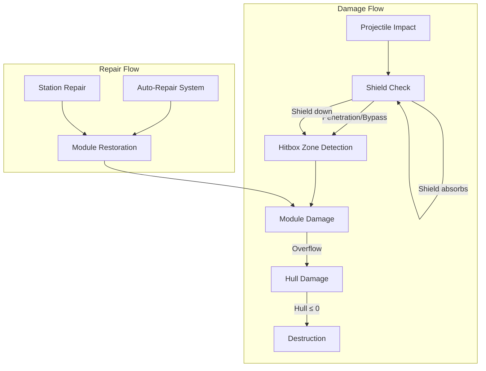
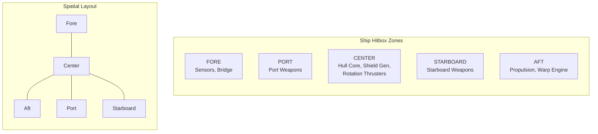
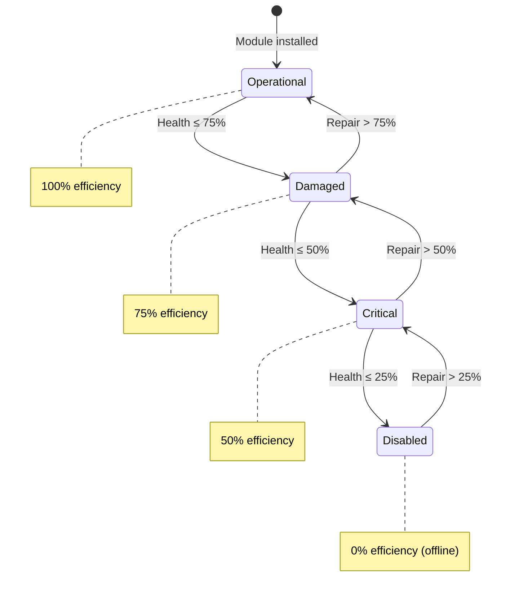
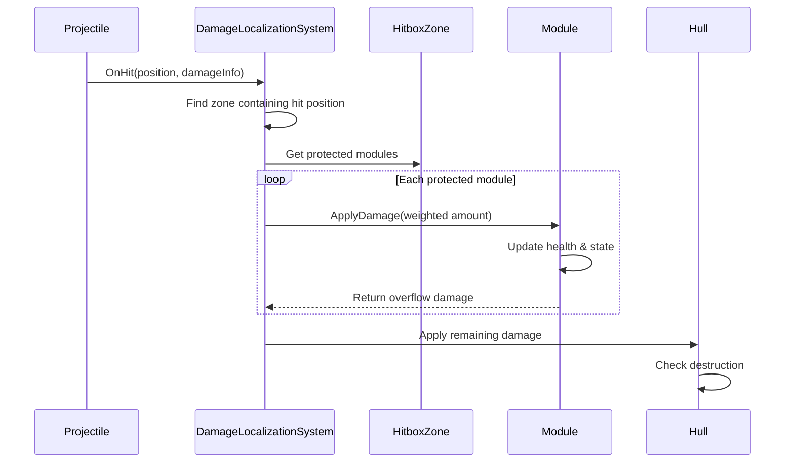
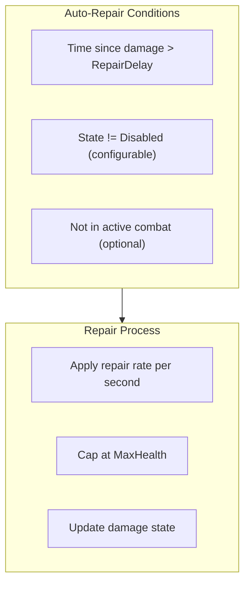
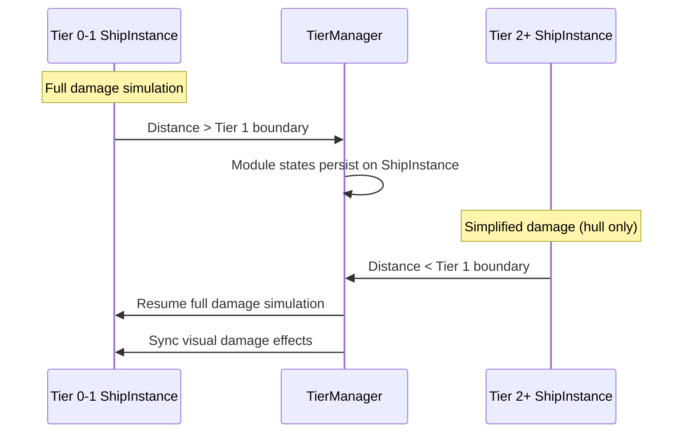

# Progressive Destruction System

This document defines the progressive destruction system for Starfire, enabling localized damage to entity subsystems based on impact location, with modules experiencing gradual degradation rather than binary destruction.

> **Architecture Note:** In the hybrid architecture, the DamageModel class on each ShipInstance handles progressive destruction. Since ships are C# objects with IShipModule interfaces, damage routing calls module methods directly (e.g., `shield.ApplyDamage()`, `propulsion.ApplyDamage()`). This is simpler than the ECS approach - no buffer elements or system ordering concerns. Full progressive destruction runs only for Rich Layer (Tier 0-1) entities. Sensor Layer entities track only aggregate HullPercent/ShieldPercent.

> **Multiplayer:** All damage computation is **server-authoritative**. Hit detection, damage routing, and destruction all happen on the server. Clients receive damage results via `NetworkEventBridge` events (`OnEntityDamaged`, `OnModuleDamaged`, `OnEntityDestroyed`) for VFX/SFX. Module damage states are packed into `NetworkShipState.ModuleDamageStates` (1 byte, 4x2-bit) for compact replication. See [[13-networking-architecture]].

---

## Design Philosophy

**Key Principles:**
1. **Localized damage** - Where a projectile hits matters; different areas protect different systems
2. **Progressive degradation** - Modules degrade through states rather than instant destruction
3. **Meaningful choices** - Targeting specific systems creates tactical depth
4. **Performance-conscious** - Full simulation only for Rich Layer (Tier 0-1) entities

**Integration with Existing Systems:**
- Extends the Shield → Hull damage pipeline with zone-based routing
- Uses IShipModule interface for module health and efficiency
- Only active in the Rich Entity Layer

---

## Overview



---

## Hitbox Zone System

### Zone Types

Entities are divided into hitbox zones, each protecting specific modules:



### HitboxZoneType Enum

```csharp
public enum HitboxZoneType : byte
{
    Center = 0,     // Default/fallback zone
    Fore = 1,       // Front of entity
    Aft = 2,        // Rear of entity
    Port = 3,       // Left side
    Starboard = 4,  // Right side
    Dorsal = 5,     // Top (for 3D or large entities)
    Ventral = 6,    // Bottom

    // Station-specific
    Upper = 10,
    Lower = 11,
    Ring = 12
}
```

### Zone Data

```csharp
public struct HitboxZone
{
    public HitboxZoneType ZoneType;
    public float2 LocalCenter;           // Center relative to entity origin
    public float2 LocalExtents;          // Half-size for AABB
    public float DamageAbsorption;       // 0-1, percentage of damage routed to modules (remainder goes to hull)
}
```

Each ship's `DamageModel` stores its hitbox zones as a `List<HitboxZone>` loaded from JSON configuration at spawn time (typically 3-5 zones per entity).

### Zone-to-Module Mapping

```csharp
public struct ZoneModuleMapping
{
    public HitboxZoneType Zone;
    public ShipModuleCategory TargetCategory;  // Which module category takes damage
    public int TargetSlotIndex;                 // -1 = all slots in category
    public float DamageWeight;                  // Weight when multiple modules in zone (0-1)
}
```

Zone-to-module mappings are stored as a `List<ZoneModuleMapping>` on the `DamageModel`, loaded alongside the hitbox zones from JSON configuration.

### Default Ship Zone Mappings

| Zone | Protected Modules (Category) | Damage Weight |
|------|------------------------------|---------------|
| **Fore** | Sensors (`Sensor`) | 1.0 |
| **Aft** | Propulsion (`Propulsion`) | 1.0 |
| **Port** | Weapons port (`Offense`, slotIndex=0) | 1.0 |
| **Starboard** | Weapons starboard (`Offense`, slotIndex=1) | 1.0 |
| **Center** | Shield (`Defense`), Rotation (`Rotation`) | 0.5 / 0.5 |

**Note:** The `Structure` category (HullModule) is intentionally NOT mapped to zones. Hull damage comes from:
1. The non-absorbed portion of zone damage (`1 - DamageAbsorption`)
2. Overflow when module health is depleted

This avoids having two separate "hull health" pools. The `Comms` category (TransponderModule) is also typically not mapped since transponders are protected internally.

---

## Module Damage Components

### ModuleDamageState



```csharp
public enum ModuleDamageState : byte
{
    Operational = 0,   // 75-100% health, 100% efficiency
    Damaged = 1,       // 50-74% health, 75% efficiency
    Critical = 2,      // 25-49% health, 50% efficiency
    Disabled = 3       // 0-24% health, 0% efficiency (offline)
}
```

### Module Health Tracking

Each `IShipModule` on a `ShipInstance` tracks its own health state directly:

**Key properties on IShipModule:**
- `MaxHealth` / `CurrentHealth`: Health values
- `DamageState`: Derived `ModuleDamageState` from health percentage
- `TimeSinceLastDamage`: Used for auto-repair delay
- `EfficiencyMultiplier`: Returns efficiency based on state (1.0, 0.75, 0.5, 0.0)

The `DamageModel` iterates the ship's modules via `ShipInstance.AllModules` when routing damage. See [[01-component-model#IShipModule]] for the full interface.

### State Thresholds with Hysteresis

To prevent oscillation at boundaries, use hysteresis for state transitions:

| Transition | Health Threshold | Hysteresis |
|------------|------------------|------------|
| Operational → Damaged | ≤ 75% | +3% to return |
| Damaged → Critical | ≤ 50% | +3% to return |
| Critical → Disabled | ≤ 25% | +3% to return |
| Disabled → Critical | > 28% | - |
| Critical → Damaged | > 53% | - |
| Damaged → Operational | > 78% | - |

```csharp
public static class ModuleDamageStateHelper
{
    private const float HYSTERESIS = 0.03f;  // 3%

    public static ModuleDamageState CalculateState(float healthPercent, ModuleDamageState currentState)
    {
        return currentState switch
        {
            ModuleDamageState.Operational when healthPercent <= 0.75f => ModuleDamageState.Damaged,
            ModuleDamageState.Damaged when healthPercent <= 0.50f => ModuleDamageState.Critical,
            ModuleDamageState.Damaged when healthPercent > 0.75f + HYSTERESIS => ModuleDamageState.Operational,
            ModuleDamageState.Critical when healthPercent <= 0.25f => ModuleDamageState.Disabled,
            ModuleDamageState.Critical when healthPercent > 0.50f + HYSTERESIS => ModuleDamageState.Damaged,
            ModuleDamageState.Disabled when healthPercent > 0.25f + HYSTERESIS => ModuleDamageState.Critical,
            _ => currentState
        };
    }
}
```

---

## Damage Routing System

### DamageLocalizationSystem

Routes incoming damage to appropriate hitbox zones and modules:



### PendingDamage

Damage events are passed as plain structs to `DamageModel.ProcessDamage()`:

```csharp
public struct PendingDamage
{
    public float Amount;
    public int SourceEntityId;
    public DamageTypeEnum DamageType;
    public double2 ImpactPosition;       // Absolute world position (set by combat pipeline)
    public float2 LocalImpactPosition;   // Local position relative to target (set by DamageModel)
    public HitboxZoneType HitZone;       // Which zone was hit (set by DamageModel)
    public bool IsLocalized;             // True if damage should use zone system (false for Tier 2+)
}
```

**Field Population:**
- Combat pipeline sets: `Amount`, `SourceEntityId`, `DamageType`, `ImpactPosition`
- `DamageModel.ProcessDamage()` sets: `LocalImpactPosition`, `HitZone`, `IsLocalized`
- `DamageModel` uses: `HitZone`, `Amount`, `IsLocalized` to distribute damage

### LocalImpactPosition Calculation

The `LocalImpactPosition` is calculated by `DamageModel.ProcessDamage()` when processing incoming damage. It transforms the world-space `ImpactPosition` to local-space relative to the target entity's position and rotation:

```csharp
/// <summary>
/// Transform world impact position to entity local space for zone detection.
/// Called by DamageModel.ProcessDamage() when routing incoming damage.
/// </summary>
public static float2 WorldToLocalImpact(
    double2 impactWorldPos,
    double2 entityWorldPos,
    float entityRotationDegrees)
{
    // Translate to entity origin
    double2 relativePos = impactWorldPos - entityWorldPos;

    // Rotate by negative entity rotation to get local space
    float rotRad = math.radians(-entityRotationDegrees);
    float cos = math.cos(rotRad);
    float sin = math.sin(rotRad);

    return new float2(
        (float)(relativePos.x * cos - relativePos.y * sin),
        (float)(relativePos.x * sin + relativePos.y * cos)
    );
}
```

**When is this calculated?**
- The combat pipeline sets `ImpactPosition` (world space) when creating `PendingDamage`
- `DamageModel.ProcessDamage()` calculates `LocalImpactPosition` using the ship's `AbsolutePosition` and `Rotation` before performing zone detection

### Zone Detection Algorithm

Called by `DamageModel.ProcessDamage()` to determine which zone was hit:

```csharp
public HitboxZoneType FindZoneAtPosition(float2 localPosition)
{
    foreach (var zone in _zones)
    {
        float2 min = zone.LocalCenter - zone.LocalExtents;
        float2 max = zone.LocalCenter + zone.LocalExtents;

        if (localPosition.x >= min.x && localPosition.x <= max.x &&
            localPosition.y >= min.y && localPosition.y <= max.y)
        {
            return zone.ZoneType;
        }
    }

    return HitboxZoneType.Center;
}
```

**Center Zone Requirement:**

The `Center` zone is **mandatory** for all hitbox configurations. It serves as the fallback zone for:
- Impacts outside other defined zones (glancing hits)
- Entities with minimal zone definitions
- Default damage routing when zone detection fails

Config validation should **reject** configurations missing a Center zone. The Center zone typically contains:
- Structure (hull core)
- Defense (shield generator)
- Rotation (maneuvering thrusters)

If no mappings exist for the Center zone (config error), all damage for that zone passes directly to hull.

**Zone Overlap Policy:** Hitbox zones should be configured with non-overlapping AABBs. If zones do overlap, the first matching zone in buffer order is returned. The `Center` zone should be positioned to cover the entity's core without overlapping perimeter zones (Fore, Aft, Port, Starboard). Config validation should warn if overlapping zones are detected.

### Damage Distribution

When a zone is hit, damage is split between modules and hull based on `DamageAbsorption`:

- **DamageAbsorption** (0-1): Percentage of incoming damage that modules in this zone can absorb
- **Remaining damage** (1 - DamageAbsorption): Passes directly to hull

Example: Zone with `DamageAbsorption = 0.7` hit for 100 damage:
- 70 damage distributed to modules in zone (by weight)
- 30 damage goes directly to hull

### Zone Lookup by Type

`PendingDamage.HitZone` contains only the `HitboxZoneType` enum. To access the full `HitboxZone` struct (which contains `DamageAbsorption`), the `DamageModel` looks it up from its zone list:

```csharp
public bool TryGetZoneByType(HitboxZoneType zoneType, out HitboxZone zone)
{
    for (int i = 0; i < _zones.Count; i++)
    {
        if (_zones[i].ZoneType == zoneType)
        {
            zone = _zones[i];
            return true;
        }
    }

    zone = default;
    return false;
}
```

**Usage in ProcessDamage:**
```csharp
if (!damage.IsLocalized)
{
    hullDamage += damage.Amount;
    continue;
}

if (!TryGetZoneByType(damage.HitZone, out var hitZone))
{
    hullDamage += damage.Amount;
    continue;
}

float overflow = DistributeDamageToModules(damage.Amount, hitZone);
hullDamage += overflow;
```

### Damage Distribution to Modules

```csharp
private float DistributeDamageToModules(float incomingDamage, in HitboxZone hitZone)
{
    float absorbableDamage = incomingDamage * hitZone.DamageAbsorption;
    float directHullDamage = incomingDamage * (1f - hitZone.DamageAbsorption);

    float totalWeight = 0f;
    foreach (var mapping in _mappings)
    {
        if (mapping.Zone == hitZone.ZoneType)
            totalWeight += mapping.DamageWeight;
    }

    if (totalWeight <= 0f)
        return incomingDamage;

    float overflowDamage = 0f;
    foreach (var mapping in _mappings)
    {
        if (mapping.Zone != hitZone.ZoneType)
            continue;

        float moduleDamage = absorbableDamage * (mapping.DamageWeight / totalWeight);

        var module = _ship.GetModule(mapping.TargetCategory, mapping.TargetSlotIndex);
        if (module == null)
        {
            overflowDamage += moduleDamage;
            continue;
        }

        float absorbed = module.ApplyDamage(moduleDamage);
        overflowDamage += (moduleDamage - absorbed);
    }

    return directHullDamage + overflowDamage;
}
```

**Module.ApplyDamage pattern:**
```csharp
// Inside each IShipModule implementation:
public float ApplyDamage(float damage)
{
    float absorbed = math.min(damage, CurrentHealth);
    CurrentHealth -= absorbed;
    TimeSinceLastDamage = 0f;
    DamageState = ModuleDamageStateHelper.CalculateState(HealthPercentage, DamageState);
    return absorbed;
}
```

---

## Shield and Zone Interaction

**Key Distinction:** The shield system has two separate health pools:

1. **Shield Energy** (`ShieldModule.CurrentCapacity`) - Depleted when absorbing incoming damage. Regenerates over time via `RegenRate`.

2. **Shield Generator Health** (`ModuleHealthElement` with `Category = Defense`) - The physical health of the shield generator equipment. Affects `RegenRate` via efficiency multiplier.

**Damage Flow:**

```
Incoming Damage
     │
     ▼
Shield Absorption ─────────► Depletes ShieldModule.CurrentCapacity
     │
     │ (Remaining damage after absorption)
     ▼
Zone Detection ────────────► Finds hit zone from LocalImpactPosition
     │
     ▼
Zone Damage Distribution ──► Distributes to modules (including Defense/shield generator)
     │
     ▼
Hull Overflow ─────────────► Non-absorbed + module overflow → HullModule
```

**Shield Absorption:** Happens BEFORE zone detection. Shield energy absorbs incoming damage regardless of hit location. Only the remaining (non-absorbed) damage proceeds to zone routing.

**Shield Generator Damage:** The "Defense" category in zone mappings damages the shield GENERATOR (the equipment), not the shield energy. When the shield generator is damaged:
- `EfficiencyMultiplier` decreases (75% at Damaged, 50% at Critical, 0% at Disabled)
- `RegenRate * EfficiencyMultiplier` = effective regeneration rate
- Existing shield capacity remains until depleted; it just won't regenerate as fast
- At Disabled state: shields cannot regenerate at all

**Penetration:** Currently, all damage that exceeds shield capacity passes through. Future enhancement could add damage-type-specific penetration (e.g., kinetic penetrates more than energy). This would be implemented in `DamageLocalizationSystem.ApplyShieldAbsorption()`.

---

## Module Efficiency Effects

When modules are damaged, their efficiency affects their output. Since each `IShipModule` tracks its own health and efficiency, managers access the multiplier directly on the module instance.

### Accessing Efficiency Multipliers

Each `IShipModule` exposes its `EfficiencyMultiplier` property, derived from its `DamageState`:

```csharp
// On any IShipModule:
public float EfficiencyMultiplier => DamageState switch
{
    ModuleDamageState.Operational => 1.0f,
    ModuleDamageState.Damaged => 0.75f,
    ModuleDamageState.Critical => 0.5f,
    ModuleDamageState.Disabled => 0.0f,
    _ => 1.0f
};
```

### Usage Pattern

Managers that need efficiency read it directly from the module:

```csharp
// In RichEntityManager movement processing:
foreach (var ship in _ships.Values)
{
    var propulsion = ship.GetModule<PropulsionModule>();
    float efficiency = propulsion.EfficiencyMultiplier;

    float effectiveAccel = propulsion.Acceleration * efficiency;
    float effectiveMaxSpeed = propulsion.MaxSpeed * efficiency;

    // Apply movement with effective values...
}
```

### Efficiency Effects by Module

| Module | Affected Stats | Disabled Behavior |
|--------|----------------|-------------------|
| **Propulsion** | MaxSpeed, Acceleration | Ship drifts, cannot accelerate |
| **Rotation** | TurnRate, ThrusterTorque | Ship cannot turn |
| **Shield** | RegenRate | Shields cannot regenerate (existing capacity remains) |
| **Weapon** | FireRate, Damage | Cannot fire |
| **Sensor** | Range, RefreshRate (inverse) | No detection, entity is "blind" |

### PropulsionModule

```csharp
float effectiveMaxSpeed = propulsion.MaxSpeed * propulsion.EfficiencyMultiplier;
float effectiveAcceleration = propulsion.Acceleration * propulsion.EfficiencyMultiplier;
// Disabled (efficiency = 0): ship cannot accelerate, only drift
```

### RotationModule

```csharp
float effectiveTurnRate = rotation.TurnRate * rotation.EfficiencyMultiplier;
float effectiveThrusterTorque = rotation.ThrusterTorque * rotation.EfficiencyMultiplier;
// Disabled: ship cannot turn
```

### ShieldModule

```csharp
float effectiveRegenRate = shield.RegenRate * shield.EfficiencyMultiplier;
// Disabled: shields cannot regenerate
// Note: Existing shield capacity remains until depleted
```

### WeaponModule

```csharp
foreach (var weapon in ship.GetModules<WeaponModule>())
{
    if (weapon.EfficiencyMultiplier <= 0f)
        continue;  // Disabled weapon cannot fire

    float effectiveFireRate = weapon.FireRate * weapon.EfficiencyMultiplier;
    float effectiveDamage = weapon.Damage * weapon.EfficiencyMultiplier;
}
```

### SensorModule

```csharp
float effectiveRange = sensor.Range * sensor.EfficiencyMultiplier;
float effectiveRefreshRate = sensor.RefreshRate / math.max(0.1f, sensor.EfficiencyMultiplier);
// Disabled: no detection capability, entity is "blind"
```

---

## Repair Systems

### Auto-Repair System

Modules automatically repair over time when not taking damage:



```csharp
public struct RepairConfiguration
{
    public float RepairDelayAfterDamage;   // Seconds before auto-repair starts (default: 5s)
    public float BaseRepairRatePerSecond;  // Percentage of MaxHealth restored per second (0.02 = 2%)
    public bool CanAutoRepairDisabled;     // Can auto-repair fix Disabled modules? (default: false)
    public bool RequiresOutOfCombat;       // Additional out-of-combat check beyond damage delay (default: false)
}
```

`RepairConfiguration` is stored on the `DamageModel` and loaded from JSON ship configuration at spawn time.

**RepairDelayAfterDamage vs RequiresOutOfCombat:**

These are **separate conditions** that can be combined:

- **RepairDelayAfterDamage**: Satisfied when `TimeSinceLastDamage >= RepairDelayAfterDamage`. This is a simple timer that resets on any damage. Used alone, this allows "repair while being shot" if shots are infrequent enough.

- **RequiresOutOfCombat**: When `true`, adds an additional check beyond the damage delay. The entity must also have no hostile entities within sensor range. This prevents repair during active engagements even if momentarily not taking damage.

| RequiresOutOfCombat | RepairDelayAfterDamage | Behavior |
|---------------------|------------------------|----------|
| `false` | 5s | Repairs start 5s after last damage, regardless of nearby enemies |
| `true` | 5s | Repairs start 5s after last damage AND no enemies in sensor range |

**Implementation:**
```csharp
// In DamageModel.UpdateRepair():
bool canRepair = module.TimeSinceLastDamage >= _repairConfig.RepairDelayAfterDamage;

if (_repairConfig.RequiresOutOfCombat && canRepair)
{
    float checkRange = GetRepairCheckRange();
    canRepair = !HasHostilesInRange(checkRange);
}

private float GetRepairCheckRange()
{
    const float DEFAULT_REPAIR_CHECK_RANGE = 500f;

    var sensor = _ship.GetModule<SensorModule>();
    return sensor != null ? sensor.Range : DEFAULT_REPAIR_CHECK_RANGE;
}

private bool HasHostilesInRange(float range)
{
    var faction = _ship.Faction;
    var sensorPool = _ship.FactionSensorPool;
    if (sensorPool == null) return false;

    foreach (var detection in sensorPool.GetDetections())
    {
        if (detection.Distance > range)
            continue;

        if (faction.IsHostile(detection.FactionIndex))
        {
            double distSq = math.distancesq(_ship.AbsolutePosition, detection.Position);
            if (distSq <= (double)range * range)
                return true;
        }
    }

    return false;
}
```

**Edge Case: Disabled Sensors + RequiresOutOfCombat**

If `RequiresOutOfCombat = true` and the entity's `SensorModule` is disabled (efficiency = 0), using `effectiveRange = Range * efficiency = 0` would mean no hostiles detected, allowing repair even with enemies adjacent.

**Design decision:** The hostile check uses the **base sensor range** (ignoring efficiency) rather than effective range. This ensures:
- A ship with disabled sensors still cannot repair while enemies are nearby
- The "blind" state affects target acquisition and detection, not the safety check for repair
- Gameplay consequence: damaged sensors don't give a repair advantage in combat

Alternative design (not used): Allow repair with disabled sensors as a risk/reward trade-off. Document this if you prefer that behavior.

### DamageModel.UpdateRepair

Called by `RichEntityManager` each frame for all Tier 0-1 ships:

```csharp
public void UpdateRepair(float deltaTime)
{
    foreach (var module in _ship.AllModules)
    {
        module.TimeSinceLastDamage += deltaTime;

        if (module.TimeSinceLastDamage < _repairConfig.RepairDelayAfterDamage)
            continue;

        if (module.DamageState == ModuleDamageState.Disabled &&
            !_repairConfig.CanAutoRepairDisabled)
            continue;

        if (module.CurrentHealth >= module.MaxHealth)
            continue;

        float repairAmount = module.MaxHealth * _repairConfig.BaseRepairRatePerSecond * deltaTime;
        module.CurrentHealth = math.min(module.CurrentHealth + repairAmount, module.MaxHealth);

        var previousState = module.DamageState;
        module.DamageState = ModuleDamageStateHelper.CalculateState(
            module.HealthPercentage,
            module.DamageState);

        if (previousState == ModuleDamageState.Disabled &&
            module.DamageState != ModuleDamageState.Disabled)
        {
            GameEventBus.Raise(new ModuleRepairedEvent(_ship.EntityId, module.Category, module.SlotIndex, module.DamageState));
        }
    }
}
```

### Station Repair

When docked at a station with repair services:

| Repair Type | Rate | Cost | Notes |
|-------------|------|------|-------|
| Standard | 10x auto-repair rate | Per health point | Available at most stations |
| Full | Instant | Fixed + per module | Repairs all modules fully |
| Emergency | 5x auto-repair rate | 2x standard cost | Available during combat (some stations) |

Station repair can fix Disabled modules, unlike auto-repair.

---

## Tier Integration

### Tier 0-1: Full Implementation

- Full hitbox zone collision detection
- Per-module damage tracking and efficiency effects
- Visual damage effects (sparks, smoke, fire)
- Auto-repair active

### Tier 2+: Simplified

- No spatial hitbox detection
- Damage goes directly to hull (existing behavior)
- Module damage states preserved but not updated
- No visual effects (no GameObject)

**Simplified Flow for Tier 2+ Entities:**

When `SensorSimulationManager` processes combat for a Tier 2+ entity:

1. **Shield absorption**: Shield energy absorbs incoming damage (shields still function at Tier 2+)
2. **Skip zone/module routing**: Damage goes directly to hull
3. **Hull damage**: Apply armor reduction and update hull integrity

```csharp
// In SensorSimulationManager combat processing for Tier 2+:
if (ship.CurrentTier >= 2)
{
    float shieldAbsorbed = ship.Shield.Absorb(damage.Amount);
    float remainingDamage = damage.Amount - shieldAbsorbed;

    ship.Hull.ApplyDamage(remainingDamage);
    // Module states unchanged — intentional simplification
}
```

### Tier Transition Handling



**State Preservation Mechanism:**

Module damage states are preserved across tier transitions because:

1. **ShipInstance Persists:** The `ShipInstance` object (and its `DamageModel`) remains in memory across all tiers. Module health, damage states, and `TimeSinceLastDamage` are retained even when the entity is in Tier 2+.

2. **No Structural Changes:** Tier transitions only change which managers process the entity. The `ShipInstance` and all its `IShipModule` references remain intact.

3. **Simplified Damage at Tier 2+:** While in Tier 2+, combat bypasses zone routing. Damage goes directly to hull. **Module states are NOT updated by Tier 2 damage** — this is intentional simplification.

**Implications:**

| Scenario | Behavior |
|----------|----------|
| Entity demoted to Tier 2 with Damaged modules | States preserved as-is, efficiency effects inactive (no simulation) |
| Entity takes damage at Tier 2 | Hull only, module states unchanged |
| Entity promoted back to Tier 1 | Original module states resume, efficiency effects reactivate |
| Entity demoted → takes damage → promoted | Module states from demotion, hull reduced by Tier 2 damage |

**Trade-off:** This means a ship that takes heavy damage at Tier 2 won't have granular module damage when returning to Tier 1. The design prioritizes performance over simulation fidelity at distance. For Critical entities that stay at Tier 2 minimum, this ensures they maintain consistent module states when players approach.

When demoting to Tier 2+:
- `ShipInstance` and all `IShipModule` references persist unchanged
- Health values and damage states preserved in memory
- No efficiency effects applied (RichEntityManager skips Tier 2+ entities)

When promoting to Tier 0-1:
- `DamageModel` and module health read by RichEntityManager again
- PresentationManager syncs visual damage effects based on stored states
- Efficiency multipliers become active

---

## Damage Effects System

### Visual Effects by State

| State | Particle Effects | Audio | Other |
|-------|-----------------|-------|-------|
| **Operational** | None | Normal operation sounds | - |
| **Damaged** | Occasional sparks | Warning beeps (configurable) | Slight visual flicker |
| **Critical** | Smoke particles | Alarm (configurable) | Heavy visual degradation |
| **Disabled** | Fire/flames | Explosion on transition | Offline visuals |

### Damage Effects in PresentationManager

Visual damage effects are handled by `PresentationManager` during Tier 0 visual sync. The `DamageModel` tracks the worst damage state across all modules for effect selection:

```csharp
// On DamageModel:
public ModuleDamageState WorstModuleState { get; private set; }
public ModuleDamageState PreviousWorstState { get; private set; }
public int DisabledModuleCount { get; private set; }

public void UpdateDamageEffectState()
{
    var worstState = ModuleDamageState.Operational;
    int disabledCount = 0;

    foreach (var module in _ship.AllModules)
    {
        if (module.DamageState > worstState)
            worstState = module.DamageState;
        if (module.DamageState == ModuleDamageState.Disabled)
            disabledCount++;
    }

    PreviousWorstState = WorstModuleState;
    WorstModuleState = worstState;
    DisabledModuleCount = disabledCount;
}
```

`PresentationManager` reads these values during visual sync to control particle effects, audio, and visual degradation. See [[02-system-architecture#8. PresentationManager]] for the sync pipeline.

---

## Configuration Layer

### HitboxZoneConfiguration

Hitbox zone configurations are plain C# classes loaded from JSON at startup via the configuration pipeline (see [[05-configuration-layer]]):

```csharp
public class HitboxZoneConfiguration
{
    public string ConfigId;
    public List<HitboxZone> Zones;
    public List<ZoneModuleMapping> Mappings;
    public RepairConfiguration Repair;
}
```

The `DamageModel` receives its `HitboxZoneConfiguration` from `ShipFactory` during spawn, which loads it from the ship's JSON config. Mods can override or add new hitbox configurations via the additive JSON pipeline.

### JSON Schema

The full JSON schema for hitbox zone configuration is defined in [[05-configuration-layer#Hitbox Zone JSON Schema]]. Key properties:

- `configId`: Unique identifier for the hitbox configuration
- `zones[]`: Array of zone definitions with `type`, `center`, `extents`, `damageAbsorption`
- `mappings[]`: Array of zone-to-module mappings with `zone`, `category`, `slotIndex`, `weight`
- `repair`: Optional repair configuration overrides

### Example Configuration: Light Fighter

```json
{
  "configId": "hitbox_fighter_light",
  "zones": [
    {
      "type": "Fore",
      "center": [2.0, 0.0],
      "extents": [1.0, 0.8],
      "damageAbsorption": 0.7
    },
    {
      "type": "Center",
      "center": [0.0, 0.0],
      "extents": [1.5, 1.0],
      "damageAbsorption": 0.9
    },
    {
      "type": "Aft",
      "center": [-2.0, 0.0],
      "extents": [1.0, 0.6],
      "damageAbsorption": 0.6
    },
    {
      "type": "Port",
      "center": [0.0, 1.5],
      "extents": [1.0, 0.5],
      "damageAbsorption": 0.5
    },
    {
      "type": "Starboard",
      "center": [0.0, -1.5],
      "extents": [1.0, 0.5],
      "damageAbsorption": 0.5
    }
  ],
  "mappings": [
    { "zone": "Fore", "category": "Sensor", "slotIndex": -1, "weight": 1.0 },
    { "zone": "Aft", "category": "Propulsion", "slotIndex": -1, "weight": 1.0 },
    { "zone": "Port", "category": "Offense", "slotIndex": 0, "weight": 1.0 },
    { "zone": "Starboard", "category": "Offense", "slotIndex": 1, "weight": 1.0 },
    { "zone": "Center", "category": "Defense", "slotIndex": -1, "weight": 0.5 },
    { "zone": "Center", "category": "Rotation", "slotIndex": -1, "weight": 0.5 }
  ]
}
```

---

## Entity Type Specifics

### Ships

Standard 5-zone layout (Fore, Aft, Port, Starboard, Center). All modules are damageable.

### Stations

Larger entities with more zones:
- **Upper**: Command, sensors, communications
- **Lower**: Power generation, storage, life support
- **Ring**: Docking bays, defensive weapons
- **Core**: Shield generator, structural integrity

Stations typically have higher `damageAbsorption` values and more module redundancy.

### Asteroids (Simplified)

Asteroids use a single-zone model:
- No module system
- Damage goes directly to integrity
- When integrity reaches threshold, asteroid breaks into smaller pieces

```csharp
// Fields on AsteroidData (Mass layer NativeArray struct):
public float MaxIntegrity;
public float CurrentIntegrity;
public float FragmentThreshold;    // Break into pieces at this %
public int FragmentCount;          // How many pieces
```

### Missiles/Projectiles (Minimal)

No progressive destruction - single hit point:
- On damage, check if damage exceeds threshold
- If yes, destroy (trigger explosion for missiles)
- No repair system

---

## Combat Events

Damage events fire via `GameEventBus` and are dispatched to Lua in `ScriptExecutionManager`. Events are raised by `DamageModel` as damage is processed.

### ModuleDamagedEvent

```csharp
public struct ModuleDamagedEvent
{
    public int TargetEntityId;
    public ShipModuleCategory ModuleCategory;
    public int ModuleSlotIndex;
    public ModuleDamageState PreviousState;
    public ModuleDamageState NewState;
    public float DamageAmount;
    public int SourceEntityId;
}
```

### ModuleDisabledEvent

Raised when a module transitions to Disabled state:

```csharp
public struct ModuleDisabledEvent
{
    public int TargetEntityId;
    public ShipModuleCategory ModuleCategory;
    public int ModuleSlotIndex;
    public int SourceEntityId;
}
```

### ModuleRepairedEvent

Raised when a module transitions out of Disabled state:

```csharp
public struct ModuleRepairedEvent
{
    public int TargetEntityId;
    public ShipModuleCategory ModuleCategory;
    public int ModuleSlotIndex;
    public ModuleDamageState NewState;
}
```

**Event Dispatch:**
```csharp
// In DamageModel.ProcessDamage():
var previousState = module.DamageState;
module.ApplyDamage(amount);

if (module.DamageState != previousState)
{
    GameEventBus.Raise(new ModuleDamagedEvent(
        _ship.EntityId, module.Category, module.SlotIndex,
        previousState, module.DamageState, amount, damage.SourceEntityId));

    if (module.DamageState == ModuleDamageState.Disabled)
    {
        GameEventBus.Raise(new ModuleDisabledEvent(
            _ship.EntityId, module.Category, module.SlotIndex, damage.SourceEntityId));
    }
}
```

Events are queued during the frame and dispatched to Lua callbacks in `ScriptExecutionManager.Update()`. Lua scripts can listen for these events:

```lua
starfire.on("module_damaged", function(event)
    if event.new_state == "disabled" then
        log("Module disabled on entity " .. event.target_id)
    end
end)
```

---

## AI Integration

### Target Zone Selection

AI can prioritize targeting specific zones:

```csharp
public enum AITargetingPriority : byte
{
    Default = 0,        // Center mass
    Engines = 1,        // Disable mobility
    Weapons = 2,        // Disable offense
    Shields = 3,        // Disable defense
    Sensors = 4         // Disable detection
}
```

AI behavior trees can use this to make tactical decisions:
- Fleeing enemy → Target engines
- Dangerous enemy → Target weapons
- Escaping target → Target sensors

---

## Performance Considerations

| Operation | Target Time | Notes |
|-----------|-------------|-------|
| Zone detection | < 0.01ms | Simple AABB tests |
| Damage distribution | < 0.05ms | Per-hit calculation |
| State updates | < 0.1ms | Batched per ship |
| Effect updates | < 0.5ms | Only Tier 0 entities |
| Repair updates | < 0.2ms | Amortized, all entities |

---

## Modding Integration

Damage and destruction are key modding extension points:

- **Hitbox zone configurations** are fully moddable via JSON (see [[05-configuration-layer#Hitbox Zone JSON Schema]]). Mods can define new zone layouts for custom ship types.
- **Damage events** (`module_damaged`, `module_disabled`, `module_repaired`) are dispatched to Lua via GameEventBus, enabling custom damage responses, UI notifications, or gameplay mechanics.
- **Repair configurations** can be overridden per ship type via JSON config pipeline.

---

## Related Documents

- [[01-component-model]] - IShipModule interface, module definitions
- [[02-system-architecture]] - System execution order, PresentationManager
- [[03-tiered-simulation]] - Tier system integration
- [[04-archetype-strategy]] - Entity archetypes with damage components
- [[05-configuration-layer]] - JSON configuration pipeline
- [[12-modding-architecture]] - Lua event hooks and JSON overrides
- [[13-networking-architecture]] - Server-authoritative damage, module state replication
