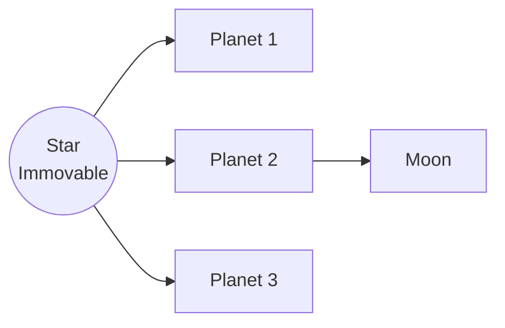
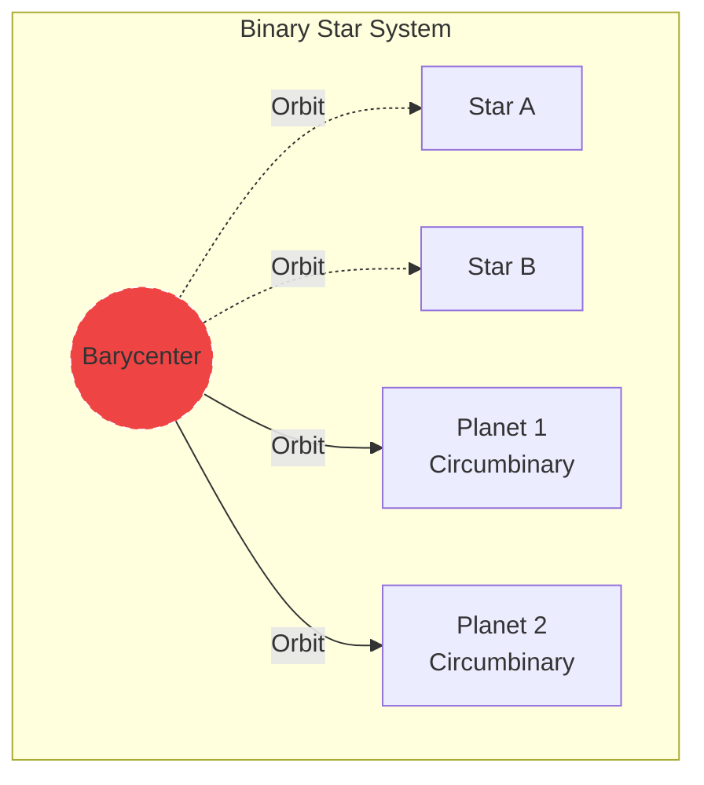
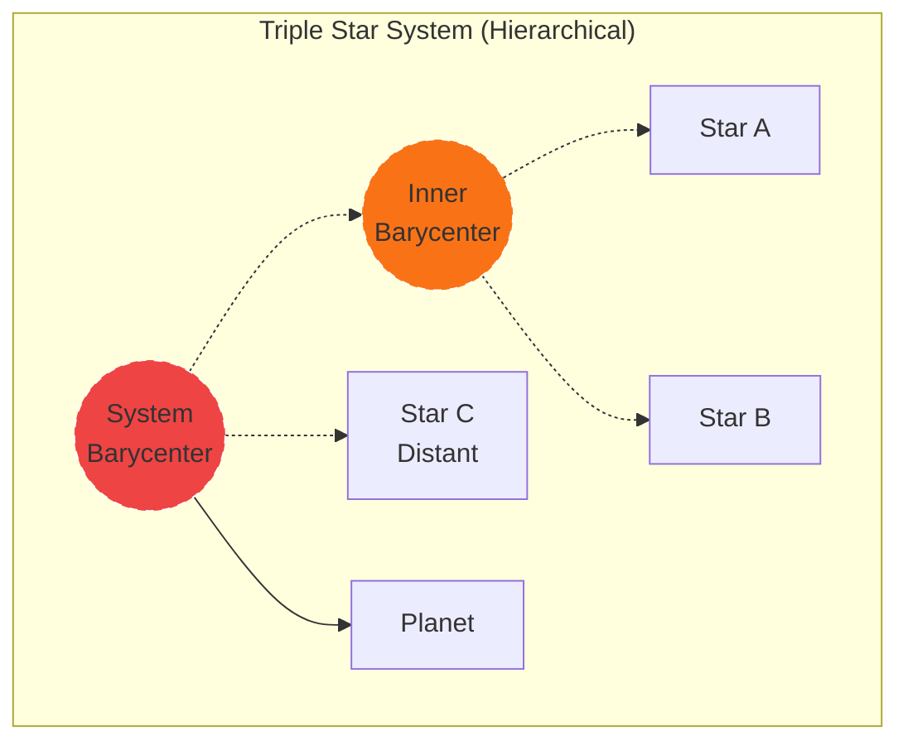
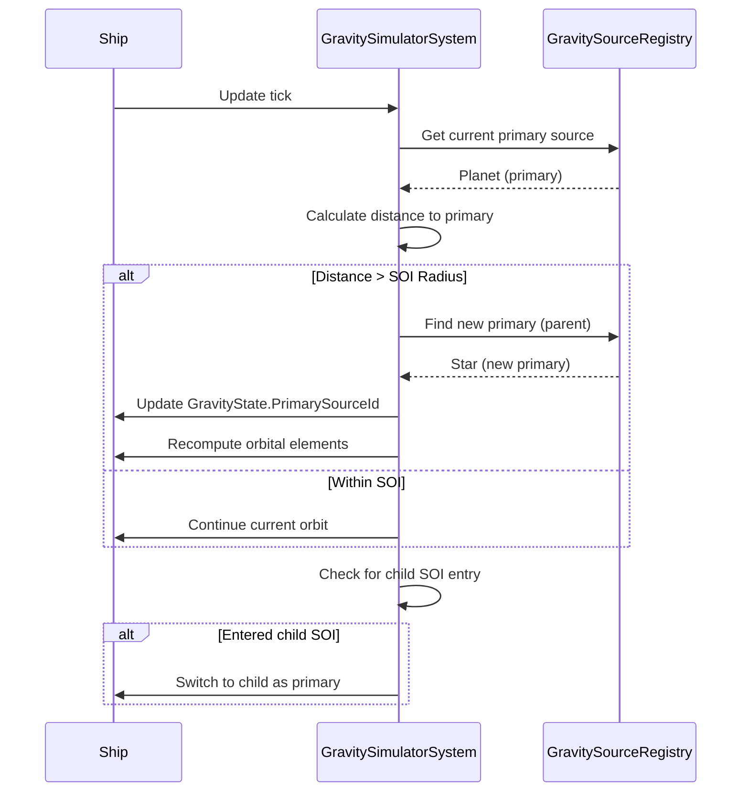
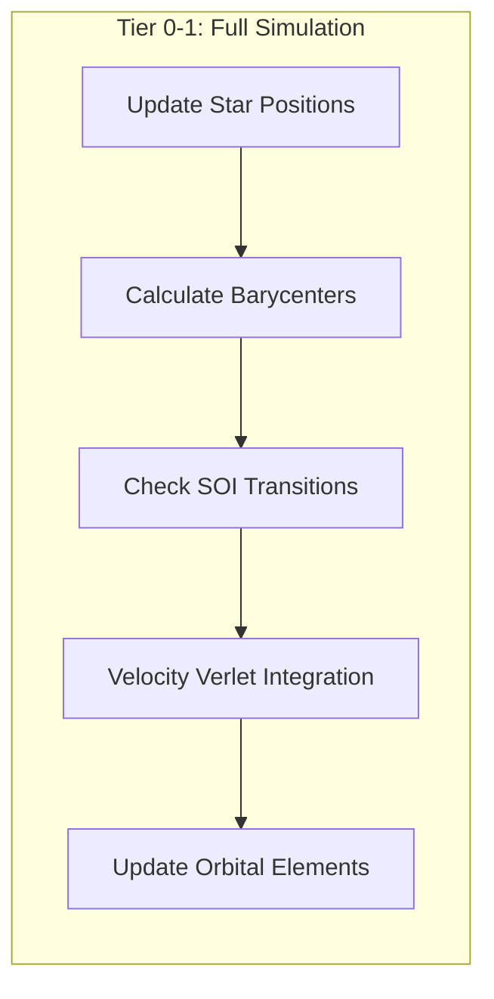
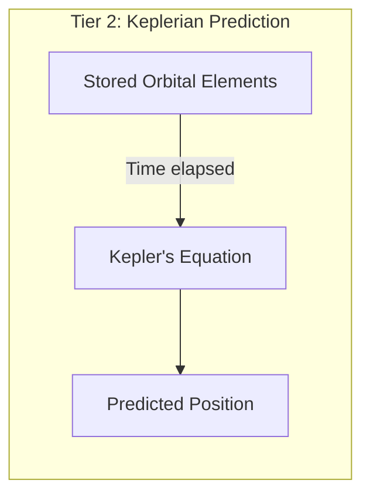
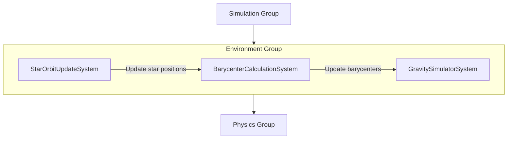

# Gravity System

This document defines the Newtonian gravity system for realistic orbital mechanics in Starfire.

> **Architecture Note:** In the hybrid architecture, gravity operates across two layers. The **Mass Entity Layer** handles asteroid belt gravity via Burst Jobs (NativeArray<AsteroidData> + NativeArray<GravitySourceData>). The **Rich Entity Layer** applies gravity to nearby ships via the EnvironmentManager. GravitySourceData is shared between both layers as a read-only NativeArray. Celestial bodies (stars, planets) are managed by the EnvironmentManager and update their positions from pre-computed orbits each tick.

> **Multiplayer:** Gravity sources are **deterministic** (pre-computed orbits) which is critical for client-side prediction. The server sends the `GravitySourceData` array **once at connection**. The client applies identical gravity during player ship prediction — no desync risk. Star position updates are only sent on actual changes (rare). A `ClientEnvironmentManager` runs the gravity calculation for the local player's ship only. See [[13-networking-architecture]].

---

## Design Decisions Summary

| Decision | Choice | Rationale |
|----------|--------|-----------|
| N-body approach | SOI hierarchy | O(n) vs O(n²), enables stable orbits |
| Integration method | Velocity Verlet | Symplectic, conserves energy over long simulations |
| Black holes | Only immovable anchors | True gravity roots, simplifies hierarchy |
| Stars | Pre-computed orbits | Can orbit black holes or each other (binary/triple) |
| Multi-star planets | Circumbinary orbits | Orbit system barycenter |
| Three-body stars | Pre-computed patterns | Known stable configurations (figure-8, hierarchical) |
| Asteroid gravity | Burst Jobs (Mass Layer) | Thousands of bodies, cache-coherent batch processing |
| Ship gravity | Managed code (Rich Layer) | Few hundred ships, needs access to ShipInstance |

---

## Gravity Hierarchy

```mermaid
graph TB
    subgraph Hierarchy["Gravity Source Hierarchy"]
        BH[Black Hole<br/>Immovable Anchor]
        STAR[Stars<br/>Pre-computed Orbits]
        PLANET[Planets<br/>Orbit Star/Barycenter]
        MOON[Moons<br/>Orbit Planet]
        SHIP[Ships/Asteroids<br/>Full Simulation]
    end

    BH -->|"Infinite SOI"| STAR
    STAR -->|"Star SOI"| PLANET
    PLANET -->|"Planet SOI"| MOON
    MOON -->|"Moon SOI"| SHIP
    PLANET -->|"Planet SOI"| SHIP

    style BH fill:#1a1a2e
    style STAR fill:#eab308
    style PLANET fill:#3b82f6
    style MOON fill:#6b7280
    style SHIP fill:#22c55e
```



**Hierarchy Levels:**

| Level | Type | Behavior | SOI Calculation |
|-------|------|----------|-----------------|
| 0 | Black Hole | Immovable anchor | Infinite within system |
| 1 | Star | Pre-computed orbit (or immovable if standalone) | Hill sphere relative to parent |
| 2 | Planet | Orbits star or system barycenter | Hill sphere relative to star |
| 3 | Moon | Orbits planet | Hill sphere relative to planet |
| 4 | Ship/Asteroid | Full Verlet simulation | N/A (affected by gravity) |

---

## Star System Configurations

### Single Star System



**Behavior:** Star is immovable. Planets orbit star directly.

### Binary Star System



**Behavior:**
- Both stars orbit the system barycenter (pre-computed paths)
- Barycenter position updates each frame as stars move
- Planets orbit the barycenter, not individual stars

### Triple Star System



**Stable Patterns:**

| Pattern | Description | Stability |
|---------|-------------|-----------|
| Hierarchical | Close binary + distant third | Long-term stable |
| Figure-8 | Three equal-mass stars in figure-8 | Special case, stable |
| Lagrangian | Equilateral triangle configuration | Requires equal masses |

### Black Hole + Orbiting Star

```mermaid
graph TB
    BH((Black Hole<br/>Immovable))
    STAR[Star<br/>Elliptical Orbit]
    P1[Planet 1]
    P2[Planet 2]

    BH -->|"Pre-computed"| STAR
    STAR --> P1
    STAR --> P2

    style BH fill:#1a1a2e
```



**Behavior:**
- Black hole is the only truly immovable object
- Star follows pre-computed elliptical orbit around black hole
- Planets orbit the moving star
- If star orbit is highly eccentric, it may eventually fall into the black hole (destruction event)

---

## Sphere of Influence (SOI)

The SOI determines which gravity source dominates an entity's motion.

### SOI Calculation

```csharp
/// <summary>
/// Hill sphere approximation for SOI radius.
/// </summary>
public static double CalculateSOI(double semiMajorAxis, double childMass, double parentMass)
{
    return semiMajorAxis * Math.Pow(childMass / parentMass, 2.0 / 5.0);
}
```

**Example SOI Values:**

| Body | Parent | Semi-major Axis | Mass Ratio | SOI Radius |
|------|--------|-----------------|------------|------------|
| Planet | Star | 10,000 units | 1:1000 | ~1,580 units |
| Moon | Planet | 500 units | 1:100 | ~125 units |
| Star | Black Hole | 50,000 units | 1:1000 | ~7,900 units |

### SOI Transition Detection



---

## Pre-computed Orbits

Stars in multi-body systems follow pre-computed Keplerian orbits.

### Orbital Elements

```csharp
/// <summary>
/// Pre-computed orbital path for a star in a multi-body system.
/// </summary>
public struct PrecomputedOrbit
{
    public double SemiMajorAxis;         // a - size of orbit
    public double Eccentricity;          // e - shape (0=circle, <1=ellipse)
    public double ArgumentOfPeriapsis;   // ω - orientation (radians)
    public double InitialMeanAnomaly;    // M₀ - starting position
    public double Period;                // T - orbital period (seconds)
    public double2 OrbitCenter;          // Barycenter or parent position
}
```

### Position Sampling

```csharp
/// <summary>
/// Sample position at time t from orbital elements.
/// Uses Kepler's equation to convert mean anomaly to position.
/// </summary>
public double2 SamplePosition(double time)
{
    // 1. Mean anomaly at time t
    double n = 2.0 * Math.PI / Period;  // Mean motion
    double M = InitialMeanAnomaly + n * time;

    // 2. Solve Kepler's equation: M = E - e*sin(E)
    double E = SolveKeplersEquation(M, Eccentricity);

    // 3. True anomaly from eccentric anomaly
    double nu = 2.0 * Math.Atan2(
        Math.Sqrt(1 + Eccentricity) * Math.Sin(E / 2),
        Math.Sqrt(1 - Eccentricity) * Math.Cos(E / 2)
    );

    // 4. Radial distance
    double r = SemiMajorAxis * (1 - Eccentricity * Math.Cos(E));

    // 5. Position in orbital plane
    double angle = nu + ArgumentOfPeriapsis;
    return OrbitCenter + new double2(
        r * Math.Cos(angle),
        r * Math.Sin(angle)
    );
}

/// <summary>
/// Newton-Raphson iteration to solve Kepler's equation.
/// </summary>
private double SolveKeplersEquation(double M, double e, int maxIterations = 10)
{
    M = M % (2 * Math.PI);
    if (M < 0) M += 2 * Math.PI;

    double E = M;  // Initial guess
    for (int i = 0; i < maxIterations; i++)
    {
        double dE = (E - e * Math.Sin(E) - M) / (1 - e * Math.Cos(E));
        E -= dE;
        if (Math.Abs(dE) < 1e-10) break;
    }
    return E;
}
```

---

## Barycenter Calculation

For multi-star systems, the barycenter (center of mass) determines planet orbits.

```csharp
/// <summary>
/// Calculate barycenter for a star system.
/// Called each frame after star positions are updated.
/// </summary>
public static double2 CalculateBarycenter(
    ReadOnlySpan<GravitySourceData> stars)
{
    double totalMass = 0;
    double2 weightedSum = double2.zero;

    foreach (var star in stars)
    {
        totalMass += star.Mass;
        weightedSum += star.AbsolutePosition * star.Mass;
    }

    return weightedSum / totalMass;
}
```

**Binary Star Example:**
- Star A: Mass 1000, Position (100, 0)
- Star B: Mass 500, Position (-200, 0)
- Barycenter: (1000×100 + 500×-200) / 1500 = (0, 0)

Star A is closer to the barycenter because it's more massive.

---

## Velocity Verlet Integration

Velocity Verlet is a symplectic integrator that conserves energy, essential for stable orbits.

### Algorithm

```
For each entity affected by gravity:
  1. Half-step velocity:  v += a × (dt/2)
  2. Full-step position:  x += v × dt
  3. Recompute acceleration at new position
  4. Complete velocity:   v += a_new × (dt/2)
```

### Implementation

```csharp
/// <summary>
/// Velocity Verlet integration with substeps for stability.
/// </summary>
[BurstCompile]
public void IntegrateEntity(
    ref double2 position,
    ref double2 velocity,
    in GravitySourceData primarySource,
    float deltaTime,
    int substeps)
{
    float substepDt = deltaTime / substeps;

    for (int i = 0; i < substeps; i++)
    {
        // Current acceleration
        double2 accel = ComputeGravityAcceleration(position, primarySource);

        // Half-step velocity
        velocity += accel * (substepDt * 0.5);

        // Full-step position
        position += velocity * substepDt;

        // New acceleration at new position
        double2 newAccel = ComputeGravityAcceleration(position, primarySource);

        // Complete velocity step
        velocity += newAccel * (substepDt * 0.5);
    }
}

/// <summary>
/// Gravitational acceleration: a = -GM/r² × r̂
/// </summary>
private double2 ComputeGravityAcceleration(double2 entityPos, GravitySourceData source)
{
    double2 r = source.AbsolutePosition - entityPos;
    double rMag = math.length(r);

    if (rMag < source.SurfaceRadius)
        return double2.zero;  // Inside body, collision handles this

    double accelMag = source.GravitationalParameter / (rMag * rMag);
    return r * (accelMag / rMag);  // Normalize and scale
}
```

### Substep Configuration

| Entity Type | Substeps | Rationale |
|-------------|----------|-----------|
| Ships (fast) | 2-4 | Higher velocity needs more precision |
| Asteroids | 1-2 | Slower, less precision needed |
| Planets | 1 | Pre-computed, substeps not needed |

---

## Tier-Specific Behavior

### Tier 0-1: Full Simulation



**Per-frame operations:**
1. Update star positions from pre-computed orbits
2. Recalculate barycenters for multi-star systems
3. Check SOI transitions for all entities
4. Apply Velocity Verlet integration
5. Periodically update orbital elements (for Tier 2 prediction)

### Tier 2: Keplerian Prediction



**Zero per-frame cost:**
- Position computed analytically when queried
- Uses orbital elements computed at demotion time
- Handles elliptical and circular orbits

**Tier 2 Prediction:**

```csharp
/// <summary>
/// Predict entity position using Keplerian mechanics.
/// Called when entity needs to be promoted back to Tier 1.
/// </summary>
public double2 PredictPosition(GravityState state, double currentTime)
{
    if (!state.IsOrbiting)
        return PredictBallistic(state, currentTime);  // Fallback

    double dt = currentTime - state.EpochTime;

    // Mean anomaly at current time
    double n = Math.Sqrt(GM / Math.Pow(state.SemiMajorAxis, 3));
    double M = state.MeanAnomalyAtEpoch + n * dt;

    // Solve Kepler's equation
    double E = SolveKeplersEquation(M, state.Eccentricity);

    // Position from eccentric anomaly
    // ... (same as PrecomputedOrbit.SamplePosition)
}
```

### Tier 3-4: No Simulation

Entities at Tier 3+ have gravity state frozen. Position is extrapolated linearly or held constant.

---

## Orbital Element Computation

When demoting an entity to Tier 2, compute orbital elements from position and velocity.

```csharp
/// <summary>
/// Compute Keplerian orbital elements from state vectors.
/// </summary>
public static GravityState ComputeOrbitalElements(
    double2 position,
    double2 velocity,
    double GM,
    double2 primaryPosition,
    double currentTime)
{
    double2 r = position - primaryPosition;
    double2 v = velocity;
    double rMag = math.length(r);
    double vMag = math.length(v);

    // Specific orbital energy
    double epsilon = (vMag * vMag / 2) - (GM / rMag);

    // Semi-major axis
    double a = -GM / (2 * epsilon);

    // Check for escape trajectory
    if (a < 0)
    {
        return new GravityState { IsOrbiting = false, IsEscaping = true };
    }

    // Specific angular momentum (2D: scalar)
    double h = r.x * v.y - r.y * v.x;

    // Eccentricity vector
    double2 eVec = ((vMag * vMag - GM / rMag) * r - math.dot(r, v) * v) / GM;
    double e = math.length(eVec);

    // Argument of periapsis
    double omega = Math.Atan2(eVec.y, eVec.x);

    // True anomaly
    double nu = Math.Atan2(r.y, r.x) - omega;

    // Eccentric anomaly from true anomaly
    double E = 2 * Math.Atan(Math.Sqrt((1 - e) / (1 + e)) * Math.Tan(nu / 2));

    // Mean anomaly
    double M = E - e * Math.Sin(E);

    return new GravityState
    {
        SemiMajorAxis = a,
        Eccentricity = e,
        ArgumentOfPeriapsis = omega,
        MeanAnomalyAtEpoch = M,
        EpochTime = currentTime,
        IsOrbiting = true,
        IsEscaping = false
    };
}
```

### Circular Orbit Velocity

For ships to achieve stable circular orbit:

```
v_circular = √(GM / r)
```

Where:
- G = Gravitational constant
- M = Mass of central body
- r = Orbital radius

---

## Components

### GravitySourceData

```csharp
/// <summary>
/// Burst-compatible gravity source data.
/// Extracted from CelestialBodyInfo for simulation.
/// </summary>
public struct GravitySourceData
{
    public int SourceId;
    public GravitySourceType SourceType;
    public double2 AbsolutePosition;        // Updated each frame for moving stars
    public double Mass;
    public double GravitationalParameter;   // GM (pre-computed)
    public double SOIRadius;
    public double SurfaceRadius;
    public int ParentSourceId;              // -1 for black holes
    public int StarSystemId;                // -1 if standalone
    public bool IsImmovable;                // Only true for black holes
    public float Luminosity;                // For heat system
}

public enum GravitySourceType : byte
{
    BlackHole = 0,
    Star = 1,
    Planet = 2,
    Moon = 3
}
```

### GravityState

```csharp
/// <summary>
/// Per-entity gravity state. Stored in SimulatedEntity.TypeData.
/// </summary>
public struct GravityState
{
    public int PrimarySourceId;             // Current dominant gravity source
    public int SecondarySourceId;           // For perturbations (-1 if none)

    // Keplerian orbital elements (for Tier 2 prediction)
    public double SemiMajorAxis;
    public double Eccentricity;
    public double ArgumentOfPeriapsis;
    public double MeanAnomalyAtEpoch;
    public double EpochTime;

    public bool IsOrbiting;                 // True if in stable orbit
    public bool IsEscaping;                 // True if on escape trajectory
}
```

### StarSystemData

```csharp
/// <summary>
/// Multi-star system configuration.
/// </summary>
public struct StarSystemData
{
    public int SystemId;
    public StarSystemType Type;
    public FixedList128Bytes<int> StarSourceIds;  // References to GravitySourceData
    public double2 Barycenter;                     // Updated each frame
    public double TotalMass;
    public OrbitPatternType PatternType;
}

public enum StarSystemType : byte
{
    Single = 0,
    Binary = 1,
    Triple = 2
}

public enum OrbitPatternType : byte
{
    None = 0,              // Single star
    SimpleBinary = 1,      // Two stars around barycenter
    HierarchicalTriple = 2,// Close binary + distant third
    Figure8Triple = 3      // Known stable three-body pattern
}
```

### PrecomputedOrbit

```csharp
/// <summary>
/// Pre-calculated orbital path for stars in multi-body systems.
/// </summary>
public struct PrecomputedOrbit
{
    public double SemiMajorAxis;
    public double Eccentricity;
    public double ArgumentOfPeriapsis;
    public double InitialMeanAnomaly;
    public double Period;
    public double2 OrbitCenter;

    public double2 SamplePosition(double time) { /* See implementation above */ }
    public double2 SampleVelocity(double time) { /* Derivative of position */ }
}
```

---

## System Execution Order



### StarOrbitUpdateSystem

**Responsibility:** Update star positions from pre-computed orbits

```csharp
[UpdateInGroup(typeof(EnvironmentSystemGroup))]
public partial struct StarOrbitUpdateSystem : ISystem
{
    public void OnUpdate(ref SystemState state)
    {
        double time = SystemAPI.Time.ElapsedTime;

        // For each star in a multi-body system
        foreach (var (source, orbit) in
            SystemAPI.Query<RefRW<GravitySourceData>, RefRO<PrecomputedOrbit>>())
        {
            if (source.ValueRO.IsImmovable) continue;

            source.ValueRW.AbsolutePosition = orbit.ValueRO.SamplePosition(time);
        }
    }
}
```

### BarycenterCalculationSystem

**Responsibility:** Update barycenters for multi-star systems

```csharp
[UpdateInGroup(typeof(EnvironmentSystemGroup))]
[UpdateAfter(typeof(StarOrbitUpdateSystem))]
public partial struct BarycenterCalculationSystem : ISystem
{
    public void OnUpdate(ref SystemState state)
    {
        foreach (var system in SystemAPI.Query<RefRW<StarSystemData>>())
        {
            if (system.ValueRO.Type == StarSystemType.Single) continue;

            system.ValueRW.Barycenter = CalculateBarycenter(
                system.ValueRO.StarSourceIds,
                /* gravity source lookup */);
        }
    }
}
```

### GravitySimulatorSystem

**Responsibility:** Velocity Verlet integration for T0-T1 entities

```csharp
[UpdateInGroup(typeof(EnvironmentSystemGroup))]
[UpdateAfter(typeof(BarycenterCalculationSystem))]
public partial struct GravitySimulatorSystem : ISystem
{
    public void OnUpdate(ref SystemState state)
    {
        float dt = SystemAPI.Time.DeltaTime;

        // Query entities with ActiveTag or LoadedTag
        // For each: detect SOI transitions, apply Verlet integration
    }
}
```

---

## Configuration

### GravityConfig (ScriptableObject)

```csharp
[CreateAssetMenu(fileName = "GravityConfig", menuName = "Starfire/Simulation/Gravity Config")]
public class GravityConfig : ScriptableObject
{
    [Header("Physics Constants")]
    public double GravitationalConstant = 6.674e-11;
    public double GravityScaleFactor = 1e6;     // Gameplay scaling

    [Header("Integration")]
    public int DefaultSubsteps = 2;
    public float MaxTimestep = 0.02f;           // Cap for stability

    [Header("SOI")]
    public float SOIMultiplier = 0.9431f;       // Hill sphere coefficient
    public float MinSOIRadius = 1000f;          // Minimum SOI for small bodies

    [Header("Orbit Detection")]
    public float OrbitStabilityThreshold = 0.98f;  // e < this = stable
    public float EscapeVelocityMargin = 1.1f;      // v > escape × margin = escaping

    [Header("Black Holes")]
    public float EventHorizonDestructionRadius = 0.1f;  // Fraction of surface radius
}
```

`GravityConfig` values can be overridden by mods via the JSON config pipeline (see [[05-configuration-layer]]). This allows mods to adjust gravity scaling, SOI behavior, and orbit detection thresholds.

---

## Key Formulas Reference

### Orbital Velocity (Circular)
```
v_circular = √(GM / r)
```

### Escape Velocity
```
v_escape = √(2GM / r)
```

### Orbital Period
```
T = 2π × √(a³ / GM)
```

### SOI Radius (Hill Sphere)
```
r_SOI = a × (m_child / m_parent)^(2/5)
```

### Barycenter
```
barycenter = Σ(m_i × pos_i) / Σ(m_i)
```

### Binary Orbital Elements
```
Period = 2π × √(a³ / G(m₁ + m₂))
r₁ = a × m₂ / (m₁ + m₂)    // Star 1 distance from barycenter
r₂ = a × m₁ / (m₁ + m₂)    // Star 2 distance from barycenter
```

---

## Related Documents

- [[00-overview]] - Architecture overview
- [[01-component-model]] - Component definitions
- [[02-system-architecture]] - System execution order
- [[03-tiered-simulation]] - Tier system behavior
- [[11-heat-system]] - Thermal radiation (uses gravity source data)
- [[12-modding-architecture]] - Moddable gravity configuration
- [[13-networking-architecture]] - Client gravity for prediction, GravitySourceData replication
