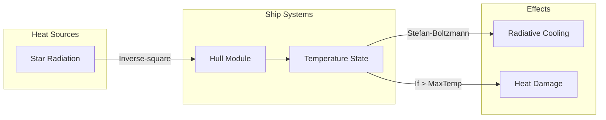
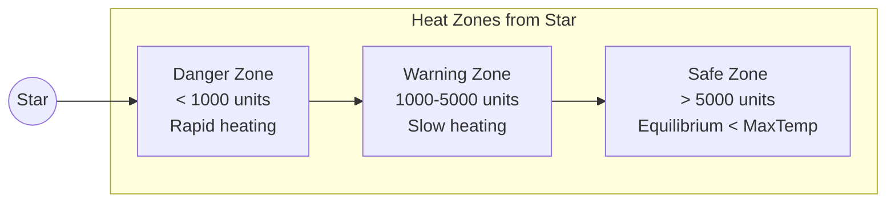
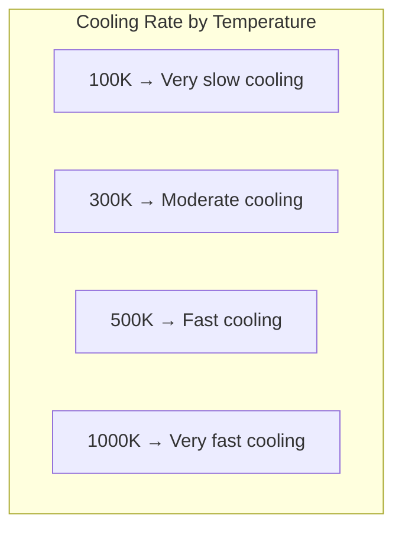
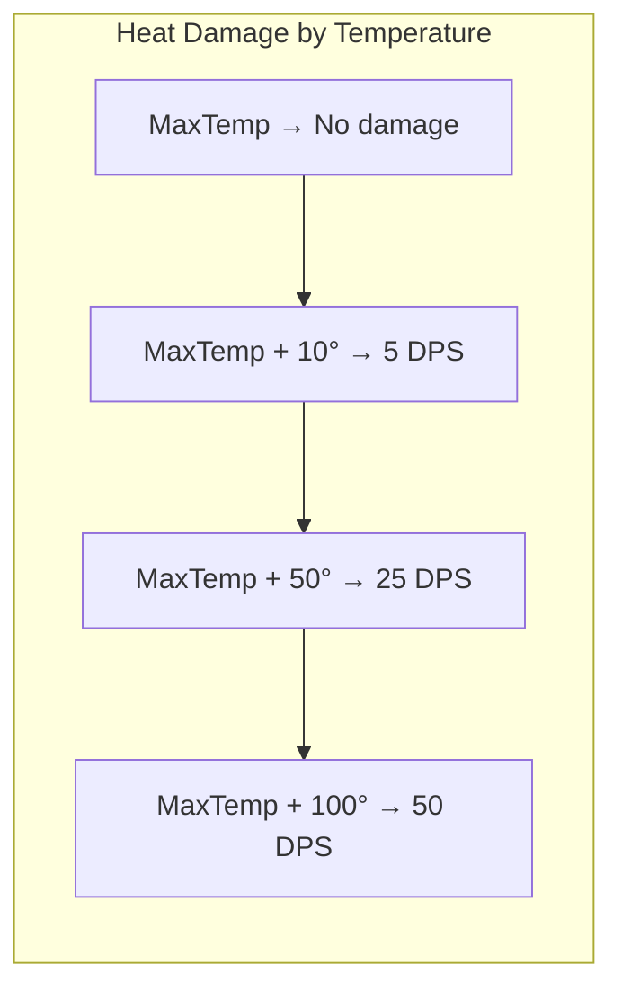
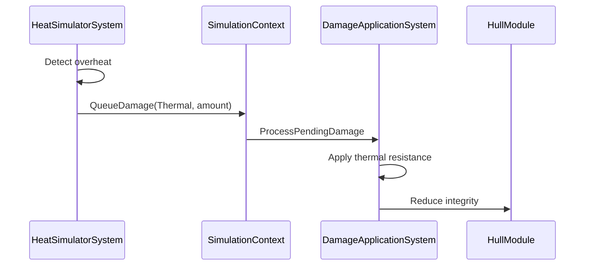
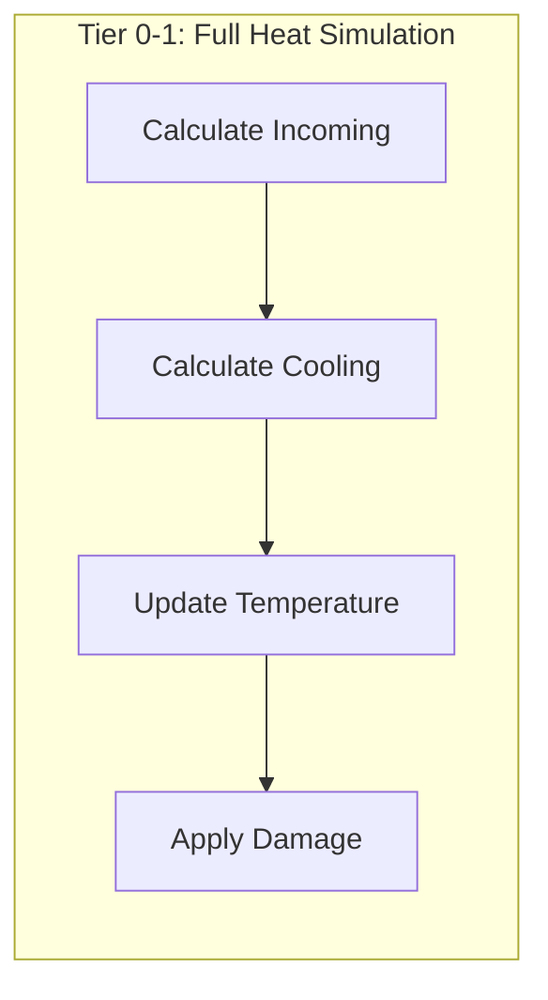
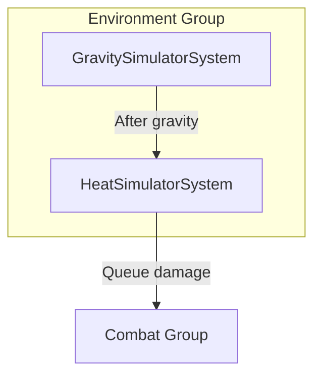
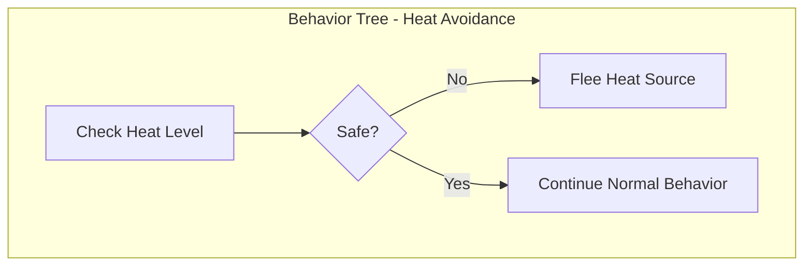

# Heat System

This document defines the thermal radiation and heat damage system for Starfire.

> **Architecture Note:** In the hybrid architecture, heat simulation runs in the EnvironmentManager for Rich Layer ships. Each ShipInstance has a HeatState struct and HullThermalProperties derived from its HullModule. Heat damage routes through the DamageModel as environmental damage. Sensor Layer contacts do not simulate heat - when promoted to Rich Layer, their temperature is initialized to equilibrium based on distance from nearest star.

---

## Design Decisions Summary

| Decision | Choice | Rationale |
|----------|--------|-----------|
| Heat sources | Stars only (via Luminosity) | Simplifies system, most impactful source |
| Heat sink | Hull module only | User preference, simpler than radiator modules |
| Cooling model | Stefan-Boltzmann radiative | Realistic for space (no convection) |
| Damage routing | Environmental damage type | Uses existing DamageModel pipeline |
| Layer handling | Rich Layer only | Sensor layer uses equilibrium approximation |

---

## Heat Flow Overview



**Heat Balance Equation:**
```
dT/dt = (Q_in - Q_out) / (m × c)
```

Where:
- Q_in = Incoming radiation from stars
- Q_out = Radiative cooling
- m = Thermal mass (hull mass × multiplier)
- c = Specific heat capacity

---

## Incoming Radiation

Stars emit radiation that heats nearby entities. Heat flux follows the inverse-square law.

### Formula

```
Q_in = (L × α) / (4π × r²)
```

Where:
- L = Star luminosity
- α = Hull absorption coefficient (default 1.0)
- r = Distance from star center

### Implementation

```csharp
/// <summary>
/// Calculate incoming heat radiation from nearby stars.
/// </summary>
public float CalculateIncomingHeat(
    double2 entityPosition,
    ReadOnlySpan<GravitySourceData> nearbySources,
    HeatConfig config)
{
    float totalHeat = 0f;
    int starCount = 0;

    foreach (var source in nearbySources)
    {
        if (source.Luminosity <= 0) continue;  // Not a star
        if (starCount >= config.MaxHeatSources) break;

        double distance = math.length(source.AbsolutePosition - entityPosition);

        // Skip if inside star (collision handles this)
        if (distance < source.SurfaceRadius) continue;

        // Inverse-square law
        float intensity = (float)(
            source.Luminosity * config.LuminosityHeatMultiplier /
            (4 * Math.PI * distance * distance)
        );

        totalHeat += intensity;
        starCount++;
    }

    return totalHeat;
}
```

### Distance-Heat Relationship



**Example Heat Intensities (Luminosity = 1000):**

| Distance | Heat Flux | Effect |
|----------|-----------|--------|
| 500 units | 0.318 | Rapid heating |
| 1000 units | 0.080 | Moderate heating |
| 2000 units | 0.020 | Slow heating |
| 5000 units | 0.003 | Near equilibrium |
| 10000 units | 0.0008 | Minimal |

---

## Radiative Cooling

In space, the only way to dissipate heat is through thermal radiation (Stefan-Boltzmann law).

### Formula

```
Q_out = ε × σ × A × (T⁴ - T_ambient⁴)
```

Where:
- ε = Emissivity (0-1, default 0.8)
- σ = Stefan-Boltzmann constant (5.67×10⁻⁸)
- A = Surface area (derived from hull size)
- T = Current temperature (Kelvin)
- T_ambient = Space temperature (~3K)

### Implementation

```csharp
/// <summary>
/// Calculate radiative cooling using Stefan-Boltzmann law.
/// </summary>
public float CalculateRadiativeCooling(
    float currentTemp,
    HeatConfig config)
{
    float ambientTemp = config.SpaceAmbientTemperature;

    float cooling = config.HullEmissivity * config.StefanBoltzmannConstant *
        (Mathf.Pow(currentTemp, 4) - Mathf.Pow(ambientTemp, 4));

    return Mathf.Max(0, cooling);  // Can't cool below ambient
}
```

### Temperature → Cooling Rate



**Note:** The T⁴ term means cooling rate increases dramatically at higher temperatures, creating a natural equilibrium.

---

## Temperature Update

Each frame, calculate net heat flow and update hull temperature.

```csharp
/// <summary>
/// Update entity heat state for one simulation tick.
/// </summary>
public void UpdateEntityHeat(
    ref HeatState state,
    in HullThermalProperties thermal,
    double2 entityPosition,
    ReadOnlySpan<GravitySourceData> sources,
    float deltaTime,
    HeatConfig config)
{
    // 1. Incoming radiation
    float incoming = CalculateIncomingHeat(entityPosition, sources, config);

    // 2. Radiative cooling
    float cooling = CalculateRadiativeCooling(state.CurrentTemperature, config);

    // 3. Net heat flow
    float netHeat = incoming - cooling;

    // 4. Temperature change: dT = Q / (m × c)
    float thermalMass = thermal.Mass * config.ThermalMassMultiplier;
    float tempChange = netHeat * deltaTime / thermalMass;

    // 5. Update temperature (clamp to ambient minimum)
    state.CurrentTemperature = Mathf.Max(
        config.SpaceAmbientTemperature,
        state.CurrentTemperature + tempChange
    );

    // 6. Update equilibrium state
    state.IsAtEquilibrium = Mathf.Abs(netHeat) < config.EquilibriumThreshold;
}
```

---

## Heat Damage

When hull temperature exceeds `MaxTemperature`, progressive damage occurs.

### Damage Calculation

```csharp
/// <summary>
/// Apply heat damage if overheating.
/// Routes through existing damage pipeline.
/// </summary>
public void ApplyHeatDamage(
    ref HeatState state,
    in HullThermalProperties thermal,
    int entityId,
    float currentTime,
    ISimulationContext context,
    HeatConfig config)
{
    // Check threshold
    float overheat = state.CurrentTemperature - thermal.MaxTemperature - config.DamageThresholdMargin;
    if (overheat <= 0) return;

    // Rate limit damage ticks
    if (currentTime - state.LastHeatDamageTime < config.HeatDamageTickRate)
        return;

    // Calculate damage
    float damage = overheat * config.OverheatDamagePerDegree * config.HeatDamageTickRate;

    // Queue through damage system
    context.QueueDamage(new PendingDamage
    {
        TargetEntityId = entityId,
        Amount = damage,
        DamageType = DamageTypeEnum.Thermal,
        Source = Entity.Null,  // Environmental
        IsLocalized = false     // Heat affects whole ship
    });

    // Record event
    context.RecordCombatEvent(new CombatEventData
    {
        AttackerId = -1,  // Environmental
        TargetId = entityId,
        Damage = damage,
        DamageType = CombatDamageType.Environmental,
        WasKillingBlow = false
    });

    state.LastHeatDamageTime = currentTime;
    state.AccumulatedHeatDamage += damage;
}
```

### Damage Rate Visualization



### Integration with Progressive Destruction

Heat damage uses `DamageTypeEnum.Thermal` and routes through the existing damage pipeline:



**Note:** Thermal damage bypasses shields (heat doesn't care about energy barriers) and applies directly to hull with thermal resistance reduction.

---

## Tier-Specific Behavior

### Tier 0-1: Full Simulation



**Per-frame operations:**
1. Query nearby stars (reuse gravity source data)
2. Calculate incoming radiation (inverse-square)
3. Calculate radiative cooling (Stefan-Boltzmann)
4. Update temperature state
5. Apply heat damage if overheating

### Tier 2: Equilibrium Estimation

At Tier 2, estimate equilibrium temperature analytically:

```csharp
/// <summary>
/// Estimate equilibrium temperature for Tier 2 prediction.
/// At equilibrium: incoming = outgoing
/// </summary>
public float PredictEquilibriumTemperature(
    double2 position,
    ReadOnlySpan<GravitySourceData> sources,
    HeatConfig config)
{
    float incoming = CalculateIncomingHeat(position, sources, config);

    if (incoming < 1e-10f)
        return config.SpaceAmbientTemperature;

    // At equilibrium: ε × σ × T⁴ = Q_in
    // T = (Q_in / (ε × σ))^(1/4)
    float equilibrium = Mathf.Pow(
        incoming / (config.HullEmissivity * config.StefanBoltzmannConstant),
        0.25f
    );

    return Mathf.Max(config.SpaceAmbientTemperature, equilibrium);
}
```

**Tier 2 Damage Prediction:**
- If equilibrium > MaxTemp: Entity will take damage
- Use for AI decision making (avoid hot zones)

### Tier 3-4: No Simulation

Heat state frozen. Assume entity maintains safe distance from stars.

---

## Components

### HeatState

```csharp
/// <summary>
/// Per-entity thermal state. Stored in SimulatedEntity.TypeData.
/// </summary>
public struct HeatState
{
    public float CurrentTemperature;       // Current hull temperature (Kelvin)
    public float LastHeatDamageTime;       // For damage rate limiting
    public float AccumulatedHeatDamage;    // Total heat damage taken
    public bool IsAtEquilibrium;           // True if heating ≈ cooling
}
```

### HullThermalProperties

```csharp
/// <summary>
/// Thermal properties from hull module.
/// Extracted when entity enters simulation.
/// </summary>
public struct HullThermalProperties
{
    public float MaxTemperature;           // Hull max temperature tolerance
    public float Mass;                     // For thermal mass calculation
    public float ThermalResistance;        // 0-1, reduces thermal damage
}
```

### HeatConfig

```csharp
/// <summary>
/// Global heat simulation configuration.
/// </summary>
[CreateAssetMenu(fileName = "HeatConfig", menuName = "Starfire/Simulation/Heat Config")]
public class HeatConfig : ScriptableObject
{
    [Header("Physical Constants")]
    [Tooltip("Stefan-Boltzmann constant (scaled for gameplay)")]
    public float StefanBoltzmannConstant = 5.67e-8f;

    [Tooltip("Background space temperature (Kelvin)")]
    public float SpaceAmbientTemperature = 3f;

    [Tooltip("Star luminosity to heat multiplier")]
    public float LuminosityHeatMultiplier = 1000f;

    [Header("Hull Properties")]
    [Tooltip("Default max temperature for entities without hull module")]
    public float DefaultMaxTemperature = 500f;

    [Tooltip("Multiplier for thermal mass calculation")]
    public float ThermalMassMultiplier = 0.1f;

    [Tooltip("Hull emissivity (0-1, affects cooling rate)")]
    public float HullEmissivity = 0.8f;

    [Header("Damage")]
    [Tooltip("Damage per second per degree over max temperature")]
    public float OverheatDamagePerDegree = 0.5f;

    [Tooltip("Minimum time between heat damage ticks")]
    public float HeatDamageTickRate = 0.5f;

    [Tooltip("Temperature margin before damage starts")]
    public float DamageThresholdMargin = 10f;

    [Header("Performance")]
    [Tooltip("Maximum stars to consider for heat calculation")]
    public int MaxHeatSources = 3;

    [Tooltip("Threshold for considering entity at equilibrium")]
    public float EquilibriumThreshold = 0.01f;
}
```

`HeatConfig` values can be overridden by mods via the JSON config pipeline (see [[05-configuration-layer]]). Heat damage routes through the `DamageModel` pipeline, which dispatches `OnEntityDamaged` events to Lua via GameEventBus (see [[09-progressive-destruction#Combat Events]]).

---

## System Execution Order



### HeatSimulatorSystem

```csharp
[UpdateInGroup(typeof(EnvironmentSystemGroup))]
[UpdateAfter(typeof(GravitySimulatorSystem))]
public partial struct HeatSimulatorSystem : ISystem
{
    public void OnUpdate(ref SystemState state)
    {
        float dt = SystemAPI.Time.DeltaTime;
        double currentTime = SystemAPI.Time.ElapsedTime;

        // Get gravity sources (reuse from gravity system)
        var sources = GetNearbySources(/* ... */);

        // Query entities with HeatState
        foreach (var (heatState, thermal, position) in
            SystemAPI.Query<RefRW<HeatState>, RefRO<HullThermalProperties>, RefRO<AbsolutePosition>>()
            .WithAll<ActiveTag>())
        {
            // Update heat
            UpdateEntityHeat(
                ref heatState.ValueRW,
                thermal.ValueRO,
                position.ValueRO.Value,
                sources,
                dt,
                _config);

            // Apply damage if overheating
            if (heatState.ValueRO.CurrentTemperature > thermal.ValueRO.MaxTemperature)
            {
                ApplyHeatDamage(/* ... */);
            }
        }
    }
}
```

---

## Hull Module Integration

The existing `IShipHullModule` interface already has temperature properties:

```csharp
public interface IShipHullModule : IShipModule
{
    float MaxTemperature { get; }
    float CurrentTemperature { get; set; }
    // ... other properties
}
```

### Extraction at Simulation Entry

```csharp
/// <summary>
/// Extract thermal properties when ship enters background simulation.
/// </summary>
public static HullThermalProperties ExtractThermalProperties(IShipHullModule hull)
{
    return new HullThermalProperties
    {
        MaxTemperature = hull.MaxTemperature,
        Mass = hull.MaxIntegrity,  // Use integrity as proxy for mass
        ThermalResistance = 0f     // Default, could be configurable
    };
}
```

### Restoration at Simulation Exit

```csharp
/// <summary>
/// Restore temperature when promoting back to GameObject.
/// </summary>
public static void RestoreThermalState(IShipHullModule hull, HeatState state)
{
    hull.CurrentTemperature = state.CurrentTemperature;
}
```

---

## AI Integration

AI ships should avoid heat danger zones.

### Heat Awareness

```csharp
/// <summary>
/// Check if a position is in a heat danger zone.
/// </summary>
public bool IsHeatDangerZone(
    double2 position,
    float maxTemperature,
    ReadOnlySpan<GravitySourceData> sources,
    HeatConfig config)
{
    float equilibriumTemp = PredictEquilibriumTemperature(position, sources, config);
    return equilibriumTemp > maxTemperature * 0.9f;  // 90% threshold for safety margin
}
```

### Behavior Tree Integration

Add heat awareness to AI navigation:



---

## Visual Effects

Heat levels can drive visual effects for Tier 0 entities.

### Temperature → Visual State

| Temperature | Visual Effect |
|-------------|---------------|
| < 50% MaxTemp | Normal |
| 50-75% MaxTemp | Faint heat shimmer |
| 75-100% MaxTemp | Orange glow on hull |
| > MaxTemp | Red glow + smoke particles |
| > MaxTemp + 50° | Fire particles |

### Implementation Hook

```csharp
/// <summary>
/// Get visual effect level from heat state.
/// </summary>
public HeatVisualLevel GetVisualLevel(float currentTemp, float maxTemp)
{
    float ratio = currentTemp / maxTemp;

    if (ratio < 0.5f) return HeatVisualLevel.Normal;
    if (ratio < 0.75f) return HeatVisualLevel.Warm;
    if (ratio < 1.0f) return HeatVisualLevel.Hot;
    if (ratio < 1.1f) return HeatVisualLevel.Overheating;
    return HeatVisualLevel.Critical;
}

public enum HeatVisualLevel : byte
{
    Normal = 0,
    Warm = 1,
    Hot = 2,
    Overheating = 3,
    Critical = 4
}
```

---

## Key Formulas Reference

### Inverse-Square Radiation
```
Q_in = L / (4π × r²)
```

### Stefan-Boltzmann Cooling
```
Q_out = ε × σ × (T⁴ - T_ambient⁴)
```

### Temperature Change
```
dT/dt = (Q_in - Q_out) / (m × c)
```

### Equilibrium Temperature
```
T_eq = (Q_in / (ε × σ))^(1/4)
```

### Heat Damage
```
Damage = (T - MaxTemp - Margin) × DamagePerDegree × TickRate
```

---

## Related Documents

- [[00-overview]] - Architecture overview
- [[01-component-model]] - Component definitions
- [[02-system-architecture]] - System execution order
- [[09-progressive-destruction]] - Damage routing
- [[10-gravity-system]] - Gravity sources (provides star data)
- [[12-modding-architecture]] - Moddable heat configuration
