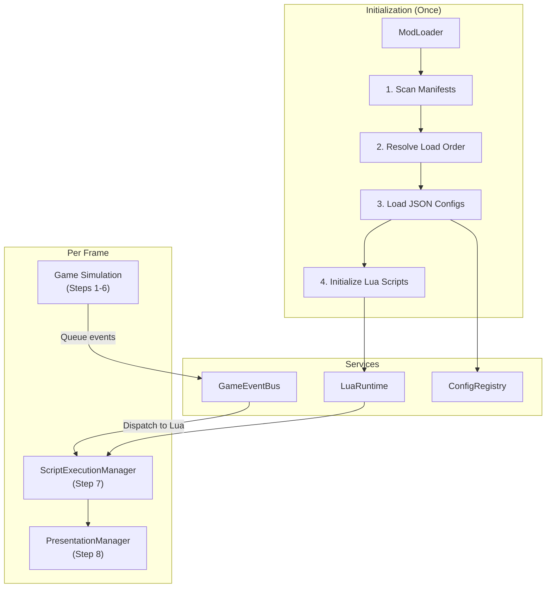
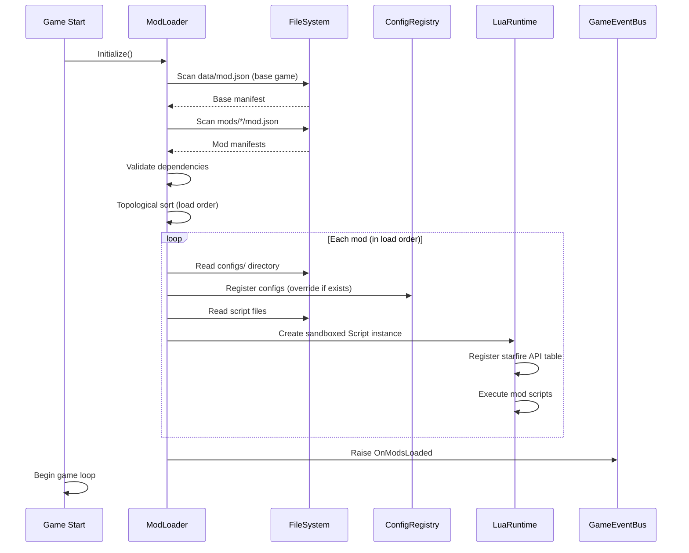
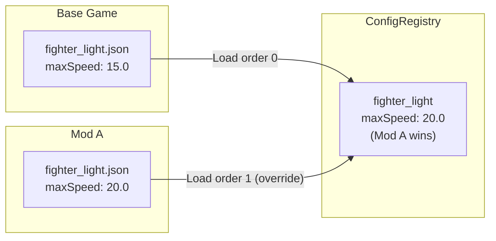
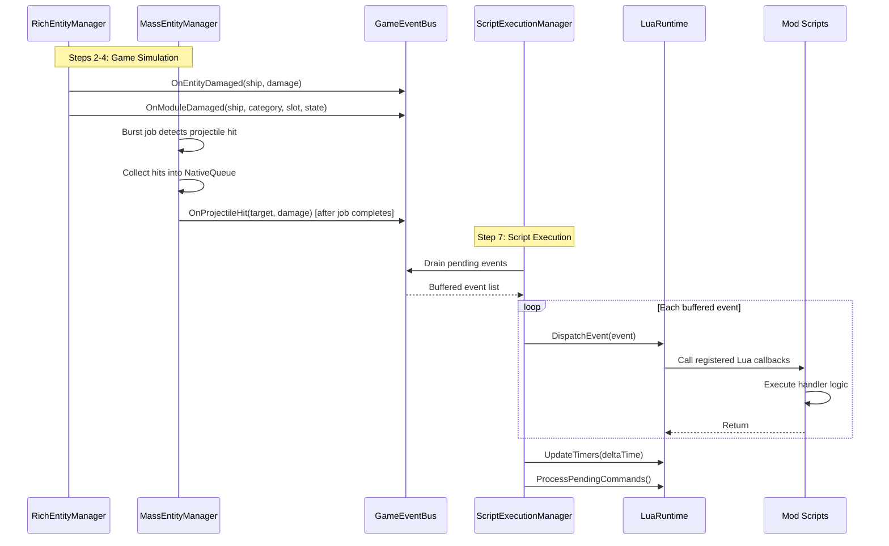

# Modding Architecture

This document defines the modding system for Starfire: mod structure, loading pipeline, JSON configuration overrides, Lua scripting runtime, event bridge, and API surface.

> **Design Principle:** The base game is its own first mod. Base game content in `StreamingAssets/data/` loads through the identical pipeline as mod content in `StreamingAssets/mods/`. There is no separate "engine" vs "content" boundary — mods have the same capabilities as the base game data layer.

> **Multiplayer:** Lua scripts run **server-only**. MoonSharp executes only on the server for authority, determinism, and security. Changes made by Lua (e.g., `set_health()`) are picked up by `NetworkStateReplicator` and sent to clients automatically. Multiplayer mod authority model (server-enforced vs client cosmetic mods) is deferred for later design. See [[13-networking-architecture]].

---

## Overview

Starfire supports two tiers of modding:

| Tier | Mechanism | Capability | Complexity |
|------|-----------|-----------|------------|
| **Tier 1: Data** | JSON configuration files | New ships, weapons, factions, hitbox zones, balance tweaks | Low |
| **Tier 2: Scripting** | Lua scripts (MoonSharp) | Custom behaviors, event reactions, spawn logic, gameplay rules | Medium |

**Key Constraints:**
- Lua executes on the **main thread**, after all game simulation completes for the tick (server-only)
- Total script execution budget: **0.5ms per tick**
- Each mod runs in a **sandboxed** MoonSharp Script instance — no filesystem or network access
- Mods cannot define new C# types or modify Burst jobs
- Lua interacts with Rich layer entities **directly** via proxy wrappers — changes are immediate



---

## Mod Structure & Manifest

### Directory Layout

```
StreamingAssets/
├── data/                           # Base game (first mod)
│   ├── mod.json                    # Base game manifest
│   ├── configs/
│   │   ├── ships/
│   │   ├── modules/
│   │   ├── hitbox-zones/
│   │   ├── factions/
│   │   ├── asteroids/
│   │   └── behavior-trees/
│   └── scripts/
│       └── base_events.lua
└── mods/
    └── radiation_zones/            # Example mod
        ├── mod.json                # Mod manifest
        ├── configs/
        │   └── ships/
        │       └── fighter_light.json   # Override base ship
        └── scripts/
            └── radiation.lua
```

### Manifest Format (`mod.json`)

```json
{
  "id": "radiation_zones",
  "name": "Radiation Zones",
  "version": "1.0.0",
  "author": "ModAuthor",
  "description": "Adds radiation damage zones near stars",
  "dependencies": [],
  "loadAfter": ["base"],
  "loadBefore": [],
  "scripts": [
    "scripts/radiation.lua"
  ]
}
```

The corresponding C# data structure:

```csharp
public class ModManifest
{
    public string Id;
    public string Name;
    public string Version;
    public string Author;
    public string Description;
    public string[] Dependencies;
    public string[] LoadAfter;
    public string[] LoadBefore;
    public string[] Scripts;
}

public class ModLoadEntry
{
    public int LoadOrder;
    public string ModId;
    public string BasePath;
    public bool IsBaseGame;
}
```

| Field | Required | Description |
|-------|----------|-------------|
| `id` | Yes | Unique mod identifier (lowercase, underscores) |
| `name` | Yes | Display name |
| `version` | Yes | Semantic version string |
| `author` | No | Author name |
| `description` | No | Short description |
| `dependencies` | No | Required mods (mod fails to load if missing) |
| `loadAfter` | No | Soft ordering — load after these if present |
| `loadBefore` | No | Soft ordering — load before these if present |
| `scripts` | No | Lua script paths relative to mod root |

---

## Mod Loading Pipeline



### Load Order Resolution

1. Base game (`StreamingAssets/data/`) loads first — always load order 0
2. Mods sorted by topological sort of `dependencies`, `loadAfter`, `loadBefore`
3. Mods with no ordering constraints sort alphabetically
4. **Later configs override earlier** — a mod's `fighter_light.json` replaces the base game's `fighter_light.json` in ConfigRegistry

### Error Handling

| Error | Behavior |
|-------|----------|
| Missing dependency | Mod skipped, warning logged |
| Circular dependency | All mods in cycle skipped, error logged |
| Invalid manifest JSON | Mod skipped, error logged |
| Invalid config JSON | Individual config skipped, error logged |
| Lua syntax error | Script skipped, error logged (other mod scripts still run) |

---

## JSON Configuration Modding (Tier 1)

JSON configs are the simplest way to mod Starfire. A mod can override existing configs or add new ones by placing JSON files in its `configs/` directory, mirroring the base game structure.

### Override Model



| Operation | Mechanism | Example |
|-----------|-----------|---------|
| **Override** | Same `archetypeId` / `configId` | Change `fighter_light` max speed |
| **Add** | New `archetypeId` / `configId` | Add `fighter_stealth` ship type |

### Moddable Config Types

| Config Type | Directory | Schema | Reference |
|-------------|-----------|--------|-----------|
| Ships | `configs/ships/` | `ship.schema.json` | [[05-configuration-layer]] |
| Modules | `configs/modules/` | `module.schema.json` | [[05-configuration-layer]] |
| Hitbox Zones | `configs/hitbox-zones/` | `hitbox-zones.schema.json` | [[09-progressive-destruction]] |
| Factions | `configs/factions/` | `faction.schema.json` | [[05-configuration-layer]] |
| Asteroids | `configs/asteroids/` | `asteroid.schema.json` | [[05-configuration-layer]] |
| Behavior Trees | `configs/behavior-trees/` | `behavior-tree-manifest.schema.json` | [[05-configuration-layer]] |
| Zone Spawn Rules | `configs/zones/` | `zone.schema.json` | [[06-chunk-integration]] |

Environment configs (gravity, heat, warp) are also moddable via the same JSON pipeline. See [[10-gravity-system]], [[11-heat-system]], and [[07-warp-system]].

---

## Lua Scripting Runtime (Tier 2)

### MoonSharp

Starfire uses **MoonSharp**, a pure C# implementation of a Lua 5.2 interpreter. MoonSharp runs entirely in managed code — no native DLLs, no platform dependencies. This makes it safe for sandboxing and compatible with all Unity platforms.

### Per-Mod Sandbox

Each mod receives its own MoonSharp `Script` instance with restricted standard libraries:

| Library | Status | Notes |
|---------|--------|-------|
| `math` | Allowed | Full math library |
| `string` | Allowed | Full string library |
| `table` | Allowed | Full table library |
| `coroutine` | Allowed | For async patterns |
| `pairs/ipairs` | Allowed | Iteration |
| `tonumber/tostring` | Allowed | Type conversion |
| `type` | Allowed | Type checking |
| `pcall/xpcall` | Allowed | Error handling |
| `os` | **Blocked** | No system access |
| `io` | **Blocked** | No file access |
| `file` | **Blocked** | No file access |
| `debug` | **Blocked** | No debug introspection |
| `require` | **Replaced** | Mod-scoped `import()` for loading other scripts within the same mod |
| `loadstring` | **Blocked** | No dynamic code generation |
| `dofile` | **Blocked** | No arbitrary file execution |

### Script Initialization

```csharp
public class LuaRuntime
{
    private Dictionary<string, Script> _modScripts;

    public void InitializeMod(ModLoadEntry mod)
    {
        var script = new Script(CoreModules.Preset_SoftSandbox);

        RegisterStarfireAPI(script);

        foreach (var scriptPath in mod.Manifest.Scripts)
        {
            var lua = File.ReadAllText(Path.Combine(mod.BasePath, scriptPath));
            script.DoString(lua, codeFriendlyName: $"{mod.ModId}/{scriptPath}");
        }

        _modScripts[mod.ModId] = script;
    }

    private void RegisterStarfireAPI(Script script)
    {
        var starfire = new Table(script);
        starfire["on"] = (Action<string, Closure>)RegisterEventHandler;
        starfire["off"] = (Action<string, Closure>)UnregisterEventHandler;
        starfire["get_entity"] = (Func<int, LuaEntityProxy>)GetEntityProxy;
        starfire["get_player"] = (Func<LuaEntityProxy>)GetPlayerProxy;
        starfire["find_entities"] = (Func<Table, Table>)FindEntities;
        starfire["spawn"] = (Action<string, double, double, string>)QueueSpawn;
        starfire["get_time"] = (Func<double>)GetGameTime;
        starfire["get_player_position"] = (Func<DynValue>)GetPlayerPosition;
        starfire["timer"] = (Func<float, Closure, int>)CreateTimer;
        starfire["interval"] = (Func<float, Closure, int>)CreateInterval;
        starfire["cancel_timer"] = (Action<int>)CancelTimer;
        starfire["log"] = (Action<string>)LogInfo;
        starfire["warn"] = (Action<string>)LogWarn;
        starfire["error"] = (Action<string>)LogError;
        script.Globals["starfire"] = starfire;
    }
}
```

---

## Lua API Surface

All Lua interaction goes through the `starfire` global table.

### Event Registration

```lua
-- Register a callback for an event
starfire.on("entity_damaged", function(entity, damage)
    if entity:get_data("rz.shielded") == 1 then
        entity:set_health(entity.health + damage * 0.5)
    end
end)

-- Unregister a callback
starfire.off("entity_damaged", my_callback)
```

### Event Table

All events dispatched via GameEventBus to Lua:

| Event Name | Callback Signature | Fired When |
|------------|-------------------|------------|
| `entity_spawned` | `(entity)` | Entity created (Rich layer) |
| `entity_damaged` | `(entity, amount, damage_type, source_id)` | Entity takes damage |
| `entity_destroyed` | `(entity_id, killer_id)` | Entity hull reaches 0 |
| `module_damaged` | `(entity, category, slot, new_state)` | Module damage state changes |
| `module_disabled` | `(entity, category, slot)` | Module reaches Disabled state |
| `module_repaired` | `(entity, category, slot, new_state)` | Module repaired from Disabled |
| `projectile_hit` | `(target_entity, damage, projectile_type, owner_id)` | Projectile impacts target |
| `warp_engaged` | `(entity)` | Ship enters warp |
| `warp_dropped` | `(entity, reason)` | Ship exits warp |
| `warp_hazard_warning` | `(entity, hazard_type, distance)` | Warp hazard detected ahead |
| `chunk_loaded` | `(chunk_x, chunk_y)` | Chunk loaded into simulation |
| `chunk_unloaded` | `(chunk_x, chunk_y)` | Chunk unloaded |
| `chunk_boundary` | `(entity, old_chunk_x, old_chunk_y, new_chunk_x, new_chunk_y)` | Entity crosses chunk boundary |
| `wave_started` | `(wave_number)` | Combat wave begins |
| `wave_completed` | `(wave_number)` | Combat wave cleared |
| `player_docked` | `(player_entity, station_entity)` | Player docks at station |
| `tier_transition` | `(entity_id, old_tier, new_tier)` | Entity changes simulation tier |
| `sensor_contact_changed` | `(contact_id, new_state)` | Sensor contact state changes |
| `mods_loaded` | `()` | All mods finished loading |

### Entity Access

```lua
local entity = starfire.get_entity(42)
local player = starfire.get_player()

-- Find all pirate ships within 500 units of position
local enemies = starfire.find_entities({
    faction = "pirate",
    x = 100, y = 200,
    radius = 500
})
for _, enemy in ipairs(enemies) do
    starfire.log("Found pirate: " .. enemy.id)
end
```

### World Interaction

```lua
-- Spawn a new entity (queued, executes end of frame)
starfire.spawn("fighter_light", 100.0, 200.0, "pirate")

-- Query world state
local time = starfire.get_time()
local px, py = starfire.get_player_position()
```

### Timers

```lua
-- One-shot timer (3 second delay)
local timer_id = starfire.timer(3.0, function()
    starfire.log("Timer fired!")
end)

-- Repeating interval (every 1 second)
local interval_id = starfire.interval(1.0, function()
    local player = starfire.get_player()
    starfire.log("Player health: " .. player.health)
end)

-- Cancel a timer
starfire.cancel_timer(interval_id)
```

### Logging

```lua
starfire.log("Info message")      -- Debug.Log
starfire.warn("Warning message")  -- Debug.LogWarning
starfire.error("Error message")   -- Debug.LogError
```

All log messages are prefixed with the mod ID: `[radiation_zones] Info message`

---

## LuaEntityProxy

The `LuaEntityProxy` wraps a `ShipInstance` for safe Lua access. Created on-demand when dispatching events or when Lua calls `starfire.get_entity()`.

### Read Properties

| Property | Type | Description |
|----------|------|-------------|
| `id` | int | Entity ID |
| `type` | string | Entity type name (Ship, Station) |
| `faction` | string | Faction name |
| `position_x` | double | Absolute X position |
| `position_y` | double | Absolute Y position |
| `velocity_x` | double | Velocity X component |
| `velocity_y` | double | Velocity Y component |
| `heading` | float | Rotation in degrees (0-360) |
| `health` | float | Current hull integrity |
| `max_health` | float | Maximum hull integrity |
| `shield` | float | Current shield capacity |
| `max_shield` | float | Maximum shield capacity |
| `speed` | float | Current speed magnitude |
| `is_in_warp` | bool | Whether entity is warping |

### Write Methods

| Method | Signature | Description |
|--------|-----------|-------------|
| `set_health` | `(float)` | Set hull integrity |
| `set_position` | `(double, double)` | Set absolute position |
| `set_velocity` | `(double, double)` | Set velocity |
| `set_heading` | `(float)` | Set rotation |

### Per-Entity Data (ScriptData)

| Method | Signature | Description |
|--------|-----------|-------------|
| `get_data` | `(string) → float` | Read custom data by key |
| `set_data` | `(string, float)` | Write custom data by key |
| `has_tag` | `(string) → bool` | Check tag existence |
| `add_tag` | `(string)` | Add a tag |
| `remove_tag` | `(string)` | Remove a tag |

### Module Access

| Method | Signature | Description |
|--------|-----------|-------------|
| `get_module` | `(string) → LuaModuleProxy` | Access module by category name |

```lua
local shield = entity:get_module("Defense")
starfire.log("Shield health: " .. shield.health)
starfire.log("Shield efficiency: " .. shield.efficiency)
shield:set_enabled(false)
```

**LuaModuleProxy** properties:

| Property | Type | Description |
|----------|------|-------------|
| `health` | float | Current module health |
| `max_health` | float | Maximum module health |
| `efficiency` | float | Current efficiency multiplier (0.0-1.0) |
| `is_enabled` | bool | Whether module is enabled |
| `damage_state` | string | "Operational", "Damaged", "Critical", "Disabled" |
| `set_enabled` | `(bool)` | Enable/disable module |

### Write Semantics

Since `ShipInstance` is a managed C# class (not an ECS entity), the proxy reads and writes fields **directly**. Changes take effect immediately within the same frame — there is no deferred buffer or 1-frame delay.

```lua
-- This takes effect immediately
entity:set_health(50)
local h = entity.health  -- Returns 50
```

### Proxy Lifecycle

Proxies are created on-demand and hold a reference to the underlying `ShipInstance`. If the entity is destroyed or demoted below Tier 1, the proxy becomes invalid and property access returns nil/0.

---

## Per-Entity Script Data

Each `ShipInstance` has a `Dictionary<string, float>` field called `ScriptData` that Lua scripts use to store custom per-entity state.

```lua
-- Store a custom cooldown timer
entity:set_data("rz.radiation_timer", 5.0)

-- Read it back
local timer = entity:get_data("rz.radiation_timer")
```

### Namespace Convention

To avoid key collisions between mods, use the mod ID as a prefix:

```
modid.key_name
```

Examples:
- `rz.radiation_timer` — radiation_zones mod
- `bounty.reward_amount` — bounty mod
- `base.quest_stage` — base game scripts

### Persistence Across Tiers

ScriptData survives tier transitions. When a ShipInstance is demoted to the Sensor layer (Tier 2), the ScriptData dictionary is serialized into the `ShipSnapshot`. When promoted back to Rich layer, the data is restored.

| Transition | ScriptData Behavior |
|------------|-------------------|
| Tier 0 → Tier 1 | No change (same ShipInstance object) |
| Tier 1 → Tier 2 | Serialized into ShipSnapshot |
| Tier 2 → Tier 1 | Restored from ShipSnapshot |
| Tier 2 → Tier 3+ | Preserved in FleetMember snapshot |

---

## Event Bridge: GameEventBus to Lua

### How Events Flow



### Burst Constraint

Burst jobs (Mass Entity Layer) cannot call into managed C# code during execution. When a Burst job detects a projectile hit:

1. The job writes hit data into a `NativeQueue<ProjectileHitResult>`
2. After the job completes, `MassEntityManager` drains the queue on the main thread
3. Each hit result is forwarded to `GameEventBus.OnProjectileHit`
4. The event reaches Lua in `ScriptExecutionManager.Update()` like any other event

### Consistent World State

Events are **not** dispatched to Lua immediately when raised. They are buffered in the `GameEventBus` until `ScriptExecutionManager.Update()` runs (step 7 of the frame). This guarantees that when a Lua callback executes:

- All entity positions are updated
- All combat damage is resolved
- All tier transitions are complete
- All module states are current

---

## Script Execution Pipeline

`ScriptExecutionManager.Update()` runs as step 7 in the frame pipeline (see [[02-system-architecture]]).

```csharp
public class ScriptExecutionManager
{
    private LuaRuntime _lua;
    private GameEventBus _eventBus;
    private Queue<GameEvent> _pendingEvents;

    public void Update(float deltaTime)
    {
        // 1. Dispatch buffered events to Lua callbacks
        while (_pendingEvents.TryDequeue(out var evt))
            _lua.DispatchEvent(evt);

        // 2. Process Lua timer callbacks
        _lua.UpdateTimers(deltaTime);

        // 3. Execute any queued Lua API calls
        _lua.ProcessPendingCommands();
    }
}
```

### Performance Budget

| Step | Budget | Notes |
|------|--------|-------|
| Event dispatch | 0.2ms | Callbacks for all buffered events |
| Timer callbacks | 0.1ms | One-shot and repeating timers |
| API call processing | 0.2ms | Spawn requests, deferred operations |
| **Total** | **0.5ms** | Part of 16.5ms frame budget |

### Safety Mechanisms

| Mechanism | Purpose |
|-----------|---------|
| **Instruction limit** | MoonSharp instruction counting per callback — prevents infinite loops |
| **Time budget** | If 0.5ms exceeded, remaining events deferred to next frame |
| **Error isolation** | `pcall` wrapper around each callback — one mod's error doesn't crash others |
| **Mod identification** | All errors logged with mod ID for debugging |

If a mod consistently exceeds its instruction limit, the LuaRuntime logs a warning and may throttle that mod's callbacks.

---

## Mod Interaction Constraints

| Constraint | Reason |
|------------|--------|
| No new C# types | No assembly loading at runtime; safety and stability |
| No new EntityTypeEnum values | Byte enum, compile-time only. Use `EntityTypeEnum.Ship` + custom `ShipConfigId` |
| No Burst job modification | Mass layer jobs are compiled ahead of time |
| No direct Mass layer access | Lua operates on Rich layer only; Mass layer events arrive via GameEventBus |
| No filesystem access | Sandbox blocks `io`, `os`, `file` libraries |
| No network access | No socket or HTTP libraries exposed |
| No debug introspection | `debug` library blocked to prevent sandbox escape |

### What Mods CAN Do

| Capability | Mechanism |
|-----------|-----------|
| Add new ship types | JSON config with new `archetypeId` |
| Rebalance existing ships | JSON config override (same `archetypeId`) |
| Add new factions | JSON faction config |
| React to game events | `starfire.on()` Lua callbacks |
| Modify entity state | `LuaEntityProxy` write methods |
| Store custom data | `ScriptData` per-entity dictionary |
| Spawn entities | `starfire.spawn()` (queued) |
| Create timed behaviors | `starfire.timer()` / `starfire.interval()` |
| Add new hitbox layouts | JSON hitbox zone config |
| Override behavior trees | Behavior tree manifest config |

### Cross-Mod Communication

Mods can communicate through:
1. **ScriptData conventions** — Mod A sets `moda.status` on an entity, Mod B reads it
2. **Shared events** — Both mods listen to the same GameEventBus events
3. **Load order** — Later mods can override earlier mod configs

---

## Example Mod: Radiation Zones

A complete example showing both Tier 1 (config) and Tier 2 (scripting) working together.

### Manifest (`mods/radiation_zones/mod.json`)

```json
{
  "id": "radiation_zones",
  "name": "Radiation Zones",
  "version": "1.0.0",
  "author": "StarfireMods",
  "description": "Ships near stars take radiation damage over time",
  "dependencies": [],
  "loadAfter": ["base"],
  "scripts": [
    "scripts/radiation.lua"
  ]
}
```

### Ship Override (`mods/radiation_zones/configs/ships/fighter_light.json`)

```json
{
  "$schema": "starfire://schemas/ship.schema.json",
  "entityType": "Ship",
  "archetypeId": "fighter_light",
  "displayName": "Light Fighter",
  "description": "Fast and agile interceptor craft — now with radiation shielding",
  "modules": {
    "hull": {
      "moduleId": "hull_light_rad",
      "maxIntegrity": 110.0,
      "armor": 6.0
    }
  }
}
```

This overrides the base game's `fighter_light` with slightly more hull integrity and armor.

### Lua Script (`mods/radiation_zones/scripts/radiation.lua`)

```lua
local RADIATION_RANGE = 5000
local RADIATION_DPS = 2.0
local CHECK_INTERVAL = 0.5

starfire.on("mods_loaded", function()
    starfire.log("Radiation Zones mod loaded!")
end)

starfire.on("entity_spawned", function(entity)
    entity:set_data("rz.rad_timer", 0)
end)

starfire.interval(CHECK_INTERVAL, function()
    local px, py = starfire.get_player_position()
    local nearby = starfire.find_entities({
        x = px, y = py,
        radius = RADIATION_RANGE * 2
    })

    for _, entity in ipairs(nearby) do
        local dist = math.sqrt(
            (entity.position_x - px) ^ 2 +
            (entity.position_y - py) ^ 2
        )

        if dist < RADIATION_RANGE then
            local intensity = 1.0 - (dist / RADIATION_RANGE)
            local damage = RADIATION_DPS * intensity * CHECK_INTERVAL
            entity:set_health(entity.health - damage)
        end
    end
end)
```

This mod:
1. **Config (Tier 1):** Buffs the light fighter hull to survive longer near radiation
2. **Script (Tier 2):** Applies distance-based radiation damage to all entities near the player using a repeating timer

---

## Related Documents

- [[00-overview]] - Architecture overview, global services table (ModLoader, LuaRuntime, GameEventBus)
- [[01-component-model]] - ModManifest struct, LuaEntityProxy class, ScriptData, GameEventBus
- [[02-system-architecture]] - ScriptExecutionManager pipeline, performance budgets
- [[03-tiered-simulation]] - Tier transitions affecting Lua entity access
- [[04-archetype-strategy]] - Entity composition for mod-created ships
- [[05-configuration-layer]] - JSON config pipeline, schemas, ConfigRegistry, override model
- [[06-chunk-integration]] - Chunk load/unload events, zone spawn rule modding
- [[07-warp-system]] - Warp events dispatched to Lua
- [[08-control-modes]] - Mod-defined behaviors and control overrides
- [[09-progressive-destruction]] - Damage events dispatched to Lua, hitbox zone modding
- [[10-gravity-system]] - Moddable gravity configuration
- [[11-heat-system]] - Moddable heat configuration, heat damage routes to Lua events
- [[13-networking-architecture]] - Lua server-only execution, NetworkEventBridge for client VFX
