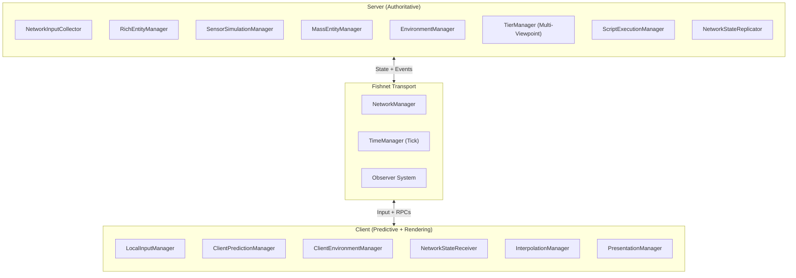
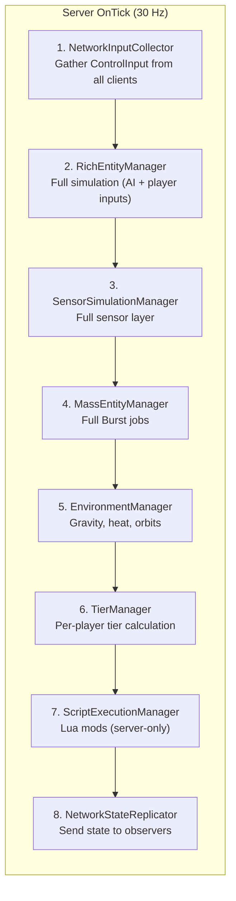
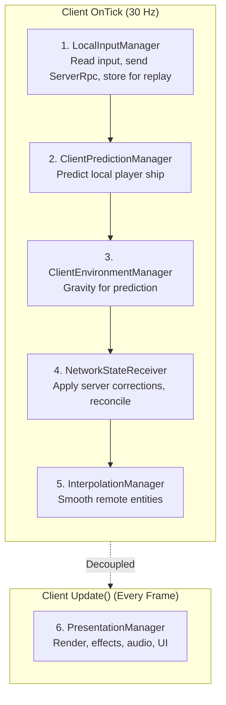
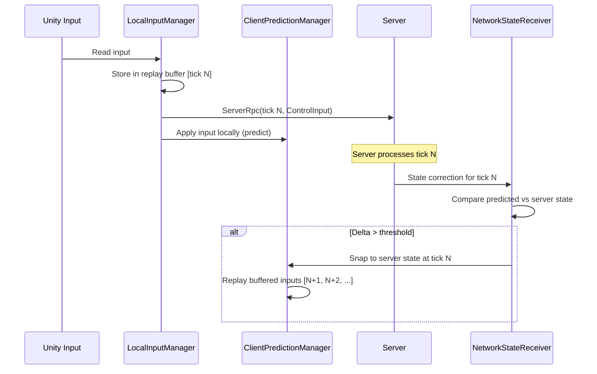
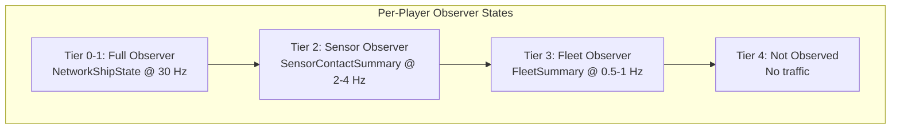
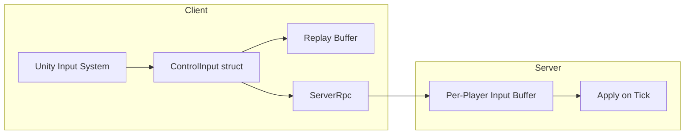

# Networking Architecture

This document defines the multiplayer networking system for Starfire using Fishnet. The game uses a **server-authoritative** model where the server runs the full simulation and clients render locally with prediction for the player's own ship.

> **Architecture Note:** Single-player is implemented as a local listen server with no remote clients. The networking stack is always active — there is no separate offline code path. This simplifies the codebase to a single execution model. Fishnet supports both dedicated servers and listen servers (host + play).

---

## Design Decisions Summary

| Decision | Choice | Rationale |
|----------|--------|-----------|
| Networking library | Fishnet | Pure C# Unity networking, server-authoritative by default, tick-based |
| Authority model | Server-authoritative | Server runs full simulation, makes all gameplay decisions |
| Player count | 8-16 concurrent | Mid-scale, observer system important for bandwidth |
| Hosting model | Dedicated + Listen server | Fishnet handles both natively |
| Single-player | Local listen server | No separate code path, networking always active |
| Simulation driver | Fishnet TimeManager.OnTick | Fixed tick rate (30 Hz) replaces frame-based Update |
| Client prediction | Player ship only | Clients predict own movement, interpolate all remote entities |
| Mod execution | Server-only | Lua runs on server for authority, determinism, security |
| Code splitting | Role-aware base class | Not separate assemblies; `NetworkSimulationManager` with ServerTick/ClientTick |

---

## Architecture Overview



---

## Tick-Based Simulation

Fishnet's `TimeManager` provides a configurable tick rate that replaces Unity's `Update()` as the simulation driver. Both server and client subscribe to `OnTick`.

| Parameter | Value | Notes |
|-----------|-------|-------|
| Server tick rate | 30 Hz | 33ms budget — generous for the 10ms simulation pipeline |
| Client prediction rate | 30 Hz | Matches server tick rate for reconciliation alignment |
| Client render rate | Unlocked | VSync dependent, decoupled from tick via interpolation |
| Physics simulation | Manual | `Physics2D.Simulate()` called per tick, auto-simulation disabled |

```csharp
public class NetworkGameManager : NetworkBehaviour
{
    private void OnEnable()
    {
        TimeManager.OnTick += OnTick;
    }

    private void OnTick()
    {
        float tickDelta = (float)TimeManager.TickDelta;

        if (IsServerStarted)
            ServerTick(tickDelta);

        if (IsClientStarted)
            ClientTick(tickDelta);
    }

    private void ServerTick(float deltaTime)
    {
        _networkInputCollector.Tick(deltaTime);
        _richEntityManager.ServerTick(deltaTime);
        _sensorSimulationManager.ServerTick(deltaTime);
        _massEntityManager.ServerTick(deltaTime);
        _environmentManager.ServerTick(deltaTime);
        _tierManager.ServerTick(deltaTime);
        _scriptExecutionManager.ServerTick(deltaTime);
        _networkStateReplicator.Tick(deltaTime);
    }

    private void ClientTick(float deltaTime)
    {
        _localInputManager.Tick(deltaTime);
        _clientPredictionManager.Tick(deltaTime);
        _clientEnvironmentManager.Tick(deltaTime);
        _networkStateReceiver.Tick(deltaTime);
        _interpolationManager.Tick(deltaTime);
    }

    private void Update()
    {
        if (IsClientStarted)
            _presentationManager.Update();
    }
}
```

`PresentationManager` remains in `Update()` for smooth rendering decoupled from tick rate. All simulation runs in `OnTick`.

---

## Server Pipeline

The server runs the authoritative simulation. No rendering, no PresentationManager.



### New Server Managers

**NetworkInputCollector** replaces `InputManager`. Gathers `ControlInput` from per-client input buffers populated by ServerRpc calls.

```csharp
public class NetworkInputCollector : NetworkBehaviour
{
    private Dictionary<int, CircularBuffer<TickedInput>> _clientInputBuffers;

    [ServerRpc(RequireOwnership = false)]
    private void SendInput(uint tick, ControlInput input, NetworkConnection sender)
    {
        int clientId = sender.ClientId;
        _clientInputBuffers[clientId].Add(new TickedInput { Tick = tick, Input = input });
    }

    public ControlInput GetInputForPlayer(int clientId, uint tick)
    {
        if (_clientInputBuffers[clientId].TryGet(tick, out var tickedInput))
            return tickedInput.Input;

        return _clientInputBuffers[clientId].Latest.Input;
    }
}
```

**NetworkStateReplicator** packages entity state and sends it to relevant observers based on per-player tier assignments.

---

## Client Pipeline

The client predicts the local player's ship and interpolates all remote entities.



### New Client Managers

**LocalInputManager** reads Unity Input System, stores input in a replay buffer keyed by tick, and sends to server via ServerRpc.

**ClientPredictionManager** applies local input to predict player ship movement. On server correction, replays buffered inputs from the corrected tick forward.

**InterpolationManager** buffers 2-3 server snapshots for remote entities and lerps between them for smooth rendering.

**NetworkStateReceiver** processes incoming server state, triggers reconciliation when predicted and server states diverge beyond a threshold.

---

## Code Splitting Pattern

Every simulation manager inherits from `NetworkSimulationManager`, providing server and client execution paths:

```csharp
public abstract class NetworkSimulationManager : NetworkBehaviour
{
    protected bool IsAuthority => IsServerStarted;
    protected bool IsLocalClient => IsClientStarted && !IsServerStarted;
    protected bool IsHost => IsServerStarted && IsClientStarted;

    public virtual void SimulationTick(float deltaTime)
    {
        if (IsServerStarted)
            ServerTick(deltaTime);
        if (IsClientStarted)
            ClientTick(deltaTime);
    }

    protected abstract void ServerTick(float deltaTime);
    protected abstract void ClientTick(float deltaTime);
}
```

**Exceptions:**
- `PresentationManager` — client-only, no base needed
- `ScriptExecutionManager` — server-only, no client path

### Folder Organization

```
Assets/Scripts/
  Core/           -- Shared types (ControlInput, ShipSnapshot, NetworkShipState)
  Simulation/     -- Server-side (managers, AI, combat, tier management)
  Prediction/     -- Client-side (player prediction, reconciliation)
  Presentation/   -- Client-side (ShipView, effects, UI, interpolation)
  Networking/     -- Fishnet integration (RPCs, state sync, observer conditions)
```

---

## Entity Networking

### Rich Layer (Tier 0-1): NetworkObject Per Entity

Only entities at Tier 0-1 **for any connected player** get a `NetworkObject`. When an entity is Tier 2+ for ALL players, its `NetworkObject` is despawned.

| Entity Type | Authority | Prediction | Replication |
|-------------|-----------|-----------|-------------|
| Player ship | Owner (client prediction) | Yes — input replay reconciliation | ControlInput via ServerRpc, corrections via SyncVar |
| AI ship | Server | No — interpolation only | NetworkShipState to observers |
| Station | Server | No — mostly static | Low-frequency SyncVar updates |

### Network State Struct

Compact replication format for Rich layer entities (~51 bytes):

```csharp
public struct NetworkShipState
{
    public double2 Position;           // 16 bytes
    public double2 Velocity;           // 16 bytes
    public float Heading;              // 4 bytes
    public float AngularVelocity;      // 4 bytes
    public half HullPercent;           // 2 bytes
    public half ShieldPercent;         // 2 bytes
    public byte Flags;                 // 1 byte (shields active, transponder, in warp)
    public byte ModuleDamageStates;    // 1 byte (packed 4×2-bit states)
    public WarpPhase WarpPhase;        // 1 byte
    public float WarpSpeed;            // 4 bytes (only when warping)
}
```

### Delta Compression

For ongoing replication, only changed fields are sent:

```csharp
public struct ShipStateDelta
{
    public byte DirtyFlags;
    // Only include fields where corresponding flag is set
}
```

Most ticks, only Position changes (~16 bytes per entity). In combat, more fields change (~30-40 bytes).

### Sensor Layer (Tier 2): Compressed Summaries

Server computes per-client sensor results and sends batch summaries at 2-4 Hz:

```csharp
public struct SensorContactSummary
{
    public int EntityId;                // 4 bytes
    public half2 RelativePosition;      // 4 bytes (relative to client, half precision)
    public half Speed;                  // 2 bytes
    public half Heading;                // 2 bytes
    public byte FactionIndex;           // 1 byte
    public DetectionLevel Level;        // 1 byte
    public SensorAIState AIState;       // 1 byte (FullRead only)
    public half HullPercent;            // 2 bytes (Identified+)
}
```

At 200 contacts × 17 bytes at 4 Hz = ~13.6 KB/s per player.

### Strategic/Dormant (Tier 3-4): Server-Only

No network traffic. Optional low-frequency fleet summary for far-range map display.

### Mass Layer: Deterministic Seeds + Exception Replication

| Entity | Strategy |
|--------|----------|
| Asteroids | Server sends chunk seed. Client generates visuals deterministically. Only modified asteroids send deltas. |
| Projectiles (player) | Client predicts locally on fire. Server validates and spawns authoritatively. |
| Projectiles (AI/remote) | Server sends spawn events. Client runs local Burst for animation. Hit detection server-authoritative. |
| Debris | Client-local cosmetic. Spawned from destruction events, not networked. |

---

## Client-Side Prediction and Reconciliation

### Prediction Flow (Player Ship)



### What Is Predicted

| System | Predicted on Client | Notes |
|--------|-------------------|-------|
| Player movement | Yes | Position, velocity, rotation |
| Player weapons | Cooldowns only | Fire events predicted, hit detection server-only |
| Gravity | Yes | Client has gravity source data for identical calculation |
| Remote ships | No | Interpolation only |
| AI behavior | No | Server-only |
| Sensor contacts | No | Server sends summaries |
| Mass entities | Visual only | Client Burst jobs for animation, no gameplay impact |

### Gravity for Prediction

Gravity sources (star positions/masses) are deterministic via pre-computed orbits. Server sends `GravitySourceData` array once at connection. Client applies identical gravity during prediction — no desync risk.

---

## Observer System Integration

Fishnet's observer system controls which clients receive updates for which `NetworkObject`s. This maps to the tier system:



### Custom Observer Condition

```csharp
public class TierBasedObserverCondition : ObserverCondition
{
    public override bool ConditionMet(
        NetworkConnection connection, bool currentlyAdded, out bool notProcessed)
    {
        notProcessed = false;
        int playerConnectionId = connection.ClientId;
        int entityId = NetworkObject.ObjectId;
        int tier = _tierManager.GetTierForPlayer(playerConnectionId, entityId);

        return tier <= 1;
    }
}
```

Entities at Tier 2+ for a given player are NOT `NetworkObject` observers for that player. The server sends sensor/fleet summaries through a separate `TargetRpc` channel.

---

## Multi-Viewpoint Tier Management

With 8-16 players, each player has different distances to entities, so the same entity can be at different tiers for different players.

### Per-Player Tier Map

```csharp
public class MultiplayerTierManager
{
    private Dictionary<int, Dictionary<int, int>> _playerEntityTiers;
    private Dictionary<int, int> _effectiveTiers;

    public int GetEffectiveTier(int entityId)
    {
        return _effectiveTiers.GetValueOrDefault(entityId, 4);
    }

    public int GetTierForPlayer(int connectionId, int entityId)
    {
        if (_playerEntityTiers.TryGetValue(connectionId, out var tiers))
            return tiers.GetValueOrDefault(entityId, 4);
        return 4;
    }
}
```

**Effective tier** = minimum tier across all players (highest fidelity any player needs). The server simulates at the effective tier but sends data at each player's individual tier resolution.

### Performance Mitigation

Tier distance calculations multiply by N players. Mitigations:
- Spatial hashing to quickly find players near entities
- Amortize checks across frames (not all players every frame)
- Hysteresis and cooldowns still apply, reference = nearest player

---

## Input Networking



`ControlInput` is already compact (~23 bytes). At 30 Hz = ~690 bytes/sec per player — negligible bandwidth.

### Missing Input Handling

If the server has no input for a tick (network jitter), reuse the last known input with decay:
- 1 missing tick: repeat last input
- 2+ missing ticks: zero throttle, maintain aim direction

---

## Network Event Bridge

Server-side `GameEventBus` events that need client delivery for VFX/SFX are forwarded via a `NetworkEventBridge`:

```csharp
public class NetworkEventBridge : NetworkBehaviour
{
    [ObserversRpc]
    private void RpcOnEntityDestroyed(int entityId, double2 position, int killerEntityId) { }

    [ObserversRpc]
    private void RpcOnProjectileHit(double2 impactPosition, byte damageType, float damage) { }

    [ObserversRpc]
    private void RpcOnWarpEngaged(int entityId, double2 direction) { }

    [ObserversRpc]
    private void RpcOnWarpDropped(int entityId, double2 position, byte reason) { }

    [TargetRpc]
    private void RpcOnPlayerDocked(NetworkConnection target, int stationEntityId) { }
}
```

### Event Routing

| Event | Delivery | Target |
|-------|----------|--------|
| `OnEntityDestroyed` | ObserversRpc | All observers of the entity |
| `OnProjectileHit` | ObserversRpc | Observers of the target |
| `OnModuleDamaged` | ObserversRpc | Observers of the entity |
| `OnWarpEngaged` | ObserversRpc | Observers of the entity |
| `OnWarpDropped` | ObserversRpc | Observers of the entity |
| `OnPlayerDocked` | TargetRpc | Owner client only |
| `OnWaveStarted` | ObserversRpc | All clients |
| `OnTierTransition` | None | Server-only |
| `OnChunkBoundary` | None | Server-only |
| `OnSensorContactChanged` | None | Server computes summaries per client |
| `OnModsLoaded` | None | Server initialization only |

---

## Floating Origin in Multiplayer

### Server: No Floating Origin

The server uses `double2` absolute positions for ALL entities. No floating origin, no precision loss issues (no rendering on server).

### Client: Per-Client Origin

Each client maintains its own `WorldOrigin.Offset` based on camera position. The server tracks each client's current origin to optimize position transmission.

**Position transmission optimization:** Instead of sending full `double2` (16 bytes), the server converts to client-relative `float2` (8 bytes) — precise within 100k units of the client's origin.

---

## Serialization Reuse

`ShipSnapshot` already captures full entity state for tier transitions. Reuse for network scenarios:

| Scenario | Serialization |
|----------|--------------|
| Initial spawn replication | Full `ShipSnapshot` |
| Reconnection recovery | Full `ShipSnapshot` for all observed entities |
| Observer gain (new entity enters view) | Full `ShipSnapshot` |
| Ongoing replication | `ShipStateDelta` with dirty flags |

---

## Bandwidth Budget (8-16 Players)

| Data Type | Per Player | Rate | Bandwidth |
|-----------|-----------|------|-----------|
| Tier 0-1 ships (delta compressed) | ~20 entities × ~20B avg | 30 Hz | ~12 KB/s |
| Tier 2 sensor contacts | ~200 × 17B | 4 Hz | ~13.6 KB/s |
| Tier 3 fleet summaries | ~10 × 32B | 1 Hz | ~0.3 KB/s |
| Projectile spawns | ~10 × 24B | 10 Hz | ~2.4 KB/s |
| Gameplay events | ~5 × 32B | Variable | ~1 KB/s |
| Player input (upstream) | 23B | 30 Hz | ~0.7 KB/s |
| **Total per player** | | | **~30 KB/s** |

For 16 players: ~480 KB/s total server bandwidth.

---

## Hosting Modes

| Mode | Configuration | Use Case |
|------|--------------|----------|
| **Single-player** | Local listen server, no remote clients | Default game experience |
| **Listen server** | Host plays + remote clients connect | Casual multiplayer |
| **Dedicated server** | Headless server, no local client | Competitive / persistent worlds |

All three modes run the same code paths. The `IsServerStarted` / `IsClientStarted` flags on `NetworkBehaviour` determine which pipeline steps execute.

---

## Related Documents

- [[00-overview]] - Architecture layers, global services
- [[01-component-model]] - Data types: ControlInput, ShipSnapshot, NetworkShipState
- [[02-system-architecture]] - Server/client pipeline split, tick-based simulation
- [[03-tiered-simulation]] - Multi-viewpoint tier management, observer mapping
- [[04-archetype-strategy]] - NetworkObject composition for Rich layer entities
- [[06-chunk-integration]] - Server-only ChunkManager, seed replication, per-client floating origin
- [[07-warp-system]] - Server validates warp, client predicts with reconciliation
- [[08-control-modes]] - Network authority per control mode, command RPCs
- [[10-gravity-system]] - Client gravity source data for prediction
- [[12-modding-architecture]] - Lua server-only execution
